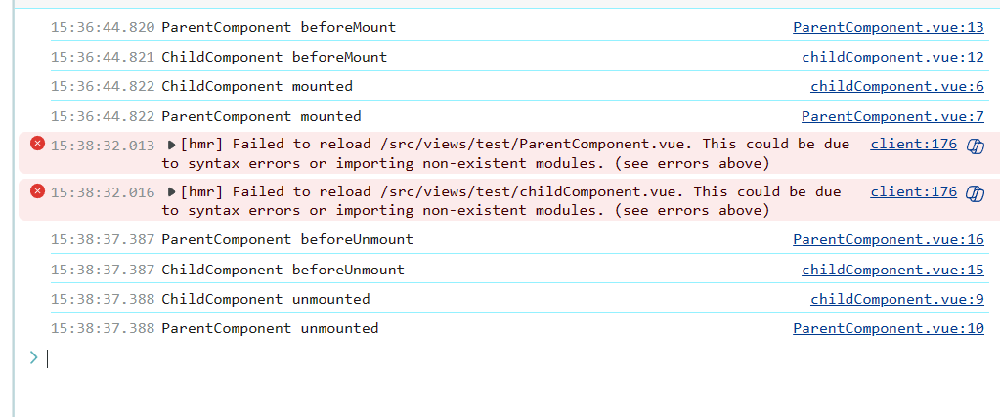

\---

title: vue3 父子组件异步数据获取解决

author: yalis

date: 2024/07/04 14:340

categories:

\- vue3

tags:

\- vue3

editLink: false

lastUpdated: true

showComment: true

\---

**# 在父组件 axios 获取数据，传递到子组件中，子组件数据无法更新？**

在子组件中发现获取的数据是 undefined，从而导致报错；只需要使用 v-if 先来判断是否有数据再显示子组件，才能够正确的获取到实际的数据。

## 原因

父子组件的挂载顺序，子组件比父组件先挂载，所以导致在子组件使用 defineProps 获取传值的时候得到的是 undefined
