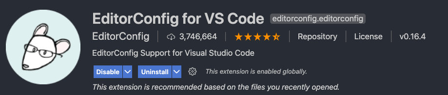
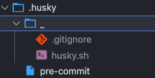
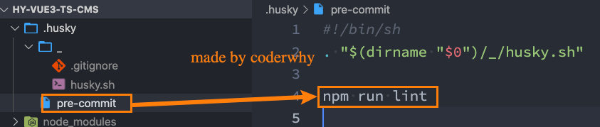
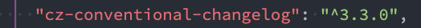

# 一. 代码规范

## 1.1. 集成editorconfig配置

EditorConfig 有助于为不同 IDE 编辑器上处理同一项目的多个开发人员维护一致的编码风格。

```yaml
# http://editorconfig.org

root = true

[*] # 表示所有文件适用
charset = utf-8 # 设置文件字符集为 utf-8
indent_style = space # 缩进风格（tab | space）
indent_size = 2 # 缩进大小
end_of_line = lf # 控制换行类型(lf | cr | crlf)
trim_trailing_whitespace = true # 去除行首的任意空白字符
insert_final_newline = true # 始终在文件末尾插入一个新行

[*.md] # 表示仅 md 文件适用以下规则
max_line_length = off
trim_trailing_whitespace = false
```


VSCode需要安装一个插件：EditorConfig for VS Code




## 1.2. 使用prettier工具

Prettier 是一款强大的代码格式化工具，支持 JavaScript、TypeScript、CSS、SCSS、Less、JSX、Angular、Vue、GraphQL、JSON、Markdown 等语言，基本上前端能用到的文件格式它都可以搞定，是当下最流行的代码格式化工具。


[`prettier` 中文官网！](https://www.prettier.cn/)  


1.安装prettier

```shell
npm install prettier -D
```

2.配置.prettierrc文件：

* useTabs：使用tab缩进还是空格缩进，选择false；
* tabWidth：tab是空格的情况下，是几个空格，选择2个；
* printWidth：当行字符的长度，推荐80，也有人喜欢100或者120；
* singleQuote：使用单引号还是双引号，选择true，使用单引号；
* trailingComma：在多行输入的尾逗号是否添加，设置为 `none`；
* semi：语句末尾是否要加分号，默认值true，选择false表示不加；

```json
{
  "useTabs": false,
  "tabWidth": 2,
  "printWidth": 80,
  "singleQuote": true,
  "trailingComma": "none",
  "semi": false
}
```


3.创建.prettierignore忽略文件

```
/dist/*
.local
.output.js
/node_modules/**

**/*.svg
**/*.sh

/public/*
```


4.VSCode需要安装prettier的插件


5.测试prettier是否生效

* 测试一：在代码中保存代码；
* 测试二：配置一次性修改的命令；

在package.json中配置一个scripts：

```json
    "prettier": "prettier --write ."
```


## 1.3. 使用ESLint检测

在前面创建项目的时候，我们就选择了ESLint，所以Vue会默认帮助我们配置需要的ESLint环境。

`.eslintrc.js配置文件`

```js
module.exports = {
  // 表示当前目录即为根目录，ESLint 规则将被限制到该目录下
  root: true,
  // env 表示启用 ESLint 检测的环境
  env: {
    // 在 node 环境下启动 ESLint 检测
    node: true
  },
  // ESLint 中基础配置需要继承的配置
  extends: ["plugin:vue/vue3-essential", "@vue/standard"],
  // 解析器
  parserOptions: {
    parser: "babel-eslint"
  },
  // 需要修改的启用规则及其各自的错误级别
  /**
   * 错误级别分为三种：
   * "off" 或 0 - 关闭规则
   * "warn" 或 1 - 开启规则，使用警告级别的错误：warn (不会导致程序退出)
   * "error" 或 2 - 开启规则，使用错误级别的错误：error (当被触发的时候，程序会退出)
   */
  rules: {
    "no-console": process.env.NODE_ENV === "production" ? "warn" : "off",
    "no-debugger": process.env.NODE_ENV === "production" ? "warn" : "off"
  }
};
```

**修改 `ESLint` 的验证规则：**

1. 在 `.eslintrc.js` 文件中，新增一条验证规则

   ```json
   "quotes": "error" // 默认
   "quotes": "warn" // 修改为警告
   "quotes": "off" // 修改不校验
   ```


2.VSCode需要安装ESLint插件：


3.解决eslint和prettier冲突的问题：

安装插件：（vue在创建项目时，如果选择prettier，那么这两个插件会自动安装）

```shell
npm i eslint-plugin-prettier eslint-config-prettier -D
```


添加prettier插件：

```json
  extends: [
    "plugin:vue/vue3-essential",
    "eslint:recommended",
    "@vue/typescript/recommended",
    "@vue/prettier",
    "@vue/prettier/@typescript-eslint",
    'plugin:prettier/recommended'
  ],
```

`prettier` 和 `ESLint` 的其他冲突问题。

1. 打开 `.eslintrc.js` 配置文件

2. 在 `rules` 规则下，新增一条规则

   ```json
   'space-before-function-paren': 'off'
   ```

3. 该规则表示关闭《方法名后增加空格》的规则

## 1.4. git Husky和eslint

虽然我们已经要求项目使用eslint了，但是不能保证组员提交代码之前都将eslint中的问题解决掉了：

* 也就是我们希望保证代码仓库中的代码都是符合eslint规范的；

* 那么我们需要在组员执行 `git commit ` 命令的时候对其进行校验，如果不符合eslint规范，那么自动通过规范进行修复；

那么如何做到这一点呢？可以通过Husky工具：

* husky是一个git hook工具，可以帮助我们触发git提交的各个阶段：pre-commit、commit-msg、pre-push

如何使用husky呢？

这里我们可以使用自动配置命令：

```shell
npx husky-init && npm install
```

这里会做三件事：

1.安装husky相关的依赖：

`限定版本：`

```shell
npm install husky@7.0.1 --save-dev
```

`直接安装`

```shell
npm install husky --save-dev
```


2.在项目目录下创建 `.husky` 文件夹：

```
npx huksy install
```




3.在 `package.json` 中生成 `prepare` 指令（ **需要 npm > 7.0 版本** ）：

```shell
npm set-script prepare "husky install"
```


接下来，我们需要去完成一个操作：在进行commit时，执行lint脚本：

1. 执行 `npx husky add .husky/pre-commit "npx eslint --ext .js,.vue src"` 添加 `commit` 时的 `hook` （`npx eslint --ext .js,.vue src` 会在执行到该 hook 时运行）

2. 该操作会生成对应文件 `pre-commit`：




这个时候我们执行git commit的时候会自动对代码进行lint校验。


## 1.5. git commit规范

### 1.5.1. 代码提交风格

通常我们的git commit会按照统一的风格来提交，这样可以快速定位每次提交的内容，方便之后对版本进行控制。


但是如果每次手动来编写这些是比较麻烦的事情，我们可以使用一个工具：Commitizen

* Commitizen 是一个帮助我们编写规范 commit message 的工具；

1.安装Commitizen

```shell
npm install -g commitizen@4.2.4
```

::: tip
使用自定义提交风格的话,不需要执行下一步。直接按照[1.5.2](###1.5.2自定义提交风格)的步骤即可。
:::

2.安装cz-conventional-changelog，并且初始化cz-conventional-changelog：

```shell
npx commitizen init cz-conventional-changelog --save-dev --save-exact
```

这个命令会帮助我们安装cz-conventional-changelog：



并且在package.json中进行配置：


这个时候我们提交代码需要使用 `npx cz`：

* 第一步是选择type，本次更新的类型

| Type     | 作用                                                         |
| -------- | ------------------------------------------------------------ |
| feat     | 新增特性 (feature)                                           |
| fix      | 修复 Bug(bug fix)                                            |
| docs     | 修改文档 (documentation)                                     |
| style    | 代码格式修改(white-space, formatting, missing semi colons, etc) |
| refactor | 代码重构(refactor)                                           |
| perf     | 改善性能(A code change that improves performance)            |
| test     | 测试(when adding missing tests)                              |
| build    | 变更项目构建或外部依赖（例如 scopes: webpack、gulp、npm 等） |
| ci       | 更改持续集成软件的配置文件和 package 中的 scripts 命令，例如 scopes: Travis, Circle 等 |
| chore    | 变更构建流程或辅助工具(比如更改测试环境)                     |
| revert   | 代码回退                                                     |

* 第二步选择本次修改的范围（作用域）


* 第三步选择提交的信息


* 第四步提交详细的描述信息


* 第五步是否是一次重大的更改


* 第六步是否影响某个open issue


我们也可以在scripts中构建一个命令来执行 cz：


### 1.5.2自定义提交风格

1. 安装并配置 `cz-customizable` 插件

   1. 使用 `npm` 下载 `cz-customizable`

      ```shell
      npm i cz-customizable@6.3.0 --save-dev
      ```

   2. 添加以下配置到 `package.json ` 中

      ```json
      ...
        "config": {
          "commitizen": {
            "path": "node_modules/cz-customizable"
          }
        }
      ```

2. 项目根目录下创建 `.cz-config.js` 自定义提示文件

   ```js
   module.exports = {
     // 可选类型
     types: [
       { value: 'feat', name: 'feat:     新功能' },
       { value: 'fix', name: 'fix:      修复' },
       { value: 'docs', name: 'docs:     文档变更' },
       { value: 'style', name: 'style:    代码格式(不影响代码运行的变动)' },
       {
         value: 'refactor',
         name: 'refactor: 重构(既不是增加feature，也不是修复bug)'
       },
       { value: 'perf', name: 'perf:     性能优化' },
       { value: 'test', name: 'test:     增加测试' },
       { value: 'chore', name: 'chore:    构建过程或辅助工具的变动' },
       { value: 'revert', name: 'revert:   回退' },
       { value: 'build', name: 'build:    打包' }
     ],
     // 消息步骤
     messages: {
       type: '请选择提交类型:',
       customScope: '请输入修改范围(可选):',
       subject: '请简要描述提交(必填):',
       body: '请输入详细描述(可选):',
       footer: '请输入要关闭的issue(可选):',
       confirmCommit: '确认使用以上信息提交？(y/n/e/h)'
     },
     // 跳过问题
     skipQuestions: ['body', 'footer'],
     // subject文字长度默认是72
     subjectLimit: 72
   }
   ```

3. 使用 `git cz` 代替 `git commit`
   使用 `git cz` 代替 `git commit`，即可看到提示内容


### 1.5.3  什么是 Git Hooks

上一小节中我们使用了 `git cz` 来代替了 `git commit` 实现了规范化的提交诉求，但是依然存在着有人会忘记使用的问题。

那么这一小节我们就来看一下这样的问题，我们应该如何去进行解决。

先来明确一下我们最终要实现的效果：

> 我们希望：
>
> 当《提交描述信息》不符合 [约定式提交规范](https://www.conventionalcommits.org/zh-hans/v1.0.0/) 的时候，阻止当前的提交，并抛出对应的错误提示

而要实现这个目的，我们就需要先来了解一个概念，叫做 `Git hooks（git 钩子 || git 回调方法）` 

也就是：**`git` 在执行某个事件之前或之后进行一些其他额外的操作**

而我们所期望的 **阻止不合规的提交消息**，那么就需要使用到 `hooks` 的钩子函数。

下面是我整理出来的所有的 `hooks` ，大家可以进行一下参考，其中加粗的是常用到的 `hooks`：

| Git Hook              | 调用时机                                                     | 说明                                                         |
| :-------------------- | ------------------------------------------------------------ | ------------------------------------------------------------ |
| pre-applypatch        | `git am`执行前                                               |                                                              |
| applypatch-msg        | `git am`执行前                                               |                                                              |
| post-applypatch       | `git am`执行后                                               | 不影响`git am`的结果                                         |
| **pre-commit**        | `git commit`执行前                                           | 可以用`git commit --no-verify`绕过                           |
| **commit-msg**        | `git commit`执行前                                           | 可以用`git commit --no-verify`绕过                           |
| post-commit           | `git commit`执行后                                           | 不影响`git commit`的结果                                     |
| pre-merge-commit      | `git merge`执行前                                            | 可以用`git merge --no-verify`绕过。                          |
| prepare-commit-msg    | `git commit`执行后，编辑器打开之前                           |                                                              |
| pre-rebase            | `git rebase`执行前                                           |                                                              |
| post-checkout         | `git checkout`或`git switch`执行后                           | 如果不使用`--no-checkout`参数，则在`git clone`之后也会执行。 |
| post-merge            | `git commit`执行后                                           | 在执行`git pull`时也会被调用                                 |
| pre-push              | `git push`执行前                                             |                                                              |
| pre-receive           | `git-receive-pack`执行前                                     |                                                              |
| update                |                                                              |                                                              |
| post-receive          | `git-receive-pack`执行后                                     | 不影响`git-receive-pack`的结果                               |
| post-update           | 当 `git-receive-pack`对 `git push` 作出反应并更新仓库中的引用时 |                                                              |
| push-to-checkout      | 当``git-receive-pack`对`git push`做出反应并更新仓库中的引用时，以及当推送试图更新当前被签出的分支且`receive.denyCurrentBranch`配置被设置为`updateInstead`时 |                                                              |
| pre-auto-gc           | `git gc --auto`执行前                                        |                                                              |
| post-rewrite          | 执行`git commit --amend`或`git rebase`时                     |                                                              |
| sendemail-validate    | `git send-email`执行前                                       |                                                              |
| fsmonitor-watchman    | 配置`core.fsmonitor`被设置为`.git/hooks/fsmonitor-watchman`或`.git/hooks/fsmonitor-watchmanv2`时 |                                                              |
| p4-pre-submit         | `git-p4 submit`执行前                                        | 可以用`git-p4 submit --no-verify`绕过                        |
| p4-prepare-changelist | `git-p4 submit`执行后，编辑器启动前                          | 可以用`git-p4 submit --no-verify`绕过                        |
| p4-changelist         | `git-p4 submit`执行并编辑完`changelist message`后            | 可以用`git-p4 submit --no-verify`绕过                        |
| p4-post-changelist    | `git-p4 submit`执行后                                        |                                                              |
| post-index-change     | 索引被写入到`read-cache.c do_write_locked_index`后           |                                                              |

PS：详细的 `HOOKS介绍` 可点击[这里](https://git-scm.com/docs/githooks)查看

整体的 `hooks` 非常多，当时我们其中用的比较多的其实只有两个：

| Git Hook       | 调用时机                                                     | 说明                               |
| :------------- | ------------------------------------------------------------ | ---------------------------------- |
| **pre-commit** | `git commit`执行前<br />它不接受任何参数，并且在获取提交日志消息并进行提交之前被调用。脚本`git commit`以非零状态退出会导致命令在创建提交之前中止。 | 可以用`git commit --no-verify`绕过 |
| **commit-msg** | `git commit`执行前<br />可用于将消息规范化为某种项目标准格式。<br />还可用于在检查消息文件后拒绝提交。 | 可以用`git commit --no-verify`绕过 |

简单来说这两个钩子：

1. `commit-msg`：可以用来规范化标准格式，并且可以按需指定是否要拒绝本次提交
2. `pre-commit`：会在提交前被调用，并且可以按需指定是否要拒绝本次提交


### 1.5.4. 代码提交验证

如果我们按照cz来规范了提交风格，但是依然有同事通过 `git commit` 按照不规范的格式提交应该怎么办呢？

1. [commitlint](https://github.com/conventional-changelog/commitlint)：用于检查提交信息

2. [husky](https://github.com/typicode/husky)：是`git hooks`工具

注意：**`npm` 需要在 7.x 以上版本！！！！！**

 **commitlint**

1. 安装 @commitlint/config-conventional 和 @commitlint/cli

   `限定版本安装：`

   ```shell
   npm install --save-dev @commitlint/config-conventional@12.1.4 @commitlint/cli@12.1.4
   ```

   `直接安装:`

   ```shell
   npm i @commitlint/config-conventional @commitlint/cli -D
   ```

   

2. 在根目录创建 `commitlint.config.js` ，配置commitlint文件

   `直接使用命令行`

   ```shell
   echo "module.exports = {extends: ['@commitlint/config-conventional']}" > commitlint.config.js
   ```

   `手动创建`

   ```js
   module.exports = {
     extends: ['@commitlint/config-conventional']
   }
   ```

   

3. 打开 `commitlint.config.js` ， 增加配置项（ [config-conventional 默认配置点击可查看](https://github.com/conventional-changelog/commitlint/blob/master/@commitlint/config-conventional/index.js) ）：

   ```js
   module.exports = {
     // 继承的规则
     extends: ['@commitlint/config-conventional'],
     // 定义规则类型
     rules: {
       // type 类型定义，表示 git 提交的 type 必须在以下类型范围内
       'type-enum': [
         2,
         'always',
         [
           'feat', // 新功能 feature
           'fix', // 修复 bug
           'docs', // 文档注释
           'style', // 代码格式(不影响代码运行的变动)
           'refactor', // 重构(既不增加新功能，也不是修复bug)
           'perf', // 性能优化
           'test', // 增加测试
           'chore', // 构建过程或辅助工具的变动
           'revert', // 回退
           'build' // 打包
         ]
       ],
       // subject 大小写不做校验
       'subject-case': [0]
     }
   }
   
   ```

4. 使用husky生成commit-msg文件，验证提交信息：

   ```shell
   npx husky add .husky/commit-msg "npx --no-install commitlint --edit $1"
   ```

5. 此时的 `.husky` 的文件结构
   

   

至此， 不符合规范的 commit 将不再可提交：

```shell
PS F:\xxxxxxxxxxxxxxxxxxxxx\imooc-admin> git commit -m "测试"
⧗   input: 测试
✖   subject may not be empty [subject-empty]
✖   type may not be empty [type-empty]

✖   found 2 problems, 0 warnings
ⓘ   Get help: https://github.com/conventional-changelog/commitlint/#what-is-commitlint

husky - commit-msg hook exited with code 1 (error)
```


**注意：确保保存为 `UTF-8` 的编码格式**，否则可能会出现以下错误：


### 1.5.5 lint-staged 自动修复格式错误


[lint-staged](https://github.com/okonet/lint-staged) 可以让你当前的代码检查 **只检查本次修改更新的代码，并在出现错误的时候，自动修复并且推送**

[lint-staged](https://github.com/okonet/lint-staged) 无需单独安装，我们生成项目时，`vue-cli` 已经帮助我们安装过了，所以我们直接使用就可以了

1. 修改 `package.json` 配置

   ```js
   "lint-staged": {
       "src/**/*.{js,vue}": [
         "eslint --fix",
         "git add"
       ]
     }
   ```

2. 如上配置，每次它只会在你本地 `commit` 之前，校验你提交的内容是否符合你本地配置的 `eslint`规则(这个见文档 [ESLint](https://panjiachen.github.io/vue-element-admin-site/zh/guide/advanced/eslint.html) )，校验会出现两种结果：

   1. 如果符合规则：则会提交成功。
   2. 如果不符合规则：它会自动执行 `eslint --fix` 尝试帮你自动修复，如果修复成功则会帮你把修复好的代码提交，如果失败，则会提示你错误，让你修好这个错误之后才能允许你提交代码。

3. 修改 `.husky/pre-commit` 文件

   ```js
   #!/bin/sh
   . "$(dirname "$0")/_/husky.sh"
   
   npx lint-staged
   
   ```

4. 再次执行提交代码

5. 发现 **暂存区中** 不符合 `ESlint` 的内容，被自动修复