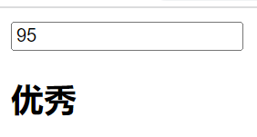

# 6. 条件渲染

- 在某些情况下，我们需要根据当前的条件决定某些元素或组件是否渲染，这个时候我们就需要进行条件判断了。 
- Vue提供了下面的指令来进行条件判断： 
  - v-if pv-else 
  - v-else-if 
  - v-show 

##  6.1 条件渲染的基本使用

- `v-if` 指令被用于按条件渲染一个区块。这个区块只会在指令的表达式为真时才被渲染。

- 使用 `v-else` 为 `v-if` 添加一个“else 区块”。

- `v-else-if` 提供的是相应于 `v-if` 的“else if 区块”。它可以连续多次重复使用：
- `v-if`、`v-else`、`v-else-if`用于根据条件来渲染某一块的内容： 
- 这些内容只有在条件为true时，才会被渲染出来； 
- 这三个指令与JavaScript的条件语句if、else、else if类似； 
- `v-if`的渲染原理： 
  - `v-if`是惰性的； 
  - 当条件为false时，其判断的内容完全不会被渲染或者会被销毁掉； 
  - 当条件为true时，才会真正渲染条件块中的内容

`示例：`




```html
<!DOCTYPE html>
<html lang="en">
<head>
  <meta charset="UTF-8">
  <meta http-equiv="X-UA-Compatible" content="IE=edge">
  <meta name="viewport" content="width=device-width, initial-scale=1.0">
  <title>Document</title>
</head>
<body>
  
  <div id="app"></div>

  <template id="my-app">
    <input type="text" v-model="score">
    <h2 v-if="score > 90">优秀</h2>
    <h2 v-else-if="score > 60">良好</h2>
    <h2 v-else>不及格</h2>
  </template>

  <script src="../js/vue.js"></script>
  <script>
    const App = {
      template: '#my-app',
      data() {
        return {
          score: 95
        }
      }
    }

    Vue.createApp(App).mount('#app');
  </script>
</body>
</html>
```


## 6.2 template和v-if结合使用

因为 `v-if` 是一个指令，他必须依附于某个元素。但如果我们想要切换不止一个元素呢？在这种情况下我们可以在一个 `<template>` 元素上使用 `v-if`，这只是一个不可见的包裹元素，并且在v-if上使用，但是最终`template`不会被渲染出来：

`示例:`

```vue
  <template id="my-app">
    <template v-if="isShowHa">
      <h2>哈哈哈哈</h2>
      <h2>哈哈哈哈</h2>
      <h2>哈哈哈哈</h2>
    </template>

    <template v-else>
      <h2>呵呵呵呵</h2>
      <h2>呵呵呵呵</h2>
      <h2>呵呵呵呵</h2>
    </template>
  </template>
  <script src="../js/vue.js"></script>
  <script>
    const App = {
      template: '#my-app',
      data() {
        return {
          isShowHa: true
        }
      }
    }

    Vue.createApp(App).mount('#app');
  </script>
```

`v-else` 和 `v-else-if` 也可以在 `<template>` 上使用。

### 6.3 v-show的条件渲染

- v-show和v-if的用法看起来是一致的，也是根据一个条件决定是否显示元素或者组件
- 不同之处在于 `v-show` 会在 DOM 渲染中保留该元素；`v-show` 仅切换了该元素上名为 `display` 的 CSS 属性。
- `v-show` 不支持在 `<template>` 元素上使用，也没有 `v-else` 来配合。


`示例:`


```vue
  <div id="app"></div>

  <template id="my-app">
    <h2 v-show="isShow">哈哈哈哈</h2>
  </template>

  <script src="../js/vue.js"></script>
  <script>
    const App = {
      template: '#my-app',
      data() {
        return {
          isShow: true
        }
      }
    }

    Vue.createApp(App).mount('#app');
  </script>
```


## 6.4 v-show 和v-if的区别

- 首先，在用法上的区别：  

  - v-show是不支持template； 

  - v-show不可以和v-else一起使用； 
- 其次，本质的区别： 
  - v-show元素无论是否需要显示到浏览器上，它的DOM实际都是有渲染的，只是通过CSS的display属性来进行 切换； 
  - v-if当条件为false时，其对应的元素压根不会被渲染到DOM中

相比之下，`v-show` 简单许多，元素无论初始条件如何，始终会被渲染，仅作 CSS class 的切换。

总的来说，`v-if` 在首次渲染时的切换成本比 `v-show` 更高。因此当你需要非常频繁切换时 `v-show` 会更好，而运行时不常改变的时候 `v-if` 会更合适。