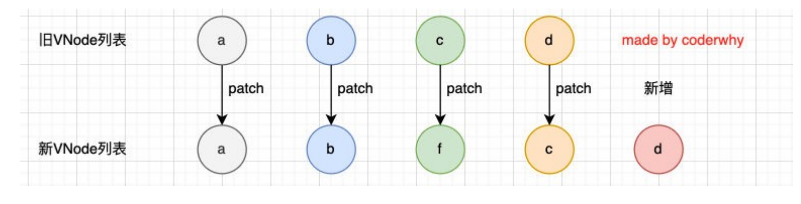
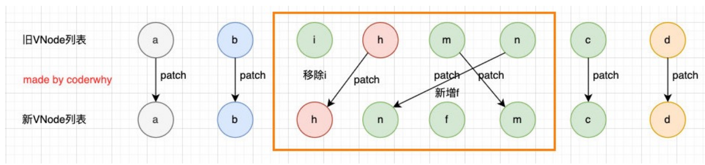

# 7. 列表渲染

- 在真实开发中，我们往往会从服务器拿到一组数据，并且需要对其进行渲染。 
  - 这个时候我们可以使用v-for来完成； 
  - v-for类似于JavaScript的for循环，可以用于遍历一组数据；

## 7.1 v-for的基本使用

- `v-for`的基本格式是 "item in 数组"： 
- 数组通常是来自data或者prop，也可以是其他方式； 
- item是我们给每项元素起的一个别名，这个别名可以自定来定义；
- 我们知道，在遍历一个数组的时候会经常需要拿到数组的索引： 
- 如果我们需要索引，可以使用格式： "(item, index) in 数组"； 
- 注意上面的顺序：数组元素项item是在前面的，索引项index是在后面的；


`示例：`


- `v-for`也支持遍历对象，并且支持有一二三个参数： 
  - 一个参数： "value in object"; 
  - 二个参数： "(value, key) in object"; key表示为属性名
  - 三个参数： "(value, key, index) in object"; index为索引
- `v-for`同时也支持数字的遍历： 
  - 每一个item都是一个数字；

```vue
<div id="app"></div>

  <template id="my-app">
    <h2>电影列表</h2>
    <ul>
      <!-- 遍历数组 -->
      <li v-for="(movie, index) in movies">{{index+1}}.{{movie}}</li>
    </ul>
    <h2>个人信息</h2>
    <ul>
      <!-- 遍历对象 -->
      <li v-for="(value, key, index) in info">{{value}}-{{key}}-{{index}}</li>
    </ul>
    <h2>遍历数字</h2>
    <ul>
      <li v-for="(num, index) in 10">{{num}}-{{index}}</li>
    </ul>
  </template>

  <script src="../js/vue.js"></script>
  <script>
    const App = {
      template: '#my-app',
      data() {
        return {
          movies: [
            "星际穿越",
            "盗梦空间",
            "大话西游",
            "教父",
            "少年派"
          ],
          info: {
            name: "why",
            age: 18,
            height: 1.88
          }
        }
      }
    }

    Vue.createApp(App).mount('#app');
  </script>
```


## 7.2 v-for和template

- 类似于`v-if`，可以使用 `template` 元素来循环渲染一段包含多个元素的内容： 
- 我们使用`template`来对多个元素进行包裹，而不是使用div来完成


`示例：`


```vue
  
  <div id="app"></div>

  <template id="my-app">
    <ul>
      <template v-for="(value, key) in info">
        <li>{{key}}</li>
        <li>{{value}}</li>
        <li class="divider"></li>
      </template>
    </ul>
  </template>

  <script src="../js/vue.js"></script>
  <script>
    const App = {
      template: '#my-app',
      data() {
        return {
          info: {
            name: "why",
            age: 18,
            height: 1.88
          }
        }
      }
    }

    Vue.createApp(App).mount('#app');
  </script>
```

## 7.3`v-for` 与 `v-if`

:::warning 注意 

同时使用 `v-if` 和 `v-for` 是***\*不推荐的\****，因为这样二者的优先级不明显。

 :::  

当它们同时存在于一个节点上时，`v-if` 比 `v-for` 的优先级更高。这意味着 `v-if` 的条件将无法访问到 `v-for` 作用域内定义的变量别名： 

```vue
<!--
 这会抛出一个错误，因为属性 todo 此时
 没有在该实例上定义
-->
<li v-for="todo in todos" v-if="!todo.isComplete">
  {{ todo.name }}
</li>
```

在外新包装一层 `<template>` 再在其上使用 `v-for` 可以解决这个问题 (这也更加明显易读)：

```vue
<template v-for="todo in todos">
  <li v-if="!todo.isComplete">
    {{ todo.name }}
  </li>
</template>
```
## 7.4 v-for中key的作用

- key属性主要用在Vue的虚拟DOM算法，在新旧nodes对比时辨识VNodes； 
- 如果不使用key，Vue会使用一种最大限度减少动态元素并且尽可能的尝试就地修改/复用相同类型元素的算法； 
- 而使用key时，它会基于key的变化重新排列元素顺序，并且会移除/销毁key不存在的元素；


`VNode的概念：`

- VNode的全称是Virtual Node，也就是虚拟节点； 
- 事实上，无论是组件还是元素，它们最终在Vue中表示出来的都是一个个VNode； 
- VNode的本质是一个JavaScript的对象；

Vue事实上会对于有key和没有key会调用两个不同的方法； 

- 有key，那么就使用 patchKeyedChildren方法； 
- 没有key，那么就使用 patchUnkeyedChildren方法；


**vue源码对没有key的操作**：

```ts
const patchUnkeyedChildren = (
    c1: VNode[],
    c2: VNodeArrayChildren,
    container: RendererElement,
    anchor: RendererNode | null,
    parentComponent: ComponentInternalInstance | null,
    parentSuspense: SuspenseBoundary | null,
    isSVG: boolean,
    slotScopeIds: string[] | null,
    optimized: boolean
  ) => {
    c1 = c1 || EMPTY_ARR
    c2 = c2 || EMPTY_ARR
    //1.获取旧节点的长度
    const oldLength = c1.length
    //2.获取新节点的长度
    const newLength = c2.length
    //获取最小的那个长度
    const commonLength = Math.min(oldLength, newLength)
    let i
    // 3.从0位置开始依次patch比较
    for (i = 0; i < commonLength; i++) {
      const nextChild = (c2[i] = optimized
        ? cloneIfMounted(c2[i] as VNode)
        : normalizeVNode(c2[i]))
      patch(
        c1[i],
        nextChild,
        container,
        null,
        parentComponent,
        parentSuspense,
        isSVG,
        slotScopeIds,
        optimized
      )
    }
    // 4.如果旧的节点数大于新的节点数
    if (oldLength > newLength) {
      // remove old
      // 移除剩余的节点
      unmountChildren(
        c1,
        parentComponent,
        parentSuspense,
        true,
        false,
        commonLength
      )
    } else {
      // mount new
      // 创建新的节点
      mountChildren(
        c2,
        container,
        anchor,
        parentComponent,
        parentSuspense,
        isSVG,
        slotScopeIds,
        optimized,
        commonLength
      )
    }
  }
```

- c和d来说它们事实上并不需要有任何的改动； 

- 但是因为我们的c被f所使用了，所有后续所有的内容都要一次进行改动，并且最后进行新增；

  

`vue源码对有key执行的操作:`

```ts
const patchKeyedChildren = (
    c1: VNode[],
    c2: VNodeArrayChildren,
    container: RendererElement,
    parentAnchor: RendererNode | null,
    parentComponent: ComponentInternalInstance | null,
    parentSuspense: SuspenseBoundary | null,
    isSVG: boolean,
    slotScopeIds: string[] | null,
    optimized: boolean
  ) => {
    let i = 0
    const l2 = c2.length
    let e1 = c1.length - 1 // prev ending index
    let e2 = l2 - 1 // next ending index

    // 1. sync from start
    // 1. 从头部开始遍历，遇到相同的节点就继续，遇到不同的就跳出循环
    // (a b) c
    // (a b) d e
    while (i <= e1 && i <= e2) {
      const n1 = c1[i]
      const n2 = (c2[i] = optimized
        ? cloneIfMounted(c2[i] as VNode)
        : normalizeVNode(c2[i]))
      if (isSameVNodeType(n1, n2)) {
        patch(
          n1,
          n2,
          container,
          null,
          parentComponent,
          parentSuspense,
          isSVG,
          slotScopeIds,
          optimized
        )
      } else {
        break
      }
      i++
    }

    // 2. sync from end
    // 2.从尾部开始遍历，遇到相同的节点就继续，遇到不同的就跳出循环
    // a (b c)
    // d e (b c)
    while (i <= e1 && i <= e2) {
      const n1 = c1[e1]
      const n2 = (c2[e2] = optimized
        ? cloneIfMounted(c2[e2] as VNode)
        : normalizeVNode(c2[e2]))
      if (isSameVNodeType(n1, n2)) {
        patch(
          n1,
          n2,
          container,
          null,
          parentComponent,
          parentSuspense,
          isSVG,
          slotScopeIds,
          optimized
        )
      } else {
        break
      }
      e1--
      e2--
    }

    // 3. common sequence + mount
    // 3.如果最后新节点更多，那么就添加新节点
    // (a b)
    // (a b) c
    // i = 2, e1 = 1, e2 = 2
    // (a b)
    // c (a b)
    // i = 0, e1 = -1, e2 = 0
    if (i > e1) {
      if (i <= e2) {
        const nextPos = e2 + 1
        const anchor = nextPos < l2 ? (c2[nextPos] as VNode).el : parentAnchor
        while (i <= e2) {
          patch(
            null,
            (c2[i] = optimized
              ? cloneIfMounted(c2[i] as VNode)
              : normalizeVNode(c2[i])),
            container,
            anchor,
            parentComponent,
            parentSuspense,
            isSVG,
            slotScopeIds,
            optimized
          )
          i++
        }
      }
    }

    // 4. common sequence + unmount
    // 4.如果旧节点更多，那么就移除旧节点
    // (a b) c
    // (a b)
    // i = 2, e1 = 2, e2 = 1
    // a (b c)
    // (b c)
    // i = 0, e1 = 0, e2 = -1
    else if (i > e2) {
      while (i <= e1) {
        unmount(c1[i], parentComponent, parentSuspense, true)
        i++
      }
    }

    // 5. unknown sequence
    // 5. 如果中间存在不知道如何排列的位置序列，那么就使用key建立索引图最大限度的使用旧节点
    // [i ... e1 + 1]: a b [c d e] f g
    // [i ... e2 + 1]: a b [e d c h] f g
    // i = 2, e1 = 4, e2 = 5
    else {
      const s1 = i // prev starting index
      const s2 = i // next starting index

      // 5.1 build key:index map for newChildren
      const keyToNewIndexMap: Map<string | number | symbol, number> = new Map()
      for (i = s2; i <= e2; i++) {
        const nextChild = (c2[i] = optimized
          ? cloneIfMounted(c2[i] as VNode)
          : normalizeVNode(c2[i]))
        if (nextChild.key != null) {
          if (__DEV__ && keyToNewIndexMap.has(nextChild.key)) {
            warn(
              `Duplicate keys found during update:`,
              JSON.stringify(nextChild.key),
              `Make sure keys are unique.`
            )
          }
          keyToNewIndexMap.set(nextChild.key, i)
        }
      }

      // 5.2 loop through old children left to be patched and try to patch
      // matching nodes & remove nodes that are no longer present
      let j
      let patched = 0
      const toBePatched = e2 - s2 + 1
      let moved = false
      // used to track whether any node has moved
      let maxNewIndexSoFar = 0
      // works as Map<newIndex, oldIndex>
      // Note that oldIndex is offset by +1
      // and oldIndex = 0 is a special value indicating the new node has
      // no corresponding old node.
      // used for determining longest stable subsequence
      const newIndexToOldIndexMap = new Array(toBePatched)
      for (i = 0; i < toBePatched; i++) newIndexToOldIndexMap[i] = 0

      for (i = s1; i <= e1; i++) {
        const prevChild = c1[i]
        if (patched >= toBePatched) {
          // all new children have been patched so this can only be a removal
          unmount(prevChild, parentComponent, parentSuspense, true)
          continue
        }
        let newIndex
        if (prevChild.key != null) {
          newIndex = keyToNewIndexMap.get(prevChild.key)
        } else {
          // key-less node, try to locate a key-less node of the same type
          for (j = s2; j <= e2; j++) {
            if (
              newIndexToOldIndexMap[j - s2] === 0 &&
              isSameVNodeType(prevChild, c2[j] as VNode)
            ) {
              newIndex = j
              break
            }
          }
        }
        if (newIndex === undefined) {
          unmount(prevChild, parentComponent, parentSuspense, true)
        } else {
          newIndexToOldIndexMap[newIndex - s2] = i + 1
          if (newIndex >= maxNewIndexSoFar) {
            maxNewIndexSoFar = newIndex
          } else {
            moved = true
          }
          patch(
            prevChild,
            c2[newIndex] as VNode,
            container,
            null,
            parentComponent,
            parentSuspense,
            isSVG,
            slotScopeIds,
            optimized
          )
          patched++
        }
      }

      // 5.3 move and mount
      // generate longest stable subsequence only when nodes have moved
      const increasingNewIndexSequence = moved
        ? getSequence(newIndexToOldIndexMap)
        : EMPTY_ARR
      j = increasingNewIndexSequence.length - 1
      // looping backwards so that we can use last patched node as anchor
      for (i = toBePatched - 1; i >= 0; i--) {
        const nextIndex = s2 + i
        const nextChild = c2[nextIndex] as VNode
        const anchor =
          nextIndex + 1 < l2 ? (c2[nextIndex + 1] as VNode).el : parentAnchor
        if (newIndexToOldIndexMap[i] === 0) {
          // mount new
          patch(
            null,
            nextChild,
            container,
            anchor,
            parentComponent,
            parentSuspense,
            isSVG,
            slotScopeIds,
            optimized
          )
        } else if (moved) {
          // move if:
          // There is no stable subsequence (e.g. a reverse)
          // OR current node is not among the stable sequence
          if (j < 0 || i !== increasingNewIndexSequence[j]) {
            move(nextChild, container, anchor, MoveType.REORDER)
          } else {
            j--
          }
        }
      }
    }
  }
```


-  第一步的操作是从头开始进行遍历、比较： 

  

- a和b是一致的会继续进行比较； 

- c和f因为key不一致，所以就会break跳出循环；

- 第二步的操作是从尾部开始进行遍历、比较：

- 

- 第三步是如果旧节点遍历完毕，但是依然有新的节点，那么就新增节点： 

  

- 第四步是如果新的节点遍历完毕，但是依然有旧的节点，那么就移除旧节点： 有key的diff算法如下（二） coderwhy 

  

- 第五步是最特色的情况，中间还有很多未知的或者乱序的节点： 

  

- 所以我们可以发现，Vue在进行diff算法的时候，会尽量利用我们的key来进行优化操作： 

  - 在没有key的时候我们的效率是非常低效的； 
  - 在进行插入或者重置顺序的时候，保持相同的key可以让diff算法更加的高效；


## 7.5 数组的修改方法

- Vue 将被侦听的数组的变更方法进行了包裹，所以它们也将会触发视图更新。这些被包裹过的方法包括

  - push() 

  - pop() 

  - shift() 

  - unshift() 

  - splice() 

  - sort() 

  - reverse() 

- 替换数组的方法 
  - 上面的方法会直接修改原来的数组，但是某些方法不会替换原来的数组，而是会生成新的数组，比如 filter()、 concat() 和 slice()

`示例：`

```vue
 <div id="app"></div>

  <template id="my-app">
    <h2>电影列表</h2>
    <ul>
      <li v-for="(movie, index) in movies">{{index+1}}.{{movie}}</li>
    </ul>
    <input type="text" v-model="newMovie">
    <button @click="addMovie">添加电影</button>
  </template>

  <script src="../js/vue.js"></script>
  <script>
    const App = {
      template: '#my-app',
      data() {
        return {
          newMovie: "",
          movies: [
            "星际穿越",
            "盗梦空间",
            "大话西游",
            "教父",
            "少年派"
          ]
        }
      },
      methods: {
        addMovie() {
          this.movies.push(this.newMovie);
          this.newMovie = "";

          // this.movies = this.movies.filter(item => item.length > 2);
        }
      }
    }

    Vue.createApp(App).mount('#app');
  </script>
```

