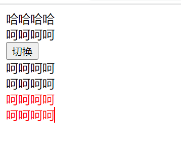

# 5. v-bind和v-on

绑定属性我们使用v-bind：

- [ ] 缩写：: 

- [ ] 预期：any (with argument) | Object (without argument) 

- [ ] 参数：attrOrProp (optional) 

- [ ] 修饰符：  .camel - 将 kebab-case attribute 名转换为 camelCase。 

- [ ] 用法：动态地绑定一个或多个 attribute，或一个组件 prop 到表达式。

- [ ] v-bind用于绑定一个或多个属性值，或者向另一个组件传递props值； 

- [ ] 在开发中，有哪些属性需要动态进行绑定呢？ 

  - 比如图片的链接src、网站的链接href、动态绑定一些类、样式等等 

- 绑定基本属性 n v-bind有一个对应的语法糖，也就是简写方式。 

- 在开发中，我们通常会使用语法糖的形式，因 为这样更加简洁

##  5.1 v-bind的基本使用

**示例**


```html
<!DOCTYPE html>
<html lang="en">
<head>
  <meta charset="UTF-8">
  <meta http-equiv="X-UA-Compatible" content="IE=edge">
  <meta name="viewport" content="width=device-width, initial-scale=1.0">
  <title>Document</title>
</head>
<body>
  
  <div id="app"></div>

  <!-- vue2 template模板中只能有一个根元素 -->
  <!-- vue3 是允许template中有多个根元素 -->
  <template id="my-app">
    <!-- 1.v-bind的基本使用 -->
    
    <a v-bind:href="link">百度一下</a>

    <!-- 2.v-bind提供一个语法糖 : -->
    
    
  </template>

  <script src="../js/vue.js"></script>
  <script>
    const App = {
      template: '#my-app',
      data() {
        return {
          imgUrl: "https://avatars.githubusercontent.com/u/66?s=60&v=4",
          link: "https://www.baidu.com"
        }
      }
    }

    Vue.createApp(App).mount('#app');
  </script>
</body>
</html>
```


##  5.2 v-bind绑定class-对象语法


对象语法：我们可以给 `:class` (`v-bind:class` 的缩写) 传递一个对象来动态切换 class：


**示例**



```html
<!DOCTYPE html>
<html lang="en">
  <head>
    <meta charset="UTF-8" />
    <meta http-equiv="X-UA-Compatible" content="IE=edge" />
    <meta name="viewport" content="width=device-width, initial-scale=1.0" />
    <title>Document</title>
    <style>
      .active {
        color: red;
      }
    </style>
  </head>
  <body>
    <div id="app"></div>

    <template id="my-app">
      <div :class="className">哈哈哈哈</div>
      <!-- 对象语法: {'active': boolean} -->
      <div :class="{'active': isActive}">呵呵呵呵</div>
      <button @click="toggle">切换</button>

      <!-- 也可以有多个键值对 -->
      <div :class="{active: isActive, title: true}">呵呵呵呵</div>

      <!-- 默认的class和动态的class结合 -->
      <div class="abc cba" :class="{active: isActive, title: true}">
        呵呵呵呵
      </div>

      <!-- 将对象放到一个单独的属性中 -->
      <div class="abc cba" :class="classObj">呵呵呵呵</div>

      <!-- 将返回的对象放到一个methods(computed)方法中 -->
      <div class="abc cba" :class="getClassObj()">呵呵呵呵</div>      
    </template>

    <script src="../js/vue.js"></script>
    <script>
      const App = {
        template: "#my-app",
        data() {
          return {
            className: "why",
            isActive: true,
            title: "abc",
            classObj: { 
              active: true, 
              title: true 
            },
          };
        },
        methods: {
          toggle() {
            this.isActive = !this.isActive;
          },
          getClassObj() {
            return { 
              active: true, 
              title: true 
            }
          }
        },
      };

      Vue.createApp(App).mount("#app");
    </script>
  </body>
</html>

```


## 5.3 v-bind绑定class-数组语法

 数组语法：我们可以把一个数组传给 :class，以应用一个 class 列表；


**示例**


```html
<!DOCTYPE html>
<html lang="en">
<head>
  <meta charset="UTF-8">
  <meta http-equiv="X-UA-Compatible" content="IE=edge">
  <meta name="viewport" content="width=device-width, initial-scale=1.0">
  <title>Document</title>
</head>
<body>
  
  <div id="app"></div>

  <template id="my-app">
    <div :class="['abc', title]">哈哈哈哈</div>
    <div :class="['abc', title, isActive ? 'active': '']">哈哈哈哈</div>
    <div :class="['abc', title, {active: isActive}]">哈哈哈哈</div>
  </template>

  <script src="../js/vue.js"></script>
  <script>
    const App = {
      template: '#my-app',
      data() {
        return {
          message: "Hello World",
          title: "cba",
          isActive: true
        }
      }
    }

    Vue.createApp(App).mount('#app');
  </script>
</body>
</html>
```


## 5.4 v-bind绑定style-对象语法

- `:style` 支持绑定 JavaScript 对象值，对应的是 [HTML 元素的 `style` 属性](https://developer.mozilla.org/en-US/docs/Web/API/HTMLElement/style)：

- `:style`  支持绑定 CSS property 名可以用驼峰式 (camelCase) 或短横线分隔 (kebab-case，记得用引号括起来) 来命名；

**示例**


```html
<!DOCTYPE html>
<html lang="en">
<head>
  <meta charset="UTF-8">
  <meta http-equiv="X-UA-Compatible" content="IE=edge">
  <meta name="viewport" content="width=device-width, initial-scale=1.0">
  <title>Document</title>
</head>
<body>
  
  <div id="app"></div>

  <template id="my-app">
    <!-- :style="{cssPropertyName: cssPropertyValue}" -->
    <div :style="{color: finalColor, 'font-size': '30px'}">哈哈哈哈</div>
    <div :style="{color: finalColor, fontSize: '30px'}">哈哈哈哈</div>
    <div :style="{color: finalColor, fontSize: finalFontSize + 'px'}">哈哈哈哈</div>

    <!-- 绑定一个data中的属性值, 并且是一个对象 -->
    <div :style="finalStyleObj">呵呵呵呵</div>
    <!-- 调用一个方法 -->
    <div :style="getFinalStyleObj()">呵呵呵呵</div>
  </template>

  <script src="../js/vue.js"></script>
  <script>
    const App = {
      template: '#my-app',
      data() {
        return {
          message: "Hello World",
          finalColor: 'red',
          finalFontSize: 50,
          finalStyleObj: {
            'font-size': '50px',
            fontWeight: 700,
            backgroundColor: 'red'
          }
        }
      },
      methods: {
        getFinalStyleObj() {
          return {
            'font-size': '50px',
            fontWeight: 700,
            backgroundColor: 'red'
          }
        }
      }
    }

    Vue.createApp(App).mount('#app');
  </script>
</body>
</html>
```


## 5.5 v-bind绑定style-数组语法

`:style` 的数组语法可以将多个样式对象应用到同一个元素上；

**示例**


```html
<!DOCTYPE html>
<html lang="en">
<head>
  <meta charset="UTF-8">
  <meta http-equiv="X-UA-Compatible" content="IE=edge">
  <meta name="viewport" content="width=device-width, initial-scale=1.0">
  <title>Document</title>
</head>
<body>
  
  <div id="app"></div>

  <template id="my-app">
    <div :style="[style1Obj, style2Obj]">哈哈哈</div>
    
    <a :href=""></a>
    <div :class></div>
  </template>

  <script src="../js/vue.js"></script>
  <script>
    const App = {
      template: '#my-app',
      data() {
        return {
          message: "Hello World",
          style1Obj: {
            color: 'red',
            fontSize: '30px'
          },
          style2Obj: {
            textDecoration: "underline"
          }
        }
      }
    }

    Vue.createApp(App).mount('#app');
  </script>
</body>
</html>
```


## 5.6 v-bind动态绑定属性 名称

- 在某些情况下，我们属性的名称可能也不是固定的： 
  - [ ] 前端我们无论绑定src、href、class、style，属性名称都是固定的； 
  - [ ] 如果属性名称不是固定的，我们可以使用 :[属性名]=“值” 的格式来定义； 
  - [ ] 这种绑定的方式，我们称之为动态绑定属性

**示例**


```html
<!DOCTYPE html>
<html lang="en">
<head>
  <meta charset="UTF-8">
  <meta http-equiv="X-UA-Compatible" content="IE=edge">
  <meta name="viewport" content="width=device-width, initial-scale=1.0">
  <title>Document</title>
</head>
<body>
  
  <div id="app"></div>

  <template id="my-app">
    <div :[name]="value">哈哈哈</div>
  </template>

  <script src="../js/vue.js"></script>
  <script>
    const App = {
      template: '#my-app',
      data() {
        return {
          name: "cba",
          value: "kobe"
        }
      }
    }

    Vue.createApp(App).mount('#app');
  </script>
</body>
</html>
```


## 5.7 v-bind属性直接绑定一个对象

直接使用 v-bind 绑定一个 对象；

**示例**


```html
<!DOCTYPE html>
<html lang="en">
<head>
  <meta charset="UTF-8">
  <meta http-equiv="X-UA-Compatible" content="IE=edge">
  <meta name="viewport" content="width=device-width, initial-scale=1.0">
  <title>Document</title>
</head>
<body>
  
  <div id="app"></div>

  <template id="my-app">
    <div v-bind="info">哈哈哈哈</div>
    <div :="info">哈哈哈哈</div>
  </template>

  <script src="../js/vue.js"></script>
  <script>
    const App = {
      template: '#my-app',
      data() {
        return {
          info: {
            name: "why",
            age: 18,
            height: 1.88
          }
        }
      }
    }

    Vue.createApp(App).mount('#app');
  </script>
</body>
</html>
```


## 5.8 v-on的用法

- v-on的使用： 

- [ ] 缩写：@ 
- [ ] 预期：Function | Inline Statement | Object 
- [ ] 参数：event 
- [ ] 修饰符： 
  - .stop - 调用 event.stopPropagation()。 
  - .prevent - 调用 event.preventDefault()。 
  - .capture - 添加事件侦听器时使用 capture 模式。 
  - .self - 只当事件是从侦听器绑定的元素本身触发时才触发回调。 
  - .{keyAlias} - 仅当事件是从特定键触发时才触发回调。 
  - .once - 只触发一次回调。 ü
  - .left - 只当点击鼠标左键时触发。 
  - .right - 只当点击鼠标右键时触发。 
  - .middle - 只当点击鼠标中键时触发。 
  - .passive - { passive: true } 模式添加侦听器 
- 用法：绑定事件监听 

## 5.9 v-on的基本使用


- 用v-on来监听一下点击的事件
- v-on:click可以写成@click，是它的语法糖写法：
- 当然，我们也可以绑定其他的事件：
- 如果我们希望一个元素绑定多个事件，这个时候可以传入一个对象：

**示例**


```html
<!DOCTYPE html>
<html lang="en">
<head>
  <meta charset="UTF-8">
  <meta http-equiv="X-UA-Compatible" content="IE=edge">
  <meta name="viewport" content="width=device-width, initial-scale=1.0">
  <title>Document</title>

  <style>
    .area {
      width: 200px;
      height: 200px;
      background: red;
    }
  </style>
</head>
<body>
  
  <div id="app"></div>

  <template id="my-app">
    <!-- 完整写法: v-on:监听的事件="methods中方法" -->
    <button v-on:click="btn1Click">按钮1</button>
    <div class="area" v-on:mousemove="mouseMove">div</div>
    <!-- 语法糖 -->
    <button @click="btn1Click">按钮1</button>
    <!-- 绑定一个表达式: inline statement -->
    <button @click="counter++">{{counter}}</button>
    <!-- 绑定一个对象 -->
    <div class="area" v-on="{click: btn1Click, mousemove: mouseMove}"></div>
    <div class="area" @="{click: btn1Click, mousemove: mouseMove}"></div>
  </template>

  <script src="../js/vue.js"></script>
  <script>
    const App = {
      template: '#my-app',
      data() {
        return {
          message: "Hello World",
          counter: 100
        }
      },
      methods: {
        btn1Click() {
          console.log("按钮1发生了点击");
        },
        mouseMove() {
          console.log("鼠标移动");
        }
      }
    }

    Vue.createApp(App).mount('#app');
  </script>
</body>
</html>   
```


## 5.10 v-on的参数传递

- 当通过methods中定义方法，以供@click调用时，需要注意参数问题： 
- 情况一：如果该方法不需要额外参数，那么方法后的()可以不添加。 
  - 但是注意：如果方法本身中有一个参数，那么会默认将原生事件event参数传递进去 
- 情况二：如果需要同时传入某个参数，同时需要event时，可以通过$event传入事件。

**示例**


```html
<!DOCTYPE html>
<html lang="en">
<head>
  <meta charset="UTF-8">
  <meta http-equiv="X-UA-Compatible" content="IE=edge">
  <meta name="viewport" content="width=device-width, initial-scale=1.0">
  <title>Document</title>
</head>
<body>
  
  <div id="app"></div>

  <template id="my-app">
    <!-- 默认传入event对象, 可以在方法中获取 -->
    <button @click="btn1Click">按钮1</button>
    <!-- $event可以获取到事件发生时的事件对象 -->
    <button @click="btn2Click($event, 'coderwhy', 18)">按钮2</button>
  </template>

  <script src="../js/vue.js"></script>
  <script>
    const App = {
      template: '#my-app',
      data() {
        return {
          message: "Hello World"
        }
      },
      methods: {
        btn1Click(event) {
          console.log(event);
        },
        btn2Click(event, name, age) {
          console.log(name, age, event);
        }
      }
    }

    Vue.createApp(App).mount('#app');
  </script>
</body>
</html>
```


## 5.11 v-on的修饰符

- v-on支持修饰符，修饰符相当于对事件进行了一些特殊的处理：
  - [ ] .stop - 调用 event.stopPropagation()。 
  - [ ] .prevent - 调用 event.preventDefault()。 
  - [ ] .capture - 添加事件侦听器时使用 capture 模式。 
  - [ ] .self - 只当事件是从侦听器绑定的元素本身触发时才触发回调。 
  - [ ] .{keyAlias} - 仅当事件是从特定键触发时才触发回调。 
  - [ ] .once - 只触发一次回调。 
  - [ ] .left - 只当点击鼠标左键时触发。 
  - [ ] .right - 只当点击鼠标右键时触发。 
  - [ ] .middle - 只当点击鼠标中键时触发。 
  - [ ] .passive - { passive: true } 模式添加侦听器

**示例**


```html
<!DOCTYPE html>
<html lang="en">
<head>
  <meta charset="UTF-8">
  <meta http-equiv="X-UA-Compatible" content="IE=edge">
  <meta name="viewport" content="width=device-width, initial-scale=1.0">
  <title>Document</title>
</head>
<body>
  
  <div id="app"></div>

  <template id="my-app">
    <div @click="divClick">
      <button @click.stop="btnClick">按钮</button>
    </div>
    <input type="text" @keyup.enter="enterKeyup">
  </template>

  <script src="../js/vue.js"></script>
  <script>
    const App = {
      template: '#my-app',
      data() {
        return {
          message: "Hello World"
        }
      },
      methods: {
        divClick() {
          console.log("divClick");
        },
        btnClick() {
          console.log('btnClick');
        },
        enterKeyup(event) {
          console.log("keyup", event.target.value);
        }
      }
    }

    Vue.createApp(App).mount('#app');
  </script>
</body>
</html>
```

