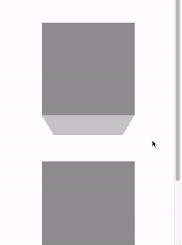
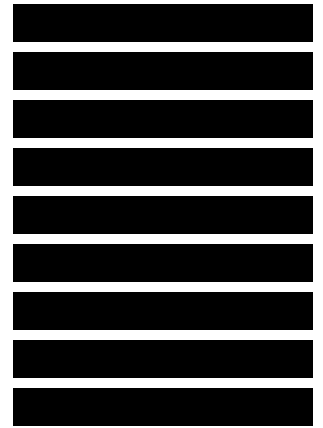
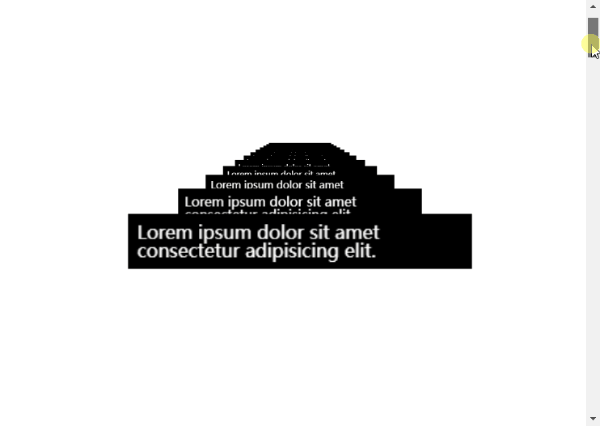

## 使用 `transform: translate3d` 实现滚动视差

这里利用的是 CSS 3D，实现滚动视差效果。

原理就是：

1. 我们给容器设置上 `transform-style: preserve-3d` 和 `perspective: xpx`，那么处于这个容器的子元素就将位于 3D 空间中，
2. 再给子元素设置不同的 `transform: translateZ()`，这个时候，不同元素在 3D Z 轴方向距离屏幕（我们的眼睛）的距离也就不一样
3. 滚动滚动条，由于子元素设置了不同的 `transform: translateZ()`，那么他们滚动的上下距离 `translateY` 相对屏幕（我们的眼睛），也是不一样的，这就达到了滚动视差的效果。

> 关于 `transform-style: preserve-3d` 以及 `perspective` 本文不做过多篇幅展开，默认读者都有所了解，还不是特别清楚的，可以先了解下 CSS 3D。

核心代码表示就是：

```html
<div class="g-container">
  <div class="section-one">translateZ(-1)</div>
  <div class="section-two">translateZ(-2)</div>
  <div class="section-three">translateZ(-3)</div>
</div>
```

```css
html {
  height: 100%;
  overflow: hidden;
}

body {
  perspective: 1px;
  transform-style: preserve-3d;
  height: 100%;
  overflow-y: scroll;
  overflow-x: hidden;
}

.g-container {
  height: 150%;

  .section-one {
    transform: translateZ(-1px);
  }
  .section-two {
    transform: translateZ(-2px);
  }
  .section-three {
    transform: translateZ(-3px);
  }
}
```

总结就是父元素设置 `transform-style: preserve-3d` 和 `perspective: 1px`，子元素设置不同的 `transform: translateZ`，滚动滚动条，效果如下：

<iframe height="300" style="width: 100%;" scrolling="no" title="CSS 3D parallax" src="https://codepen.io/mafqla/embed/abxBXmd?default-tab=html%2Cresult&editable=true&theme-id=light" frameborder="no" loading="lazy" allowtransparency="true" allowfullscreen="true">
  See the Pen <a href="https://codepen.io/mafqla/pen/abxBXmd">
  CSS 3D parallax</a> by mafqla (<a href="https://codepen.io/mafqla">@mafqla</a>)
  on <a href="https://codepen.io">CodePen</a>.
</iframe>

很明显，当滚动滚动条时，不同子元素的位移程度从视觉上看是不一样的，也就达到了所谓的滚动视差效果。

## 借助 CSS 视差实现酷炫交互动效

OK，有了上面的铺垫，我们来看看这样两个有趣的交互效果。由群里的**日服第一切图仔** wheatup 友情提供。

先来看第一个效果：


效果是一种文本交替在不同高度的层展示，并且在滚动的过程中，会有明显的 3D 视差效果。

这个效果并不困难，核心就在于：

1. 利用了 `transform-style: preserve-3d` 和 `perspective` 构建不同的层次效果，制作视差效果
2. 利用元素的 `::before`，`::after` 构建了 3D 的效果

我们看一个最小化 DEMO：

```html
<div class="g-container">
  <div class="g-box"></div>
  <div class="g-box"></div>
  <div class="g-box"></div>
</div>
```

```scss
.g-container {
  height: 150vh;
  perspective: 600px;
}

.g-box {
  width: 200px;
  height: 200px;
  background: #999;
  transform-style: preserve-3d;

  &::before,
  &::after {
    content: '';
    position: absolute;
    right: 0;
    left: 0;
    transform-style: preserve-3d;
    height: 200px;
    background-color: #ccc;
  }
  &::before {
    transform-origin: top center;
    top: 0;
    transform: rotateX(-90deg);
  }
  &::after {
    transform-origin: bottom center;
    bottom: 0;
    transform: rotateX(90deg);
  }
}
```

滚动 `g-container` 容器，即可得到一种 3D 效果：



由于还需要视差效果，我们需要给不同的层赋予不同的 `translateZ()`，我们稍微改造下代码，给每个 `g-box` 中间，再加多一层正常的 `div`，再给每个 `g-box` 加上一个 `translateZ()`。

```html
<div class="g-container">
  <div class="g-box"></div>
  <div class="g-normal"></div>
  <div class="g-box"></div>
  <div class="g-normal"></div>
  <div class="g-box"></div>
</div>
```

```scss
.g-container {
  width: 400px;
  height: 150vh;
  perspective: 800px;
}

.g-normal {
  width: 200px;
  height: 200px;
  background: #666;
  transform-style: preserve-3d;
}

.g-box {
  width: 200px;
  height: 200px;
  background: #999;
  transform-style: preserve-3d;
  transform: translate3d(0, 0, 200px);

  &::before,
  &::after {
    // ... 保持不变
  }
}
```

1. 由于 `g-box` 和 `g-normal` 的 translateZ 值不同，所以滚动的过程中会出现视差效果
2. 由于 `g-box` 的 `translateZ` 值为 `translateZ(200px)`，两个伪元素的 `rotateX` 为正负 `90deg`，且高度为 `200px`，因此 `g-box` 和 `g-normal` 刚好可以通过 `g-box` 的两个伪元素衔接起来

最终，效果就是如上所示：

<iframe height="300" style="width: 100%;" scrolling="no" title="3D Parallax Scroll" src="https://codepen.io/mafqla/embed/YzMpBGQ?default-tab=html%2Cresult&editable=true&theme-id=light" frameborder="no" loading="lazy" allowtransparency="true" allowfullscreen="true">
  See the Pen <a href="https://codepen.io/mafqla/pen/YzMpBGQ">
  3D Parallax Scroll</a> by mafqla (<a href="https://codepen.io/mafqla">@mafqla</a>)
  on <a href="https://codepen.io">CodePen</a>.
</iframe>

## CSS 滚动视差动画 2

OK，下面第二个滚动视差动画，也非常的有意思，想看看原版，也是来自于 [wheatup](https://codepen.io/wheatup) 的 CodePen：

<iframe height="300" style="width: 100%;" scrolling="no" title="3D Chat Viewer" src="https://codepen.io/mafqla/embed/RwOovGL?default-tab=html%2Cresult&editable=true&theme-id=light" frameborder="no" loading="lazy" allowtransparency="true" allowfullscreen="true">
  See the Pen <a href="https://codepen.io/mafqla/pen/RwOovGL">
  3D Chat Viewer</a> by mafqla (<a href="https://codepen.io/mafqla">@mafqla</a>)
  on <a href="https://codepen.io">CodePen</a>.
</iframe>

这里核心还是借助了 CSS 3D 的能力，但是由于使用的是滚动触发动画效果，并且有一定的从模糊到清晰的渐现效果，因此还是有一定的 JavaScript 代码。

感兴趣的可以看看上述的源码。

本文将尝试使用 CSS [@Property](https://github.com/Property) 和 CSS 最新的特性 @scroll-timeline 还原该效果借助 JavaScript 实现的部分。

当然，首先不管是否需要借助 JavaScript，核心的 3D 部分使用的都是 CSS。

我们首先需要这样一个结构：

```html
<div class="g-wrapper">
  <div class="g-inner">
    <div class="g-item"></div>
    <div class="g-item"></div>
    // ... 重复 N 个
  </div>
</div>
```

```scss
.g-wrapper {
  width: 100vw;
  height: 100vh;
}
.g-inner {
  position: relative;
  height: 100%;
  display: flex;
  flex-direction: column;
  justify-content: center;
  align-items: center;
  gap: 10px;
}
.g-item {
  width: 300px;
  height: 100px;
  background: #000;
}
```

大概是这个效果：



然后，我们添加一些 CSS 3D 变换：

```css
.g-wrapper {
  // ... 与上述代码保持一致
  perspective: 200px;
  transform-style: preserve-3d;
}
.g-inner {
  // ... 与上述代码保持一致
  transform-style: preserve-3d;
  transform: translateY(calc(-50% + 100px)) translateZ(0) rotateX(90deg);
  transform-origin: bottom center;
}
```

就能得到这样一种视角的效果：


由于容器 `g-inner` 进行了一个绕 X 轴的 90deg 翻转，也就是 `rotateX(90deg)`，所以，我们再给 `g-item` 一个反向的旋转，把卡片翻转回来：

```css
.g-wrapper {
  // ... 与上述代码保持一致
  perspective: 200px;
  transform-style: preserve-3d;
}
.g-inner {
  // ... 与上述代码保持一致
  transform-style: preserve-3d;
  transform: translateY(calc(-50% + 100px)) translateZ(0) rotateX(90deg);
  transform-origin: bottom center;
}
.g-item {
  // ... 与上述代码保持一致
  transform: rotateX(-90deg);
}
```

就能得到这样一种视角的效果：


此时，我们给容器一个赋予一个 translateZ 的动画：

```css
.g-inner {
  animation: move 10s infinite linear;
}
@keyframes move {
  100% {
    transform: translateY(calc(-50% + 100px)) translateZ(calc(100vh + 120px))
      rotateX(90deg);
  }
}
```

这样，整个动画的雏形就完成了，通过控制父元素的 `perspective` 大小和容器的 translateZ，得到了一种不断向视角面前位移的动画效果：

<iframe height="300" style="width: 100%;" scrolling="no" title="CSS 3D Effect Demo" src="https://codepen.io/mafqla/embed/WNWoPGY?default-tab=html%2Cresult&editable=true&theme-id=light" frameborder="no" loading="lazy" allowtransparency="true" allowfullscreen="true">
  See the Pen <a href="https://codepen.io/mafqla/pen/WNWoPGY">
  CSS 3D Effect Demo</a> by mafqla (<a href="https://codepen.io/mafqla">@mafqla</a>)
  on <a href="https://codepen.io">CodePen</a>.
</iframe>

## 结合 CSS @scroll-timeline，利用 CSS 控制滚动与动画

那怎么利用 CSS 再把这个动画和滚动操作结合起来呢？

@scroll-timeline，利用它可以实现 CSS 动画与滚动操作的结合，我们利用它改造一下代码：

```html
<div class="g-scroll" id="g-scroll"></div>
<div class="g-wrapper">
  <div class="g-inner">
    <div class="g-item">
      Lorem ipsum dolor sit amet consectetur adipisicing elit.
    </div>
    // ... 重复 N 个
  </div>
</div>
```

```css
@property --phase {
  syntax: '<length>';
  inherits: false;
  initial-value: 15px;
}
.g-scroll {
  width: 100%;
  height: 1000vh;
}
.g-wrapper {
  position: fixed;
  width: 100vw;
  height: 100vh;
  perspective: 200px;
  transform-style: preserve-3d;
}
.g-inner {
  position: relative;
  height: 100%;
  // 省略一些 flex 布局代码，与上文一致
  transform-style: preserve-3d;
  transform: translateY(calc(-50% + 100px)) translateZ(var(--phase)) rotateX(90deg);
  transform-origin: bottom center;
  animation-name: move;
  animation-duration: 1s;
  animation-timeline: box-move;
}
.g-item {
  width: 300px;
  height: 200px;
  color: #fff;
  background: #000;
  transform: rotateX(-90deg);
}
@scroll-timeline box-move {
  source: selector('#g-scroll');
  orientation: 'vertical';
}
@keyframes move {
  0% {
    --phase: 0;
  }
  100% {
    --phase: calc(100vh + 100px);
  }
}
```

这里相比上述的 DEMO，主要添加了 `@scroll-timeline` 的代码，我们增加了一个超长容器 `.g-scroll`，并且把它的滚动动作使用 `@scroll-timeline box-move {}` 规则和 `animation-timeline: box-move` 绑定了起来，这样，我们可以使用滚动去触发 `@keyframes move {}` CSS 动画。

效果如下：



在原效果中，还有一些使用 JavaScript 结合滚动距离控制的模糊的变化，这个，我们使用 `backdrop-filter: blur()` 也可以简单模拟。我们再简单添加一层 `g-mask`：

```html
<div class="g-scroll" id="g-scroll"></div>
<div class="g-wrapper">
  <div class="g-mask"></div>
  <div class="g-inner">
    <div class="g-item">
      Lorem ipsum dolor sit amet consectetur adipisicing elit.
    </div>
    // ... 重复 N 个
  </div>
</div>
```

```css
// 其他保持一致
.g-mask {
  position: fixed;
  width: 100vw;
  height: 100vh;
  backdrop-filter: blur(5px);
  transform: translateZ(0);
}
```

这样，基本就还原了原效果，并且，我们用且仅使用了 CSS：

<iframe height="300" style="width: 100%;" scrolling="no" title="Pure CSS Scroll Animation（Chrome Only &amp;&amp; Support ScrollTimeline）" src="https://codepen.io/mafqla/embed/XWQNONJ?default-tab=html%2Cresult&editable=true&theme-id=light" frameborder="no" loading="lazy" allowtransparency="true" allowfullscreen="true">
  See the Pen <a href="https://codepen.io/mafqla/pen/XWQNONJ">
  Pure CSS Scroll Animation（Chrome Only &amp;&amp; Support ScrollTimeline）</a> by mafqla (<a href="https://codepen.io/mafqla">@mafqla</a>)
  on <a href="https://codepen.io">CodePen</a>.
</iframe>
