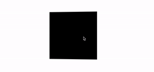

## 纯 CSS 实现元素的 3D 旋转

如果不借助 JavaScript，仅仅只是 CSS，如何实现类似的 3D 旋转效果呢？

这里会运用到一种名为**正反旋转相消**或者是**正负旋转相消**的小技巧。嗯，名字起的很奇怪，好像数学概念一样。

在动画中，旋转是非常常用的属性，

```css
{
  transform: rotate(90deg);
}
```


如果我们给不同的层级的元素，添加不同方向的旋转，会发生什么呢？

首先假设一下场景，我们有这样的一层 HTML 结构：

```html
<div class="reverseRotate">
    <div class="rotate">
        <div class="content">正负旋转相消3D动画</div>
    </div>
</div>
```


样式如下：

[](./img/163178879-56b58f38-256c-42bf-8d3a-a390488ba0a7.png)

`.content` 内是我们的主要内容，好了，现在想象一下，如果父元素 `.rotate` 进行正向 linear 360° 旋转，最外层的父级元素 `.reverseRotate` 进行反向 linear 360° 旋转，效果会是啥样？

CSS 代码如下：

```css
.rotate {
    animation: rotate 5s linear infinite;
}
.reverseRotate {
    animation: reverseRotate 5s linear infinite;
}
@keyframes rotate {
    100% {
        transform: rotate(360deg);
    }
}
@keyframes reverseRotate {
    100% {
        transform: rotate(-360deg);
    }
}
```


我们可以得到这样一种动画（注意，下图是 GIF 不是 PNG）：

[](./img/163178879-56b58f38-256c-42bf-8d3a-a390488ba0a7.png)

神奇！因为一正一反的旋转，且缓动函数一样，所以整个 `.content` 看上去依然是静止的！注意，这里整个 `.content` 静止的非常重要。

有读者看到这里就要骂人了，作者你个智障，静止了不就没动画了吗？哪来的动画技巧？

别急！虽然看上去是静止的，但是其实祖先两个元素都是在旋转的！这会看上去风平浪静的效果底下其实是暗流涌动。用开发者工具选取最外层祖先元素是这样的：

[](./img/29658516-b78fe5f0-88ed-11e7-8877-bf904d175bc5.gif)

既然如此，我们继续思考，如果我在其中旋转的一个父元素上，添加一些别的动画会是什么效果？想想就很刺激。

首先，我们先给这几个元素添加 CSS 3D 转换：

```css
div {
    transform-style: preserve-3d;
    perspective: 100px;
}
```


接着，尝试修改上面的旋转动画，在内层旋转上额外添加一个 rotateX：

```scss
@keyframes rotate {
    0% {
        transform: rotateX(0deg) rotateZ(0deg);
    }
    50% {
        transform: rotateX(40deg) rotateZ(180deg);
    }
    100% {
        transform: rotateX(0deg) rotateZ(360deg);
    }
}
```


效果如下：

[](./img/29659798-e3e366dc-88f1-11e7-98a3-3d7d913d7480.gif)

Wow，这里需要好好理解一下。由于内容 `.content` 层是静止的但其实外层两个图层都在旋转，通过设置额外的 `rotateX(40deg)`，相当于叠加多了一个动画，由于正反旋转抵消了，所有整个动画只能看到旋转的 `rotateX(40deg)` 这个动画，产生了上述的效果。

这样，在没有 JavaScript 介入的情况下，我们就模拟了题图所示的 3D 效果。当然，仅仅是这样，与用户的联动是不够的，如果一定要结合鼠标移动，我们就需要 JavaScript 的一些辅助了。

## 借助 Javascript 实现鼠标跟随 3D 旋转动效

我们的目标是实现这样一个动画效果：

[](./img/163180473-923b8dde-8c6f-45f3-b8a3-f2fb02b0fc3f.gif)

这里，我们其实有两个核心元素：

1. 鼠标活动区域
2. 旋转物体本身

鼠标在**鼠标活动区域**内的移动，会影响**旋转物体本身**的 3D 旋转，而旋转的方向其实可以被分解为 X 轴方向与 Y 轴方向。

我们来看一下，假设我们的 HTML 结构如下：

```html
<body>
    <div id="element"></div>
</body>
```


得到这样一个图形：


这里，`body` 的范围就是整个鼠标可活动区域，也是我们添加鼠标的 `mousemove` 事件的宿主 target，而 `#element` 就是需要跟随鼠标一起转动的旋转物体本身。

因为整个效果是需要基于 CSS 3D 的，我们首先加上简单的 CSS 3D 效果：

```css
body {
    width: 100vw;
    height: 100vh;
    transform-style: preserve-3d;
    perspective: 500px;
}

div {
    width: 200px;
    height: 200px;
    background: #000;
    transform-style: preserve-3d;
}
```


效果如下：

[](./img/163181057-07ea1d64-c264-43e5-9402-2c6f61bc4502.png)

没有什么不一样。这是因为还没有添加任何的 3D 变换，我们给元素添加 X、Y 两个方向的 `rotate()` 试一下（注意，这里默认的旋转圆心即是元素中心）：

```css
div {
     transform: rotateX(15deg) rotateY(30deg);
}
```


效果如下，是有那么点意思了：

[](./img/163182435-96512ec5-6dfd-4ff4-9ec8-9a1225bfed27.png)

好，接下来，我们的目标就是通过结合 mouseover 事件，让元素动起来。

### 控制 X 方向的移动

当然，为了更加容易理解，我们把动画拆分为 X、Y 两个方向上的移动。首先看 X 方向上的移动：

[](./img/163185636-cf3ae453-61f4-46fe-b4ac-54dfaab03ace.gif)

这里，我们需要以元素的中心为界：

1. 当鼠标在中心右侧连续移动，元素绕 Y 轴移动，并且值从 0 开始，越来越大，范围为(0, +∞)deg
2. 反之，当鼠标在中心左侧连续移动，元素绕 Y 轴移动，并且值从 0 开始，越来越小，范围为(-∞, 0)deg

这样，我们可以得到这样一个公式：

rotateY = (鼠标 x 坐标 - 元素左上角 x 坐标 - 元素宽度的一半)deg

通过绑定 onmousemove 事件，我们尝试一下：

```js
const mouseOverContainer = document.getElementsByTagName("body")[0];
const element = document.getElementById("element");

mouseOverContainer.onmousemove = function(e) {
  let box = element.getBoundingClientRect();
  let calcY = e.clientX - box.x - (box.width / 2);
    
  element.style.transform  = "rotateY(" + calcY + "deg) ";
}
```


效果如下：

[](./img/163187794-a26a2979-7327-413d-9819-9874820b5225.gif)

好吧，旋转的太夸张了，因此，我们需要加一个倍数进行控制：

```js
const multiple = 20;
const mouseOverContainer = document.getElementsByTagName("body")[0];
const element = document.getElementById("element");

mouseOverContainer.onmousemove = function(e) {
  let box = element.getBoundingClientRect();
  let calcY = (e.clientX - box.x - (box.width / 2)) / multiple;
    
  element.style.transform  = "rotateY(" + calcY + "deg) ";
}
```


通过一个倍数约束后，效果好了不少：

[](./img/163188818-61d6ebd5-c740-4899-94b3-ad7cfddd8285.gif)

### 控制 Y 方向的移动

同理，我们利用上述的方式，同样可以控制 Y 方向上的移动：

```js
const multiple = 20;
const mouseOverContainer = document.getElementsByTagName("body")[0];
const element = document.getElementById("element");

mouseOverContainer.onmousemove = function(e) {
  let box = element.getBoundingClientRect();
  let calcX = (e.clientY - box.y - (box.height / 2)) / multiple;
    
  element.style.transform  = "rotateX(" + calcX + "deg) ";
};
```


效果如下：


当然，在这里，我们会发现方向是元素运动的方向是反的，所以需要做一下取反处理，修改下 `calcX` 的值，乘以一个 `-1` 即可：

```js
let calcX = (e.clientY - box.y - (box.height / 2)) / multiple * -1;
```


### 结合 X、Y 方向的移动

OK，到这里，我们只需要把上述的结果合并一下即可，同时，上面我们使用的是 `onmousemove` 触发每一次动画移动。现代 Web 动画中，我们更倾向于使用 `requestAnimationFrame` 去优化我们的动画，确保每一帧渲染一次动画即可。

完整的改造后的代码如下：

```js
const multiple = 20;
const mouseOverContainer = document.getElementsByTagName("body")[0];
const element = document.getElementById("element");

function transformElement(x, y) {
  let box = element.getBoundingClientRect();
  let calcX = -(y - box.y - (box.height / 2)) / multiple;
  let calcY = (x - box.x - (box.width / 2)) / multiple;
  
  element.style.transform  = "rotateX("+ calcX +"deg) "
                        + "rotateY("+ calcY +"deg)";
}

mouseOverContainer.addEventListener('mousemove', (e) => {
  window.requestAnimationFrame(function(){
    transformElement(e.clientX, e.clientY);
  });
});
```


至此，我们就能简单的实现题图所示的鼠标跟随 3D 旋转动效：


### 设置平滑出入

现在，还有最后一个问题，就是当我们的鼠标离开活动区域时，元素的 transform 将停留在最后一帧，正确的表现应该是复原到原状。因此，我们还需要添加一些事件监听做到元素的平滑复位。

通过一个 `mouseleave` 事件配合元素的 `transition` 即可。

```css
div {
    // 与上述保持一致...
    transition: all .2s;
}
```


```js
mouseOverContainer.addEventListener('mouseleave', (e) => {
  window.requestAnimationFrame(function(){
    element.style.transform = "rotateX(0) rotateY(0)";
  });
});
```


至此，我们就可以完美的实现平滑出入，整体效果最终如下：

<iframe height="300" style="width: 100%;" scrolling="no" title="CSS 3D Rotate With Mouse Move" src="https://codepen.io/mafqla/embed/JjVENXY?default-tab=html%2Cresult&editable=true&theme-id=light" frameborder="no" loading="lazy" allowtransparency="true" allowfullscreen="true">
  See the Pen <a href="https://codepen.io/mafqla/pen/JjVENXY">
  CSS 3D Rotate With Mouse Move</a> by mafqla (<a href="https://codepen.io/mafqla">@mafqla</a>)
  on <a href="https://codepen.io">CodePen</a>.
</iframe>

