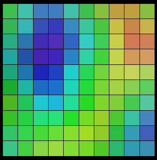
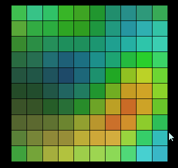
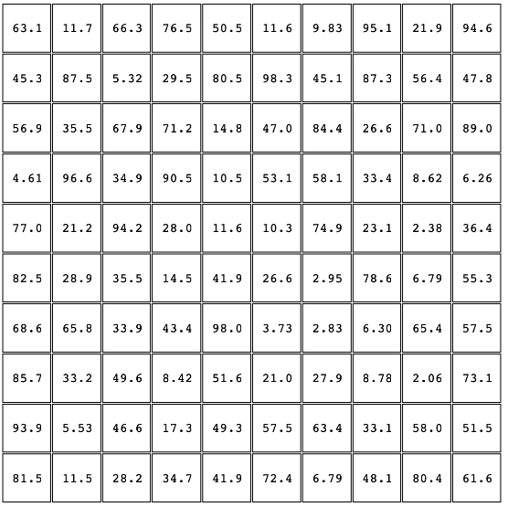
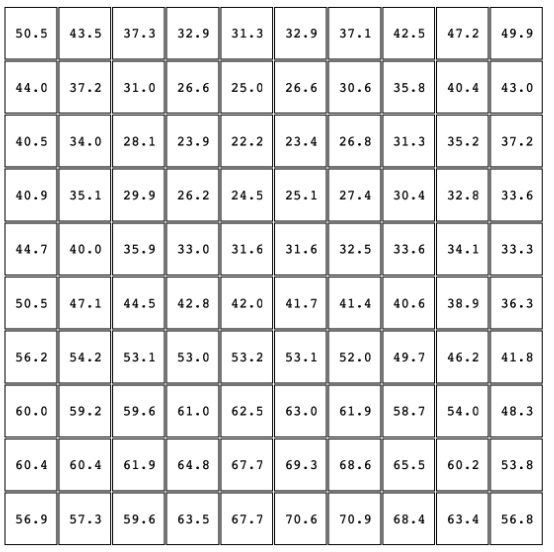
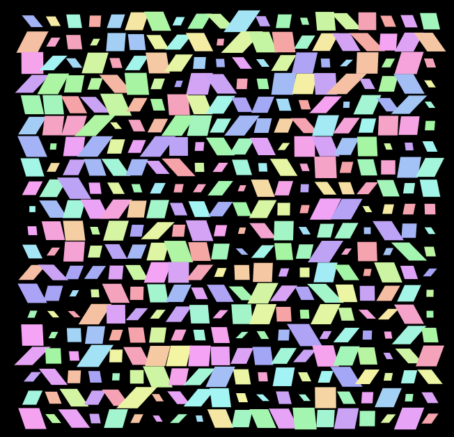
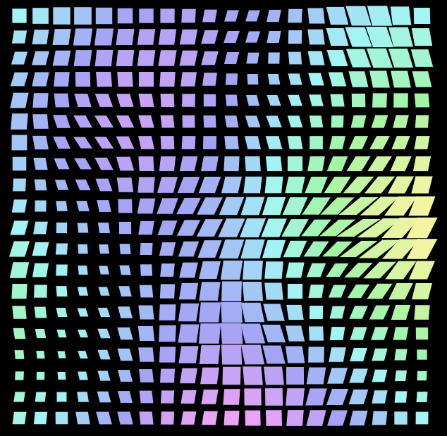

## 什么是白噪声？

噪声（Noise）实际上就是一个随机数生成器。

那么，什么是**白噪声**呢？如果从程序员的角度去理解的话，可以理解为我们在 JavaScript 中使用的 `random()` 函数，生成的数大致在 0~1 内是完全随机的。

而噪声的基础是随机数，譬如我们给上述的图形每一个格子添加了一个随机颜色，得到的就是一幅杂乱无章的图形块，没有太多美感可言。

> 白噪声或白杂讯，是一种功率[谱密度](https://baike.baidu.com/item/谱密度)为常数的随机信号。换句话说，此[信号](https://baike.baidu.com/item/信号)在各个频段上的功率谱密度是一样的，由于白光是由各种频率（颜色）的单色光混合而成，因而此信号的这种具有平坦[功率谱](https://baike.baidu.com/item/功率谱)的性质被称作是“白色的”，此信号也因此被称作白噪声。

因为，利用白噪声产生的图形，看起不自然，也不太具备美感。

观察现实生活中的自然噪声，它们不会长成上面的样子。例如木头的纹理、山脉的起伏，它们的形状是趋于分形状（fractal）的，即包含了不同程度的细节，这些随机的成分并不是完全独立的，它们之间有一定的关联。和显然，白噪声没有做到这一点。

## 柏林噪声

这样，我们就自然而然的引入了**柏林噪声**。

Perlin 噪声 ( Perlin noise ) 指由 Ken Perlin 发明的自然噪声生成算法。

在介绍它之前，我们先看看，上述的图形，如果我们不使用白噪声（完全随机），而是使用柏林噪声，会是什么样子呢？

它可能是这样：

[](https://user-images.githubusercontent.com/8554143/177000524-f8961ec8-e861-4f18-a088-54ec923703c5.png)

这里我制作了一张动图，大家可以感受下，每次点击都是一次利用了柏林噪声随机，赋予每个格子不同随机颜色的结果：

[](https://user-images.githubusercontent.com/8554143/177000641-0d1ff4a0-e5f0-4ff2-8860-c7976db9a5be.gif)

可以看到，利用**柏林噪声**随机效果产生的图形，彼此之间并非毫无关联，它们之间的变化是连续的，彼此之间并没有发生跳变。这种随机效果，类似于自然界中的随机效果，譬如上面说的，木头纹理、山脉起伏的变化。

上面说的，噪声实际上就是一个随机数生成器。而这里：

1. **白噪声**的问题在于，它实在太过于随机，毫无规律可言
2. 而**柏林噪声**基于随机，并在此基础上利用缓动曲线进行平滑插值，使得最终得到噪声效果更加趋于自然

具体的实现方式在这里 [Improved Noise reference implementation](https://mrl.cs.nyu.edu/~perlin/noise/)，可以看看，源码其实不是很多：

```java
// This code implements the algorithm I describe in a corresponding SIGGRAPH 2002 paper.
// JAVA REFERENCE IMPLEMENTATION OF IMPROVED NOISE - COPYRIGHT 2002 KEN PERLIN.

public final class ImprovedNoise {
   static public double noise(double x, double y, double z) {
      int X = (int)Math.floor(x) & 255,                  // FIND UNIT CUBE THAT
          Y = (int)Math.floor(y) & 255,                  // CONTAINS POINT.
          Z = (int)Math.floor(z) & 255;
      x -= Math.floor(x);                                // FIND RELATIVE X,Y,Z
      y -= Math.floor(y);                                // OF POINT IN CUBE.
      z -= Math.floor(z);
      double u = fade(x),                                // COMPUTE FADE CURVES
             v = fade(y),                                // FOR EACH OF X,Y,Z.
             w = fade(z);
      int A = p[X  ]+Y, AA = p[A]+Z, AB = p[A+1]+Z,      // HASH COORDINATES OF
          B = p[X+1]+Y, BA = p[B]+Z, BB = p[B+1]+Z;      // THE 8 CUBE CORNERS,

      return lerp(w, lerp(v, lerp(u, grad(p[AA  ], x  , y  , z   ),  // AND ADD
                                     grad(p[BA  ], x-1, y  , z   )), // BLENDED
                             lerp(u, grad(p[AB  ], x  , y-1, z   ),  // RESULTS
                                     grad(p[BB  ], x-1, y-1, z   ))),// FROM  8
                     lerp(v, lerp(u, grad(p[AA+1], x  , y  , z-1 ),  // CORNERS
                                     grad(p[BA+1], x-1, y  , z-1 )), // OF CUBE
                             lerp(u, grad(p[AB+1], x  , y-1, z-1 ),
                                     grad(p[BB+1], x-1, y-1, z-1 ))));
   }
   static double fade(double t) { return t * t * t * (t * (t * 6 - 15) + 10); }
   static double lerp(double t, double a, double b) { return a + t * (b - a); }
   static double grad(int hash, double x, double y, double z) {
      int h = hash & 15;                      // CONVERT LO 4 BITS OF HASH CODE
      double u = h<8 ? x : y,                 // INTO 12 GRADIENT DIRECTIONS.
             v = h<4 ? y : h==12||h==14 ? x : z;
      return ((h&1) == 0 ? u : -u) + ((h&2) == 0 ? v : -v);
   }
   static final int p[] = new int[512], permutation[] = { 151,160,137,91,90,15,
   131,13,201,95,96,53,194,233,7,225,140,36,103,30,69,142,8,99,37,240,21,10,23,
   190, 6,148,247,120,234,75,0,26,197,62,94,252,219,203,117,35,11,32,57,177,33,
   88,237,149,56,87,174,20,125,136,171,168, 68,175,74,165,71,134,139,48,27,166,
   77,146,158,231,83,111,229,122,60,211,133,230,220,105,92,41,55,46,245,40,244,
   102,143,54, 65,25,63,161, 1,216,80,73,209,76,132,187,208, 89,18,169,200,196,
   135,130,116,188,159,86,164,100,109,198,173,186, 3,64,52,217,226,250,124,123,
   5,202,38,147,118,126,255,82,85,212,207,206,59,227,47,16,58,17,182,189,28,42,
   223,183,170,213,119,248,152, 2,44,154,163, 70,221,153,101,155,167, 43,172,9,
   129,22,39,253, 19,98,108,110,79,113,224,232,178,185, 112,104,218,246,97,228,
   251,34,242,193,238,210,144,12,191,179,162,241, 81,51,145,235,249,14,239,107,
   49,192,214, 31,181,199,106,157,184, 84,204,176,115,121,50,45,127, 4,150,254,
   138,236,205,93,222,114,67,29,24,72,243,141,128,195,78,66,215,61,156,180
   };
   static { for (int i=0; i < 256 ; i++) p[256+i] = p[i] = permutation[i]; }
}
```

当然，本文不是专门来论述**柏林噪声**如何实现的，上述代码谁看了都头大。我们只需要知道，我们可以借助柏林噪声去构建更有规律的图形效果。让我们的图形更具美感。

## 利用 CSS-doodle，在 CSS 中利用柏林噪声

那么，在 CSS 中我们如何去使用**柏林噪声**呢？

一种方式是找一些现成的库，譬如 p5.js 里面的 `noise` 函数。

当然，这里，我习惯使用 [CSS-doodle](https://css-doodle.com/)，这个 CSS 图形构建库我在多篇文章中已经都有介绍过。

简单而言，CSS-doodle 它是一个基于 Web-Component 的库。允许我们快速的创建基于 CSS Grid 布局的页面，并且提供各种便捷的指令及函数（随机、循环等等），让我们能通过一套规则，得到不同 CSS 效果。可以简单看看它的主页 -- [Home Page of CSS-doodle](https://css-doodle.com/)，只需要 5min 也许就能快速上手。

譬如上述的图形，**它的全部代码**：

```html
<css-doodle grid="10x10">
  :doodle { @size: 50vmin; gap: 1px; } background: hsl(@rn(255, 1, 2), @rn(10%,
  90%), @rn(10%, 90%));
</css-doodle>
```

没错，只需要这么寥寥几句，就可以勾勒出这样一幅图案：

<iframe height="300" style="width: 100%;" scrolling="no" title="CSS Pattern -- CSS Doodle" src="https://codepen.io/mafqla/embed/zYXzLKO?default-tab=html%2Cresult&editable=true&theme-id=light" frameborder="no" loading="lazy" allowtransparency="true" allowfullscreen="true">
  See the Pen <a href="https://codepen.io/mafqla/pen/zYXzLKO">
  CSS Pattern -- CSS Doodle</a> by mafqla (<a href="https://codepen.io/mafqla">@mafqla</a>)
  on <a href="https://codepen.io">CodePen</a>.
</iframe>

简单解释下：

1. `css-doodle` 是基于 Web-Component 封装的，基本所有的代码都写在 `<css-doodle>` 标签内，当然也可以写一些原生 CSS/JavaScript 辅助
2. 使用 `grid="10x10"` 即可生成一个 10x10 的 Grid 网格，再配合 `@size: 50vmin`，表示生成一个宽高大小为 `50vmin` 的 10x10 Grid 网格布局，其中 `gap: 1px` 表示 Gird 网格布局的 gap
3. 最后，整个代码的核心部分即是 `background: hsl(@rn(255, 1, 2), @rn(10%, 90%), @rn(10%, 90%))`，这里即表示对每个 grid item 赋予背景色，其中 `@rn()`，就是最核心的部分，利用了**柏林噪声**算法，有规律的将背景色 map 到每一个 grid 上

得到的回复是，官网近期会重构，所以目前没有更新最新的语法。同时，`@rn()` 的实现使用的就是**柏林噪声**的实现。同时，函数相当于是类似 p5.js 里面的 noise 函数同时做了 map，map 到前面函数参数设定的 from 到 to 范围内。

这里的 `@rn()` 柏林噪声随机会根据 Grid 网格，Map 到每一个网格上，使之相邻的 Grid item 之间的值，存在一定的关联。

举个栗子，我们有个 10x10 的 Grid 布局，给其每个 Grid item，添加一个伪元素，伪元素的内容，使用 `@r(100)` 进行填充，注意，`@r()` 函数是没有规律的完全随机，那么生成的数字大概是这样的：

[](https://user-images.githubusercontent.com/8554143/177152536-8d2bea6b-429b-48cf-b676-b279d95e7ecf.png)

可以看到，它们每个各自之间的数字，是完全随机毫无关联的。

如果我们使用有关联的柏林噪声随机呢？使用 `@rn(100)` 填充每个格子的话，大概是这样：

[](https://user-images.githubusercontent.com/8554143/177152777-5b161a25-b2be-44bc-891a-be09a1019be7.png)

观察一下，很容易发现，相邻的盒子之间，或者多个连续的格子之间，存在一定的关联性，这就使得，我们利用它创造出来的图形，会具备一定的规律。

可以简单看看源码的实现，当前，前提是你需要对 CSS-doodle 的用法有一定的了解：

```
    rn({ x, y, context, position, grid, extra, shuffle }) {
      let counter = 'noise-2d' + position;
      let [ni, nx, ny, nm, NX, NY] = last(extra) || [];
      let isSeqContext = (ni && nm);
      return (...args) => {
        let {from = 0, to = from, frequency = 1, amplitude = 1} = get_named_arguments(args, [
          'from', 'to', 'frequency', 'amplitude'
        ]);

        if (args.length == 1) {
          [from, to] = [0, from];
        }
        if (!context[counter]) {
          context[counter] = new Perlin(shuffle);
        }
        frequency = clamp(frequency, 0, Infinity);
        amplitude = clamp(amplitude, 0, Infinity);
        let transform = [from, to].every(is_letter) ? by_charcode : by_unit;
        let t = isSeqContext
          ? context[counter].noise((nx - 1)/NX * frequency, (ny - 1)/NY * frequency, 0)
          : context[counter].noise((x - 1)/grid.x * frequency, (y - 1)/grid.y * frequency, 0);
        let fn = transform((from, to) => map2d(t * amplitude, from, to, amplitude));
        let value = fn(from, to);
        return push_stack(context, 'last_rand', value);
      };
    },
```

语法大概是 `@rn(from, to, frequency, amplitude)`，其中 `from`、`to` 表示随机范围，而 `frequency` 表示噪声的频率，`amplitude` 表示噪声的振幅。这两个参数可以理解为控制随机效果的频率和幅度。

其中 `new Perlin(shuffle)` 即运用到了柏林噪声算法。

## Show Time

OK，上文介绍了很多与噪声和 CSS-doodle 相关的知识，下面我们回归 CSS，回归本文的主体。

在上述图形的基础上，我们可以再添加上随机的 `scale()`、以及 `skew()`。如果是完全随机的话，代码是这样的：

```html
<css-doodle grid="20">
  :doodle { grid-gap: 1px; width: 600px; height: 600px; } background:
  hsl(@r(360), 80%, 80%); transform: scale(@r(1.1, .3, 3)) skew(@r(-45deg,
  45deg, 3));
</css-doodle>
```

```css
html,
body {
  width: 100%;
  height: 100%;
  background-color: #000;
}
```

上述代码表示的是一个 20x20 的 Grid 网格，每个 Grid item 都设置了完全随机的背景色、`scale()` 以及 `skew()`。当然，这里我们用的是 `@r()`而不是 `@rn()`，每个格子的每个属性的随机，没有任何的关联，那么我们会得到这样一幅图案：

[](https://user-images.githubusercontent.com/8554143/177009729-525760d5-b7e1-4787-a1c6-cd9f70b7f29e.png)

好吧，这是什么鬼，毫无美感可言。我们只需要在上述代码的基础上，将普通的完全随机，改为柏林噪声随机 `@rn()`：

```html
<css-doodle grid="20">
  :doodle { grid-gap: 1px; width: 600px; height: 600px; } background:
  hsl(@rn(360), 80%, 80%); transform: scale(@rn(1.1, .3, 3)) skew(@rn(-45deg,
  45deg, 3));
</css-doodle>
```

此时，就能得到完全不一样的效果：

[](https://user-images.githubusercontent.com/8554143/177009864-06c0e157-3743-4108-8357-f539ccf151c3.png)

这是由于，每个 Grid item 的随机效果，都基于它们在 Grid 布局中的位置，彼此存在关联，这就是柏林噪声随机的效果。

我可以再添加上 `hue-rotate` 动画：

```css
html,
body {
  width: 100%;
  height: 100%;
  background-color: #000;
  animation: change 10s linear infinite;
}
@keyframes change {
  10% {
    filter: hue-rotate(360deg);
  }
}
```

看看效果，并且，在 CSS-doodle 中，由于随机效果，每次刷新，都可以得到不一样的图案：

<iframe height="300" style="width: 100%;" scrolling="no" title="CSS Doodle - CSS Pattern" src="https://codepen.io/mafqla/embed/OJGgwXO?default-tab=html%2Cresult&editable=true&theme-id=light" frameborder="no" loading="lazy" allowtransparency="true" allowfullscreen="true">
  See the Pen <a href="https://codepen.io/mafqla/pen/OJGgwXO">
  CSS Doodle - CSS Pattern</a> by mafqla (<a href="https://codepen.io/mafqla">@mafqla</a>)
  on <a href="https://codepen.io">CodePen</a>.
</iframe>

当然，这个样式还可以搭配各式各样其他的 idea，像是这样：

<iframe height="300" style="width: 100%;" scrolling="no" title="CSS Pattern" src="https://codepen.io/mafqla/embed/vYMZaKg?default-tab=html%2Cresult&editable=true&theme-id=light" frameborder="no" loading="lazy" allowtransparency="true" allowfullscreen="true">
  See the Pen <a href="https://codepen.io/mafqla/pen/vYMZaKg">
  CSS Pattern</a> by mafqla (<a href="https://codepen.io/mafqla">@mafqla</a>)
  on <a href="https://codepen.io">CodePen</a>.
</iframe>

又或者是这样：

<iframe height="300" style="width: 100%;" scrolling="no" title="CSS Pattern" src="https://codepen.io/mafqla/embed/zYXzLqg?default-tab=html%2Cresult&editable=true&theme-id=light" frameborder="no" loading="lazy" allowtransparency="true" allowfullscreen="true">
  See the Pen <a href="https://codepen.io/mafqla/pen/zYXzLqg">
  CSS Pattern</a> by mafqla (<a href="https://codepen.io/mafqla">@mafqla</a>)
  on <a href="https://codepen.io">CodePen</a>.
</iframe>

emmm，又或者这样：

<iframe height="300" style="width: 100%;" scrolling="no" title="CSS-doodle CSS Pattern" src="https://codepen.io/mafqla/embed/poBwZyQ?default-tab=html%2Cresult&editable=true&theme-id=light" frameborder="no" loading="lazy" allowtransparency="true" allowfullscreen="true">
  See the Pen <a href="https://codepen.io/mafqla/pen/poBwZyQ">
  CSS-doodle CSS Pattern</a> by mafqla (<a href="https://codepen.io/mafqla">@mafqla</a>)
  on <a href="https://codepen.io">CodePen</a>.
</iframe>

是的，我们可以把柏林噪声随机应用在各种属性上，我们可以放飞想象，去尝试各种不一样的搭配。下面这个， 就是把柏林噪声运用在点阵定位上：

```html
<css-doodle grid="30x30">
  :doodle { @size: 90vmin; perspective: 10px; } position: absolute; top: 0;
  left: 0; width: 2px; height: 2px; border-radius: 50%; top: @rn(1%, 100%, 1.5);
  left: @rn(1%, 100%, 1.5); transform: scale(@rn(.1, 5, 2)); background:
  hsl(@rn(1, 255, 3), @rn(10%, 90%), @rn(10%, 90%));
</css-doodle>
```

<iframe height="300" style="width: 100%;" scrolling="no" title="CSS Doodle - CSS Pattern " src="https://codepen.io/mafqla/embed/bGJRjpv?default-tab=html%2Cresult&editable=true&theme-id=light" frameborder="no" loading="lazy" allowtransparency="true" allowfullscreen="true">
  See the Pen <a href="https://codepen.io/mafqla/pen/bGJRjpv">
  CSS Doodle - CSS Pattern </a> by mafqla (<a href="https://codepen.io/mafqla">@mafqla</a>)
  on <a href="https://codepen.io">CodePen</a>.
</iframe>

亦或者配合运用在 `transform: rotate()` 上：

```html
<css-doodle grid="20x5">
  @place-cell: center; @size: calc(@i * 1.5%); :doodle { width: 60vmin; height:
  60vmin; } z-index: calc(999 - @i); border-radius: 50%; border: 1px @p(dashed,
  solid, double) hsl(@rn(255), 70%, @rn(60, 90%)); border-bottom-color:
  transparent; border-left-color: transparent; transform: rotate(@rn(-720deg,
  720deg)) scale(@rn(.8, 1.2, 3));
</css-doodle>
```

效果如下：

<iframe height="300" style="width: 100%;" scrolling="no" title="CSS Pattern" src="https://codepen.io/mafqla/embed/RwOgBap?default-tab=html%2Cresult&editable=true&theme-id=light" frameborder="no" loading="lazy" allowtransparency="true" allowfullscreen="true">
  See the Pen <a href="https://codepen.io/mafqla/pen/RwOgBap">
  CSS Pattern</a> by mafqla (<a href="https://codepen.io/mafqla">@mafqla</a>)
  on <a href="https://codepen.io">CodePen</a>.
</iframe>
