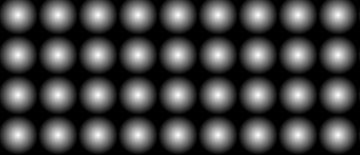
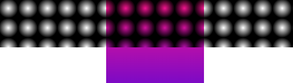
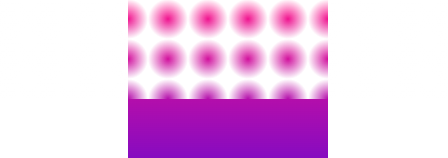
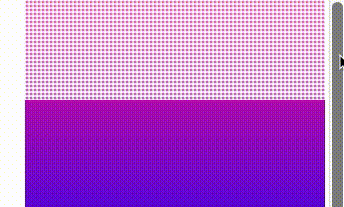
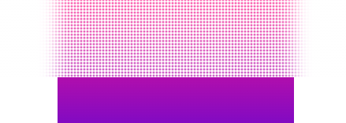
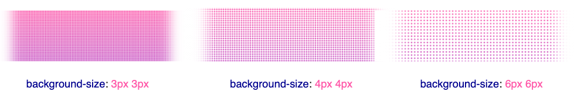
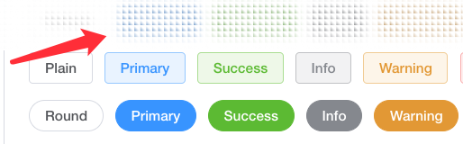

## 需求拆解

上述效果看似神奇，其实原理也非常简单。主要就是**颗粒化的背景 background**加上`backdrop-filter: blur()` 即可。

首先，我们需要实现颗粒背景。

我们利用 `background` 实现这样一个背景：

```html
<div></div>
```

```css
div {
  background: radial-gradient(transparent, #000 20px);
  background-size: 40px 40px;
}
```

从透明到黑色的径向渐变效果如下：

[](https://user-images.githubusercontent.com/8554143/179511399-4c3bd8f2-1666-4d24-b3a1-b5e31246c4b6.png)

需要注意的是，图里的白色部分其实透明的，可以透出背后的背景。此时，如果背景后面有元素，效果就会是这样：

[](https://user-images.githubusercontent.com/8554143/179511838-3679904c-b020-49b3-a454-1063a154c54d.png)

好，我们将 `background: radial-gradient(transparent, #000 20px)` 中的**黑色替换成白色**，效果如下：

[](https://user-images.githubusercontent.com/8554143/179511998-947d426f-7462-4a2a-9200-972099870268.png)

这里为了展示原理，每个径向渐变的圆设置的比较大，我们把它调整回正常大小：

```css
div {
  background: radial-gradient(transparent, rgba(255, 255, 255, 1) 2px);
  background-size: 4px 4px;
}
```

这样，我们就成功的将背景颗粒化：

[](https://user-images.githubusercontent.com/8554143/179512713-a67d3f0f-ece7-4997-b4ac-e30c17b83147.gif)

当然，此时透出的背景看上去非常生硬，也不美观，所以，我们还需要 `backdrop-filter: blur()`，我们加上一个试试看：

```css
div {
  background: radial-gradient(transparent, rgba(255, 255, 255, 1) 2px);
  background-size: 4px 4px;
  backdrop-filter: blur(10px);
}
```

这样，我们就实现了一开始所展示的效果：

[](https://user-images.githubusercontent.com/8554143/179513288-ab4d3863-42bb-48ee-a704-e90a94f8452d.png)

这里需要注意的是，`background-size` 的大小控制，和不同的 `backdrop-filter: blur(10px)` 值，都会影响效果。

[](https://user-images.githubusercontent.com/8554143/179514653-d9d0cd57-9c70-4b17-951c-c72ff8ffcdef.png)

<iframe height="300" style="width: 100%;" scrolling="no" title="Mask Filter" src="https://codepen.io/mafqla/embed/VwNzEYV?default-tab=html%2Cresult&editable=true&theme-id=light" frameborder="no" loading="lazy" allowtransparency="true" allowfullscreen="true">
  See the Pen <a href="https://codepen.io/mafqla/pen/VwNzEYV">
  Mask Filter</a> by mafqla (<a href="https://codepen.io/mafqla">@mafqla</a>)
  on <a href="https://codepen.io">CodePen</a>.
</iframe>

当然，掌握了这个技巧之后，我们可以尝试替换掉 `background: radial-gradient()` 图形，及改变 `background-size`，尝试各种不同形状的透视背景。简单举几个例子：

```css
div {
  background: linear-gradient(45deg, transparent, #fff 4px);
  background-size: 6px 6px;
  backdrop-filter: saturate(50%) blur(4px);
}
```

这里使用了 `linear-gradient()` 替换了 `radila-gradient()`：

[](https://user-images.githubusercontent.com/8554143/179516537-b1bb2731-9f39-45ef-9b63-a33367db5bca.png)
