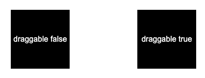
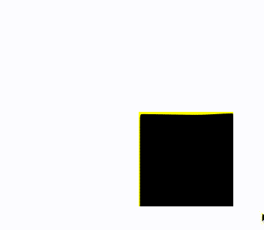
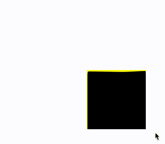
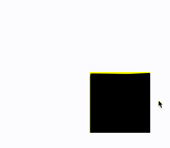
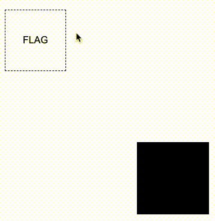
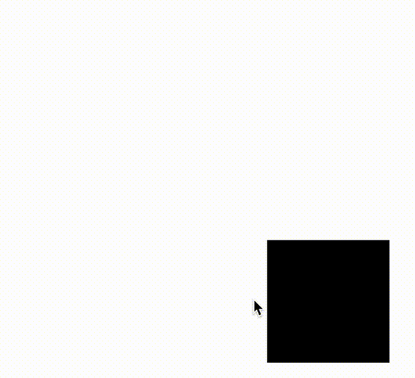

## 利用 draggable 属性实现元素的拖拽

基于上述第一点，**如何让一个元素变得可以拖拽**，这是最容易解决的。

在 HTML5 中，给标签新增了一个 `draggable` 属性，设置为 `true` 后，即可实现元素的拖拽效果。

简单而言：

```html
<div>draggable false</div>
<div draggable="true">draggable true</div>
```

我们实现这样两个 div，其中第二个设置了 `draggable="true"`：

[](https://user-images.githubusercontent.com/8554143/182604075-791ca1e8-1eac-4379-b8e9-46a03454a517.png)

设置了 `draggable="true"` 的元素，长按住鼠标即可拖动元素：

<iframe height="300" style="width: 100%;" scrolling="no" title="HTML draggable Demo" src="https://codepen.io/mafqla/embed/vYMWzMd?default-tab=html%2Cresult&editable=true&theme-id=light" frameborder="no" loading="lazy" allowtransparency="true" allowfullscreen="true">
  See the Pen <a href="https://codepen.io/mafqla/pen/vYMWzMd">
  HTML draggable Demo</a> by mafqla (<a href="https://codepen.io/mafqla">@mafqla</a>)
  on <a href="https://codepen.io">CodePen</a>.
</iframe>

## 实现元素从位置 A 到位置 B 的移动

OK，接下来的难点就在于，如何将元素从位置 A 移动到位置 B。

这里的核心在于，巧妙的应用 `transition` 元素。

我们来看这样一个例子，如果有一个元素，已经偏移了 `translate(120px, 120px)`，我们 hover 这个元素的时候，让它回到原来的位置：

```css
div {
  transform: translate(120px, 120px);
}
div:hover {
  transform: translate(0, 0);
}
```

效果如下：

[](https://user-images.githubusercontent.com/8554143/182607097-e9ac86cf-1063-454d-b956-93c40d49e10e.gif)

这里很有意思的是：

1. 当我们 hover 元素，元素归位
2. 由于元素归位，失去了 hover 的状态，又变回了原来状态，然后又重新触发了 hover 状态，如此反复，所以会看到剧烈的跳动

那，有没有办法让它复位了就不再跳回来呢？

可以的，我们可以通过设置一个非常大的 `transition-duraiotn` 和一个非常大的 `transition-delay`，让整个过渡效果变得非常缓慢，慢到我们察觉不到：

```css
div {
  transform: translate(120px, 120px);
  transition: 999999s 999999s;
}
div:hover {
  transform: translate(0, 0);
  transition: 0s;
}
```

如此一来，元素复位了之后，就再也不会跳回来了（理论上）：

[](https://user-images.githubusercontent.com/8554143/182608383-6a407d8b-5785-415f-a6a6-36758ee54f42.gif)

如果，我们把上述的 `transition: 999999s 999999s`，也就**过渡持续时间与**过渡延迟时间\*\*设置短一点，譬如都设置为 2s 的话 `transition: 2s 2s`，效果如下：

[](https://user-images.githubusercontent.com/8554143/182609475-b70d8067-21be-4ca4-8289-8851c2a37bd3.gif)

这样，你应该能大致理解发生了什么了。

### 通过 :active 伪类实现触发器

当然，只有上面的知识还是不够。

首先，元素的移动不是通过 hover 触发的，而是需要通过拖到到特定位置，并且释放鼠标的拖动效果，实现元素的移动。并且，只有在特定的位置释放，元素才能移动。

这又是怎么实现的呢？这里，我们还需要通过**事件的冒泡**。

我们简单改造一下代码，给元素添加一个父元素，再添加一个标记元素：

```html
<div class="g-wrap">
  <div class="g-flag">FLAG</div>
  <div class="g-box" draggable="true"></div>
</div>
```

```css
.g-flag:hover ~ .g-box {
  transform: translate(0, 0);
  transition: 0s;
}
.g-box {
  width: 120px;
  height: 120px;
  background: #000;
  transform: translate(120px, 120px);
  transition: 9999s 9999s;
}
```

其中，`.g-flag` 是我们实现的一个触发器，我们不再通过 hover 元素本身实现元素的移动，而是通过 hover 这个特殊的触发器来实现元素的移动，这个应该很好理解：

[](https://user-images.githubusercontent.com/8554143/182612447-d3cf9b4c-12de-49de-a5a1-49324c0a6f7b.gif)

好！**最为关键的步骤来了**！

我们需要通过事件的冒泡，当开始拖拽 `.g-box` 元素本身的时候，才让我们的触发器显现，并且设置一个极为短暂的停留时间，这样让鼠标放下的一瞬间，触发元素的复位。

什么意思呢？看看效果图：

[](https://user-images.githubusercontent.com/8554143/182614416-91c834a8-2d0e-4b10-8f72-67e5e9ee95e6.gif)

核心代码如下：

```html
<div class="g-wrap">
  <div class="g-flag">FLAG</div>
  <div class="g-box" draggable="true"></div>
</div>
```

```css
.g-wrap {
  position: relative;
  width: 120px;
  height: 120px;
}
.g-box {
  width: 120px;
  height: 120px;
  background: #000;
  transform: translate(120px, 120px);
  transition: 9999s 9999s;
}
.g-flag {
  position: absolute;
  width: 0;
  height: 0;
  top: -100px;
  left: -100px;
  transition: 0 0.5s;
}
.g-wrap:active .g-flag {
  border: 1px dashed #000;
  width: 100px;
  height: 100px;
}
.g-flag:hover ~ .g-box {
  transform: translate(0, 0);
  transition: 0s;
}
```

这里运用到非常核心的一点是，在拖拽 `.g-box` 元素的过程中，触发了它的 `:active` 事件，同时，这个事件还会冒泡到它的父元素 `.g-wrap` 上。利用事件的冒泡，我们可以让元素在拖拽的过程中，让触发器显示，并且通过鼠标释放后立即触发了触发器的 hover 事件，让元素从位置 A，移动到了位置 B，实在是妙不可言！

最后，我们只需要让触发器的位置，与我们希望元素去到的位置，保持一致，即可实现拼图的原理：

<iframe height="300" style="width: 100%;" scrolling="no" title="HTML draggable Demo" src="https://codepen.io/mafqla/embed/XWQzPQd?default-tab=html%2Cresult&editable=true&theme-id=light" frameborder="no" loading="lazy" allowtransparency="true" allowfullscreen="true">
  See the Pen <a href="https://codepen.io/mafqla/pen/XWQzPQd">
  HTML draggable Demo</a> by mafqla (<a href="https://codepen.io/mafqla">@mafqla</a>)
  on <a href="https://codepen.io">CodePen</a>.
</iframe>

## 实现拼字拼图游戏

剩下的大部分工作在于，将完整的图片切割成不同份数，随机放置不同到不同的位置。

这里，借助同样的原理，我再给出一个类似的 DEMO，一个简单的拼字游戏，给出完整的代码：

```html
<p class="source">请把文字摆放到正确的位置：橘皮乌龙</p>
<div class="g-container">
  <div class="g-wrap">
    <div class="g-flag"></div>
    <div class="g-box" draggable="true">橘</div>
  </div>
  <div class="g-wrap">
    <div class="g-flag"></div>
    <div class="g-box" draggable="true">皮</div>
  </div>
  <div class="g-wrap">
    <div class="g-flag"></div>
    <div class="g-box" draggable="true">乌</div>
  </div>
  <div class="g-wrap">
    <div class="g-flag"></div>
    <div class="g-box" draggable="true">龙</div>
  </div>
</div>
```

```css
.g-container {
  display: flex;
  width: 400px;
  height: 100px;
}
.g-wrap {
  position: relative;
  margin: auto;
  width: 100px;
  height: 100px;
  border: 1px dashed #000;
  box-sizing: border-box;
}
.g-flag {
  position: absolute;
  top: 0;
  left: 0;
  width: 0;
  height: 0;
  background: rgba(0, 0, 0, 0.15);
}
.g-box {
  width: 100%;
  height: 100%;
  background-color: #000;
  cursor: grab;
  color: #fff;
  text-align: center;
  line-height: 100px;
  font-size: 48px;
}
.g-wrap:active .g-flag {
  width: 100%;
  height: 100%;
}
@for $i from 1 to 5 {
  .g-wrap:nth-child(#{$i}) .g-box {
    transform: rotate(#{random(180)}deg)
      translate(#{random(400) - 150}px, #{random(100) + 60}px);
  }
}
.g-box {
  transition: 99999s 999999s;
}
.g-flag:hover + .g-box {
  transform: translate(0, 0);
  transition: 0s;
}
```

为了方便理解，每次拖拽元素的时候，需要放置的位置都会被高亮，当然，这一点提示效果完全是可以去掉的：

<iframe height="300" style="width: 100%;" scrolling="no" title="Pure CSS Spelling game" src="https://codepen.io/mafqla/embed/NWmwLJo?default-tab=html%2Cresult&editable=true&theme-id=light" frameborder="no" loading="lazy" allowtransparency="true" allowfullscreen="true">
  See the Pen <a href="https://codepen.io/mafqla/pen/NWmwLJo">
  Pure CSS Spelling game</a> by mafqla (<a href="https://codepen.io/mafqla">@mafqla</a>)
  on <a href="https://codepen.io">CodePen</a>.
</iframe>

在上述的代码中，我们利用了 SASS 快速实现了不同块的文字的位置的随机摆放，增加一定的随机性。同时，利用 SASS 减少了一些重复性代码的工作量。
