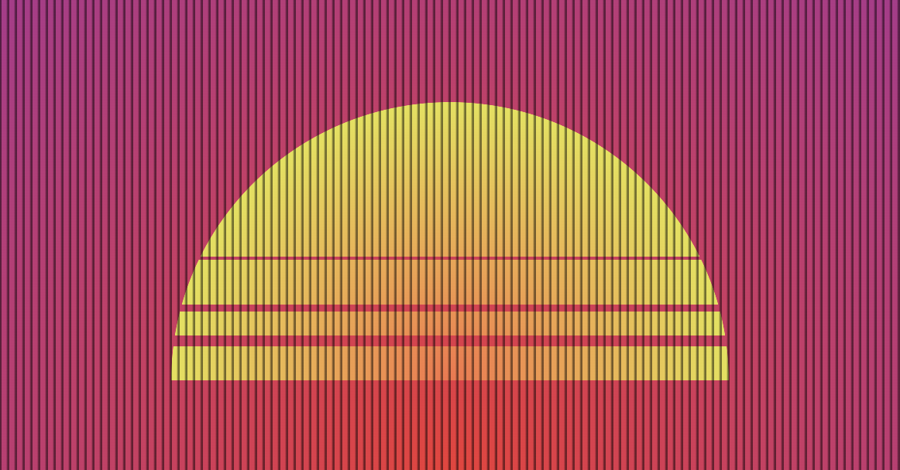
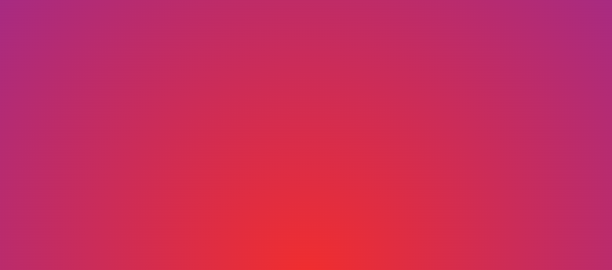
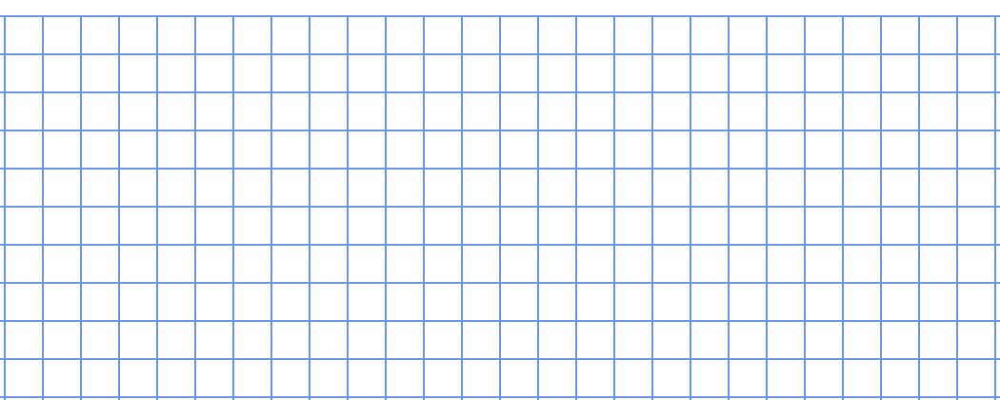
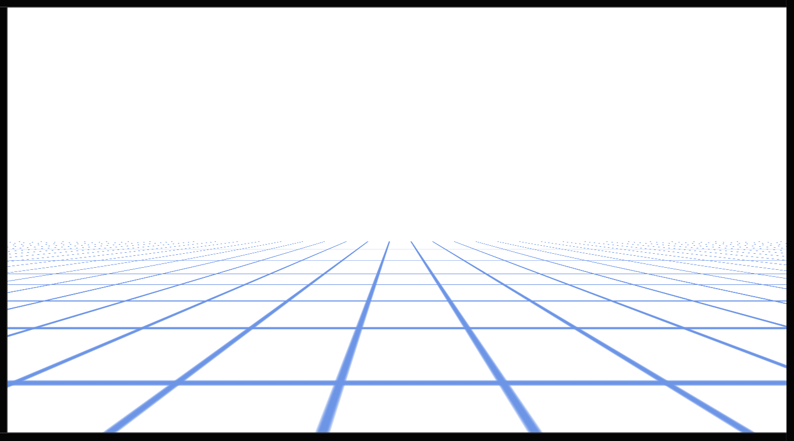
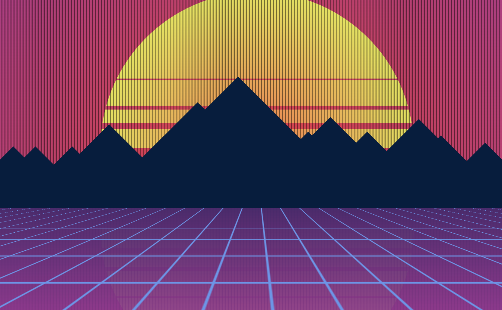

### 实现上半部分背景加落日

首先，我们来实现上半部分的背景加落日效果：

[](https://user-images.githubusercontent.com/8554143/187644739-3ea988df-6e78-4936-ad82-ecba5338d303.png)

大家可以先停顿思考下，这里让你来实现，会如何去做？需要多少个标签？

好的，这里，我们利用一个 DOM 标签去完成这个图形：

```html
<div class="g-bg"><div></div></div>
```

背景色好做，使用一个径向渐变或者线性渐变即可：

```css
.g-bg {
  background: radial-gradient(circle at 50% 100%, var(--color1), var(--color2));
}
```

如此，得到简单的背景：

[](https://user-images.githubusercontent.com/8554143/189865316-ee670bb6-2573-411f-8d17-440bd252be7f.png)

好，接下来，我们使用其中一个**伪元素实现落日**的效果。

```scss
.g-bg {
  position: absolute;
  background: radial-gradient(circle at 50% 100%, var(--color1), var(--color2));

  &::before {
    content: '';
    position: absolute;
    bottom: 20%;
    left: 10%;
    right: 10%;
    top: 10%;
    background: radial-gradient(
      circle at 50% 100%,
      var(--color3),
      var(--color4) 55%,
      transparent 55.1%,
      transparent
    );
  }
}
```

效果如下：


到这里，我觉得算是出现了第一个技巧，也就是这一行代码 `background: radial-gradient(circle at 50% 100%, var(--color3), var(--color4) 55%, transparent 55.1%, transparent)`，它用于在一个矩形元素中，通过径向渐变从实色到透明色，实现一个半圆。

**技巧 1：可以利用径向渐变，在一个矩形 DIV 元素中，通过径向渐变从实色到透明色的变化，实现一个半圆**。

我们继续，接下来，切割这个圆形，得到这样一种效果：


注意，这里需要裁剪切割的地方不是白色，而是透明的，需要透出后面的背景色。

毫无疑问，这里需要使用 mask 来完成，我们给伪元素加上 mask：

```scss
.g-bg {
  position: absolute;
  background: radial-gradient(circle at 50% 100%, var(--color1), var(--color2));

  &::before {
    content: '';
    position: absolute;
    bottom: 20%;
    left: 10%;
    right: 10%;
    top: 10%;
    background: radial-gradient(
      circle at 50% 100%,
      var(--color3),
      var(--color4) 55%,
      transparent 55.1%,
      transparent
    );
    mask: linear-gradient(
      to top,
      #000 0,
      #000 10%,
      transparent 10%,
      transparent 13%,
      #000 13%,
      #000 20%,
      transparent 20%,
      transparent 22%,
      #000 22%,
      #000 35%,
      transparent 35%,
      transparent 36%,
      #000 36%,
      #000 100%
    );
  }
}
```

这样，我们就实现了这个效果：

这里，引出了第二个技巧：

**技巧 2：利用 mask 可以对图形进行裁剪，被裁剪区域将会变成透明。**

好，接下来，我们需要在整个图形上再叠加上竖形黑色条纹。这个其实也可以用 mask，如果整个图形后面还有一层黑色背景。

当然，这里我们也可以把另外一个伪元素利用起来，利用它，通过多重线性渐变（repeating-linear-gradient）实现这里的竖形黑色条纹。

看看代码：

```scss
.g-bg {
  position: absolute;
  background: radial-gradient(circle at 50% 100%, var(--color1), var(--color2));

  &::before {
    content: '';
    // code of sun
  }

  &::after {
    content: '';
    position: absolute;
    top: 0;
    bottom: 0;
    right: 0;
    left: 0;
    background: repeating-linear-gradient(
      90deg,
      transparent 0,
      transparent 3px,
      rgba(0, 0, 0, 0.5) 4px,
      rgba(0, 0, 0, 0.5) 5px
    );
  }
}
```

这里，我们利用 `repeating-linear-gradient` 快速创建批量的竖形黑色条纹效果，得到这样的效果：

这里，得到技巧 3。

**技巧 3：当你碰到大量重复有规律的线条，或者方块图形，你第一时间就应该想到在一个 DOM 中利用渐变而不是多个 DOM 去实现**

好，至此，我们整个上半部分就实现了。

## 利用 -webkit-box-reflect 实现倒影

有了上面的基础，接下来我们要得到完整的背景：

怎么做呢？换个配色重新实现一遍吗？当然不是，这里我们利用 CSS 提供的倒影功能，可以快速完成这个操作。

```scss
.g-bg {
  position: absolute;
  background: radial-gradient(circle at 50% 100%, var(--color1), var(--color2));
  -webkit-box-reflect: below;

  &::before {
    content: '';
    // ...
  }
  &::after {
    content: '';
    // ...
  }
}
```

我们给 `.g-bg` 加一个 `-webkit-box-reflect: below`，意为下方的倒影：

虽然是复制了一个一模一样的 `.g-bg` 出来，但是和我们要的效果还相差很多啊，怎么办呢？

别急，`-webkit-box-reflect: below` 还提供，倒影偏移距离，倒影遮罩等属性。

我们需要给下方的倒影，添加一个遮罩，修改一下 `-webkit-box-reflect` 的代码：

```scss
.g-bg {
  position: absolute;
  background: radial-gradient(circle at 50% 100%, var(--color1), var(--color2));
  -webkit-box-reflect: below -50px linear-gradient(rgba(255, 255, 255, 0.2), transparent);

  &::before {
    content: '';
    // ...
  }
  &::after {
    content: '';
    // ...
  }
}
```

这样，我们就得到了这样一种效果：

这里，整个图形其实是半透明的，我们在背后叠加上一层我们想要的色彩渐变，可以利用 body 的伪元素：

```scss
body {
  &::before {
    position: absolute;
    content: '';
    top: 50%;
    left: 0;
    bottom: 0;
    right: 0;
    background: linear-gradient(var(--c5), var(--c6));
  }
}
.g-bg {
  position: absolute;
  background: radial-gradient(circle at 50% 100%, var(--color1), var(--color2));
  -webkit-box-reflect: below -50px linear-gradient(rgba(255, 255, 255, 0.2), transparent);

  &::before {
    content: '';
    // ...
  }
  &::after {
    content: '';
    // ...
  }
}
```

倒影通过半透明和背后的渐变背景叠加，这样，我们就完美实现了我们想要的整体背景效果：

这里，我们可以引出技巧 4。

**技巧 4：当出现重复的对称图形时，`-webkit-box-reflect` 也许能派上用场。**

## 利用 CSS 3D 动画实现线条动画

好，主体背景完成了，下面，我们来试着实现 3D 线条动画：

利用 CSS 3D，我们是可以实现这样一种效果的。我们一步一步来拆解。

首先，我们需要实现这样一种网格效果：

[](https://user-images.githubusercontent.com/8554143/187662899-16bb8ac1-1f8b-40b9-a5ee-5b039fa40aa1.png)

还记得上面的技巧 3 吗？当你碰到大量重复有规律的线条，或者方块图形，你第一时间就应该想到在一个 DOM 中利用渐变而不是多个 DOM 去实现。

这种效果，其实利用渐变一个标签就组足够了：

```html
<div class="grid"></div>
```

```css
.grid {
  background: repeating-linear-gradient(
      var(--c1),
      var(--c1) 1px,
      transparent 1px,
      transparent 20px
    ), repeating-linear-gradient(90deg, var(--c1), var(--c1) 1px, transparent
        1px, transparent 20px);
}
```

仅此而已，我们就能得到一个网格图。

好的，接下来，需要利用 transform 让他呈现一种 3D 视觉：

```css
body {
  perspective: 300px;
}
.grid {
  position: absolute;
  width: 300vw;
  height: 600px;
  left: -100vw;
  top: 55vh;
  transform-style: preserve-3d;
  background: repeating-linear-gradient(
      var(--c1),
      var(--c1) 1px,
      transparent 1px,
      transparent 20px
    ), repeating-linear-gradient(90deg, var(--c1), var(--c1) 1px, transparent
        1px, transparent 20px);
  transform: translate3d(0, 0, 0) rotateX(90deg);
  transform-origin: 50% 0;
}
```

效果如下：

[](https://user-images.githubusercontent.com/8554143/187663962-cbff25e5-89c1-42ec-a4c8-f2e337a396f9.png)

由于，整体绕 X 轴旋转 90°，所以这里的 `top: 55vh` 很重要。

由于旋转圆心是 `50% 0`，如果是 `top: 50vh`， 相当于整个图形会垂直于屏幕，如果 `top` 值小于 50vh，则整个网格是一种向上的翻转效果：

接着，我们需要让其运动起来。

我们尝试添加一个 translateZ 的运动动画：

```css
.grid {
  // ...
  animation: move 10s infinite linear;
}
@keyframes move {
  0% {
    transform: translate3d(0, 0, -600px) rotateX(90deg);
  }
  100% {
    transform: translate3d(0, 0, 600px) rotateX(90deg);
  }
}
```

看看效果：

这里有个很严重的问题，仅仅只是单个动画，很难做到无限循环衔接。

因此，我们需要再加一组 Grid，动画两组动画先后出发，来实现整个动画的衔接。

```html
<div class="grid"></div>
<div class="grid"></div>
```

```scss
.grid {
  // ...
  animation: move 10s infinite linear;
}
.grid:nth-child(2) {
  animation: move 10s infinite -5s linear;
}
@keyframes move {
  0% {
    transform: translate3d(0, 0, -600px) rotateX(90deg);
  }
  100% {
    transform: translate3d(0, 0, 600px) rotateX(90deg);
  }
}
```

我们通过这么一种方式：

1. 两组一模一样的动画，整个位移长度是 1200px，整个动画持续 10s，缓动为线性动画
2. 第一组出发 5s 后（刚好行进了 600px），第二组再出发，如此 infinite 反复
3. 整个 3D 动画，在近屏幕端看上去就是无限循环的一种效果
4. 这里运用的是 `-5s`，意思是提前 5s 出发，实际动画效果也就不会有等待感

如下（这里，为了录制 GIF，我整体是加快了动画的速度）：

可以看到，近屏幕端的动画是连续不断的，只是远端会出现一定的闪烁。这里，可以得到技巧 5。

**技巧 5：利用 2 组动画可以将一些有效在单组内的动画无法实现的连续效果实现**

这样，叠加上上面的效果，我们就得到了这样一种效果：

可以看到，很接近了。目前线条动画远处还有一些抖动。刚好，我们还差一个山峰的效果，可以把这块瑕疵挡住。

## 使用 box-shadow 及 SVG 滤镜实现山脉效果

OK，最后，我们在屏幕中间再叠加上一个山峰的效果就好。

这里，原效果使用的是一长串导出的 SVG 路径。如果我们没有这种资源，只是想简单模拟一下效果。这里我给出一种可能可行的方案。

我首先利用一个圆角矩形进行旋转，再配合容器的 `overflow: hidden` 得到一个小山峰：

```html
<div class="g-mountain"></div>
```

```scss
.g-mountain {
  position: absolute;
  left: 0;
  right: 0;
  top: 15%;
  bottom: 42%;
  overflow: hidden;

  &::after {
    content: '';
    position: absolute;
    top: 78%;
    background: #011d3f;
    width: 15vw;
    height: 15vw;
    transform: rotate(-45deg);
  }
}
```

大概是这样一种效果：

[](https://user-images.githubusercontent.com/8554143/187668374-e2efecd3-6ee5-47f1-98d9-f273123d6734.png)

好，如果我们想重复得到多个这样的图形，该怎么办呢？多个 DOM 吗？不是的，这里我们可以利用 `box-shadow` 复制自身。

```scss
.g-mountain {
  // ...
  &::after {
    content: '';
    position: absolute;
    top: 78%;
    background: #011d3f;
    width: 15vw;
    height: 15vw;
    transform: rotate(-45deg);
    box-shadow: -3vw -3vw, 5vw 5vw, 10vw 10vw 0 3vw, 15vw 20vw 0 4vw,
      22vw 22vw 0 6vw, 25vw 30vw 0 12vw, 38vw 36vw 0 1vw, 41vw 39vw 0 3vw,
      45vw 45vw 0 2vw, 52vw 52vw 0 4vh, 55vw 55vw 0 1.5vw, 61vw 61vw 0 0.5vw,
      68vw 68vw 0 0;
  }
}
```

这样，我们就用一个标签，实现了一系列的“山”：

[](https://user-images.githubusercontent.com/8554143/187669194-3dd2983a-bdf6-478a-9eb6-8a12d2d7630c.png)

这里，我们得到了技巧 6。

**技巧 6：`box-shadow` 可以有效的复制自身，并且，可以利用第四个参数，扩散半径，来等比例放大自身。**

其实，到这里，一个比较粗糙的还原就完成了。当然，有一点小问题是，山峰明显不应该是一条条直线。能否营造出一种弯弯曲曲的外轮廓效果呢？

这个使用纯 CSS 是比较难实现的，当然，好在这里我们可以运用上之前给大家多次提及过的 SVG 滤镜。

利用 `feTurbulence` 可以有效实现一些波形纹理效果。并且可以通过 CSS filter 快速引入。

```html
<div class="g-mountain"></div>
<svg width="0">
  <filter id="filter">
    <feTurbulence
      id="turbulence"
      type="fractalNoise"
      baseFrequency=".03"
      numOctaves="20"
    />
    <feDisplacementMap in="SourceGraphic" scale="30" />
  </filter>
</svg>
```

```scss
.g-mountain {
  // ...
  filter: url('#filter');

  &::after {
  }
}
```

这里，原本，整齐划一的直线，立马变得杂乱无章了起来，看起来更像是山脉的轮廓：

这里，我们得出了技巧 7。

**技巧 7：SVG 滤镜可以通过 CSS 滤镜快速引入，SVG 滤镜可以实现一些 CSS 完成不了的事情，譬如一些特殊的纹理，波纹，烟雾颗粒感等等效果。**

好，至此，我们就大体上按照自己的理解，重新实现了一遍上述的动画，再做一些简单的修饰，最终的效果如下：

<iframe height="300" style="width: 100%;" scrolling="no" title="Pure CSS to the future" src="https://codepen.io/mafqla/embed/wvZmrOR?default-tab=html%2Cresult&editable=true&theme-id=light" frameborder="no" loading="lazy" allowtransparency="true" allowfullscreen="true">
  See the Pen <a href="https://codepen.io/mafqla/pen/wvZmrOR">
  Pure CSS to the future</a> by mafqla (<a href="https://codepen.io/mafqla">@mafqla</a>)
  on <a href="https://codepen.io">CodePen</a>.
</iframe>
