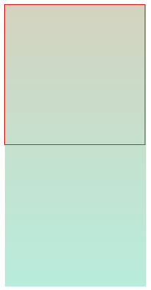
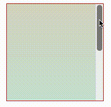
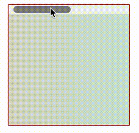
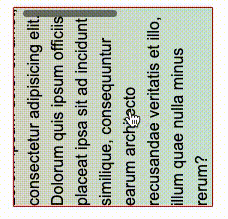
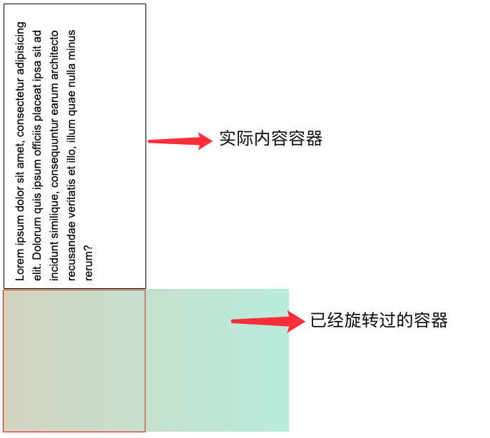
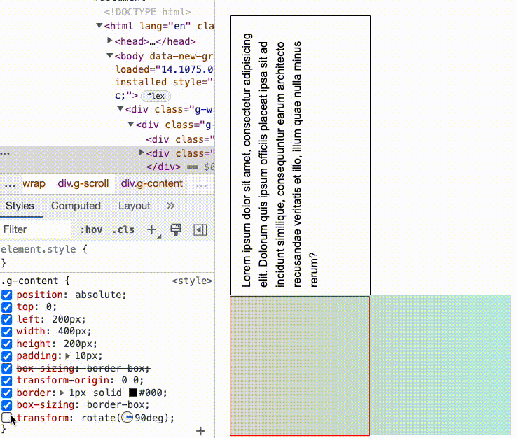
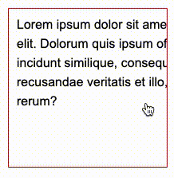
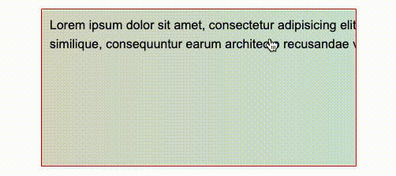

## 旋转大法

是的，既然只有垂直方向的溢出，才能响应滚轮操作。那我们不妨从这个角度入手。

首先实现一个垂直方向的溢出：

```html
<div class="g-scroll">
  <div class="g-pesudo"></div>
</div>
```

```css
.g-scroll {
  width: 200px;
  height: 200px;
  border: 1px solid #f00;
}
.g-pesudo {
  width: 200px;
  height: 400px;
  background: linear-gradient(rgba(122, 122, 50, 0.3), rgba(20, 200, 150, 0.3));
}
```

大概是这样：

[](https://user-images.githubusercontent.com/8554143/185917282-06ea9608-7018-4e43-9266-70859def9ae4.png)

好，加上 `overflow: hidden`，就会变成这样：

```css
.g-scroll {
  overflow: scroll;
}
```

[](https://user-images.githubusercontent.com/8554143/185918065-f51c6659-9d4c-4f65-a249-6f0991befe86.gif)

既然**只有垂直方向的溢出，才能响应滚轮操作**。要想变成水平方向的，我们只需要给容器旋转 90° 不就行了吗？

好像有点道理，我们来尝试下：

```css
.g-scroll {
  width: 200px;
  height: 200px;
  box-sizing: border-box;
  transform: rotate(-90deg);
  overflow: scroll;
}
```

看看效果：

[](https://user-images.githubusercontent.com/8554143/185918538-b932d4f6-3dcf-4c81-941c-ddd77396a6dc.gif)

这样，原本竖直的容器，就变成了水平的容器，图中鼠标没有在滚动条上容器的运动就是通过滚轮实现的。

当然，这样还有个非常严重的问题，如果容器内存在内容，那么就变成了这样：

[](https://user-images.githubusercontent.com/8554143/185919061-323d44d9-ed93-4b6e-8826-35b8555f0e9e.gif)

Oh，由于容器整体旋转了 90°，里面的内容当然也一起发生了旋转。我们需要解决这个问题。

### 内容反向旋转 90°，修复视角

这个也好解决，我们只需要重新构造下 DOM，将原本的内容再反向旋转 90° 一次。

当然，需要同时处理好旋转中心。

整个结构变成了这样：

```html
<div class="g-scroll">
  <div class="g-pesudo"></div>
  <div class="g-content">
    Lorem ipsum dolor sit amet, consectetur adipisicing elit. Dolorum quis ipsum
    officiis placeat ipsa sit ad incidunt similique, consequuntur earum
    architecto recusandae veritatis et illo, illum quae nulla minus rerum?
  </div>
</div>
```

我们将实际装有了文字内容的 DOM 提取出来成一个单独的 DOM，与 `g-pesudo` 同级。

我们实际触发滚动操作的实际是 `g-pesudo` 的变化，我们只需要将内容通过再一次旋转，完美叠加在原本的容器之上即可：

```css
.g-scroll {
  position: relative;
  width: 200px;
  height: 200px;
  transform-origin: 100% 0;
  transform: rotate(-90deg);
  overflow: scroll;
}
.g-pesudo {
  width: 200px;
  height: 400px;
  background: linear-gradient(rgba(122, 122, 50, 0.3), rgba(20, 200, 150, 0.3));
}
.g-content {
  position: absolute;
  top: 0;
  left: 200px;
  width: 400px;
  height: 200px;
  transform-origin: 0 0;
  border: 1px solid #000;
  transform: rotate(90deg);
}
```

什么意思呢。通过定位，我们将 `g-content` 高宽设置为容器旋转后，滚动内容的 DOM 实际表现为的高宽。

[](https://user-images.githubusercontent.com/8554143/185921679-804091cc-76da-4ed3-a313-54830ce81bb2.png)

并且，通过设定以左下角为旋转中心 `transform-origin: 0 0`，再经过一次旋转，将滚动容器，和内容叠加在一起：

[](https://user-images.githubusercontent.com/8554143/185922709-6b35fac0-81a1-44cd-9c99-53aa2ec5143d.gif)

好，经过这一系列较为复杂的操作，我们就实现了内容适配旋转，给容器加上 `overflow: scroll`，一切表现正常，我们实现了横向滚动溢出，鼠标滚轮依旧生效！

[](https://user-images.githubusercontent.com/8554143/185923216-2056c053-0e9c-4b55-979a-25f7385f0504.gif)

<iframe height="300" style="width: 100%;" scrolling="no" title="CSS-Only Horizontal Parallax Gallery" src="https://codepen.io/mafqla/embed/KKYoOEo?default-tab=html%2Cresult&editable=true&theme-id=light" frameborder="no" loading="lazy" allowtransparency="true" allowfullscreen="true">
  See the Pen <a href="https://codepen.io/mafqla/pen/KKYoOEo">
  CSS-Only Horizontal Parallax Gallery</a> by mafqla (<a href="https://codepen.io/mafqla">@mafqla</a>)
  on <a href="https://codepen.io">CodePen</a>.
</iframe>

### 隐藏滚动条

当然，有个问题，这样滚动条就穿帮了。

这里，在现代浏览器，我们可以通过 `::-webkit-scrollbar` 相关 CSS 隐藏掉整个滚动条：

```css
/* hide scrollbar */
::-webkit-scrollbar {
  width: 1px;
  height: 1px;
}
::-webkit-scrollbar-button {
  width: 1px;
  height: 1px;
}
```

这样，整个效果，就感受不到滚动条的存在，可以直接使用滚轮进行控制：

[](https://user-images.githubusercontent.com/8554143/185924347-c1614358-eaac-4a22-901a-34f0fc268f83.gif)

> 上述操作都在鼠标滚轮下完成。

## 其他用途场景

这个技巧，只有特定的一些场景才适用。

如果内部的 DOM 复杂一点，整体改造的成本就非常高了，不太适合。

这里再给另外一个用这个技巧实现的 DEMO，一个横向 3D 纯 CSS 的视差效果，使用鼠标滚轮控制页面横向滚动：

感兴趣可以自行研究下源码，整体的技巧与上述阐述的类似，容器一次旋转，内容二次反向旋转即可。

<iframe height="300" style="width: 100%;" scrolling="no" title="CSS-Only Horizontal Parallax Gallery" src="https://codepen.io/mafqla/embed/WNWzVmX?default-tab=html%2Cresult&editable=true&theme-id=light" frameborder="no" loading="lazy" allowtransparency="true" allowfullscreen="true">
  See the Pen <a href="https://codepen.io/mafqla/pen/WNWzVmX">
  CSS-Only Horizontal Parallax Gallery</a> by mafqla (<a href="https://codepen.io/mafqla">@mafqla</a>)
  on <a href="https://codepen.io">CodePen</a>.
</iframe>
