## 使用渐变实现网格

OK，首先，我们实现最简单的网格布局：

[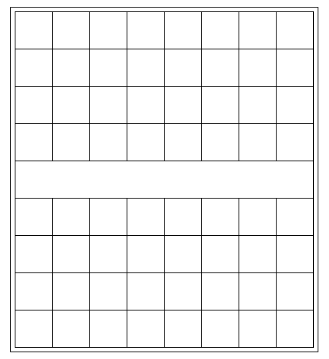](https://user-images.githubusercontent.com/8554143/188444900-43fd5b60-69e3-4a8c-b824-49afd8450b3e.png)

不考虑最外层的一圈边框，我们可以首先利用**多重线性渐变**实现一个网格布局：

```html
<div class="g-grid"></div>
```

```css
.g-grid {
  width: 401px;
  height: 451px;
  background: repeating-linear-gradient(
      #000,
      #000 1px,
      transparent 1px,
      transparent 50px
    ), repeating-linear-gradient(90deg, #000, #000 1px, transparent 1px, transparent
        50px);
  background-repeat: no-repeat;
  background-size: 100% 100%, 100% 100%;
  background-position: 0 0, 0 0;
}
```

效果如下：

[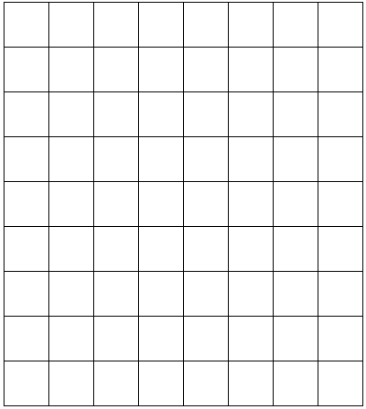](https://user-images.githubusercontent.com/8554143/188445689-9e1a76bf-96e9-4f1d-b999-18624221dc1a.png)

在最外层加一层边框有非常多办法，这里我们简单使用 `outline` 配合 `outline-offset` 即可：

```css
.g-grid {
  width: 401px;
  height: 451px;
  background: repeating-linear-gradient(
      #000,
      #000 1px,
      transparent 1px,
      transparent 50px
    ), repeating-linear-gradient(90deg, #000, #000 1px, transparent 1px, transparent
        50px);
  background-repeat: no-repeat;
  background-size: 100% 100%, 100% 100%;
  background-position: 0 0, 0 0;
  outline: 1px solid #000;
  outline-offset: 5px;
}
```

这样，一个架子就差不多了：

[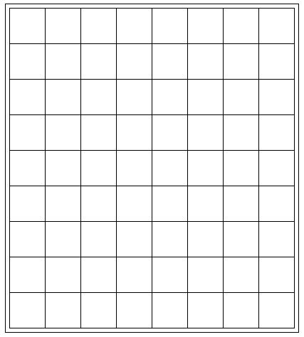](https://user-images.githubusercontent.com/8554143/188446010-b30e6a34-4af8-4e76-bdff-49ef8b3bc167.png)

当然，棋盘中间的一行，是没有格子的。要将上述渐变代码处理一下，可以分成上下两块，利用 `background-size` 和 `background-position` 进行分隔。

当然，我们也可以在最上层直接再叠一层纯白色渐变：

```css
.grid {
  // ...
  background: // 最上层叠加一层白色渐变
    linear-gradient(#fff, #fff), // 下面两个重复线性渐变实现网格
    repeating-linear-gradient(
        #000,
        #000 1px,
        transparent 1px,
        transparent 50px
      ), repeating-linear-gradient(90deg, #000, #000 1px, transparent 1px, transparent
        50px);
  background-repeat: no-repeat;
  background-size: calc(100% - 2px) 49px, 100% 100%, 100% 100%;
  background-position: 1px 201px, 0 0, 0 0;
}
```

到这里，其实核心还都是渐变，目前共 3 层渐变，得到这样一个效果：

[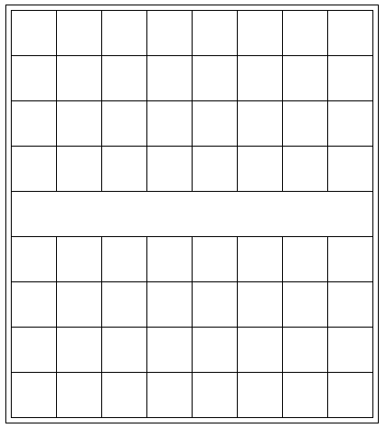](https://user-images.githubusercontent.com/8554143/188446664-26ed0424-9d2a-4e3b-8a8e-638c0b6e3db3.png)

## 利用渐变实现交叉虚线十字

OK，我们继续，我们需要基于上述的基础，得到两个交叉虚线十字，像是这样：

[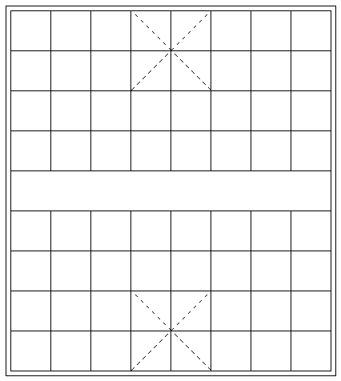](https://user-images.githubusercontent.com/8554143/188446878-ef13c4a5-d377-4503-807a-cc1ee51024de.png)

这里其实真的有难度。想象一下，如果给你一个 DIV，去实现其中一个，可以怎么做呢？

通过 border 中特有的虚线 dashed？这样可能就需要两个元素设置单边的虚线边框，然后旋转相交得到。（可以利用元素的两个伪元素，实现在一个 DOM 中）。

当然，这样的话，我们的标签就不够用了。

**所以，这里我们另辟蹊径，继续使用渐变**！

首先，打个样，如果是一个 100px x 100px 的 DIV，可以怎么利用渐变去画**交叉虚线十字**呢？

```html
<div></div>
```

```css
div {
  position: relative;
  margin: auto;
  width: 100px;
  height: 100px;
  border: 1px solid #000;
  background: linear-gradient(
    45deg,
    transparent 0,
    transparent calc(50% - 0.5px),
    #000 calc(50% - 0.5px),
    #000 calc(50% + 0.5px),
    transparent calc(50% + 0.5px),
    transparent 0
  );
}
```

我们首先利用渐变，实现一条 1px 的斜线，注意这里的渐变是从**透明到黑色到透明**，实现了一条 45° 的斜线。

[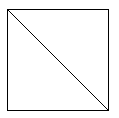](https://user-images.githubusercontent.com/8554143/188448914-f47f8d74-e9e0-45db-8444-badbd117a64f.png)

我们再反 45° 过来，利用**多重线性渐变**，实现透明到白色的渐变效果：

```css
div {
  position: relative;
  margin: auto;
  width: 100px;
  height: 100px;
  border: 1px solid #000;
  background: // 渐变 1
    repeating-linear-gradient(
        -45deg,
        transparent 0,
        transparent 5px,
        #fff 5px,
        #fff 10px
      ), // 渐变 2
    linear-gradient(
        45deg,
        transparent 0,
        transparent calc(50% - 0.5px),
        #000 calc(50% - 0.5px),
        #000 calc(50% + 0.5px),
        transparent calc(50% + 0.5px),
        transparent 0
      );
}
```

这样，我们就得到了一条虚线：

[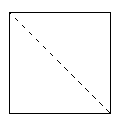](https://user-images.githubusercontent.com/8554143/188449435-855232b3-bc33-41f1-8c81-788205443a0b.png)

好吧，这一步有一些同学可能会有一点疑惑，怎么变过来的。

我把上面**渐变 1**的透明色改成黑色，就很好理解了：

[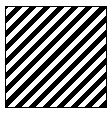](https://user-images.githubusercontent.com/8554143/188449655-51e67f5f-da21-47a4-904f-0ce57d3bd2c2.png)

想象一下，上图的黑色部分，如果是透明的，就能透出原本的那条斜线没有被白色遮挡住的地方。

> 这里，需要提一下，在渐变中，越是先书写的渐变，层级越高。

好，有了上面的铺垫，我们基于上面的代码，再继续利用渐变，把上下两个交叉虚线十字补齐即可：

```css
.g-grid {
  width: 401px;
  height: 451px;
  outline: 1px solid #000;
  outline-offset: 5px;
  background: // 最上层的白色块，挡住中间的网格
    linear-gradient(#fff, #fff), // 实现网格布局
    repeating-linear-gradient(
        #000,
        #000 1px,
        transparent 1px,
        transparent 50px
      ), repeating-linear-gradient(
      90deg,
      #000,
      #000 1px,
      transparent 1px,
      transparent 50px
    ),
    // 棋盘上方的虚线1
    repeating-linear-gradient(
        -45deg,
        transparent 0,
        transparent 5px,
        #fff 5px,
        #fff 10px
      ), linear-gradient(
      45deg,
      transparent,
      transparent calc(50% - 0.5px),
      #000 calc(50% - 0.5px),
      #000 calc(50% + 0.5px),
      transparent calc(50% + 0.5px),
      transparent 0
    ), // 棋盘上方的虚线2
    repeating-linear-gradient(
        45deg,
        transparent 0,
        transparent 5px,
        #fff 5px,
        #fff 10px
      ), linear-gradient(
      -45deg,
      transparent,
      transparent calc(50% - 0.5px),
      #000 calc(50% - 0.5px),
      #000 calc(50% + 0.5px),
      transparent calc(50% + 0.5px),
      transparent 0
    ),
    // 棋盘下方的虚线1
    repeating-linear-gradient(
        -45deg,
        transparent 0,
        transparent 5px,
        #fff 5px,
        #fff 10px
      ), linear-gradient(
      45deg,
      transparent,
      transparent calc(50% - 0.5px),
      #000 calc(50% - 0.5px),
      #000 calc(50% + 0.5px),
      transparent calc(50% + 0.5px),
      transparent 0
    ), // 棋盘下方的虚线2
    repeating-linear-gradient(
        45deg,
        transparent 0,
        transparent 5px,
        #fff 5px,
        #fff 10px
      ), linear-gradient(-45deg, transparent, transparent calc(50% - 0.5px), #000
        calc(50% - 0.5px), #000 calc(50% + 0.5px), transparent calc(50% + 0.5px), transparent
        0);
  background-repeat: no-repeat;
  background-size: calc(100% - 2px) 49px, 100% 100%, 100% 100%, // 交叉虚线 1
    100px 100px, 100px 100px, 100px 100px, 100px 100px, // 交叉虚线 2
    100px 100px, 100px 100px, 100px 100px, 100px 100px;
  background-position: 1px 201px, 0 0, 0 0, // 交叉虚线 1
    151px 0, 151px 0, 151px 0, 151px 0, // 交叉虚线 2
    151px 350px, 151px 350px, 151px 350px, 151px 350px;
}
```

嚯，这渐变代码确实复杂了点，但是其实每一块的作用都是很清晰的，这样，我们的棋盘就变成了这样：

[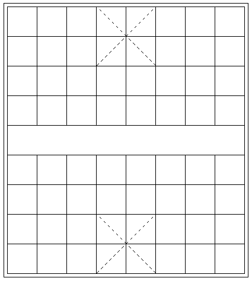](https://user-images.githubusercontent.com/8554143/188450466-275b4211-6e80-4640-bbe2-be2f5cf83f11.png)

## 借助伪元素及 box-shadow 实现剩余符合

到这里，我们仅仅使用了元素本身，要知道，我们还有元素的两个伪元素没使用。要实现的只剩下多个的这个符合：

[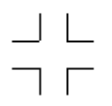](https://user-images.githubusercontent.com/8554143/188450768-c0a57380-5ea0-4314-8db3-e322c58db321.png)

因为一共要实现 12 个这样的符号，有的符合还是不完整的，所有这些要在剩余的元素的两个伪元素中完成。可选的方法思来想去，也只有 **box-shadow** 了。

利用 `box-shadow` 能够非常好的复制自身。这个技巧其实也反复讲过非常多次了。

我们首先利用元素的一个伪元素，在这个位置，实现一个短横线：

[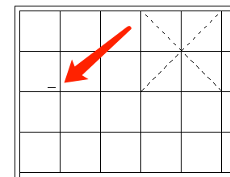](https://user-images.githubusercontent.com/8554143/188451697-17a1e82e-ef5f-4c52-9f73-b693e9f2f16b.png)

代码大致如下：

```scss
.g-grid {
  // ...
  &::before {
    content: '';
    position: absolute;
    top: 95px;
    left: 35px;
    width: 10px;
    height: 1px;
    background: #000;
  }
}
```

我们利用 `box-shadow` 复制自身，可以完成一半横线效果。当然这里由于是个镜面布局，可以利用镜像 `-webkit-box-reflect: below` 减少一半的代码：

```scss
.g-grid {
  // ...
  &::before {
    content: '';
    position: absolute;
    top: 95px;
    left: 35px;
    width: 10px;
    height: 1px;
    background: #000;
    box-shadow: 20px 0, 0 10px, 20px 10px, 300px 0, 320px 0, 300px 10px,
      320px 10px, -30px 50px, -30px 60px, 50px 50px, 50px 60px, 70px 50px,
      70px 60px, 150px 50px, 150px 60px, 170px 50px, 170px 60px, 250px 50px,
      250px 60px, 270px 50px, 270px 60px, 350px 50px, 350px 60px;
    -webkit-box-reflect: below 259px;
  }
}
```

效果如下：

[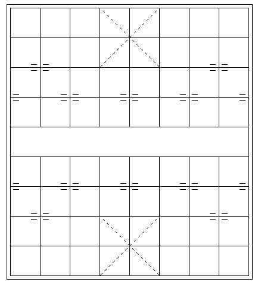](https://user-images.githubusercontent.com/8554143/188452121-d6f5f201-8fcd-4ceb-af0d-4f67515f3c55.png)

最后，利用另外一个伪元素，完成另外一半的竖向横线即可：

```scss
.g-grid {
  // ...
  &::before {
    // ...
  }
  &::after {
    // ...
    box-shadow: 10px 0, 0 20px, 10px 20px, 300px 0px, 300px 20px, 310px 0,
      310px 20px, -40px 50px, -40px 70px, 50px 50px, 50px 70px, 60px 50px,
      60px 70px, 150px 50px, 150px 70px, 160px 50px, 160px 70px, 250px 50px,
      250px 70px, 260px 50px, 260px 70px, 350px 50px, 350px 70px;
    -webkit-box-reflect: below 260px;
  }
}
```

这样，我们就在一个标签内，得到这样一个效果：

[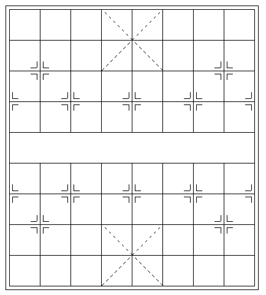](https://user-images.githubusercontent.com/8554143/188452610-51f4751c-c5e2-46c9-90b0-0b932c735cb9.png)

当然，还剩下**楚河、汉界** 4 个字，这个也简单直接加在 div 中即可，配合一些简单的 CSS 调整，整个效果就在一个标签内完成啦：

<iframe height="300" style="width: 100%;" scrolling="no" title="CSS Chess board" src="https://codepen.io/mafqla/embed/QWPxWNo?default-tab=html%2Cresult&editable=true&theme-id=light" frameborder="no" loading="lazy" allowtransparency="true" allowfullscreen="true">
  See the Pen <a href="https://codepen.io/mafqla/pen/QWPxWNo">
  CSS Chess board</a> by mafqla (<a href="https://codepen.io/mafqla">@mafqla</a>)
  on <a href="https://codepen.io">CodePen</a>.
</iframe>

好，实际中我确实不太推荐这么去写，纯粹是为了实现而实现，少了很多代码可读性的考量。因此，本文更多的是给大家带来一些思路，当遇到类似的问题的使用能够有更多的灵感。
