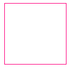
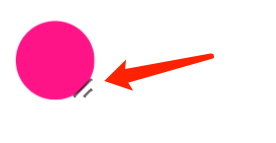

## 鼠标点击拖拽跟随效果

OK，什么意思呢？我们先来看一个最最简单的效果示意图，点击一个元素，能够拖动元素进行移动：

好，到这里，在继续往下阅读之前，你可以停一停。这种效果，正常而言，都是必须要借助 JavaScript 才能够实现的。从表现上来看：

1. 首先拖拽元素，可以任意将元素进行移动
2. 然后放置元素，让元素停留在另外一个地方

思考一下，如果不借助 JavaScript 的话，有办法将元素小球从 A 点移动到 B 点么？这个效果完全就不像是纯 CSS 能够完成的。

**答案必然是可以的**！过程也非常之巧妙，这里我们核心需要利用强大的 `resize` 属性。以及，配合通过构建一种巧妙的布局，去解决可能会遇到的各种难题。

## 一个简单的 resize 元素

首先，我们利用 `resize` 属性来实现一个可改变大小的元素。什么是 `resize`？

[MDN -- resize](https://developer.mozilla.org/zh-CN/docs/Web/CSS/resize)：该 CSS 属性允许你控制一个元素的可调整大小性。

语法如下：

```css
 {
  /* Keyword values */
  resize: none;
  resize: both;
  resize: horizontal;
  resize: vertical;
  resize: block;
  resize: inline;
}
```

简单解释一下：

- `resize: none`：元素不能被用户缩放
- `resize: both`：允许用户在水平和垂直方向上调整元素的大小
- `resize: horizontal`：允许用户在水平方向上调整元素的大小
- `resize: vertical`：允许用户在垂直方向上调整元素的大小
- `resize: block`：根据书写模式（writing-mode）和方向值（direction），元素显示允许用户在块方向上（block）水平或垂直调整元素大小的机制。
- `resize: inline`：根据书写模式（writing-mode）和方向值（direction），元素显示一种机制，允许用户在内联方向上（inline）水平方向或垂直方向调整元素的大小。

看一个最简单的 DEMO：

```html
<p>
  Lorem ipsum dolor sit amet, consectetur adipisicing elit. A aut qui labore
  rerum placeat similique hic consequatur tempore doloribus aliquid alias, nobis
  voluptates. Perferendis, voluptate placeat esse soluta deleniti id!
</p>
```

```css
p {
  width: 200px;
  height: 200px;
  resize: horizontal;
  overflow: scroll;
}
```

这里，我们设置了一个长宽为 `200px` 的 `<p>` 为横向可拖拽改变宽度。效果如下：

简单总结一些小技巧：

- `resize` 的生效，需要配合 `overflow: scroll`，当然，准确的说法是，`overflow` 不是 `visible`，或者可以直接作用于替换元素譬如图像、`<video>` 及 `<iframe>`、`<textarea>` 等
- 我们可以通过 `resize` 的 `horizontal`、`vertical`、`both` 来设置横向拖动、纵向拖动、横向纵向皆可拖动。
- 可以配合容器的 `max-width`、`min-width`、`max-height`、`min-height` 限制可拖拽改变的一个范围

## 将 resize 应用到本文实例中

OK，接下来，我们将 resize 实际运用到我们本文的例子中去，首先，我们先简单实现一个 DIV：

```html
<div class="g-resize"></div>
```

```css
.g-resize {
  width: 100px;
  height: 100px;
  border: 1px solid deeppink;
}
```

如下，非常普通，没有什么特别的：

[](https://user-images.githubusercontent.com/8554143/190407775-67cd49ae-a73f-4e2a-85b2-373f3a00979f.png)

但是，通过给这个元素加上 `resize: both` 以及 `overflow: scroll`，此时，这个元素的大小就通过元素右下角的 ICON 进行拖动改变。

简单修改下我们的 CSS 代码：

```css
.g-resize {
  width: 100px;
  height: 100px;
  border: 1px solid deeppink;
  resize: both;
  overflow: scroll;
}
```

这样，我们就得到了一个灵活可以拖动的元素：

是的，我们的整个效果，就需要借助这个特性进行实现。

在此基础上，我们可以尝试将一个元素定位到上面这个可拖动放大缩小的元素的右下角，看着能不能实现上述的效果。

简单加一点代码：

```html
<div class="g-resize"></div>
```

```css
.g-resize {
  position: relative;
  width: 20px;
  height: 20px;
  resize: both;
  overflow: scroll;
}
.g-resize::before {
  content: '';
  position: absolute;
  bottom: 0;
  right: 0;
  width: 20px;
  height: 20px;
  border-radius: 50%;
  background: deeppink;
}
```

我们利用元素的伪元素实现了一个小球，放置在容器的右下角看看效果：

如果我们再把整个设置了 `resize: both` 的边框隐藏呢？那么效果就会是这样：

Wow，整个效果已经非常的接近了！只是，认真看的话，能够看到一些瑕疵，就是还是能够看到设置了 `resize` 的元素的这个 ICON：

[](https://user-images.githubusercontent.com/8554143/190410520-2fda0099-44f4-468e-8116-2c826e1006c4.png)

这个也好解决，在 Chrome 中，我们可以通过另外一个伪元素 `::-webkit-resizer `，设置这个 ICON 的隐藏。

根据 [MDN - ::-webkit-resizer](https://developer.mozilla.org/zh-CN/docs/Web/CSS/::-webkit-scrollbar)，它属于整体的滚动条伪类样式家族中的一员。

其中 `::-webkit-resizer` 可以控制出现在某些元素底角的可拖动调整大小的滑块的样式。

所以，这里我就利用这个伪类：

```css
.g-resize {
  position: relative;
  width: 20px;
  height: 20px;
  resize: both;
  overflow: scroll;
}
.g-resize::before {
  content: '';
  position: absolute;
  bottom: 0;
  right: 0;
  width: 20px;
  height: 20px;
  border-radius: 50%;
  background: deeppink;
}
.g-resize::-webkit-resizer {
  background-color: transparent;
}
```

这样，这里的核心在于利用了 `.g-resize::-webkit-resizer` 中的 `background-color: transparent`，将滑块的颜色设置为了透明色。我们就得到了与文章一开始，一模一样的效果：

## 解决溢出被裁剪问题

当然，这里有个很致命的问题，如果需要移动的内容，远比设置了 `resize` 的容器要大，或者其初始位置不在该容器内，超出了的部分因为设置了 `overflow: scroll`，将无法看到。

因此上述方案存在比较大的缺陷。

举个例子，假设我们需要被拖动的元素不再是一个有这样一个简单的结构：

```
<div class="g-content"></div>
```

```scss
.g-content {
    width: 100px;
    height: 100px;
    background: black;
    pointer-event: none;

    &::before {
        content: "";
        position: absolute;
        width: 20px;
        height: 20px;
        background: yellow;
        border-radius: 50%;
}
```

而像是这样，是一个更为复杂的布局内容展示（当然下面展示的也比较简单，实际中可以想象成任意复杂结构内容）：

[](https://user-images.githubusercontent.com/8554143/190982185-84f047dc-2ae0-4f28-9690-54a2781d73bf.png)

如果将这个结构，扔到上面的 `g-resize` 中：

```html
<div class="g-resize">
  <div class="g-content"></div>
</div>
```

那么就会因为设置了 `overflow: scroll` 的原因，将完全看不到，只剩下一小块：

[](https://user-images.githubusercontent.com/8554143/190982998-57956e0f-b42a-4cab-a5d3-1239685bb0ac.png)

为了解决这个问题，我们得修改原本的 DOM 结构，另辟蹊径。

方法有很多，譬如可以利用 Grid 布局的一些特性。当然，这里我们只需要巧妙的加多一层，就可以完全解决这个问题。

我们来实现这样一个布局：

```html
<div class="g-container">
  <div class="g-resize"></div>
  <div class="g-content"></div>
</div>
```

解释一下上述代码，其中：

1. `g-container` 设置为绝对定位加上 `display: inline-block`，这样其盒子大小就可以由内部正常流式布局盒子的大小撑开
2. `g-resize` 设置为 `position: relative 并且`设置 `resize`，负责提供一个可拖动大小元素，在这个元素的变化过程中，就能动态改变父容器的高宽
3. `g-content` 实际内容盒子，通过 `position: absolute` 定位到容器的右下角即可

看看完整的 CSS 代码：

```css
.g-container {
  position: absolute;
  display: inline-block;
}
.g-resize {
  content: '';
  position: relative;
  width: 20px;
  height: 20px;
  border-radius: 50%;
  resize: both;
  overflow: scroll;
  z-index: 1;
}
.g-content {
  position: absolute;
  bottom: -80px;
  right: -80px;
  width: 100px;
  height: 100px;
  background: black;
  pointer-event: none;

  &::before {
    content: '';
    position: absolute;
    width: 20px;
    height: 20px;
    background: yellow;
    border-radius: 50%;
    transition: 0.3s;
  }
}
.g-container:hover .g-content::before {
  transform: scale(1.1);
  box-shadow: -2px 2px 4px -4px #333, -4px 4px 8px -4px #333;
}
.g-resize::-webkit-resizer {
  background-color: transparent;
}
```

下图中，你看到的所有元素，都只是 `g-content` 呈现出来的元素，整个效果就是这样：

是的，可能你会有所疑惑，下面我用简单不同颜色，标识不同不同的 DOM 结构，方便你去理解。

1. 红色边框表示整个 `g-container` 的大小
2. 用蓝色矩形表示设置了 `g-resize` 元素的大小
3. 关掉 `::-webkit-resizer` 的透明设置，展示出 resize 框的可拖拽 ICON

```css
.g-container {
  border: 3px solid red;
}
.g-resize {
  content: '';
  background: blue;
  resize: both;
  overflow: scroll;
}
.g-resize::-webkit-resizer {
  // background-color: transparent;
}
```

看看这个图，整个原理基本就比较清晰的浮现了出来：

<iframe height="300" style="width: 100%;" scrolling="no" title="Pure CSS Auto Drag Demo" src="https://codepen.io/mafqla/embed/ZEZRvmv?default-tab=html%2Cresult&editable=true&theme-id=light" frameborder="no" loading="lazy" allowtransparency="true" allowfullscreen="true">
  See the Pen <a href="https://codepen.io/mafqla/pen/ZEZRvmv">
  Pure CSS Auto Drag Demo</a> by mafqla (<a href="https://codepen.io/mafqla">@mafqla</a>)
  on <a href="https://codepen.io">CodePen</a>.
</iframe>

## 实际应用

OK，用了比较大篇幅对原理进行了描述。下面我们举一个实际的应用场景。使用上述技巧制作的可拖动便签贴。灵感来自 -- [scottkellum](https://codepen.io/scottkellum)。

代码也不多，如果你了解了上面的内容，下面的代码将非常好理解：

```html
<div class="g-container">
  <div class="g-resize"></div>
  <div class="g-content">Lorem ipsum dolor sit amet consectetur?</div>
</div>
```

完整的 CSS 代码如下：

```scss
body {
  position: relative;
  padding: 10px;
  background: url('背景图');
  background-size: cover;
}
.g-container {
  position: absolute;
  display: inline-block;
}
.g-resize {
  content: '';
  position: relative;
  width: 20px;
  height: 20px;
  resize: both;
  overflow: scroll;
  z-index: 1;
}
.g-content {
  position: absolute;
  bottom: -160px;
  right: -180px;
  color: rgba(#000, 0.8);
  background-image: linear-gradient(
    160deg,
    rgb(255, 222, 30) 50%,
    rgb(255, 250, 80)
  );
  width: 200px;
  height: 180px;
  pointer-event: none;
  text-align: center;
  font-family: 'marker felt', 'comic sans ms', sans-serif;
  font-size: 24px;
  line-height: 1.3;
  padding: 1em;
  box-sizing: border-box;
  &:before {
    content: '';
    position: absolute;
    width: 20px;
    height: 20px;
    top: 0;
    left: 0;
    border-radius: 50%;
    background-image: radial-gradient(
      at 60% 30%,
      #f99,
      red 20%,
      rgb(180, 8, 0)
    );
    background-position: 20% 10%;
    cursor: pointer;
    pointer-events: none;
    transform: scale(0.8);
    box-shadow: -5px 10px 3px -8.5px #000, -1px 7px 12px -5px #000;
    transition: all 0.3s ease;
    transform: scale(0.8);
  }
}
.g-container:hover .g-content::before {
  transform: scale(0.9);
  box-shadow: -5px 10px 6px -8.5px #000, -1px 7px 16px -4px #000;
}
.g-resize::-webkit-resizer {
  background-color: transparent;
}
```

我们通过上述的技巧，实现了一个仅仅使用 CSS 实现的自由拖拽的便签贴。我们可以自由的将其拖拽到任意地方。看看效果：

当然，我们可以再配合上另外一个有意思是 HTML 属性 -- `contenteditable`。

`contenteditable` 是一个 HTML TAG 的属性，表示元素是否可被用户编辑。如果可以，浏览器会修改元素的部件以允许编辑。

简单修改一下 DOM 结构：

```html
<div class="g-container">
  <div class="g-resize"></div>
  <div class="g-content" contenteditable="true">
    Lorem ipsum dolor sit amet consectetur?
  </div>
</div>
```

此时，元素不仅可以被拖动，甚至可以被重写，感受一下：

<iframe height="300" style="width: 100%;" scrolling="no" title="Pure CSS Auto Drag Demo" src="https://codepen.io/mafqla/embed/QWPxaJp?default-tab=html%2Cresult&editable=true&theme-id=light" frameborder="no" loading="lazy" allowtransparency="true" allowfullscreen="true">
  See the Pen <a href="https://codepen.io/mafqla/pen/QWPxaJp">
  Pure CSS Auto Drag Demo</a> by mafqla (<a href="https://codepen.io/mafqla">@mafqla</a>)
  on <a href="https://codepen.io">CodePen</a>.
</iframe>
