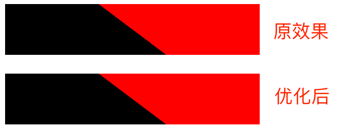
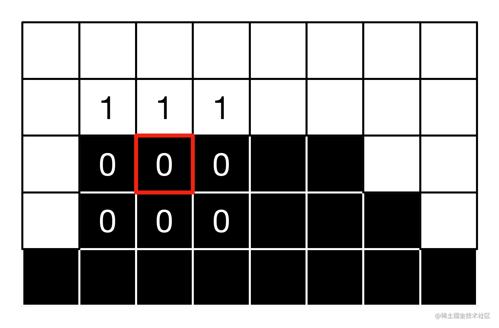
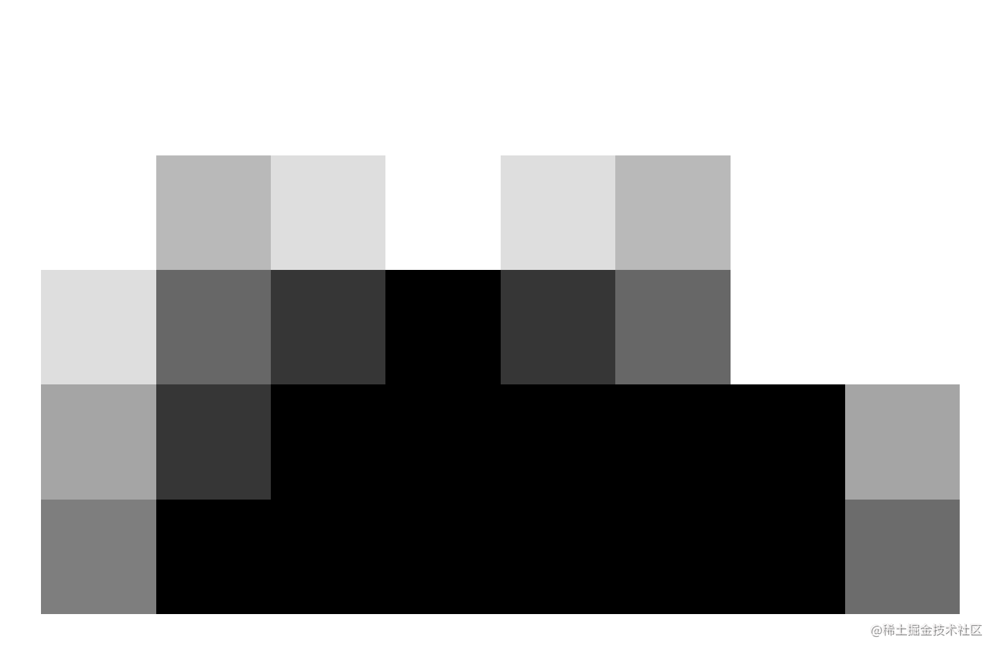
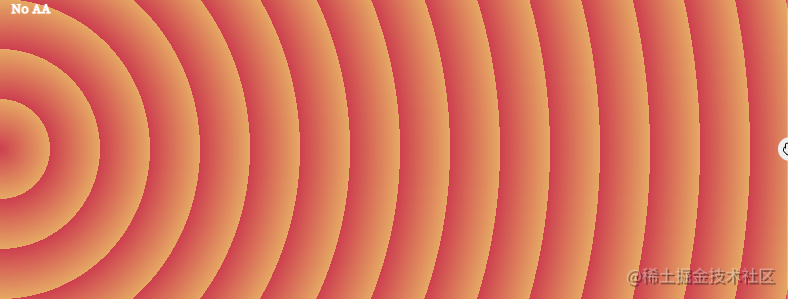
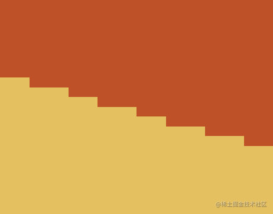
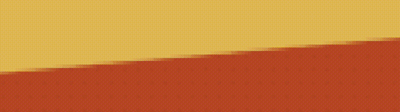

## 何为渐变锯齿？

那么，什么是渐变图形产生的锯齿呢？

简单的一个 DEMO：

```html
<div></div>
```

```css
div {
    width: 500px;
    height: 100px;
    background: linear-gradient(37deg), #000 50%, #f00 50%, #f00 0);
}
```

效果如下：

[](https://user-images.githubusercontent.com/8554143/198029224-eb40216f-8106-4ffe-9d88-030c529263f0.png)

其实，锯齿感已经非常明显了，我们再放大了看，其内部其实是这样的：

[](https://user-images.githubusercontent.com/8554143/198029939-0a02b5ce-9871-4d96-af0a-745de41446ae.png)

又或者是这样：

[](https://user-images.githubusercontent.com/8554143/198030376-47cddf21-e0cf-45b6-b905-558cde17cc12.png)

有意思的是，锯齿现象在 DPR 为 1 的屏幕下特别明显，而在一些高清屏（dpr > 1）的屏幕下，感受不会那么明显。

> DPR（Device Pixel Ratio）为设备像素比，DPR = 物理像素 / 设备独立像素，设备像素比描述的是未缩放状态下，物理像素和设备独立像素的初始比例关系。

那么为啥会产生锯齿感呢？

传统网页的呈现是基于像素单位的，对于这种一种颜色直接过渡另外一种颜色状态的图片，容易导致可视质量下降（信息失真）。因而对于普通的渐变元素，像是上述写法，产生了锯齿，这是非常常见的在使用渐变过程中的一个棘手问题。

## 简单的解决办法

解决失真的问题有很多。这里最简单的方式就是不要直接过渡，保留一个极小的渐变过渡空间。

上述的代码，我们可以简单改造一下：

```css
div {
    width: 500px;
    height: 100px;
  - background: linear-gradient(37deg), #000 50%, #f00 50%, #f00);
  + background: linear-gradient(37deg), #000 49.5%, #f00 50.5%, #f00);
}
```

仔细看其中的变化，我们从 50% --> 50% 的直接过渡，变化成预留了 1% 的渐变过渡空间，效果如下：

[](https://user-images.githubusercontent.com/8554143/198033237-043c246f-9a39-4f4b-af44-42d976800762.png)

可以看到，效果立马有了大幅提升！

当然，如果不想修改原代码，也可以通过叠加一层伪元素实现，这里给出 3 种方式的对比图：

```html
<div></div>
<div class="gradient"></div>
<div class="pesudo"></div>
```

```scss
:root {
  --deg: 37deg;
  --c1: #000;
  --c2: #f00;
  --line-width: 0.5px;
}
div {
  margin: auto;
  width: 500px;
  height: 100px;
  background: linear-gradient(
    var(--deg),
    var(--c1) 50%,
    var(--c2) 50%,
    var(--c2) 0
  );
}
// 方法一：
.gradient {
  background: linear-gradient(
    var(--deg),
    var(--c1),
    var(--c1) calc(50% - var(--line-width)),
    var(--c2) calc(50% + var(--line-width)),
    var(--c2) 0
  );
}
// 方法二：
.pesudo {
  position: relative;

  &::before {
    content: '';
    position: absolute;
    top: 0;
    left: 0;
    right: 0;
    bottom: 0;
    background: linear-gradient(
      var(--deg),
      transparent,
      transparent calc(50% - var(--line-width)),
      var(--c1) calc(50% - var(--line-width)),
      var(--c2) calc(50% + var(--line-width)),
      transparent calc(50% + var(--line-width)),
      transparent
    );
  }
}
```

通过伪元素叠加的意思是，在产生锯齿的地方，实现一个平滑过渡进行覆盖：

效果如下：

<iframe height="300" style="width: 100%;" scrolling="no" title="消除 Gradient 锯齿" src="https://codepen.io/mafqla/embed/WNWKKXY?default-tab=html%2Cresult&editable=true&theme-id=light" frameborder="no" loading="lazy" allowtransparency="true" allowfullscreen="true">
  See the Pen <a href="https://codepen.io/mafqla/pen/WNWKKXY">
  消除 Gradient 锯齿</a> by mafqla (<a href="https://codepen.io/mafqla">@mafqla</a>)
  on <a href="https://codepen.io">CodePen</a>.
</iframe>

划重点！**此方法适用于线性渐变、径向渐变、角向渐变**，是最为简单的消除 CSS 锯齿的方式。

## 更为高阶的锯齿消除法

当然，也还有其他更为高阶的锯齿消除法。

我们可以建立一种**边缘锯齿边缘->重建锯齿边缘**的锯齿消除方法。

我们需要做的，就是在锯齿处，叠加上另外一层内容，让锯齿感不那么强烈。称为像素偏移抗锯齿（Pixel-Offset Anti-Aliasing，POAA）。

在[Implementing FXAA](https://link.juejin.cn/?target=http%3A%2F%2Fblog.simonrodriguez.fr%2Farticles%2F30-07-2016_implementing_fxaa.html)这篇博客中，解释了 FXAA 具体是如何运作的。对于一个已经被找到的图形边缘，经过 FXAA 处理后会变成这样，见下两幅图：

[](https://user-images.githubusercontent.com/8554143/198036311-abae439d-2fd0-41ea-af2e-9be28d69f90a.png)

[](https://user-images.githubusercontent.com/8554143/198036332-31953d0e-7f39-4078-8384-b1fd5f9fdc38.png)

> FXAA（Fast Approximate Anti-Aliasing），快速近似抗锯齿，它找到画面中所有图形的边缘并进行平滑处理。

我们可以轻易找到找到渐变的边缘地方，就是那些渐变的颜色改变的地方。有了边缘信息后，接着就要重建边缘。重建边缘也许可以再拆分，分为以下几个步骤：

- 需要通过某种方法得到透明度的点
- 这些点需要能够组成线段
- 线段完全吻合我们的 Gradient
- 使线段覆盖在 Gradient 的上一层以应用我们的修改

这就是大体思路，我们并没有参与浏览器的渲染，而是通过像 FXAA 一样的后处理的方法。在已渲染的图像上做文章。

比如说，我们有这样一张图：

```css
.circle-con {
  $c1: #cd3f4f;
  $c2: #e6a964;
  position: relative;
  height: 300px;
  background-image: repeating-radial-gradient(
    circle at 0% 50%,
    $c1 0,
    $c2 50px
  );
}
```

[](https://user-images.githubusercontent.com/8554143/198037216-632582f9-2354-4210-bf28-32e84d35d278.png)

边缘信息如下：

[](https://user-images.githubusercontent.com/8554143/198035917-8dece1e5-c35b-40b0-abdf-7d217e46591f.png)

我们要做的，就是在它的边缘处，利用渐变再生成一段渐变，通过准确叠加，消除渐变！原理图如下：

[](https://user-images.githubusercontent.com/8554143/198038342-79e90db9-3347-43d7-a5e5-c8bfb4fb63af.gif)

原理可行，但是实操起来非常之复杂，计算量会比较大。感兴趣的可以拿这段代码尝试一下：

```scss
.repeat-con {
  --c1: #cd3f4f;
  --c2: #e6a964;
  --c3: #5996cc;
  position: relative;
  height: 300px;
  background-image: repeating-linear-gradient(
    var(--deg),
    var(--c1),
    var(--c1) 10px,
    var(--c2) 10px,
    var(--c2) 40px,
    var(--c1) 40px,
    var(--c1) 50px,
    var(--c3) 50px,
    var(--c3) 80px
  );

  &.antialiasing {
    &:after {
      --offsetX: 0.4px;
      --offsetY: -0.1px;
      --dark-alpha: 0.3;
      --light-alpha: 0.6;
      --line-width: 0.6px;
      content: '';
      position: absolute;
      top: var(--offsetY);
      left: var(--offsetX);
      width: 100%;
      height: 100%;
      opacity: 0.5;
      background-image: repeating-linear-gradient(
        var(--deg),
        var(--c3),
        transparent calc(0px + var(--line-width)),
        transparent calc(10px - var(--line-width)),
        var(--c2) 10px,
        var(--c1) 10px,
        transparent calc(10px + var(--line-width)),
        transparent calc(40px - var(--line-width)),
        var(--c1) 40px,
        var(--c2) 40px,
        transparent calc(40px + var(--line-width)),
        transparent calc(50px - var(--line-width)),
        var(--c3) 50px,
        var(--c1) 50px,
        transparent calc(50px + var(--line-width)),
        transparent calc(80px - var(--line-width)),
        var(--c1) 80px
      );
    }
  }
}
```
