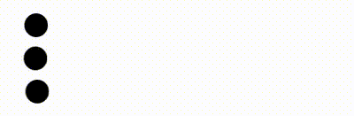
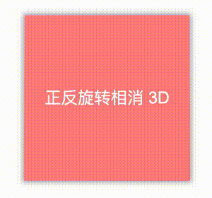
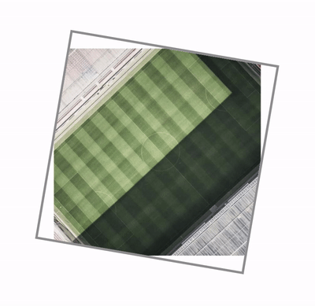
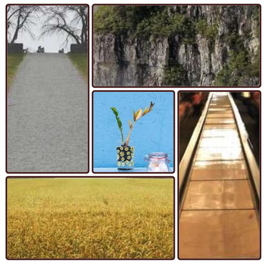

## CSS 变量

CSS 变量大家应该都比较熟悉了，已经不能算是新知识了，快速过一遍。

CSS 变量（CSS Variable），在之前也叫做 CSS 自定义属性，其使用方式如下：

```css
// 声明一个变量：
:root {
  --bgColor: #000;
}
```

> 这里我们借助了上面 `#12、结构性伪类` 中的 `:root{ }` 伪类，在全局 `:root{ }` 伪类中定义了一个 CSS 变量，取名为 `--bgColor` 。

定义完了之后则是使用，假设我要设置一个 div 的背景色为黑色：

```css
.main {
  background: var(--bgColor);
}
```

这里，我们在需要使用之前定义变量的地方，通过 `var(定义的变量名)` 来调用。

## 在 [@Keyframes](https://github.com/Keyframes) 中使用 CSS 变量

OK，回归我们的正题。**巧用 CSS 变量，实现动画函数复用**。

假设，我们现在有多个元素，需要实现一个位移动画，从位置 A 位移到 位置 B，位置 A 相同，但是位置 B 不一样，像是这样：

[](https://user-images.githubusercontent.com/8554143/221820850-4c0b034c-72fa-47d4-8e3c-302efb9abdb8.gif)

正常而言，由于终点不一样，我们可能需要实现 3 个不一样的 `@keyframes`，像是这样：

```html
<ul>
  <li></li>
  <li></li>
  <li></li>
</ul>
```

```css
li:nth-child(1) {
  animation: move1 2s linear;
}
li:nth-child(2) {
  animation: move2 2s linear;
}
li:nth-child(3) {
  animation: move3 2s linear;
}

@keyframes move1 {
  60%,
  100% {
    transform: translate(150px);
  }
}
@keyframes move2 {
  60%,
  100% {
    transform: translate(120px);
  }
}
@keyframes move3 {
  60%,
  100% {
    transform: translate(200px);
  }
}
```

这个代码有问题吗？没有。

但是，我们可以利用 CSS 变量，让它变得更为简洁，我们改造一下 `@keyframes` 代码，将固定的位移值，变成一个变量：

```css
@keyframes move {
  60%,
  100% {
    transform: translate(var(--dis));
  }
}
```

由于 CSS 变量是存在作用域的，我们可以通过 CSS 变量的方式，给每一个 li 定义一个不同的 `--dis` 变量，像是这样：

```css
li:nth-child(1) {
  --dis: 150px;
}
li:nth-child(2) {
  --dis: 120px;
}
li:nth-child(3) {
  --dis: 200px;
}
```

这样，虽然动画的结束点不一样，但是我们利用 CSS 变量，复用了同一个 `@keyframes` 函数：

[](https://user-images.githubusercontent.com/8554143/221820850-4c0b034c-72fa-47d4-8e3c-302efb9abdb8.gif)

### 通过内联 style 属性传入自定义变量

除了通过在 `<style>` 内传入不同的自定义变量，我们还可以通过内联 style 属性传入自定义变量。

我们再改造一下我们的 `@keyframes`:

```css
@keyframes move {
  60%,
  100% {
    transform: translate(var(--end));
    background: var(--color);
  }
}
```

这一次，我们不需要通过 `:nth-child()` 去修改每一个 li 的 CSS，而是通过 HTML 元素的内联 `style` 属性，像是这样：

```html
<ul>
  <li style="--end: 150px; --color: red;"></li>
  <li style="--end: 200px; --color: blue;"></li>
  <li style="--end: 120px; --color: green;"></li>
</ul>
```

是的，每个 li 元素的 `@keyframes` 可以读取到每个 li 的 `style` 里面定义的不一样的 CSS 变量。

这样，我们就可以得到如下效果：

<iframe height="300" style="width: 100%;" scrolling="no" title="巧用 CSS 变量，实现动画函数复用" src="https://codepen.io/mafqla/embed/QWPZRGj?default-tab=html%2Cresult&editable=true&theme-id=light" frameborder="no" loading="lazy" allowtransparency="true" allowfullscreen="true">
  See the Pen <a href="https://codepen.io/mafqla/pen/QWPZRGj">
  巧用 CSS 变量，实现动画函数复用</a> by mafqla (<a href="https://codepen.io/mafqla">@mafqla</a>)
  on <a href="https://codepen.io">CodePen</a>.
</iframe>

## 实战演练

下面我们实战演练一下，上一点难度。

在很久之前，我们实现过这样一个动画效果：

[](https://user-images.githubusercontent.com/8554143/222084057-91459044-e312-45e3-844d-7ddf03824e50.gif)

这个动画效果的实现方式在于：

1. 父级元素实现一个 rotateZ(360deg) 的匀速动画
2. 子级元素实现一个反向的 rotateZ(-360deg) 的匀速动画
3. 给父级元素添加一个 rotateX(40deg) 的动画

由于父容器和子容器同时相反向旋转，所以子元素看上去其实和没有旋转是一样的。但是由于又添加了一个 `rotateX(40deg)` 动画，因此看上去就会有这样一种 3D 效果。

在之前，我们的代码是这样的：

```html
<div class="reverseRotate">
  <div class="rotate"></div>
</div>
```

```css
.rotate {
  animation: rotate 5s linear infinite;
}
.reverseRotate {
  animation: reverseRotate 5s linear infinite;
}
@keyframes rotate {
  0% {
    transform: rotateX(0deg) rotateZ(0deg);
  }
  50% {
    transform: rotateX(40deg) rotateZ(180deg);
  }
  100% {
    transform: rotateX(0deg) rotateZ(360deg);
  }
}
@keyframes reverseRotate {
  0% {
    transform: rotateZ(0deg);
  }
  100% {
    transform: rotateZ(-360deg);
  }
}
```

可以看到，我们这里实现了两个动画效果：

1. `@keyframes rotate {}` 父容器的旋转动画
2. `@keyframes reverseRotate {}` 子容器的旋转动画

其实，这里，运用今天的技巧，我们可以把两个动画合成为一个，利用 CSS 自定义变量进行控制。改造后更简洁的 CSS 代码如下：

```css
.rotate {
  --degZ: 360deg;
  --degZMiddle: 180deg;
  --degX: 30deg;
  animation: rotate 5s linear infinite;
}

.reverseRotate {
  --degZ: -360deg;
  --degZMiddle: -180deg;
  --degX: 0;
  animation: rotate 5s linear infinite;
}

@keyframes rotate {
  0% {
    transform: rotateX(0deg) rotateZ(0deg);
  }
  50% {
    transform: rotateX(var(--degX)) rotateZ(var(--degZMiddle));
  }
  100% {
    transform: rotateX(0deg) rotateZ(var(--degZ));
  }
}
```

是的，我们可以得到同样的效果！

<iframe height="300" style="width: 100%;" scrolling="no" title="Css动画正反旋转相消" src="https://codepen.io/mafqla/embed/ExJdzNw?default-tab=html%2Cresult&editable=true&theme-id=light" frameborder="no" loading="lazy" allowtransparency="true" allowfullscreen="true">
  See the Pen <a href="https://codepen.io/mafqla/pen/ExJdzNw">
  Css动画正反旋转相消</a> by mafqla (<a href="https://codepen.io/mafqla">@mafqla</a>)
  on <a href="https://codepen.io">CodePen</a>.
</iframe>

### 图片旋转配合容器旋转

下面，我们再来尝试一个有意思的动画效果，图片旋转配合容器旋转。

在上述的基础上，如果我们把子元素，改成图片，整个效果就会有意思不少，我们稍微改变一点点代码：

```html
<div class="reverseRotate">
  
</div>
```

```css
.rotate,
.reverseRotate {
  width: 60vh;
  height: 60vh;
}
.reverseRotate {
  position: absolute;
  top: 50%;
  left: 50%;
  transform: translate(-50%, -50%);
  border: 3px solid #999;
  overflow: hidden;
}

.rotate {
  position: absolute;
  top: 50%;
  left: 50%;
  transform: translate(-50%, -50%);
  width: 100%;
  height: 100%;
}

.rotate {
  --degZ: 360deg;
  animation: rotate 5s linear infinite;
}

.reverseRotate {
  --degZ: -360deg;
  animation: rotate 5s linear infinite;
}

@keyframes rotate {
  0% {
    transform: translate(-50%, -50%) rotateZ(0deg);
  }
  100% {
    transform: translate(-50%, -50%) rotateZ(var(--degZ));
  }
}
```

这里，我们做了什么事情呢？

1. 去掉了 3D 效果
2. 给外层容器加了边框
3. 内层图片基于父容器绝对定位，水平垂直居中
4. 内外两层容器反向旋转 360° 动画

这样，我们就能看到，虽然内外两层容器同时在进行相反方向的旋转 360° 动画，但是内部的图片其实是静止不动的！

效果如下：

[](https://user-images.githubusercontent.com/8554143/222388200-ea30417c-5c9f-41c7-aded-a743ee75ac39.gif)

由于，内部图片的大小为父容器的 `100%`，所以在旋转过程中，父容器会有明显的无法包裹住整个图片的情况。

这个很好解决，我们只需要把图片大小调整大一点：

```css
// ... 其它代码不变
.rotate {
  width: 150%;
  height: 150%;
}
.rotate {
  --degZ: 360deg;
  animation: rotate 5s linear infinite;
}
```

正常而言，对于正方形容器，内部图片设置到 `141%` 即可满足父容器旋转过程，可以一直包裹住图片的效果。那么，我们就能得到这样一种效果：

<iframe height="300" style="width: 100%;" scrolling="no" title="Css动画正反旋转相消" src="https://codepen.io/mafqla/embed/dyLgEOj?default-tab=html%2Cresult&editable=true&theme-id=light" frameborder="no" loading="lazy" allowtransparency="true" allowfullscreen="true">
  See the Pen <a href="https://codepen.io/mafqla/pen/dyLgEOj">
  Css动画正反旋转相消</a> by mafqla (<a href="https://codepen.io/mafqla">@mafqla</a>)
  on <a href="https://codepen.io">CodePen</a>.
</iframe>

### Grid 布局配合正反旋转动画

当然，上述当只有一个容器的时候，整个动画效果还不够震撼。

如果我们可以把这个效果融合进整个布局的动画之中，整个效果又会完全不一样。

在 [Rotating gallery with CSS scroll-driven animations](https://jhey.dev/cheep/rotating-gallery-with-css-scroll-driven-animations/) 这篇文章中，作者提供了一种非常巧妙的思路，将 Grid 布局动画与上述动画效果巧妙的结合了起来。

首先，我们利用 Grid 布局，实现这样一个简单的网格布局结构：

```html
<div class="container">
  <div class="A">
    
  </div>
  <div class="B">
    
  </div>
  <div class="C">
    
  </div>
  <div class="D">
    
  </div>
  <div class="E">
    
  </div>
</div>
```

```css
.container {
  width: 60vmin;
  height: 60vmin;
  display: grid;
  grid-template-columns: 1fr 1fr 1fr;
  grid-template-rows: 1fr 1fr 1fr;
  gap: 4px;
  grid-template-areas:
    'E B B'
    'E A C'
    'D D C';
}
.container > div {
  border: 3px solid #431312;
  border-radius: 5px;
}

.A {
  grid-area: A;
}
.B {
  grid-area: B;
}
.C {
  grid-area: C;
}
.D {
  grid-area: D;
}
.E {
  grid-area: E;
}
```

效果如下：

[](https://user-images.githubusercontent.com/8554143/222391324-0755b4dd-f00c-461a-a206-f0db06571b86.png)

接下来，我们要做的，就是结合上面的知识点，容器滚动起来，图片反向滚动起来，配合一些 tranfrom 变换。

有了上面的铺垫，下面的新增的代码就非常好理解了：

```css
.container > div img {
  --scale: 1;
  --rotation: -360deg;
  position: absolute;
  top: 50%;
  left: 50%;
  transform: translate(-50%, -50%);
  width: 260%;
  height: 260%;
  object-fit: cover;
  object-position: center;
}
.container,
.container > div img {
  animation: 10s scale-up both ease-in-out infinite alternate;
}
@keyframes scale-up {
  0% {
    transform: translate(-50%, -50%) scale(var(--scale)) rotate(0deg);
  }
  100% {
    transform: translate(-50%, -50%) scale(1) rotate(var(--rotation));
  }
}
```

这样，我们就得到了一个高级感拉满的网格旋转动画：

<iframe height="300" style="width: 100%;" scrolling="no" title="Grid 图片旋转动画 &amp; 使用 CSS 变量复用动画函数" src="https://codepen.io/mafqla/embed/Pogyvbv?default-tab=html%2Cresult&editable=true&theme-id=light" frameborder="no" loading="lazy" allowtransparency="true" allowfullscreen="true">
  See the Pen <a href="https://codepen.io/mafqla/pen/Pogyvbv">
  Grid 图片旋转动画 &amp; 使用 CSS 变量复用动画函数</a> by mafqla (<a href="https://codepen.io/mafqla">@mafqla</a>)
  on <a href="https://codepen.io">CodePen</a>.
</iframe>

注意，这里我们依旧是通过 CSS 自定义变量，在不同元素间，复用了同一个动画 `@keyframes` 函数。
