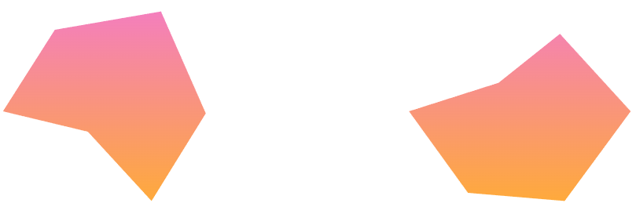
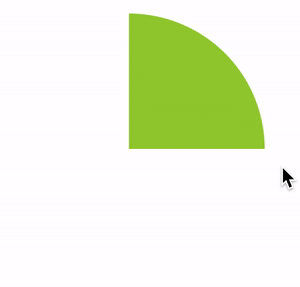

## 实现背景网格

对于如下这样一个背景网格，**最好的方式当然肯定是切图**。

[](https://user-images.githubusercontent.com/8554143/226373559-f1e3912d-a09b-4aa3-b99b-4480c2be9fa9.png)

这里，我们可以使用 `drop-shadow()`，大致实现一下这个效果，核心步骤：

1. 通过叠加实现一个六边形图形
2. 利用 `drop-shadow()` 实现边框效果

用动图演示一下，大概是这样：

[](https://user-images.githubusercontent.com/8554143/226378686-1d3dd180-3bc2-46c3-a1d7-b13138f01f83.gif)

代码如下：

```html
<div></div>
```

```scss
div {
  position: relative;
  width: 150px;
  height: 260px;
  background: #fff;
  filter: drop-shadow(0 0 0.5px #333) drop-shadow(0 0 0.5px #333) drop-shadow(0
        0 0.5px #333);
  &::before,
  &::after {
    content: '';
    position: absolute;
    inset: 0;
    background: inherit;
  }
  &::before {
    transform: rotate(60deg);
  }
  &::after {
    transform: rotate(-60deg);
  }
}
```

效果如下：

[](https://user-images.githubusercontent.com/8554143/226379801-4732ae5a-4e46-405a-9186-7078843558fa.png)

只需要多叠加几次，配合 3 条直线，整个背景就能很快的画出来，完整的代码，使用 `SASS` 表示如下：

```html
<div class="g-container">
  <ul class="g-bg">
    <li></li>
    <li></li>
    <li></li>
    <li></li>
    <li></li>
  </ul>
</div>
```

```scss
.g-container {
  position: relative;
  width: 300px;
  height: 300px;
}
.g-bg {
  position: absolute;
  inset: 0;

  &::after {
    content: '';
    position: absolute;
    inset: 20px 0;
    z-index: 6;
    background: linear-gradient(
        transparent,
        transparent calc(50% - 0.5px),
        #333 calc(50% - 0.5px),
        #333 calc(50% + 0.5px),
        transparent calc(50% + 0.5px),
        transparent
      ), linear-gradient(
        120deg,
        transparent,
        transparent calc(50% - 1px),
        #333 calc(50% - 0.5px),
        #333 calc(50% + 0.5px),
        transparent calc(50% + 1px),
        transparent
      ), linear-gradient(240deg, transparent, transparent calc(50% - 1px), #333
          calc(50% - 0.5px), #333 calc(50% + 0.5px), transparent calc(50% + 1px), transparent);
    clip-path: polygon(25% 0%, 75% 0%, 100% 50%, 75% 100%, 25% 100%, 0% 50%);
  }

  li {
    --rotate: 0deg;
    position: absolute;
    width: 150px;
    height: 260px;
    translate: -50% -50%;
    left: 50%;
    top: 50%;
    background: #fff;
    filter: drop-shadow(0 0 0.5px #333) drop-shadow(0 0 0.5px #333) drop-shadow(0
          0 0.5px #333);

    &::before,
    &::after {
      content: '';
      position: absolute;
      inset: 0;
      background: inherit;
    }
    &::before {
      transform: rotate(60deg);
    }
    &::after {
      transform: rotate(-60deg);
    }
  }
  @for $i from 1 to 5 {
    li:nth-child(#{$i}) {
      z-index: #{$i};
      width: #{(1 - $i / 5) * 150}px;
      height: #{(1 - $i / 5) * 260}px;
    }
  }
}
```

背景网格就出来了：

[](https://user-images.githubusercontent.com/8554143/226373559-f1e3912d-a09b-4aa3-b99b-4480c2be9fa9.png)

## 实现六芒星样式

有了背景图，接下来，我们只需要实现六芒星效果图加上动画即可。

要实现这么一个图形其实非常简单，利用 `clip-path` 裁剪即可：

[](https://user-images.githubusercontent.com/8554143/226381308-f1db1667-dcb5-484b-b444-5fd1d8412371.png)

只需要两步：

1. 实现一个渐变图形
2. 利用 `clip-path` 进行裁剪

核心代码：

````html
<div></div>
··· ```CSS div { background: linear-gradient(rgba(241,94,174, .8), rgba(255,
152, 0, .8)); clip-path: polygon(25% 0%, 75% 0%, 100% 50%, 75% 100%, 25% 100%,
0% 50%); }
````

当然，我们可以把坐标点当成参数，把坐标点计算好后，通过内联标签的 `style` 传递进 CSS 中，这样，就可以展示不同基于的六芒星的图案。

像是这样：

````html
<div
  style="--polygon: 30% 10%, 75% 1%, 94% 51%, 71% 94%, 44% 60%, 8% 50%"
></div>
<div
  style="--polygon: 25% 0%, 75% 0%, 100% 50%, 75% 100%, 25% 100%, 0% 50%"
></div>
··· ```CSS div { background: linear-gradient(rgba(241,94,174, .8), rgba(255,
152, 0, .8)); clip-path: polygon(var(--polygon)); }
````

这样就能快速得到不同的图形：

[](https://user-images.githubusercontent.com/8554143/226382342-bf6458ca-189d-44e8-82b9-68e2d1146de7.png)

## 借助 CSS [@Property](https://github.com/Property) 实现动画 Hover 效果

最后一步，我们只需要实现 Hover 动画即可。

这里，我们需要借助 CSS [@Property](https://github.com/Property) 实现。

这里其实就是一个饼图动画，首先，我们来实现一个动态的饼图动画。

假设，我们有如下结构：

```html
<div></div>
```

```scss
.normal {
  width: 200px;
  height: 200px;
  border-radius: 50%;
  background: conic-gradient(
    yellowgreen,
    yellowgreen 25%,
    transparent 25%,
    transparent 100%
  );
  transition: background 300ms;

  &:hover {
    background: conic-gradient(
      yellowgreen,
      yellowgreen 60%,
      transparent 60.1%,
      transparent 100%
    );
  }
}
```

将会得到这样一种效果，由于 `conic-gradient` 是不支持过渡动画的，得到的是一帧向另外一帧的直接变化：

[](https://user-images.githubusercontent.com/8554143/114262545-2a51eb80-9a13-11eb-93b8-b1a3e34608fc.gif)

好，使用 CSS [@Property](https://github.com/Property) 自定义变量改造一下：

```css
@property --per {
  syntax: '<percentage>';
  inherits: false;
  initial-value: 25%;
}

div {
  background: conic-gradient(
    yellowgreen,
    yellowgreen var(--per),
    transparent var(--per),
    transparent 100%
  );
  transition: --per 300ms linear;

  &:hover {
    --per: 60%;
  }
}
```

看看改造后的效果，借助 CSS [@Property](https://github.com/Property) 自定义变量，我们能够实现过往无法实现的过渡动画效果：

<iframe height="300" style="width: 100%;" scrolling="no" title="conic-gradient 配合 CSS @property 实现饼图动画" src="https://codepen.io/mafqla/embed/PogXagr?default-tab=html%2Cresult&editable=true&theme-id=light" frameborder="no" loading="lazy" allowtransparency="true" allowfullscreen="true">
  See the Pen <a href="https://codepen.io/mafqla/pen/PogXagr">
  conic-gradient 配合 CSS @property 实现饼图动画</a> by mafqla (<a href="https://codepen.io/mafqla">@mafqla</a>)
  on <a href="https://codepen.io">CodePen</a>.
</iframe>

在本 DEMO 中，我们会运用一样的技巧，只不过，我们会把 CSS [@Property](https://github.com/Property) 自定义变量运用在 mask 上，通过 mask 的遮罩效果，实现 Hover 过程的展示动画。

核心代码如下：

```html
<div
  class="g-content"
  style="--polygon: 43% 36%, 69% 12%, 99% 50%, 71% 94%, 30% 90%, 5% 50%"
></div>
```

```scss
@property --per {
  syntax: '<percentage> | <angle>';
  inherits: false;
  initial-value: 360deg;
}
.g-content {
  position: absolute;
  inset: 20px 0;
  z-index: 10;
  mask: conic-gradient(
    #000,
    #000 var(--per),
    transparent var(--per),
    transparent 360deg
  );

  &:hover {
    animation: hoverPie 600ms ease-in-out;
  }

  &::before {
    content: '';
    position: absolute;
    inset: 0;
    background: linear-gradient(
      rgba(241, 94, 174, 0.8),
      rgba(255, 152, 0, 0.8)
    );
    clip-path: polygon(var(--polygon));
  }
}
@keyframes hoverPie {
  0% {
    --per: 0deg;
  }
  100% {
    --per: 360deg;
  }
}
```

这里：

1. 我们用元素的 `&::before` 实现了我们上述说的六芒星样式图
2. 利用元素本身的 `mask` 配合一个 CSS [@Property](https://github.com/Property) 属性实现遮罩动画

整体 Hover 上去的效果如下：

[](https://user-images.githubusercontent.com/8554143/226385314-d2334376-55a2-4aca-b3d6-5ae92ecb2a21.gif)

我们把上述所有的内容融合一下，就能得到完整的效果：

[](https://user-images.githubusercontent.com/8554143/226385811-ca823641-de94-4466-befe-226b0dca5476.gif)

<iframe height="300" style="width: 100%;" scrolling="no" title="LPL Player Hexagram Ability Chart Animation" src="https://codepen.io/mafqla/embed/poBqKmE?default-tab=html%2Cresult&editable=true&theme-id=light" frameborder="no" loading="lazy" allowtransparency="true" allowfullscreen="true">
  See the Pen <a href="https://codepen.io/mafqla/pen/poBqKmE">
  LPL Player Hexagram Ability Chart Animation</a> by mafqla (<a href="https://codepen.io/mafqla">@mafqla</a>)
  on <a href="https://codepen.io">CodePen</a>.
</iframe>
