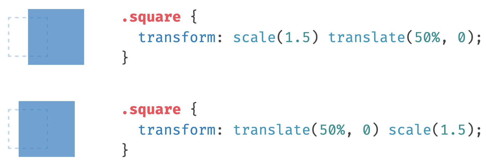
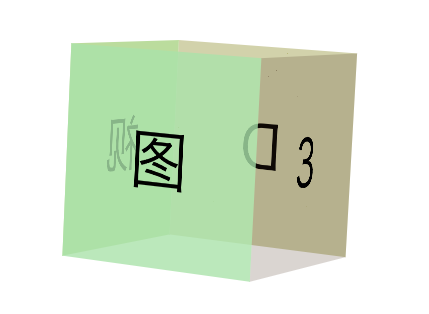
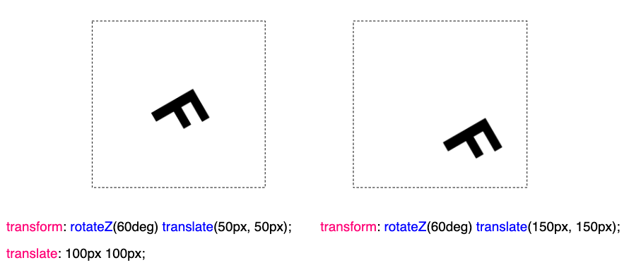

## 什么是分开写的 `transform`？

什么意思呢？我们来看这样一个例子：

在之前，我们可以利用 `transform` 配合绝对定位的 `top`、`left` 进行任意元素的水平垂直居中，像是这样：

```html
<div></div>
```

```css
div {
  width: 200px;
  height: 200px;
  background: #000;
  position: absolute;
  top: 50%;
  left: 50%;
  transform: translate(-50%, -50%);
}
```

这样，我们就得到了一个水平垂直居中的元素：

[](https://user-images.githubusercontent.com/8554143/192275427-afb61454-d414-429b-a5a9-75af5b407f2c.png)

但是，如果我们想对这个元素进行一个缩放的动画，该怎么做呢？会是这样：

```css
div {
  width: 200px;
  height: 200px;
  background: #000;
  position: absolute;
  top: 50%;
  left: 50%;
  transform: translate(-50%, -50%);
}
@keyframes scale {
  0% {
    transform: translate(-50%, -50%) scale(1);
  }
  100% {
    transform: translate(-50%, -50%) scale(1.2);
  }
}
```

好的，动画本身，并不是重点。**重点在于，在上述的 [@Keyframes](https://github.com/Keyframes) 代码中，我们想改变的其实只有 `scale()` 的值，但是基于现有的 CSS 机制，我们必须把前面控制定位的 `translate()` 一并写上。**

## transform 拆开书写

为了解决这个痛点，规范支持了将 transform 分开书写的方式。

所以，对于这一句，`transform: translate(-50%, -50%) scale(1)`，我们可以分别拆开成 `translate` 和 `scale`：

```css
div {
  width: 200px;
  height: 200px;
  background: #000;
  position: absolute;
  top: 50%;
  left: 50%;
  // transform: translate(-50%, -50%); 删掉这句
  translate: -50% -50%;
  scale: 1;
  animation: scale 1s infinite linear alternate;
}

@keyframes scale {
  0% {
    scale: 1;
  }
  100% {
    scale: 1.2;
  }
}
```

是的，我们可以通过 `translate` 和 `scale` 分开控制它们，这样我们就能愉快的在 `@keyframes` 中，只进行 `scale` 的动画了！妙哉。

所以，根据规范 -- [W3 - individual-transforms](https://www.w3.org/TR/css-transforms-2/#individual-transforms)，于 `transform` 而言，我们可以将它整个拆解为：

1. translate
2. rotate
3. scale

具体的语法会有一点点不同，具体使用的时候，多看看文档，譬如 `translate` 接收 3 个参数，第 2、3 个参数如果不存在，则为零（例如：translate: 50% 50% 0）。又譬如 `rotate`，如果想改变 Y 轴的旋转角度，可以这样写 `rotate: y 30deg`。

再举个例子，下面两组代码是等效的：

```css
// 上下两组代码产生的效果等效！
 {
  transform: translate(-50%, -50%) rotateZ(30deg) scale(1.2);
}
 {
  translate: -50% -50%;
  rotate: Z 30deg;
  scale: 1.2;
}
```

> 是的，比较奇怪的是，规范里没有涉及到 `skew` 的拆解。

## 顺序对 transform 的影响

transform 各个值的书写顺序对结果有影响吗？**答案是肯定的**。

借用一张图：

[](https://user-images.githubusercontent.com/8554143/194686910-7d5fd23c-2284-4423-9b17-1eb4348a2e47.png)

1. `transform: scale(1.5) translate(50%, 0)` 先放大再位移
2. `transform: translate(50%, 0) scale(1.5) ` 先位移再放大

可以看到，两者的结果是不一样的，因为 `translate(50%, 0)` 的百分比会以当前元素的实际大小作为参照，而很明显，元素放大前后，大小并不一致。

因此，拆开后和原本写在一起并非完全一样。

如果，我们使用的是 `transform`，将它们全部写在一起，像是这样：

```css
div {
  transform: rotateY(90deg) translateZ(400px) scale(1.2);
}
```

此时，**元素的 transform 变换遵循的是从左向右进行变换**。也就是先旋转 `rotate`，再 `translateZ()`，最后缩放 `scale()`。

但是如果，我们分开来写：

```css
div {
  rotate: Y 90deg;
  translate: 0 0 400px;
  scale: 1.2;
}
```

虽然代码属性的顺序是 rotate --> translate --> scale，**但是实际上，无论他们的书写顺序如何，解析的时候都会按照首先 translate，然后 rotate，最后 scale 的顺序进行！**

这个会有什么影响吗？当然，这里我们来看这样一个例子。假设，我们想实现这样一个立方体：

[](https://user-images.githubusercontent.com/8554143/192489801-cd49e2af-f254-4585-b576-b0c2466e9ab1.png)

不算上下两个面，以其余 4 个面为例子，正常的做法是，在 `transform-style: preserve-3d` 状态下，每个面先绕 Y 轴旋转一定的角度，然后进行 `translateZ()` 的位移。

像是这样：

[](https://user-images.githubusercontent.com/8554143/192489996-acbefea0-91e8-4aaf-ac5d-3794ca759bf5.png)

所以，代码会是这样：

```css
face1 {
  transform: rotateY(0) translateZ(200px);
}
face2 {
  transform: rotateY(90deg) translateZ(200px);
}
face3 {
  transform: rotateY(180deg) translateZ(200px);
}
face4 {
  transform: rotateY(270deg) translateZ(200px);
}
```

注意，这里 transform 的变换是**先旋转，再位移**。

如果我们拆开写，变成：

```css
face2 {
  rotate: Y 90deg;
  translate: 0 0 200px;
}
//...
```

则整个效果就变成了：

<iframe height="300" style="width: 100%;" scrolling="no" title="3D Box View " src="https://codepen.io/mafqla/embed/BaEMGyg?default-tab=html%2Cresult&editable=true&theme-id=light" frameborder="no" loading="lazy" allowtransparency="true" allowfullscreen="true">
  See the Pen <a href="https://codepen.io/mafqla/pen/BaEMGyg">
  3D Box View </a> by mafqla (<a href="https://codepen.io/mafqla">@mafqla</a>)
  on <a href="https://codepen.io">CodePen</a>.
</iframe>

因为这里实际执行的顺序是，先 `translate`，后 `rotate`。

所以，实际使用的时候一定要注意，矩阵变换的顺序会影响最终的效果。如果对顺序有严格的要求，还是需要合在一起写。

## 两种语法共存？

当然，还有一种情况。

那就是当两种语法同时共存的时候。整个对 `transform` 的赋值，到底是以哪个为准呢？

我们来看看这个例子：

```css
.mix {
  transform: translate(100px, 100px) rotateZ(60deg) scale(2);
  translate: 150px 150px;
  rotate: Z 30deg;
  scale: 1.5;
}
```

两种语法共存的情况下，transform 的各个值是以一种什么情况存在呢？transform 各个值作用的顺序又是否会发生变化呢？

因此这里我们需要探讨两个问题：

1. 如果两种语法同时存在，且作用顺序一致，重复出现的值会以哪个声明为主？
2. 如果两种语法同时存在，且作用顺序不一致，作用的顺序以及 transform 每个值的最终计算值是多少？

### 同时存在，且作用顺序一致

我们先来看第一种情况，**同时存在，且作用顺序一致**。也就是上面给出的代码：

```css
.mix {
  transform: translate(100px, 100px) rotateZ(60deg) scale(2);
  translate: 150px 150px;
  rotate: Z 30deg;
  scale: 1.5;
}
```

上面我们说了对于分开写的 `transform` 而言，无论其书写顺序，总是按照先 `translate`，然后 `rotate`，最后 `scale` 的顺序进行。然后合在一起写的语法其顺序也是如此。

在这里的情况下，结论是，两种写法的作用顺序是一致的，所以对顺序没有影响，而 `translate`、`rotate`、`scale` 的值最终会以一种叠加态存在。

也就是相当于：

1. 先进行一次 `transform: translate(100px, 100px) rotateZ(60deg) scale(2)`
2. 再接着进行 `translate: 150px 150px`
3. 再接着进行 `rotate: Z 30deg`
4. 再接着进行 `scale: 1.5`

### 同时存在，且作用顺序不一致

那如果作用顺序不一致，两种写法又同时存在，又会是怎么样一种情况呢？

像是这样：

```css
.mix {
  transform: rotateZ(60deg) translate(100px, 100px) scale(2);
  translate: 150px 150px;
  rotate: Z 30deg;
  scale: 1.5;
}
```

这里，对于合在一起写的 `transform: rotateZ(60deg) translate(100px, 100px) scale(2)` 而言，执行顺序是 `rotate` --> `translate` --> `scale`，而对于分开写的 3 个值，执行顺序是 `translate` --> `rotate` --> `scale`。

其实这里与上述也顺序不一致的规则也是一样的：

1. 先进行一次 `transform: translate(100px, 100px) rotateZ(60deg) scale(2)`
2. 以 (1) 的结果为基准，再进行一次 `translate: 150px 150px`
3. 以 (2) 的结果为基准，再进行一次 `rotate: Z 30degx`
4. 以 (3) 的结果为基准，再进行一次 `scale: 1.5`

## 两种语法共存的误区

当两种语法都存在时，容易产生一种理解上的误区。

看这样一种情况，假设我们有这样一个 div：

[](https://user-images.githubusercontent.com/8554143/194695047-6176f708-ac13-47a7-afd7-c51fd10ec7c5.png)

如果存在两种 transform 语法，代码如下：

```css
div {
  transform: rotateZ(60deg) translate(100px, 100px);
  translate: 150px 150px;
}
```

那么按照刚刚的叠加规则，其结果，是不是就等于下面的结果呢：

```css
div {
  transform: rotateZ(60deg) translate(250px, 250px);
}
```

我们能否把单独的 `translate: 150px 150px` 合进上面整个的 `transform` 中呢？

答案是不行的！

两种语法的作用如下：

[](https://user-images.githubusercontent.com/8554143/194695628-82157016-e98c-43da-8e24-0128a2d83b2a.png)

这是因为，对于分开的写的语法而言，第二次的 `translate: 150px 150px` 是纯粹的向右位移 150px，向下位移 150px，不会考虑当前旋转角度的。

而对于 `transform: rotateZ(60deg) translate(250px, 250px)` 而言，这里的 `250px, 250px` 是基于旋转了 60° 的基础上而言的。这一点，再实际使用的过程中，一定要注意！

<iframe height="300" style="width: 100%;" scrolling="no" title="individual transforms Demo" src="https://codepen.io/mafqla/embed/ZEZwmGB?default-tab=html%2Cresult&editable=true&theme-id=light" frameborder="no" loading="lazy" allowtransparency="true" allowfullscreen="true">
  See the Pen <a href="https://codepen.io/mafqla/pen/ZEZwmGB">
  individual transforms Demo</a> by mafqla (<a href="https://codepen.io/mafqla">@mafqla</a>)
  on <a href="https://codepen.io">CodePen</a>.
</iframe>

## 做好回退机制

当然，如果你迫不及待的想使用这个特性了。可以提前使用 `@supports` 语法进行兼容。到今天，`@supports` 语法的兼容性已经非常之好了。

我们可以这样使用：

```css
.container {
  translate: 50% 10%;
  rotate: 80deg;
  scale: 1.5;
}

// 如果不支持上述的语法，则 supports 内的语法生效
@supports not (scale: 1) {
  transform: translate(50%, 10%) rotate(80deg) scale(1.5);
}
```

是的，如果不支持 `.container` 内的的语法，则 supports 内的语法生效。
