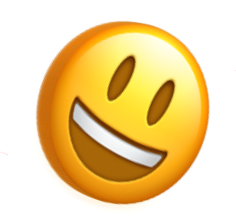

## 实现 3D Emoji 表情

首先，一个比较大的难点就是，我们如何使用 CSS 实现一个 3D 的 Emoji 表情？像是这样：



这里，**其实使用的是个障眼法**。核心就在于，使用多层 Emoji 表情的叠加，当叠加的间距合适的情况下，当观看角度处于一定的合理范围内时，视觉上就能得到一种 3D 的效果。

合理的利用距离、角度及光影构建出不一样的 3D 效果。看看下面这个例子，只是简单是设置了三层字符，让它们在 Z 轴上相距一定的距离。

简单的伪代码如下：

```html
<div>
  <span class="C">C</span>
  <span class="S">S</span>
  <span class="S">S</span>
  <span></span>
  <span class="3">3</span>
  <span class="D">D</span>
</div>
```

```scss
$bright: #afa695;
$gold: #867862;
$dark: #746853;
$duration: 10s;
div {
  perspective: 2000px;
  transform-style: preserve-3d;
  animation: fade $duration infinite;
}
span {
  transform-style: preserve-3d;
  transform: rotateY(25deg);
  animation: rotate $duration infinite ease-in;

  &:after,
  &:before {
    content: attr(class);
    color: $gold;
    z-index: -1;
    animation: shadow $duration infinite;
  }
  &:after {
    transform: translateZ(-16px);
  }
  &:before {
    transform: translateZ(-8px);
  }
}
@keyframes fade {
  // 透明度变化
}
@keyframes rotate {
  // 字体旋转
}
@keyframes shadow {
  // 字体颜色变化
}
```

简单捋一下，上述代码的核心就是：

1. 父元素、子元素设置 `transform-style: preserve-3d`
2. 用 `span` 元素的两个伪元素复制两个相同的字，利用 `translateZ()` 让它们在 Z 轴间隔一定距离
3. 添加简单的旋转、透明度、字体颜色变化

可以得到这样一种类似电影开片的标题 3D 动画，其实只有 3 层元素，但是由于角度恰当，视觉上的衔接比较完美，看上去就非常的 3D。


为什么上面说需要合理的利用距离、角度及光影呢？

还是同一个动画效果，如果动画的初始旋转角度设置的稍微大一点，整个效果就会穿帮：


可以看到，在前几帧，能看出来简单的分层结构。又或者，简单调整一下 `perspective`，设置父容器的 `perspective` 由 `2000px` 改为 `500px`，穿帮效果更为明显：


也就是说，在恰当的距离，合适的角度，我们仅仅通过很少的元素，就能在视觉上形成比较不错的 3D 效果。

我们把上述的效果，套用到一个 Emoji 表情上：

```html
<div class="g-emoji">
  <div class="g-foo"></div>
  <div class="g-bar"></div>
  <div class="g-baz"></div>
</div>
```

```css
.g-emoji {
    position: relative;
    width: 200px;
    height: 200px;
    perspective: 2000px;
    transform-style: preserve-3d;
    font-size: 200px;
    animation: rotate 2s alternate infinite ease-in-out;

    &::before,
    &::after {
        content: "\1F600"
        position: absolute;
        top: 50%;
        left: 50%;
        transform: translate(-50%, -50%);
        width: 200px;
        height: 200px;
    }
    &::after {
        transform: translate(-50%, -50%) translateZ(-4px);
    }

    .g-foo,
    .g-bar,
    .g-baz{
        position: absolute;
        inset: 0;
        transform-style: preserve-3d;
    }

    .g-foo::before,
    .g-foo::after,
    .g-bar::before,
    .g-bar::after,
    .g-baz::before,
    .g-baz::after{
        content: "\1F600";
        position: absolute;
        top: 50%;
        left: 50%;
        width: 200px;
        height: 200px;
    }
    .g-foo::before {
        transform: translate(-50%, -50%) translateZ(-8px);
        opacity: .95;
    }
    .g-foo::after {
        transform: translate(-50%, -50%) translateZ(-12px);
        opacity: .9;
    }
    .g-bar::before {
        transform: translate(-50%, -50%) translateZ(-16px);
        opacity: .85;
    }
    .g-bar::after {
        transform: translate(-50%, -50%) translateZ(-20px);
        opacity: .8;
    }
    .g-baz::before {
        transform: translate(-50%, -50%) translateZ(-24px);
        opacity: .75;
    }
    .g-baz::after {
        transform: translate(-50%, -50%) translateZ(-28px);
        opacity: .7;
    }
}

@keyframes rotate {
    0% {
        transform: rotateY(-45deg);
    }
    100% {
        transform: rotateY(45deg);
    }
}
```

这里做了什么事情呢：

1. 利用元素的伪元素，生成了多个同样的 Emoji 表情，也就是这一句 `content: "\1F600"`，其中 `\1f600` 表示是的笑脸的 Emoji 表情
2. 多个相同的 Emoji 表情，叠加在一起，但是设置了不同的 `translateZ`以及不同的透明度

> 这里需要提一句，Emoji 表情是有特定的编码范围的，Emoji 表情的编码范围通常是指 Unicode 字符集中专门用于表示 Emoji 图形的范围，一个常见的范围是从 U+1F600 到 U+1F64F。

<iframe height="300" style="width: 100%;" scrolling="no" title="Untitled" src="https://codepen.io/mafqla/embed/mdggJBM?default-tab=html%2Cresult&editable=true&theme-id=light" frameborder="no" loading="lazy" allowtransparency="true" allowfullscreen="true">
  See the Pen <a href="https://codepen.io/mafqla/pen/mdggJBM">
  Untitled</a> by mafqla (<a href="https://codepen.io/mafqla">@mafqla</a>)
  on <a href="https://codepen.io">CodePen</a>.
</iframe>

### 弹跳动画

好，有了 3D Emoji，接下来，就是实现一个自由落体的弹跳动画。

这个相对而言比较简单，当然，为了效果逼着，在下落的过程中需要让元素受到挤压变形。

核心借助缓动函数，以及 transform，我们在上述 DEMO 的基础上，实现弹跳动画效果：

```html
<div class="g-emoji">
  <div class="g-foo"></div>
  <div class="g-bar"></div>
  <div class="g-baz"></div>
</div>
```

```css
body,
html {
  width: 100%;
  height: 100%;
  display: flex;
  background: conic-gradient(
    #fff,
    #fff 90deg,
    #ddd 90deg,
    #ddd 180deg,
    #fff 180deg,
    #fff 270deg,
    #ddd 270deg
  );
  background-size: 50px 50px;
}

.g-emoji {
  position: relative;
  width: 200px;
  height: 200px;
  margin: auto;
  perspective: 2000px;
  transform-style: preserve-3d;
  font-size: 200px;
  animation: rotate 2s alternate infinite ease-in-out, fall 0.6s alternate
      infinite cubic-bezier(0.22, 0.16, 0.04, 0.99) forwards;

  //...
}
@keyframes fall {
  0% {
    scale: 1.25 0.75;
    translate: 0 150px;
  }
  25% {
    scale: 1 1;
  }
  100% {
    scale: 1 1;
    translate: 0 0;
  }
}
```

与上面代码不一样的是，这里新增了 `fall` 动画效果，此效果完成了两件事：

1. 利用 `translate` 实现了下落动画
2. 利用 `scale` 实现了形变变化

当然，由于是自由落地，选取了一个与自由落体速率相近的 `cubic-bezier(.22,.16,.04,.99)` 缓动函数，并且，利用了 `alternate infinite` 让整个动画效果，反向无限运行。

## 解决弹起瞬间切换 Emoji 表情

OK，接下来，我们要解决另外一个难点。

如何在 Emoji 表情弹起的瞬间，替换一个新的 Emoji 表情呢？

此处的麻烦之处在于，上面列出的两个动画效果，都是 `infinite` 无限动画。熟悉 CSS 动画的同学应该都知道，在 JavaScript 中，我们可以利用 `animationstart` 和 `animationend` 两个事件，监听 CSS 动画的开始与结束。

然而，上面也说了，由于本例中的 CSS 动画都是无限动画，我们无法通过这两个事件去获取譬如动画弹起和下落的一些关键事件节点。

因此，这里我使用了 `requestAnimationFrame` 去完成这个事情。步骤大致如下：

1. 改造一下代码，DEMO 中 CSS 代码中使用的 Emoji 表情，通过 JavaScript 写入元素的 `style` 标签内，通过 CSS 变量获取
2. 通过 `requestAnimationFrame` 监听页面渲染的每一帧，计算每一帧元素当前的位置与上一帧的位置的一些关系
3. 如果发现上一帧中，元素在下降（计算相对位置变化得到），而最新的一帧中，元素开始上升，则找到了元素从下落到上升转换的这一帧
4. 而（3）这一帧的 `requestAnimationFrame()`，可以理解为是一个 HOOK，我们在这一帧中，实现 Emoji 表情的随机生成与写入元素的 Style 属性中

上面一段步骤代码，需要好好理解，代码大致如下：

```html
<div class="g-emoji">
  <div class="g-foo"></div>
  <div class="g-bar"></div>
  <div class="g-baz"></div>
</div>
```

```scss
.g-emoji {
  position: relative;
  animation: rotate 2.3s alternate infinite ease-in-out, fall 0.6s alternate
      infinite cubic-bezier(0.22, 0.16, 0.04, 0.99) forwards;

  &::before,
  &::after {
    content: var(--emoji, '\1F600');
    position: absolute;
    top: 50%;
    left: 50%;
    transform: translate(-50%, -50%);
    width: 200px;
    height: 200px;
  }

  .g-foo::before,
  .g-foo::after,
  .g-bar::before,
  .g-bar::after,
  .g-baz::before,
  .g-baz::after {
    content: var(--emoji, '\1F600');
    position: absolute;
    top: 50%;
    left: 50%;
    width: 200px;
    height: 200px;
  }
  // ...
}
```

最为核心的 JavaScript 代码：

```js
const emoji = document.querySelectorAll('.g-emoji')[0]

let curTranslate = 0
let lastTranslate = 0
let diff = 0

function aniFun() {
  curTranslate =
    window
      .getComputedStyle(emoji, null)
      .getPropertyValue('translate')
      .split(' ')[1]
      .slice(0, -2) - 0

  // 翻转
  if (diff > 0 && curTranslate - lastTranslate < 0) {
    emoji.style = `--emoji: "${generateRandomEmoji()}"`
  }

  window.requestAnimationFrame(aniFun)
  diff = curTranslate - lastTranslate
  lastTranslate = curTranslate
}

function generateRandomEmoji() {
  // 开始的 Emoji 编码
  var emojiStart = 0x1f600
  var emojiStart2 = 0x1f900
  // 结束的 Emoji 编码
  var emojiEnd = 0x1f64f
  var emojiEnd2 = 0x1f9ff

  var randomCode =
    Math.random() > 0.5
      ? Math.floor(Math.random() * (emojiEnd - emojiStart + 1)) + emojiStart
      : Math.floor(Math.random() * (emojiEnd2 - emojiStart2 + 1)) + emojiStart2
  var emoji = String.fromCodePoint(randomCode)

  return emoji
}

window.requestAnimationFrame(aniFun)
```

这样，我们就成功的拿到了动画从下落转向上升的那一帧。

并且，在这一帧中，利用 `generateRandomEmoji()`，随机生成了一个 Emoji 表情的 Unicode 编码，插入元素中。

## 增加随机背景

好，到这里，基本上最为核心的部分我们已经实现了。

接下来，就是让整个动画更加的丰满有特色的一些辅助工作。

下一个非常有意思点，如何添加随机背景动画？可以看到最上面的 DEMO 图，在 Emoji 表情变化的瞬间，背景图也在变化。

这个也好做，上面我们既然已经拿到了**从下落转向上升的那一帧**。那么我们就可以在这一帧中，做更多事情。

随机背景的做法就是：

1. 事先基于 `<body>`，使用 CSS 实现多个不同的背景效果，每个效果，都赋予一个单独的 className
2. 在表情切换的瞬间，也随机切换一个背景效果，其本质就是给 `body` 再添加一个事先定义好的范围内的随机的 className，表现为不同的背景效果

```scss
body.a {
  background-image: conic-gradient(
    #fff,
    #fff 90deg,
    #ddd 90deg,
    #ddd 180deg,
    #fff 180deg,
    #fff 270deg,
    #ddd 270deg
  );
  background-size: 50px 50px;
}
body.b {
  background-image: linear-gradient(
      0deg,
      transparent 9%,
      rgba(255, 255, 255, 0.2) 10%,
      rgba(255, 255, 255, 0.2) 12%,
      transparent 13%,
      transparent 29%,
      rgba(255, 255, 255, 0.1) 30%,
      rgba(255, 255, 255, 0.1) 31%,
      transparent 32%,
      transparent 49%,
      rgba(255, 255, 255, 0.1) 50%,
      rgba(255, 255, 255, 0.1) 51%,
      transparent 52%,
      transparent 69%,
      rgba(255, 255, 255, 0.1) 70%,
      rgba(255, 255, 255, 0.1) 71%,
      transparent 72%,
      transparent 89%,
      rgba(255, 255, 255, 0.1) 90%,
      rgba(255, 255, 255, 0.1) 91%,
      transparent 92%,
      transparent
    ), linear-gradient(90deg, transparent 9%, rgba(255, 255, 255, 0.2) 10%, rgba(
          255,
          255,
          255,
          0.2
        ) 12%, transparent 13%, transparent 29%, rgba(255, 255, 255, 0.1) 30%, rgba(
          255,
          255,
          255,
          0.1
        ) 31%, transparent 32%, transparent 49%, rgba(255, 255, 255, 0.1) 50%, rgba(
          255,
          255,
          255,
          0.1
        ) 51%, transparent 52%, transparent 69%, rgba(255, 255, 255, 0.1) 70%, rgba(
          255,
          255,
          255,
          0.1
        ) 71%, transparent 72%, transparent 89%, rgba(255, 255, 255, 0.1) 90%, rgba(
          255,
          255,
          255,
          0.1
        ) 91%, transparent 92%, transparent);
  background-size: 50px 50px;
}
body.c {
  background-image: linear-gradient(
      rgba(0, 255, 0, 0.7) 0.1em,
      transparent 0.1em
    ), linear-gradient(90deg, rgba(0, 255, 0, 0.7) 0.1em, transparent 0.1em);
  background-size: 3em 3em;
}
body.d {
  background: repeating-linear-gradient(45deg, #444 0 20px, #c0466f 0 40px);
}
body.e {
  background: repeating-radial-gradient(
    circle at 50% 50%,
    #fff,
    #9c27b0 20px,
    #ff5722 21px,
    #9c27b0 40px,
    #000000 41px,
    #256b8f 60px,
    #fff 61px
  );
}
body.f {
  background: conic-gradient(#333 0 45deg, #fff 0 360deg);
  background-position: -50% -50%;
  background-size: 30px 30px;
}
body.g {
  &::before {
    content: '';
    position: absolute;
    inset: 0;
    background: linear-gradient(-45deg, #ee7752, #e73c7e, #23a6d5, #23d5ab);
    background-size: 400% 400%;
    animation: gradient 3s ease infinite;
  }
}
body.h {
  background: linear-gradient(30deg, #000 0, #000 49.9%, #fff 50%);
}
body.i {
  background: #000;
  &::before,
  &::after {
    content: '';
    position: absolute;
    inset: 0 50% 0 0;
    background: linear-gradient(
      45deg,
      #00f376 10%,
      transparent 10%,
      transparent 50%,
      #00f376 50%,
      #00f376 60%,
      transparent 60%,
      transparent 100%
    );
    background-size: 40px 40px;
    animation: move 0.3s linear infinite;
  }
  &::after {
    inset: 0 0 0 50%;
    transform: rotateY(180deg);
  }
}
body.j {
  &::before {
    content: '';
    position: absolute;
    inset: 0;
    background: conic-gradient(#fff 0, transparent 30%, #fff);
  }
}
body.k {
  &::before {
    content: '';
    position: absolute;
    inset: -100vmax;
    background: conic-gradient(#fff 0, transparent 45%, #fff);
    animation: bgrotate 2s infinite linear;
  }
}
```

```js
const body = document.querySelectorAll('body')[0]
const container = document.querySelectorAll('.g-container')[0]
const emoji = document.querySelectorAll('.g-emoji')[0]
const bgArr = ['a', 'b', 'c', 'd', 'e', 'f', 'g', 'h', 'i', 'j', 'k']

let curTranslate = 0
let lastTranslate = 0
let diff = 0

function aniFun() {
  curTranslate =
    window
      .getComputedStyle(emoji, null)
      .getPropertyValue('translate')
      .split(' ')[1]
      .slice(0, -2) - 0

  // 翻转
  if (diff > 0 && curTranslate - lastTranslate < 0) {
    emoji.style = `--emoji: "${generateRandomEmoji()}"`
    body.style = `--bg: ${generateRandomColor()}`
    body.setAttribute('class', bgArr[Math.floor(Math.random() * bgArr.length)])
  }

  window.requestAnimationFrame(aniFun)
  diff = curTranslate - lastTranslate
  lastTranslate = curTranslate
}

function generateRandomColor() {
  var red = Math.floor(Math.random() * 256)
  var green = Math.floor(Math.random() * 256)
  var blue = Math.floor(Math.random() * 256)

  var color = 'rgb(' + red + ', ' + green + ', ' + blue + ')'

  return color
}

function generateRandomEmoji() {
  // 开始的 Emoji 编码
  var emojiStart = 0x1f600
  var emojiStart2 = 0x1f900
  // 结束的 Emoji 编码
  var emojiEnd = 0x1f64f
  var emojiEnd2 = 0x1f9ff

  var randomCode =
    Math.random() > 0.5
      ? Math.floor(Math.random() * (emojiEnd - emojiStart + 1)) + emojiStart
      : Math.floor(Math.random() * (emojiEnd2 - emojiStart2 + 1)) + emojiStart2
  var emoji = String.fromCodePoint(randomCode)

  return emoji
}

window.requestAnimationFrame(aniFun)
```

其核心就是上述说的，**在表情切换的瞬间，也随机切换一个背景效果，其本质就是给 `body` 再添加一个事先定义好的范围内的随机的 className**。

这样，整个动画就基本完成了。基于上述的核心步骤，可以再做一些细节的增强：

1. 伴随 Emoji 表情落体运动，下方可以增添阴影的变化
2. Emoji 表情旋转方向的变化优化
3. 丰富不同的背景效果
4. 等等等等

这样，最终整个效果就完成啦，效果如下：

<iframe height="300" style="width: 100%;" scrolling="no" title="Random 3D Emoji" src="https://codepen.io/mafqla/embed/poBBJWG?default-tab=html%2Cresult&editable=true&theme-id=light" frameborder="no" loading="lazy" allowtransparency="true" allowfullscreen="true">
  See the Pen <a href="https://codepen.io/mafqla/pen/poBBJWG">
  Random 3D Emoji</a> by mafqla (<a href="https://codepen.io/mafqla">@mafqla</a>)
  on <a href="https://codepen.io">CodePen</a>.
</iframe>
