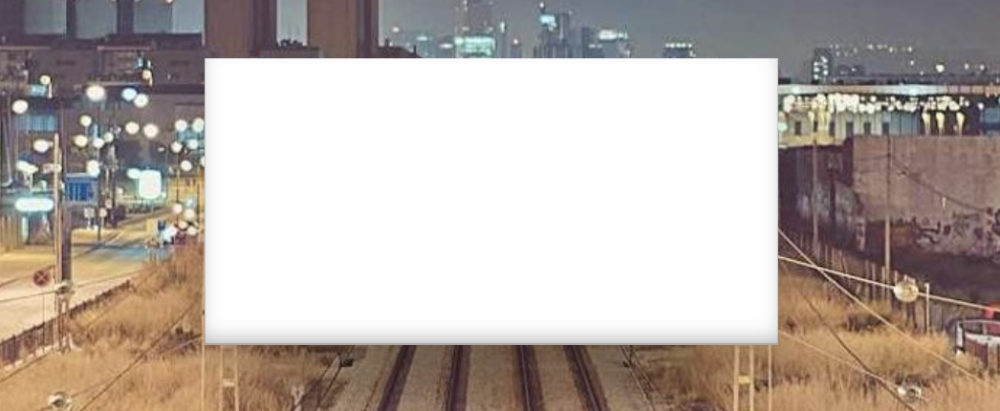
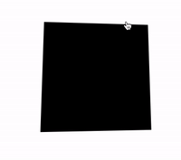

## 构建基础骨架

首先，我们快速实现整个效果的基础骨架。其核心代码如下：

```html
<div id="element"></div>
```

```css
body {
  width: 100vw;
  height: 100vh;
  background: url(https://picsum.photos/id/242/1920/1080);
}

div {
  width: 600px;
  height: 300px;
  background: #fff;
  box-shadow: 0 20px 40px 1px rgba(0, 0, 0, 0.12);
}
```

基于上述代码，我们可以快速得到如下效果：



这里，我们实现了一个白色背景的 div 元素，并且给 body 设置了一张背景图。

接着，我们就一步一步实现上面说的 3 个关键点：

1. 毛玻璃磨砂效果
2. 3D 卡片效果
3. 整体透明度和磨砂感、以及卡片的 3D 形态会随着用户移动鼠标而进行动态变化

## 实现毛玻璃磨砂效果

毛玻璃磨砂效果，是最为简单的一步。在 CSS 中，我们如今可以使用 `backdrop-filter` 滤镜进行实现。

> **毛玻璃效果**是一种视觉效果，通常用于美化设计或增加隐私保护。它通过模糊化图像的某些区域来达到这种效果，使图像看起来有一层轻微的模糊，同时仍然清晰可见。毛玻璃效果可以应用于图像、文本、按钮等各种 UI 元素上，为用户提供更加优雅和良好的视觉体验。

`backdrop-filter` 滤镜最为常见的使用场景，就是实现毛玻璃效果。

在没有 `backdrop-filter` 属性前，我们想实现如下所示的毛玻璃效果，是比较困难的：


在有了 `backdrop-filter` 属性后，毛玻璃效果的实现就非常简单了。

仅仅需要如下一段简单的代码：

```html
<div class="bg">
  <div>Normal</div>
  <div class="g-filter">filter</div>
  <div class="g-backdrop-filter">backdrop-filter</div>
</div>
```

```scss
.bg {
  background: url(image.png);

  & > div {
    width: 300px;
    height: 200px;
    background: rgba(255, 255, 255, 0.7);
  }
  .g-filter {
    filter: blur(6px);
  }
  .g-backdrop-filter {
    backdrop-filter: blur(6px);
  }
}
```

下面列出了 3 种效果，分别是：

1. 正常情况，没有使用任何滤镜；
2. 元素作用了 `filter: blur(6px)`；
3. 元素作用了 `backdrop-filter: blur(6px)`。

效果对比图如下：

<iframe height="300" style="width: 100%;" scrolling="no" title="filter 与 backdrop-filter 对比" src="https://codepen.io/mafqla/embed/RwOOgMe?default-tab=html%2Cresult&editable=true&theme-id=light" frameborder="no" loading="lazy" allowtransparency="true" allowfullscreen="true">
  See the Pen <a href="https://codepen.io/mafqla/pen/RwOOgMe">
  filter 与 backdrop-filter 对比</a> by mafqla (<a href="https://codepen.io/mafqla">@mafqla</a>)
  on <a href="https://codepen.io">CodePen</a>.
</iframe>

这里的核心就在于，使用透明背景，加上 `backdrop-filter: blur()` 即可实现毛玻璃效果。

我们改造一下我们的代码，添加上毛玻璃效果：

```css
div {
  width: 600px;
  height: 300px;
  backdrop-filter: blur(15px);
  background: linear-gradient(rgba(255, 255, 255, 0.1), rgba(0, 0, 0, 0.5));
  box-shadow: 0 20px 40px 1px rgba(0, 0, 0, 0.12);
}
```

效果如下：


## 卡片的 3D 旋转跟随效果

这个交互效果主要有两个核心：

1. 借助了 CSS 3D 的能力
2. 元素的旋转需要和鼠标的移动相结合

我们的目标是实现这样一个动画效果：



这里，我们其实有两个核心元素：

1. 鼠标活动区域
2. 旋转物体本身

鼠标在**鼠标活动区域**内的移动，会影响**旋转物体本身**的 3D 旋转，而旋转的方向其实可以被分解为 X 轴方向与 Y 轴方向。

我们来看一下，假设我们的 HTML 结构如下：

```html
<body>
  <div id="element"></div>
</body>
```

得到这样一个图形：


这里，`body` 的范围就是整个鼠标可活动区域，也是我们添加鼠标的 `mousemove` 事件的宿主 target，而 `#element` 就是需要跟随鼠标一起转动的旋转物体本身。

因为整个效果是需要基于 CSS 3D 的，我们首先加上简单的 CSS 3D 效果：

```css
body {
  width: 100vw;
  height: 100vh;
  transform-style: preserve-3d;
  perspective: 500px;
}

div {
  width: 200px;
  height: 200px;
  background: #000;
  transform-style: preserve-3d;
}
```

效果如下：


没有什么不一样。这是因为还没有添加任何的 3D 变换，我们给元素添加 X、Y 两个方向的 `rotate()` 试一下（注意，这里默认的旋转圆心即是元素中心）：

```css
div {
  transform: rotateX(15deg) rotateY(30deg);
}
```

效果如下，是有那么点意思了：


好，接下来，我们的目标就是通过结合 mouseover 事件，让元素动起来。

### 控制 X 方向的移动

当然，为了更加容易理解，我们把动画拆分为 X、Y 两个方向上的移动。首先看 X 方向上的移动：


这里，我们需要以元素的中心为界：

1. 当鼠标在中心右侧连续移动，元素绕 Y 轴移动，并且值从 0 开始，越来越大，范围为(0, +∞)deg
2. 反之，当鼠标在中心左侧连续移动，元素绕 Y 轴移动，并且值从 0 开始，越来越小，范围为(-∞, 0)deg

这样，我们可以得到这样一个公式：

rotateY = (鼠标 x 坐标 - 元素左上角 x 坐标 - 元素宽度的一半)deg

通过绑定 onmousemove 事件，我们尝试一下：

```js
const mouseOverContainer = document.getElementsByTagName('body')[0]
const element = document.getElementById('element')

mouseOverContainer.onmousemove = function (e) {
  let box = element.getBoundingClientRect()
  let calcY = e.clientX - box.x - box.width / 2

  element.style.transform = 'rotateY(' + calcY + 'deg) '
}
```

效果如下：


好吧，旋转的太夸张了，因此，我们需要加一个倍数进行控制：

```js
const multiple = 20
const mouseOverContainer = document.getElementsByTagName('body')[0]
const element = document.getElementById('element')

mouseOverContainer.onmousemove = function (e) {
  let box = element.getBoundingClientRect()
  let calcY = (e.clientX - box.x - box.width / 2) / multiple

  element.style.transform = 'rotateY(' + calcY + 'deg) '
}
```

通过一个倍数约束后，效果好了不少：


### 控制 Y 方向的移动

同理，我们利用上述的方式，同样可以控制 Y 方向上的移动：

```js
const multiple = 20
const mouseOverContainer = document.getElementsByTagName('body')[0]
const element = document.getElementById('element')

mouseOverContainer.onmousemove = function (e) {
  let box = element.getBoundingClientRect()
  let calcX = (e.clientY - box.y - box.height / 2) / multiple

  element.style.transform = 'rotateX(' + calcX + 'deg) '
}
```

效果如下：


当然，在这里，我们会发现方向是元素运动的方向是反的，所以需要做一下取反处理，修改下 `calcX` 的值，乘以一个 `-1` 即可：

```js
let calcX = ((e.clientY - box.y - box.height / 2) / multiple) * -1
```

### 结合 X、Y 方向的移动

OK，到这里，我们只需要把上述的结果合并一下即可，同时，上面我们使用的是 `onmousemove` 触发每一次动画移动。现代 Web 动画中，我们更倾向于使用 `requestAnimationFrame` 去优化我们的动画，确保每一帧渲染一次动画即可。

完整的改造后的代码如下：

```js
const multiple = 20
const mouseOverContainer = document.getElementsByTagName('body')[0]
const element = document.getElementById('element')

function transformElement(x, y) {
  let box = element.getBoundingClientRect()
  let calcX = -(y - box.y - box.height / 2) / multiple
  let calcY = (x - box.x - box.width / 2) / multiple

  element.style.transform =
    'rotateX(' + calcX + 'deg) ' + 'rotateY(' + calcY + 'deg)'
}

mouseOverContainer.addEventListener('mousemove', e => {
  window.requestAnimationFrame(function () {
    transformElement(e.clientX, e.clientY)
  })
})
```

至此，我们就能简单的实现题图所示的鼠标跟随 3D 旋转动效：


### 设置平滑出入

现在，还有最后一个问题，就是当我们的鼠标离开活动区域时，元素的 transform 将停留在最后一帧，正确的表现应该是复原到原状。因此，我们还需要添加一些事件监听做到元素的平滑复位。

通过一个 `mouseleave` 事件配合元素的 `transition` 即可。

```css
div {
  // 与上述保持一致...
  transition: all 0.2s;
}
```

```js
mouseOverContainer.addEventListener('mouseleave', e => {
  window.requestAnimationFrame(function () {
    element.style.transform = 'rotateX(0) rotateY(0)'
  })
})
```

至此，我们就可以完美的实现平滑出入，整体效果最终如下：

<iframe height="300" style="width: 100%;" scrolling="no" title="CSS 3D Rotate With Mouse Move" src="https://codepen.io/mafqla/embed/VwNNWxB?default-tab=html%2Cresult&editable=true&theme-id=light" frameborder="no" loading="lazy" allowtransparency="true" allowfullscreen="true">
  See the Pen <a href="https://codepen.io/mafqla/pen/VwNNWxB">
  CSS 3D Rotate With Mouse Move</a> by mafqla (<a href="https://codepen.io/mafqla">@mafqla</a>)
  on <a href="https://codepen.io">CodePen</a>.
</iframe>

基于上述的铺垫，我们改造一下我们的 DEMO，只是把上述 DEMO 中中心的黑块，替换成我们的毛玻璃元素，将背景替换成图片。

完整的代码：

```html
<div id="element"></div>
```

CSS 代码：

```css
body {
  width: 100vw;
  height: 100vh;
  transform-style: preserve-3d;
  background: url(https://picsum.photos/id/242/1920/1080);
}

div {
  width: 600px;
  height: 300px;
  transform-style: preserve-3d;
  backdrop-filter: blur(15px);
  background: linear-gradient(rgba(255, 255, 255, 0.1), rgba(0, 0, 0, 0.5));
  transition: all 0.3s;
}
```

Javascript 代码：

```js
const multiple = 25
const mouseOverContainer = document.getElementsByTagName('body')[0]
const element = document.getElementById('element')

function transformElement(x, y) {
  const box = element.getBoundingClientRect()
  const calcX = -(y - box.y - box.height / 2) / multiple
  const calcY = (x - box.x - box.width / 2) / multiple
  let angle = Math.floor(
    getMouseAngle(y - box.y - box.height / 2, x - box.x - box.width / 2)
  )

  element.style.transform =
    'rotateX(' + calcX + 'deg) ' + 'rotateY(' + calcY + 'deg)'
}

mouseOverContainer.addEventListener('mousemove', e => {
  window.requestAnimationFrame(function () {
    transformElement(e.clientX, e.clientY)
  })
})

mouseOverContainer.addEventListener('mouseleave', e => {
  window.requestAnimationFrame(function () {
    element.style.transform = 'rotateX(0) rotateY(0)'
  })
})
```

## 透明度变化

OK，最后，剩下最关键一步。我们需要让整个卡片的磨砂感和透明度不一样，随着整体鼠标的 Hover 位置而实时发生变化。

这里我们会用到两个核心是技术：

1. mask 遮罩，改变 background 的透明度
2. 利用 CSS [@Property](https://github.com/Property) 实现 mask 和 background 的渐变角度变换动画效果

这里是整个效果最为复杂的地方。

我们一个一个来理解。

首先，基于 `background` 透明度实现的毛玻璃效果，我们可以利用 mask 让整个毛玻璃效果的透明度不均匀一致。

什么意思呢？看看这张图：

利用 mask，我们就能让毛玻璃效果不均与。上述对比图中，图 2 和 图 3 的 `mask` 的角度分别是 _90deg_、_270deg_。

那么，我们只需要在 HOVER 的过程中，动态的算出当前鼠标的位置相对于元素中心的角度值，赋值给 mask 即可！

像是这样：`mask: linear-gradient(var(--angle), rgba(255, 255, 255, .5), #fff);`，其中 `--angle` 的值，由 JavaScript 计算，实时传给 mask 即可。

并且，由于，渐变是不支持过渡动画的，因此，我们需要 CSS [@Property](https://github.com/Property) 来实现 mask 角度变化的动画效果。

这里核心的代码如下：

```
div {
    width: 600px;
    height: 300px;
    backdrop-filter: blur(15px);
    background: linear-gradient(var(--angle), rgba(255, 255, 255, 0.1), rgba(0, 0, 0, 0.5));
    mask: linear-gradient(var(--angle), rgba(255, 255, 255, .5), #fff);
    transition: all 0.3s, --angle 0.3s;
}
```

```
const multiple = 25;
const mouseOverContainer = document.getElementsByTagName("body")[0];
const element = document.getElementById("element");

function transformElement(x, y) {
  const box = element.getBoundingClientRect();
  const calcX = -(y - box.y - (box.height / 2)) / multiple;
  const calcY = (x - box.x - (box.width / 2)) / multiple;
  let angle = Math.floor(getMouseAngle((y - box.y - (box.height / 2)), (x - box.x - (box.width / 2))));

  element.style.transform  = "rotateX("+ calcX +"deg) " + "rotateY("+ calcY +"deg)";
  element.style.setProperty("--angle", `${-angle}deg`);
}

function getMouseAngle(x, y) {
  const radians = Math.atan2(y, x);
  let angle = radians * (180 / Math.PI);

  if (angle < 0) {
    angle += 360;
  }

  return angle;
}

mouseOverContainer.addEventListener('mousemove', (e) => {
  window.requestAnimationFrame(function(){
    transformElement(e.clientX, e.clientY);
  });
});

mouseOverContainer.addEventListener('mouseleave', (e) => {
  window.requestAnimationFrame(function(){
    element.style.transform = "rotateX(0) rotateY(0)";
  });
});
```

上面的代码，有两点需要再解释一下：

1. `getMouseAngle()` ·用于计算当前鼠标位置相对于元素中心点的角度值
2. 我们同时将角度变化设置给了 `background` 渐变背景，这样会让背景的渐变角度也跟随变化，能够让整体效果更好

如此一下，我们的整体效果就变成了这样：

<iframe height="300" style="width: 100%;" scrolling="no" title="CSS 3D Rotate With Mouse Move" src="https://codepen.io/mafqla/embed/ZEZZyRB?default-tab=html%2Cresult&editable=true&theme-id=light" frameborder="no" loading="lazy" allowtransparency="true" allowfullscreen="true">
  See the Pen <a href="https://codepen.io/mafqla/pen/ZEZZyRB">
  CSS 3D Rotate With Mouse Move</a> by mafqla (<a href="https://codepen.io/mafqla">@mafqla</a>)
  on <a href="https://codepen.io">CodePen</a>.
</iframe>
