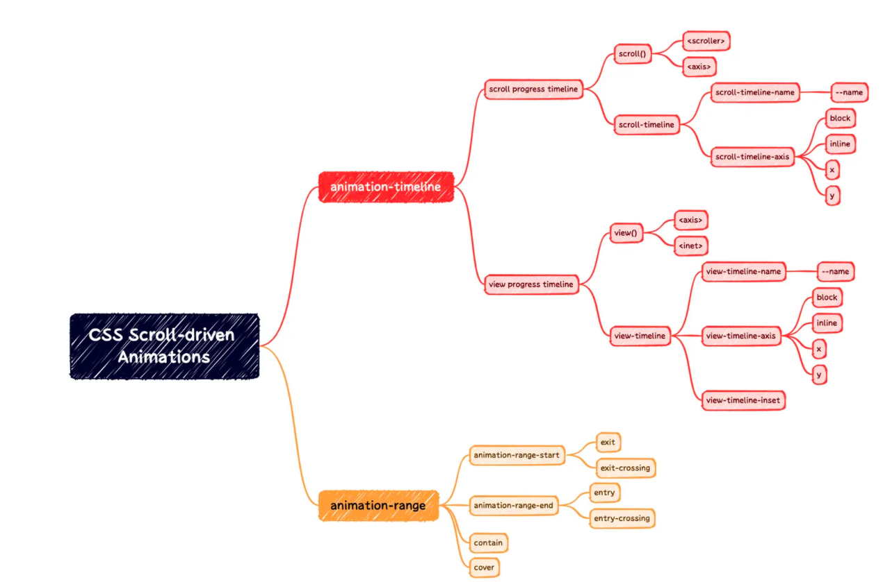
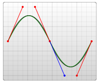
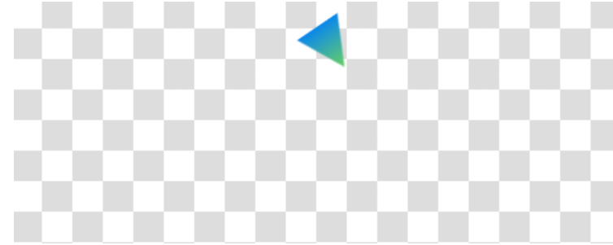

## 什么是滚动驱动动画（Scroll-driven Animations）？

OK，我们通过一个例子，快速上手（回忆）滚动驱动动画。

我们来实现这么一个滚动进度指示器效果：


注意看 GIF 图的上方，有一个黄色进度条，可以通过滚动，改变黄色进度条的进度状态。这个也就是我们说的滚动指示器效果。

在之前，这个效果利用纯 CSS 是不太好实现的，但是有了 animation-timeline 之后，一切都将变得非常轻松。

假设我们有如下结构：

```html
<div id="g-container">
  <h1>不可思议的纯 CSS 进度条效果</h1>
  <p>OK，继续....../p> // ...</p>
</div>
```

```css
body {
  overflow: scroll;
}
#g-container {
  width: 100vw;
}
```

其中，`#g-container` 有非常多的内容，其长度远远超过 `100vh`，也就是一个屏幕的高度。并且，`body` 是设置了 `overflow: scroll` 的。因此，整个页面是可以进行滚动的：

好，接下来，我们需要加上进度条，实现的方式有非常多种，这里我通过给 `#g-container` 添加一个伪元素，将进度条的效果设置给这个伪元素，代码也非常简单：

```css
#g-container::before {
  content: '';
  position: fixed;
  height: 7px;
  left: 0;
  top: 0;
  right: 0;
  background: #ffc107;
  animation: scale 3s linear infinite;
  transform-origin: 0 50%;
}

@keyframes scale {
  0% {
    transform: scaleX(0);
  }
  100% {
    transform: scaleX(1);
  }
}
```

这里，利用元素的缩放，从 `transform: scaleX(0)` 到 `transform: scaleX(1)` 的变化，实现了进度条的动画效果。

只不过，目前是一个无限动画，一次动画效果持续 3 秒 -- `animation: scale 3s linear infinite`：


好，铺垫到这里，接下来终于要轮到 [animation-timeline](https://developer.mozilla.org/en-US/docs/Web/CSS/animation-timeline) 登场了。

上述的动画效果，目前是由时间进行控制的，持续时长为 3s，而我们的目标，就是利用滚动的效果控制整个动画。

我们只需要简单的改造一下代码：

```css
#g-container::before {
  // ...
  animation: scale 3s linear;
  animation-timeline: scroll(root);
  transform-origin: 0 50%;
}
```

这里，我们仅仅加了一句 `animation-timeline: scroll(root)`，表示利用滚动进行元素的动画控制，并且利用的是 `root` 元素的滚动，也就是 body 元素的滚动进行控制。

这样，我们就轻松的实现了一个滚动指示器效果：

<iframe height="300" style="width: 100%;" scrolling="no" title="使用 scroll-animation  实现滚动指示器进度条" src="https://codepen.io/mafqla/embed/OJGGeJE?default-tab=html%2Cresult&editable=true&theme-id=light" frameborder="no" loading="lazy" allowtransparency="true" allowfullscreen="true">
  See the Pen <a href="https://codepen.io/mafqla/pen/OJGGeJE">
  使用 scroll-animation  实现滚动指示器进度条</a> by mafqla (<a href="https://codepen.io/mafqla">@mafqla</a>)
  on <a href="https://codepen.io">CodePen</a>.
</iframe>

当然，整个滚动驱动动画（Scroll-driven Animations）的内容还是非常多的，本文不对基础语法做过多展开，大家可以通过下面两个途径，进一步了解新语法：

1. MDN 文档 -- [animation-timeline](https://developer.mozilla.org/en-US/docs/Web/CSS/animation-timeline)
2. XboxYan 大佬的 [CSS 滚动驱动动画终于正式支持了~](https://juejin.cn/post/7259026189904805944)

借用 XboxYan 文章中的一幅图：



## motion-path 运动路径动画

好，到目前位置，我们都还在铺垫内容，本文的核心是**当路径动画遇到滚动驱动**。

什么是 CSS Motion Path 运动路径？利用这个规范规定的属性，我们**可以控制元素按照特定的路径进行位置变换的动画**。并且，这个路径可以是非常复杂的一条路径。

### 初窥 motion-path

CSS Motion Path 规范主要包含以下几个属性：

- `offset-path`：接收一个 SVG 路径（与 SVG 的 path、CSS 中的 clip-path 类似），指定运动的几何路径
- `offset-distance`：控制当前元素基于 `offset-path` 运动的距离
- `offset-position`：指定 `offset-path` 的初始位置
- `offset-anchor`：定义沿 `offset-path` 定位的元素的锚点。 这个也算好理解，运动的元素可能不是一个点，那么就需要指定元素中的哪个点附着在路径上进行运动
- `offset-rotate`：定义沿 `offset-path` 定位时元素的方向，说人话就是运动过程中元素的角度朝向

下面，我们使用 Motion Path 实现一个简单的直线位移动画。

```html
<div></div>
```

```css
div {
  width: 60px;
  height: 60px;
  background: linear-gradient(#fc0, #f0c);
  offset-path: path('M 0 0 L 100 100');
  offset-rotate: 0deg;
  animation: move 2000ms infinite alternate ease-in-out;
}
@keyframes move {
  0% {
    offset-distance: 0%;
  }
  100% {
    offset-distance: 100%;
  }
}
```

`offset-path` 接收一个 SVG 的 path 路径，这里我们的路径内容是一条自定义路径 `path("M 0 0 L 100 100")`，翻译过来就是从 `0 0` 点运动到 `100px 100px` 点。

> `offset-path` 接收一个 SVG 路径，指定运动的几何路径。与 SVG 的 path、CSS 中的 clip-path 类似，对于这个 SVG Path 还不太了解的可以戳这里先了解下 SVG 路径内容：[SVG 路径](https://developer.mozilla.org/zh-CN/docs/Web/SVG/Tutorial/Paths)

我们会得到如下结果：


通过控制元素的 `offset-distance` 从 `0%` 变化到 `100%` 进行元素的路径动画。

当然，上述的动画是最基本的，我可以充分利用 path 的特性，增加多个中间关键帧，稍微改造下上述代码：

```css
div {
    // 只改变运动路径，其他保持一致
    offset-path: path("M 0 0 L 100 0 L 200 0 L 300 100 L 400 0 L 500 100 L 600 0 L 700 100 L 800 0");
    animation: move 2000ms infinite alternate linear;
}
@keyframes move {
    0% {
        offset-distance: 0%;
    }
    100% {
        offset-distance: 100%;
    }
}
```

这里最主要还是运用了 path 中的 `L` 指令，得到了如下图这样一条直线路径：


最终的效果如下，与利用 `transform: translate()` 添加多个关键帧类似：

<iframe height="300" style="width: 100%;" scrolling="no" title="CSS Motion Path Demo" src="https://codepen.io/mafqla/embed/OJGGePw?default-tab=html%2Cresult&editable=true&theme-id=light" frameborder="no" loading="lazy" allowtransparency="true" allowfullscreen="true">
  See the Pen <a href="https://codepen.io/mafqla/pen/OJGGePw">
  CSS Motion Path Demo</a> by mafqla (<a href="https://codepen.io/mafqla">@mafqla</a>)
  on <a href="https://codepen.io">CodePen</a>.
</iframe>

### 曲线路径动画

上面的运动轨迹都是由直线构成，下面我们看看如何使用 CSS Motion Path 实现曲线路径动画。

其实原理还是一模一样，只需要在 `offset-path: path()` 中添加曲线相关的路径即可。

在 SVG 的 Path 中，我们取其中一种绘制曲线的方法 -- 贝塞尔曲线，譬如下述这条 path，其中的 path 为 `d="M 10 80 C 80 10, 130 10, 190 80 S 300 150, 360 80"`：

```html
<svg width="400" height="160" xmlns="http://www.w3.org/2000/svg">
  <path
    d="M 10 80 C 80 10, 130 10, 190 80 S 300 150, 360 80"
    stroke="black"
    fill="transparent"
  />
</svg>
```

对应这样一条连续的贝塞尔曲线：



将对应的路径应用在 `offset-path: path` 中：

```html
<div></div>
```

```css
div:nth-child(2) {
  width: 40px;
  height: 40px;
  background: linear-gradient(#fc0, #f0c);
  offset-path: path('M 10 80 C 80 10, 130 10, 190 80 S 300 150, 360 80');
}
@keyframes move {
  0% {
    offset-distance: 0%;
  }
  100% {
    offset-distance: 100%;
  }
}
```

可以得到如下运动效果：

<iframe height="300" style="width: 100%;" scrolling="no" title="CSS Motion Path Demo" src="https://codepen.io/mafqla/embed/zYXXVGr?default-tab=html%2Cresult&editable=true&theme-id=light" frameborder="no" loading="lazy" allowtransparency="true" allowfullscreen="true">
  See the Pen <a href="https://codepen.io/mafqla/pen/zYXXVGr">
  CSS Motion Path Demo</a> by mafqla (<a href="https://codepen.io/mafqla">@mafqla</a>)
  on <a href="https://codepen.io">CodePen</a>.
</iframe>

可以看到，元素是沿着贝塞尔曲线的路径进行运动的，并且，由于这次没有限制死 `offset-rotate`，元素的朝向也是跟随路径的朝向一直变化的。（可以联想成开车的时候，车头一直跟随道路会进行变化的，带动整个车身的角度变化）

## Amazing！路径动画配合滚动驱动

好，终于，到这里，你应该已经大致了解了什么是**路径动画 motion-path**，什么是**滚动驱动 scroll-driven**。

我们可以尝试把这两个东西组合在一起。

假设，我们有这么个 HTML 结构：

```html
<div class="g-container">
  <div class="ele"></div>
</div>
```

```css
body {
  width: 100%;
  height: 100%;
  background: conic-gradient(
    #fff,
    #fff 90deg,
    #ddd 90deg,
    #ddd 180deg,
    #fff 180deg,
    #fff 270deg,
    #ddd 270deg
  );
  background-size: 50px 50px;
}
.g-container {
  position: absolute;
  top: 0;
  left: 50%;
  transform: translate(-50%, 0);
  width: 700px;
  height: 2000px;
}
.ele {
  position: absolute;
  width: 40px;
  height: 40px;
  clip-path: polygon(0 0, 100% 50%, 0 100%);
  background: linear-gradient(270deg, #65d060, #0887ec);
}
```

简单解释一下：

1. 为了方便理解，我把 body 的背景设置成了格子背景
2. `.g-container` 是一个远比屏幕高度高的容器，方便整个页面进行滚动
3. `.ele` 是一个小三角形

目前，整个页面是这样的：



下面，我们给 `.ele`设置一个 `offset-path` 路径：

```css
.ele {
  position: absolute;
  width: 40px;
  height: 40px;
  clip-path: polygon(0 0, 100% 50%, 0 100%);
  background: linear-gradient(270deg, #65d060, #0887ec);
  offset-path: path('M 350 40 C 1000 1000, -350 1000, 350 1960');
  animation: move 4s linear infinite;
}

@keyframes move {
  0% {
    offset-distance: 0%;
  }
  50% {
    transform: scale(2.5);
  }
  100% {
    offset-distance: 100%;
  }
}
```

其中的核心就是 `offset-path: path("M 350 40 C 1000 1000, -350 1000, 350 1960")` 这里面，有一个利用 3 次贝塞尔曲线画出来的路径。

并且，我们给它加上了 `offset-distance: 0` 到 `offset-distance: 100%` 的动画效果，目前，整个效果是这样的：


可以看到，小三角形，按照特定的路径在进行运动。

为了更好的理解这个动画，我们可以利用 `SVG`，把这个运动的路径给画出来：

```html
<div class="g-container">
  <svg
    class="g-svg"
    width="400"
    height="160"
    xmlns="http://www.w3.org/2000/svg"
  >
    <path
      id="svgpath"
      d="M 350 40 C 1000 1000, -350 1000, 350 1960"
      stroke="black"
      fill="transparent"
    />
  </svg>
  <div class="ele"></div>
</div>
```

```css
.g-svg {
  position: absolute;
  top: 0;
  left: 50%;
  width: 700px;
  height: 2000px;
  transform: translate(-50%, 0);
}
#svgpath {
  stroke: #9bc9de;
  stroke-width: 3px;
  stroke-dasharray: 2108, 2108;
  animation: lineMove 4s linear;
}
@keyframes lineMove {
  0% {
    stroke-dashoffset: 2108;
  }
  100% {
    stroke-dashoffset: 0;
  }
}
```

我们利用 SVG 路径，成功的将运动的路径绘制了出来，并且，利用 `stroke-dasharray` 和 `stroke-dashoffset`，实现了一条线条动画，控制它和小三角形的 motion-path 动画保持一致。

> 要看懂 `stroke-dasharray` 和 `stroke-dashoffset` 实现的线条动画，可能需要翻阅：[【Web 动画】SVG 线条动画入门](https://www.cnblogs.com/coco1s/p/6225973.html)

这样，现在，我们就得到了这么一个动画效果：


到这里，其实还没有运用上滚动驱动，现在，我们把上述经由时间控制的动画效果，交给页面的滚动。

简单改造上述 CSS 代码：

```css
.ele {
    position: absolute;
    width: 40px;
    height: 40px;
    clip-path: polygon(0 0, 100% 50%, 0 100%);
    offset-path: path("M 350 40 C 1000 1000, -350 1000, 350 1960");
    background: linear-gradient(270deg, #65d060, #0887ec);
    animation: move 4s linear;
    animation-timeline: scroll(root);
}

#svgpath {
    stroke: #9bc9de;
    stroke-width: 3px;
    stroke-dasharray: 2108, 2108;
    animation: lineMove 4s linear;
    animation-timeline: scroll(root);
}
```

改动比较简单：

1. 去掉两个动画效果的 infinite 关键字
2. 添加上 `animation-timeline: scroll(root)`

此时，我们就可以利用页面的滚动，控制整个动画效果：

<iframe height="300" style="width: 100%;" scrolling="no" title="Scroll Driven &amp; motion path &amp;  SVG stroke-dasharray Demo" src="https://codepen.io/mafqla/embed/ZEZZdbE?default-tab=html%2Cresult&editable=true&theme-id=light" frameborder="no" loading="lazy" allowtransparency="true" allowfullscreen="true">
  See the Pen <a href="https://codepen.io/mafqla/pen/ZEZZdbE">
  Scroll Driven &amp; motion path &amp;  SVG stroke-dasharray Demo</a> by mafqla (<a href="https://codepen.io/mafqla">@mafqla</a>)
  on <a href="https://codepen.io">CodePen</a>.
</iframe>

在灵活掌握了上述内容后，我们就可以利用路径动画及滚动驱动创造出各种妙趣横生的动画效果！

下面是我综合利用各种技巧，实现的一个纯 CSS 滚动动画效果，感受一下：

<iframe height="300" style="width: 100%;" scrolling="no" title="CSS Scroll Driven" src="https://codepen.io/mafqla/embed/zYXXVvr?default-tab=html%2Cresult&editable=true&theme-id=light" frameborder="no" loading="lazy" allowtransparency="true" allowfullscreen="true">
  See the Pen <a href="https://codepen.io/mafqla/pen/zYXXVvr">
  CSS Scroll Driven</a> by mafqla (<a href="https://codepen.io/mafqla">@mafqla</a>)
  on <a href="https://codepen.io">CodePen</a>.
</iframe>
