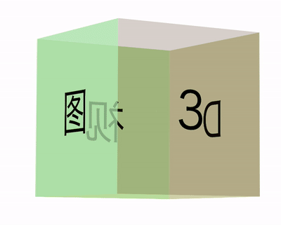
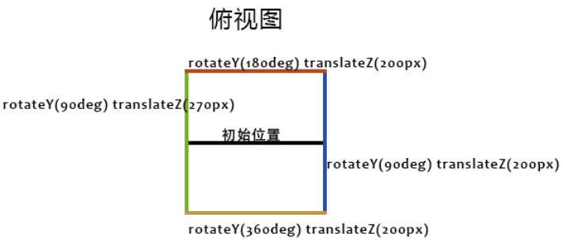

## 解动画效果

其实，上述的动画效果，本质就是一个 3D 立方体。

同时，3D 立方体上每个面存在颜色不一样的文字，文字和颜色都在随机变化。

也就是说，我们需要实现一个 3D 立方体：


同时，我们还需要实现这样一个动画效果 -- 文字和颜色都在随机变化的平面效果：


两者组合一下，再挪动 3D 元素的景深距离，就能实现我们想要的效果！

好，下面我们一个一个实现。

## 实现一个 3D 立方体

实现一个 3D 立方体，相对另外一个文字和颜色都在随机变化的平面效果而言，属于非常非常简单的一步了。

我们在非常多篇文章中也讲过具体的实现方式：

最常见的 3D 图形，莫过于一个 3D 立方体。

如果没有上下两个面，只是一个 4 个面的图形，大概是这样：



这样一个图形，利用 CSS 3D，如何快速实现呢？

首先，构造这么一个结构：

```html
<div class="perspective">
  <div class="container">
    <div class="img">3</div>
    <div class="img">D</div>
    <div class="img">视</div>
    <div class="img">图</div>
  </div>
</div>
```

4 个面，就是最内层的 4 个 `.img`，首先，需要给两个父容器，设置 3D 的属性：

```css
.perspective {
  perspective: 3000px;
}
.container {
  width: 400px;
  height: 400px;
  transform-style: preserve-3d;
}
```

简单解释一下：

1. `perspective` 可以作用于元素的后代，设置在最上层即可；
2. `transform-style: preserve-3d` 设置给最终需要 3D 空间的元素的父容器之上，由于最终是 4 个 `.img` 需要 3D 空间，因此设置给 `.container` 即可。

接下来，就是最为核心的，如何设置 4 个 `.img` 元素的 3D 变换，使之形成 3D 立方体。

技巧就是：**先旋转，再位移**。

这里给出一个俯视效果图：



以上述 Demo 中的正方体为例子，class 为 `.img` 的 div 块的高宽为 `400px*400px`。那么要利用 4 个 这样的 div 拼接成一个正方体，需要分别将 4 个 div 绕 Y 轴旋转 [90°, 180°, 270°, 360°]，再 `translateY(200px) `。

值得注意的是，**一定是先旋转角度，再偏移距离，这个顺序很重要**。

代码如下：

```scss
.img {
  position: absolute;
  top: 0;
  left: 0;
  width: 400px;
  height: 400px;
}
@for $i from 1 through $imgCount {
  .img:nth-child(#{$i}) {
    transform: rotateY(($i * 90deg)) translateZ(200px);
  }
}
```

效果如下：


此时，可能会觉得图片太太太大了，此时，我们可以通过给中间层 `.container` 设置一个恰当的 `translateZ` 进行视觉大小上的调节。

```
.container {
    transform: translateZ(-3000px);
}
```

这样，就能得到恰当大小的立方体元素效果：

<iframe height="300" style="width: 100%;" scrolling="no" title="3D Cube" src="https://codepen.io/mafqla/embed/RwOXjwR?default-tab=html%2Cresult&editable=true&theme-id=light" frameborder="no" loading="lazy" allowtransparency="true" allowfullscreen="true">
  See the Pen <a href="https://codepen.io/mafqla/pen/RwOXjwR">
  3D Cube</a> by mafqla (<a href="https://codepen.io/mafqla">@mafqla</a>)
  on <a href="https://codepen.io">CodePen</a>.
</iframe>

当然，对于我们这个效果，我们 5 要五个面（前后左右与上方即可），因此，我们基于上述的基础知识铺垫，重新实现一个我们需要的框架结构：

```html
<div class="perspective">
  <div class="container">
    <div class="g-panel"></div>
    <div class="g-panel"></div>
    <div class="g-panel"></div>
    <div class="g-panel"></div>
    <div class="g-panel"></div>
  </div>
</div>
```

并且，我们希望我们的图形是一个立方体，只需要稍微改造长宽和 `translateZ()` 的即可。这样，我们就能得到一个前后左右与上方 5 个面的立方体元素。

## 实现文字动画效果

OK，立方体我们先放在一边。

接下来，我们尝试来实现这个效果：


这个效果如果一个文字用一个 DIV 承载实现，那是非常容易的，**但是这样势必会造成元素过多，再设置动画效果，则会导致页面太为卡顿**。

所以，我们需要另辟蹊径。这里，我们可以使用**多层渐变配合 `background-clip: text`**。

首先，我们利用等宽字体，随机实现一列文字：

```html
<div>ABCDEFGHIJKLMN</div>
```

```css
div {
  font-family: monospace;
  text-align: center;
  font-size: 25px;
  width: 25px;
  line-height: 25px;
  color: #fff;
}
```

效果大致如下：

此时，如果我们再利用线性渐变，给每个字符的对应空间（也就 `25px x 25px`），设置上不同的颜色，大概是这样：

```scss
@function randomLinear($count) {
  $value: '';

  @for $i from 0 through ($count - 1) {
    $value: $value + randomColor() + string.unquote(' 0 #{$i * 25}px,');
  }

  @return linear-gradient(string.unquote(#{$value}) randomColor() 0 100%);
}
@function randomColor() {
  @return rgb(randomNum(255), randomNum(255), randomNum(255));
}
div {
  // ...
  background: randomLinear(14);
}
```

其中，`randomLinear(14)` 是一个 SASS 函数，参数 14 表示生成 14 层线性渐变，每一个文字区域的颜色都是随机的，经过编译后的其中一种结果如下：

```scss
div {
  // ...
  background: linear-gradient(
    #feea96 0 25px,
    #edde42 0 50px,
    #e2344a 0 75px,
    #cdab7e 0 100px,
    #e16c8b 0 125px,
    #dcdc7d 0 150px,
    #dcb42a 0 175px,
    #d6a587 0 200px,
    #984f71 0 225px,
    #221e34 0 250px,
    #5e9a69 0 275px,
    #a955e4 0 300px,
    #4e908f 0 325px,
    #8d177e 0 350px
  );
}
```

上面，我们按照每间隔 25px 的高度，利用线性渐变随机设置了一种颜色，最终，能够得到这么个效果：

此时，我们只需要再设置 `background-clip: text`，配合透明文字颜色 `color: transparent`，就可以实现单个 div 内，单列文字，每个字体的颜色都是不一样的：

```css
div {
  // ...
  background: randomLinear(14);
  background-clip: text;
  color: transparent;
}
```

当然，文字颜色可以随机，那么文字本身也应该随机。这个不难，我们也可以借助 SASS 函数，编写一个随机字符的函数，通过元素的伪元素 content 进行设置。

那么此时，完整的代码可能是这样的：

```html
<div></div>
```

```scss
$str: 'QWERTYUIOPASDFGHJKLZXCVBNMabcdefghigklmnopqrstuvwxyz123456789';
$length: str-length($str);

@function randomLinear($count) {
  $value: '';

  @for $i from 0 through ($count - 1) {
    $value: $value + randomColor() + string.unquote(' 0 #{$i * 25}px,');
  }

  @return linear-gradient(string.unquote(#{$value}) randomColor() 0 100%);
}
@function randomColor() {
  @return rgb(randomNum(255), randomNum(255), randomNum(255));
}
@function randomChar() {
  $r: random($length);
  @return str-slice($str, $r, $r);
}
@function randomChars($number) {
  $value: '';

  @if $number > 0 {
    @for $i from 1 through $number {
      $value: $value + randomChar();
    }
  }
  @return $value;
}

div {
  position: relative;
  width: 25px;
  height: 350px;

  &::before {
    content: randomChars(14);
    position: absolute;
    font-family: monospace;
    background: randomLinear(14);
    background-clip: text;
    color: transparent;
    text-align: center;
    font-size: 25px;
    width: 25px;
    line-height: 25px;
  }
}
```

这样，每次 div 内的文字，都是从上面 SASS 函数中 `$str` 变量中随机取的：

接下来，我们需要实现文字的随机跳变，也很好做，我们需要在一开始，随机生成多个不同的 content，然后，借助 CSS 动画，进行切换。

```scss
div {
  &::before {
    content: randomChars(14);
    --content1: '#{randomChars(14)}';
    --content2: '#{randomChars(14)}';
    --content3: '#{randomChars(14)}';
    --content4: '#{randomChars(14)}';
    animation: contentChange 1s infinite;
  }
}

@keyframes contentChange {
  20% {
    content: var(--content1);
  }
  40% {
    content: var(--content2);
  }
  60% {
    content: var(--content3);
  }
  80% {
    content: var(--content4);
  }
}
```

这里，我们一次生成了 5 个 content，其中 4 个用 CSS 变量保存了起来，随后，在 CSS 动画中，利用提前生成好的 content，进行字符内容的替换，

随机内容有了，单个字体颜色不一样有了，就差颜色的随机跳变动画了，这个也非常好做，我们在多篇文章也提及过，利用 `filter: hue-rotate()` 可以快速实现内容的颜色切换。

```scss
div {
  animation: colorChange 1s steps(12) infinite;
}
@keyframes colorChange {
  100% {
    filter: hue-rotate(360deg);
  }
}
```

我们利用了 `filter: hue-rotate()` 加上了步骤动画（steps），成功的实现了颜色的跳变！效果如下：

当然，我们最终要实现的是整个面随机颜色加上随机文字的跳变动画，只需要在上述的基础上，利用 SASS 函数，循环重复多列操作即可。基于上述所有内容的铺垫，我们最终的单个面下的动画效果代码如下：

```html
<div class="g-container">
  <div></div>
  // ... 一个 32 个子 div
  <div></div>
</div>
```

```scss
@use 'sass:string';

$str: 'QWERTYUIOPASDFGHJKLZXCVBNMabcdefghigklmnopqrstuvwxyz123456789';
$length: str-length($str);
$size: 25;
$count: 41;

@function randomNum($max, $min: 0, $u: 1) {
  @return ($min + random($max)) * $u;
}

@function randomLinear($count) {
  $value: '';

  @for $i from 0 through ($count - 1) {
    $value: $value + randomColor() + string.unquote(' 0 #{$i * 25}px,');
  }

  @return linear-gradient(string.unquote(#{$value}) randomColor() 0 100%);
}

@function randomColor() {
  @return rgb(randomNum(255), randomNum(255), randomNum(255));
}

@function randomChar() {
  $r: random($length);
  @return str-slice($str, $r, $r);
}

@function randomChars($number) {
  $value: '';

  @if $number > 0 {
    @for $i from 1 through $number {
      $value: $value + randomChar();
    }
  }
  @return $value;
}

body,
html {
  width: 100%;
  height: 100%;
  background: #000;
  font-family: monospace;
}

.g-container {
  position: relative;
  width: 800px;
  height: 800px;
  display: flex;
  animation: colorChange 1s steps(12) infinite;

  div {
    position: relative;
    width: #{$size}px;
    height: 800px;
    flex-shrink: 0;

    &::before {
      position: absolute;
      inset: 0;
      text-align: center;
      font-size: #{$size}px;
      width: #{$size}px;
      text-align: center;
      line-height: #{$size}px;
      color: transparent;
    }
  }

  @for $i from 1 to $count {
    div:nth-child(#{$i}) {
      &::before {
        content: randomChars(32);
        --content1: '#{randomChars(32)}';
        --content2: '#{randomChars(32)}';
        --content3: '#{randomChars(32)}';
        --content4: '#{randomChars(32)}';
        animation: contentChange 1s infinite;
        background: randomLinear(32);
        background-clip: text;
      }
    }
  }
}
@keyframes colorChange {
  100% {
    filter: hue-rotate(360deg);
  }
}
@keyframes contentChange {
  20% {
    content: var(--content1);
  }
  40% {
    content: var(--content2);
  }
  60% {
    content: var(--content3);
  }
  80% {
    content: var(--content4);
  }
}
```

这样，我们就成功的实现了单个平面下的，颜色随机，文字随机，且不断变化的动画效果：

<iframe height="300" style="width: 100%;" scrolling="no" title="Single Panel Random Text" src="https://codepen.io/mafqla/embed/wvZVPBq?default-tab=html%2Cresult&editable=true&theme-id=light" frameborder="no" loading="lazy" allowtransparency="true" allowfullscreen="true">
  See the Pen <a href="https://codepen.io/mafqla/pen/wvZVPBq">
  Single Panel Random Text</a> by mafqla (<a href="https://codepen.io/mafqla">@mafqla</a>)
  on <a href="https://codepen.io">CodePen</a>.
</iframe>

## 实现立体效果

有了上面的立方体和单个平面的效果，要实现立体效果就不难了。我们尝试将两者结合起来。

改造原有的立方体结构，大致改成如下形式：

```scss
.perspective
    .container
        .g-panel
            -for(var i=0; i<32; i++)
                div
        .g-panel
            -for(var i=0; i<32; i++)
                div
        .g-panel
            -for(var i=0; i<32; i++)
                div
        .g-panel
            -for(var i=0; i<32; i++)
                div
        .g-panel
            -for(var i=0; i<32; i++)
                div
```

上面采用了 PUG 模板引擎来简化代码，编译后的效果如下：

```html
<div class="perspective">
  <div class="container">
    <div class="g-panel">
      <div></div>
      // ... 32 个
      <div></div>
      <div class="g-panel">
        <div></div>
        // ... 32 个
        <div></div>
        <div class="g-panel">
          <div></div>
          // ... 32 个
          <div></div>
          <div class="g-panel">
            <div></div>
            // ... 32 个
            <div></div>
            <div class="g-panel">
              <div></div>
              // ... 32 个
              <div></div>
            </div>
          </div>
        </div>
      </div>
    </div>
  </div>
</div>
```

这里，我们只需要实现 5 个面的立方体即可（前后左右以及上方）。

每个 `.g-panel`，实现一个我们上面铺垫的单面文字跳变效果，这样，我们就能得到这么一个立体的 3D 立方体动画效果：

接下来，我们只需要稍加调试，通过控制 `perspective` 和 `transform: translateZ()` 控制视觉上的纵深，将画面的视角放置于整个立方体之中，即可得到这么个效果：

<iframe height="300" style="width: 100%;" scrolling="no" title="Cube Random Text" src="https://codepen.io/mafqla/embed/XWQvzJG?default-tab=html%2Cresult&editable=true&theme-id=light" frameborder="no" loading="lazy" allowtransparency="true" allowfullscreen="true">
  See the Pen <a href="https://codepen.io/mafqla/pen/XWQvzJG">
  Cube Random Text</a> by mafqla (<a href="https://codepen.io/mafqla">@mafqla</a>)
  on <a href="https://codepen.io">CodePen</a>.
</iframe>
