## 卡片的 3D 旋转跟随效果

这个交互效果主要有两个核心：

1. 借助了 CSS 3D 的能力
2. 元素的旋转需要和鼠标的移动相结合

我们的目标是实现这样一个动画效果：

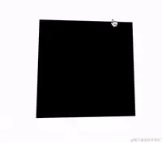

这里，我们其实有两个核心元素：

1. 鼠标活动区域
2. 旋转物体本身

鼠标在**鼠标活动区域**内的移动，会影响**旋转物体本身**的 3D 旋转，而旋转的方向其实可以被分解为 X 轴方向与 Y 轴方向。

我们来看一下，假设我们的 HTML 结构如下：

```HTML
<body>
    <div id="element"></div>
</body>
```

得到这样一个图形：

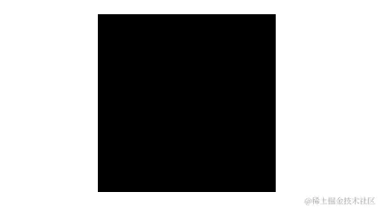

这里，`body` 的范围就是整个鼠标可活动区域，也是我们添加鼠标的 `mousemove` 事件的宿主 target，而 `#element` 就是需要跟随鼠标一起转动的旋转物体本身。

因为整个效果是需要基于 CSS 3D 的，我们首先加上简单的 CSS 3D 效果：

```CSS
body {
    width: 100vw;
    height: 100vh;
    transform-style: preserve-3d;
    perspective: 500px;
}

div {
    width: 200px;
    height: 200px;
    background: #000;
    transform-style: preserve-3d;
}
```

效果如下：


没有什么不一样。这是因为还没有添加任何的 3D 变换，我们给元素添加 X、Y 两个方向的 `rotate()` 试一下（注意，这里默认的旋转圆心即是元素中心）：

```CSS
div {
     transform: rotateX(15deg) rotateY(30deg);
}
```

效果如下，是有那么点意思了：

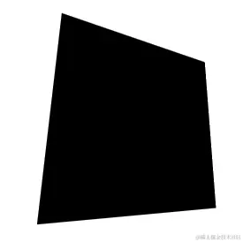

好，接下来，我们的目标就是通过结合 mouseover 事件，让元素动起来。

### 控制 X 方向的移动

当然，为了更加容易理解，我们把动画拆分为 X、Y 两个方向上的移动。首先看 X 方向上的移动：

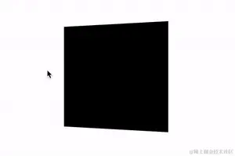

这里，我们需要以元素的中心为界：

1. 当鼠标在中心右侧连续移动，元素绕 Y 轴移动，并且值从 0 开始，越来越大，范围为(0, +∞)deg
2. 反之，当鼠标在中心左侧连续移动，元素绕 Y 轴移动，并且值从 0 开始，越来越小，范围为(-∞, 0)deg

这样，我们可以得到这样一个公式：

rotateY = (鼠标 x 坐标 - 元素左上角 x 坐标 - 元素宽度的一半)deg

通过绑定 onmousemove 事件，我们尝试一下：

```Javascript
const mouseOverContainer = document.getElementsByTagName("body")[0];
const element = document.getElementById("element");

mouseOverContainer.onmousemove = function(e) {
  let box = element.getBoundingClientRect();
  let calcY = e.clientX - box.x - (box.width / 2);

  element.style.transform  = "rotateY(" + calcY + "deg) ";
}
```

效果如下：

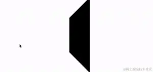

好吧，旋转的太夸张了，因此，我们需要加一个倍数进行控制：

```Javascript
const multiple = 20;
const mouseOverContainer = document.getElementsByTagName("body")[0];
const element = document.getElementById("element");

mouseOverContainer.onmousemove = function(e) {
  let box = element.getBoundingClientRect();
  let calcY = (e.clientX - box.x - (box.width / 2)) / multiple;

  element.style.transform  = "rotateY(" + calcY + "deg) ";
}
```

通过一个倍数约束后，效果好了不少：

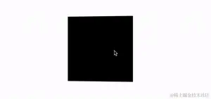

### 控制 Y 方向的移动

同理，我们利用上述的方式，同样可以控制 Y 方向上的移动：

```Javascript
const multiple = 20;
const mouseOverContainer = document.getElementsByTagName("body")[0];
const element = document.getElementById("element");

mouseOverContainer.onmousemove = function(e) {
  let box = element.getBoundingClientRect();
  let calcX = (e.clientY - box.y - (box.height / 2)) / multiple;

  element.style.transform  = "rotateX(" + calcX + "deg) ";
};
```

效果如下：

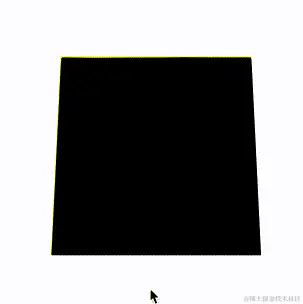

当然，在这里，我们会发现方向是元素运动的方向是反的，所以需要做一下取反处理，修改下 `calcX` 的值，乘以一个 `-1` 即可：

```javascript
let calcX = ((e.clientY - box.y - box.height / 2) / multiple) * -1
```

### 结合 X、Y 方向的移动

OK，到这里，我们只需要把上述的结果合并一下即可，同时，上面我们使用的是 `onmousemove` 触发每一次动画移动。现代 Web 动画中，我们更倾向于使用 `requestAnimationFrame` 去优化我们的动画，确保每一帧渲染一次动画即可。

完整的改造后的代码如下：

```Javascript
const multiple = 20;
const mouseOverContainer = document.getElementsByTagName("body")[0];
const element = document.getElementById("element");

function transformElement(x, y) {
  let box = element.getBoundingClientRect();
  let calcX = -(y - box.y - (box.height / 2)) / multiple;
  let calcY = (x - box.x - (box.width / 2)) / multiple;

  element.style.transform  = "rotateX("+ calcX +"deg) "
                        + "rotateY("+ calcY +"deg)";
}

mouseOverContainer.addEventListener('mousemove', (e) => {
  window.requestAnimationFrame(function(){
    transformElement(e.clientX, e.clientY);
  });
});
```

至此，我们就能简单的实现题图所示的鼠标跟随 3D 旋转动效：

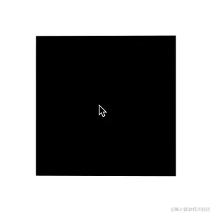

### 设置平滑出入

现在，还有最后一个问题，就是当我们的鼠标离开活动区域时，元素的 transform 将停留在最后一帧，正确的表现应该是复原到原状。因此，我们还需要添加一些事件监听做到元素的平滑复位。

通过一个 `mouseleave` 事件配合元素的 `transition` 即可。

```CSS
div {
    // 与上述保持一致...
    transition: all .2s;
}

```

```js
mouseOverContainer.addEventListener('mouseleave', e => {
  window.requestAnimationFrame(function () {
    element.style.transform = 'rotateX(0) rotateY(0)'
  })
})
```

至此，我们就可以完美的实现平滑出入，整体效果最终如下：

<iframe height="300" style="width: 100%;" scrolling="no" title="CSS 3D Rotate With Mouse Move" src="https://codepen.io/mafqla/embed/Exzjjgy?default-tab=html%2Cresult&editable=true&theme-id=light" frameborder="no" loading="lazy" allowtransparency="true" allowfullscreen="true">
  See the Pen <a href="https://codepen.io/mafqla/pen/Exzjjgy">
  CSS 3D Rotate With Mouse Move</a> by mafqla (<a href="https://codepen.io/mafqla">@mafqla</a>)
  on <a href="https://codepen.io">CodePen</a>.
</iframe>

## Hover 状态下的光泽变化

好，有了上述铺垫之后，我们就可以将黑色背景图，替换成实际的图片，得到这么一个初步效果：

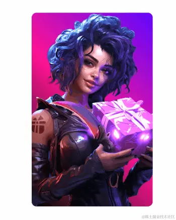

接下来，我们需要让卡片能够变得有光泽，并且也能基于鼠标 Hover 的坐标不同，展现出不一样的效果，像是这样：


怎么实现呢？看似复杂，其实只需要简单的利用混合模式即可。其中本质就是图片叠加上黑白相间的渐变，再调整混合模式，就能实现上述的高光效果。

代码如下：

```html
<div></div>
```

```scss
div {
  position: relative;
  background: url('image.png');

  &::before {
    content: '';
    position: absolute;
    inset: 0;
    background: linear-gradient(
                115deg, 
                transparent 0%, 
                rgba(255, 255, 255, 0.5 30%), 
                rgba(0, 0, 0, .5) 55%), 
                rgba(255, 255, 255, .5) 80%), 
                transparent 100%
            );
    mix-blend-mode: color-dodge;
  }
}
```

这里，我们利用 div 元素的背景展示了图片，利用元素的伪元素展示了黑白渐变效果，最终再叠加上混合模式 `mix-blend-mode: color-dodge`，示意图如下：

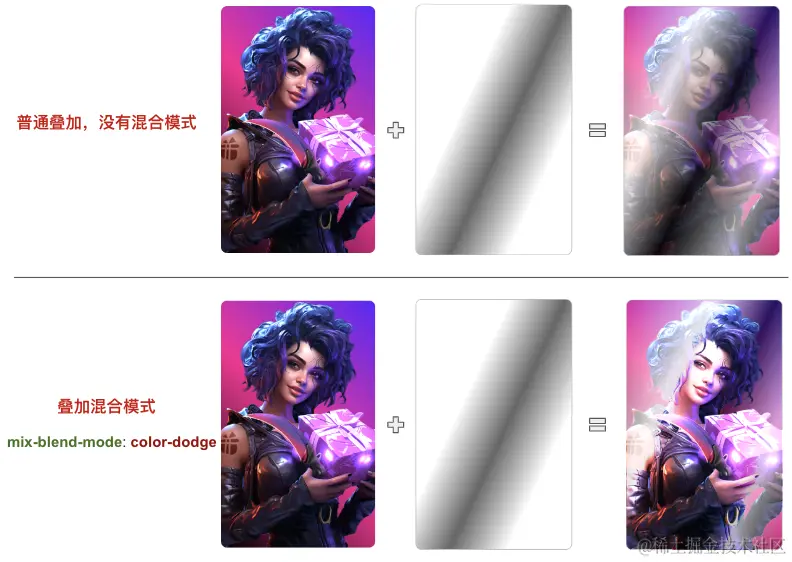

但是，此时，只有卡片是有 3D 效果的，叠加的黑白渐变层是不会随着 Hover 效果进行变化的：

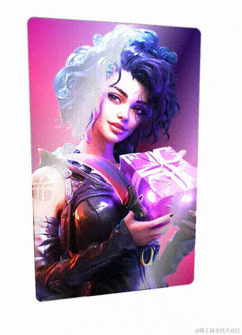

为了解决这个问题，我们需要让渐变图层也能受到 Hover 的动态影响，这个好做，我们额外引入一个 CSS 变量，基于鼠标当前 Hover 卡片时，距离卡片最左侧的横向距离，设置动态的 CSS 变量。

改造一下代码：

```html
<div id="g-img"></div>
```

```scss
div {
    --per: 30%;
    position: relative;
     // ...

    &::before {
        content: "";
        position: absolute;
        inset: 0;
        background:
            linear-gradient(
                115deg,
                transparent 0%,
                rgba(255, 255, 255, 0.5) var(--per),
                rgba(0, 0, 0, .5) calc(var(--per) + 25%),
                rgba(255, 255, 255, .5) calc(var(--per) + 50%),
                transparent 100%
            );
        mix-blend-mode: color-dodge;
    }
}
Javascript复制代码const multiple = 15;
const mouseOverContainer = document.getElementsByTagName("body")[0];
const element = document.getElementById("element");
const img = document.getElementById("g-img");

function transformElement(x, y) {
    let box = element.getBoundingClientRect();
    const calcX = -(y - box.y - box.height / 2) / multiple;
    const calcY = (x - box.x - box.width / 2) / multiple;
    const percentage = parseInt((x - box.x) / box.width * 1000) / 10;

    element.style.transform = "rotateX(" + calcX + "deg) " + "rotateY(" + calcY + "deg)";

    // 额外增加一个控制 --per 的变量写入
    img.style = `--per: ${percentage}%`;
}

mouseOverContainer.addEventListener("mousemove", (e) => {
    window.requestAnimationFrame(function () {
        transformElement(e.clientX, e.clientY);
    });
});
```

简单解释一下，上述代码最核心的部分就是引入了 `--per` CSS 变量，其应用在渐变代码中。

我们通过计算当前鼠标距离卡片左侧的横向距离，除以卡片整体的宽度，得到 `--per` 实际表示的百分比，再赋值给 `--per`，以此实现 Hover 时候的光效变化：


## 叠加星星闪烁效果

好，效果已经非常接近了。当然，总感觉缺少什么，我们可以在这一步，继续叠加上另外一层星星闪烁的效果。

这里，我们可以用现成的 GIF 图，像是这样（图片来源于 [Pokemon Card Holo Effect](https%3A%2F%2Fcodepen.io%2Fsimeydotme%2Fpen%2FPrQKgo)）：

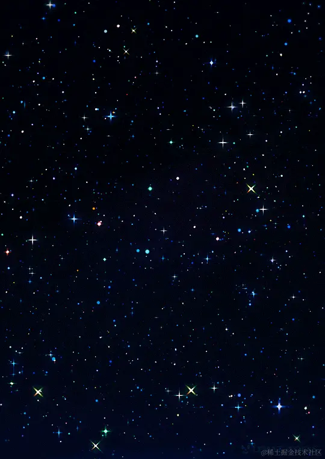

这样，我们的整个效果，其实就变成了这种叠加状态：

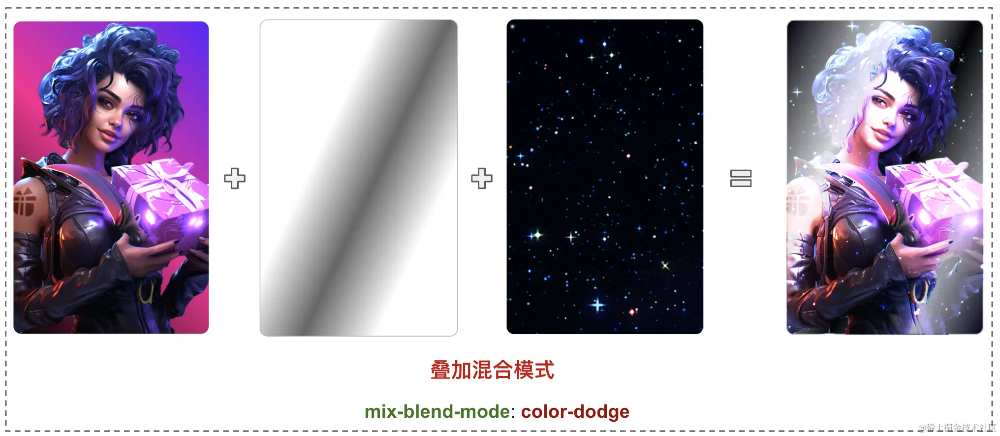

我们再简单改造一下代码：

```sCSS
#g-img {
    --per: 30%;
    position: relative;
    background: url('image.png');

    &::after {
        content: "";
        display: none;
        position: absolute;
        inset: 0;
        background: url("https://s3-us-west-2.amazonaws.com/s.cdpn.io/13471/sparkles.gif");
        mix-blend-mode: color-dodge;
    }

    &::before {
        content: "";
        display: none;
        position: absolute;
        background:
            linear-gradient(
                115deg,
                transparent 0%,
                rgba(255, 255, 255, 0.7) var(--per),
                rgba(0, 0, 0, .6) calc(var(--per) + 25%),
                rgba(255, 255, 255, .5) calc(var(--per) + 50%),
                transparent 100%
            );
        mix-blend-mode: color-dodge;
    }

    &:hover::after,
    &:hover::before {
        display: block;
    }
}
```

当 Hover 状态下，才展示渐变背景与星星 Gif 图的叠加效果，最终，我们就实现了最开头的效果：

<iframe height="300" style="width: 100%;" scrolling="no" title="CSS 3D Rotate With Mouse Move" src="https://codepen.io/mafqla/embed/eYaNNBp?default-tab=html%2Cresult&editable=true&theme-id=light" frameborder="no" loading="lazy" allowtransparency="true" allowfullscreen="true">
  See the Pen <a href="https://codepen.io/mafqla/pen/eYaNNBp">
  CSS 3D Rotate With Mouse Move</a> by mafqla (<a href="https://codepen.io/mafqla">@mafqla</a>)
  on <a href="https://codepen.io">CodePen</a>.
</iframe>

### 尝试不同渐变背景与不同混合模式

了解上述制作方式的全过程后，我们就可以改变叠加的混合模式与渐变背景，以创造更多不一样的效果。

像是这样：

<iframe height="300" style="width: 100%;" scrolling="no" title="CSS 3D Rotate With Mouse Move" src="https://codepen.io/mafqla/embed/abrOOBB?default-tab=html%2Cresult&editable=true&theme-id=light" frameborder="no" loading="lazy" allowtransparency="true" allowfullscreen="true">
  See the Pen <a href="https://codepen.io/mafqla/pen/abrOOBB">
  CSS 3D Rotate With Mouse Move</a> by mafqla (<a href="https://codepen.io/mafqla">@mafqla</a>)
  on <a href="https://codepen.io">CodePen</a>.
</iframe>

或者是这样：

<iframe height="300" style="width: 100%;" scrolling="no" title="CSS 3D Rotate With Mouse Move" src="https://codepen.io/mafqla/embed/qBGddqm?default-tab=html%2Cresult&editable=true&theme-id=light" frameborder="no" loading="lazy" allowtransparency="true" allowfullscreen="true">
  See the Pen <a href="https://codepen.io/mafqla/pen/qBGddqm">
  CSS 3D Rotate With Mouse Move</a> by mafqla (<a href="https://codepen.io/mafqla">@mafqla</a>)
  on <a href="https://codepen.io">CodePen</a>.
</iframe>
