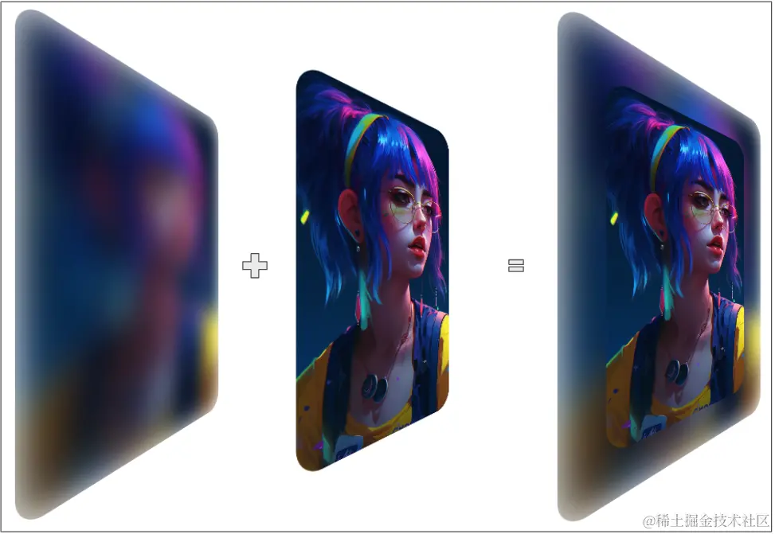
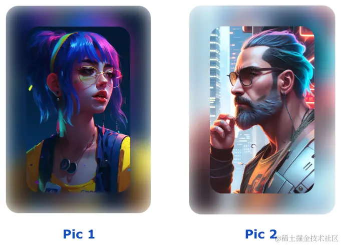
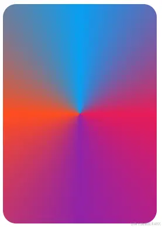
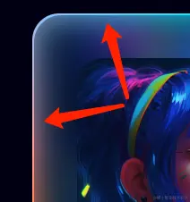
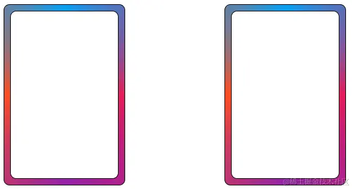
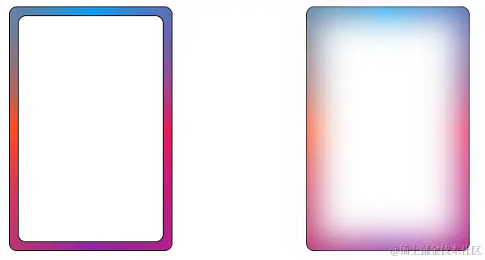
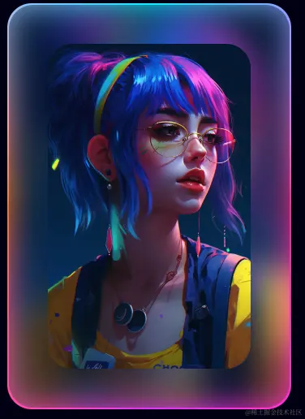
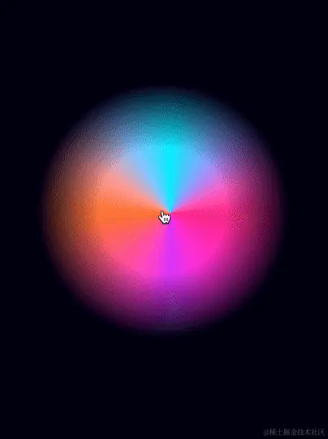
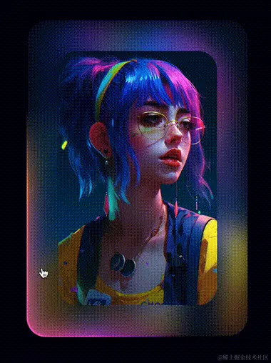

## 搭建整个静态效果

首先，我们需要搭建整个静态效果。也就是在没任何 hover 的状态下的效果，如下所示：


由于，每张图背后的虚化图效果，应该是基于图片不同而千图千面，因此，不可能能够用一张背景图 Cover 所有情况。

并且，图片背后的虚化图的效果，需要与实际图片的颜色保持大致一致。

基于上述两点，我们很容易想到使用 `filter: blur()` 模糊来处理此类情况。

代码也比较简单：

```html
<div></div>
```

```scss
:root {
  --pic: url('https://oss.aiyuzhou8.com/2023/05/08-.jpg');
}
div {
  position: relative;
  margin: auto;
  width: 350px;
  height: 500px;
  border-radius: 30px;
  overflow: hidden;

  &::before,
  &::after {
    content: '';
    position: absolute;
    background: var(--pic);
    background-size: cover;
    background-position: center;
    border-radius: 30px;
  }

  &::before {
    inset: 0;
    filter: blur(20px);
  }

  &::after {
    inset: 50px;
  }
}
```

这里，我们用元素的一层伪元素实现原图，另外一层伪元素实现虚化后的图片：



这种好处是，背后的虚化图层，可以适配任意的不同图片：



## 实现渐变色边框

接下来，我们需要实现渐变色的边框效果。

这个需要借助 `conic-gradient` 实现。

我们需要借助另外一个 div 实现我们的效果：

```html
<div></div>
```

```css
div {
  width: 350px;
  height: 500px;
  border-radius: 30px;
  background: conic-gradient(#03a9f4, #e91e63, #9c27b0, #ff5722, #03a9f4);
}
```

这样，我们就得到了一个这样的图形：



把它叠加到我们上述的效果之上，让整个图形，稍微比上述虚化背景大一点点即可，如此一来，效果就变成了这样：


仔细看，图片带上了渐变色的边框。

等等，再仔细看！除了渐变色边框之外，当前的效果，居然还自带了内发光（内阴影）效果，真是歪打正着，这不正是我们需要实现的吗：



### 探究 `filter: blur()` 的透明效果

这是为何呢？原因在于，设置了 `filter: blur()` 的元素，会从边缘处向中心处，带有透明衰减的效果。

我们简单来做个实验：

```html
<div></div>
<div></div>
```

```scss
div {
  position: relative;
  width: 200px;
  height: 300px;
  border-radius: 10px;
  border: 1px solid #000;
  background: conic-gradient(#03a9f4, #e91e63, #9c27b0, #ff5722, #03a9f4);

  &::before {
    content: '';
    position: absolute;
    inset: 10px;
    border-radius: 10px;
    background: #fff;
    border: 1px solid #000;
  }
}
```

我们设置了两个一模一样的 div，其中，元素本身设置了一个角向渐变背景。

接着，利用其伪元素，在元素中间相距边界 `10px` 的地方，设置一个背景为白色的元素。效果如下：



此时此刻，两个元素没有任何不一样。但是接下来，我们给第二个元素的伪元素，添加上一个 `filter: blur()` 高斯模糊效果：

```CSS
div:nth-child(2) {
    &::before {
        filter: blur(20px);
    }
}
```

此时，再看看效果：



在白色元素的边缘处，向内的方向，其实是有逐渐减弱的透明效果。

当然，由于高斯模糊还会产生向外扩散的效果，因此上述 DEMO 示意图看起来不是很清晰，我们可以通过多套一层容器，通过 `overflow: hidden` 阻止高斯模糊的向外扩散。

我们再调整一下布局：

```html
<div class="g-father">
  <div class="g-child"></div>
</div>
<div class="g-father">
  <div class="g-child"></div>
</div>
```

```scss
.g-father {
  position: relative;
  width: 200px;
  height: 300px;
  border-radius: 10px;
  border: 1px solid #000;
  background: conic-gradient(#03a9f4, #e91e63, #9c27b0, #ff5722, #03a9f4);

  .g-child {
    position: absolute;
    inset: 10px;
    border-radius: 10px;
    border: 1px solid #000;
    overflow: hidden;

    &::before {
      content: '';
      position: absolute;
      inset: 0;
      background: #fff;
      border-radius: 10px;
    }
  }
}

.g-father:nth-child(2) {
  .g-child::before {
    filter: blur(20px);
  }
}
```

此时，我们再看整个效果，设置了 `filter: blur()` 的元素，会从边缘处向中心处，带有透明衰减的效果就非常明显了：

<iframe height="300" style="width: 100%;" scrolling="no" title="filter: blur 透明效果示意" src="https://codepen.io/mafqla/embed/bGypWgo?default-tab=html%2Cresult&editable=true&theme-id=light" frameborder="no" loading="lazy" allowtransparency="true" allowfullscreen="true">
  See the Pen <a href="https://codepen.io/mafqla/pen/bGypWgo">
  filter: blur 透明效果示意</a> by mafqla (<a href="https://codepen.io/mafqla">@mafqla</a>)
  on <a href="https://codepen.io">CodePen</a>.
</iframe>

## 鼠标移动事件监听配合 mask，实现整体效果

好，到这里，我们已经成功得到了这么一个效果：



基于上述效果，我们最后要做的，就是最终实现这么个效果：


这里，我们会利用鼠标移动事件监听配合 mask 来实现。

由于我们上述的效果是分层实现的，其中边框和内发光层，其实是这么个背景效果：


我们要做的就是：

1. 利用 `radial-gradient()` 实现一个径向渐变 mask 遮罩；
2. 监听鼠标移动事件，移动 mask 遮罩的中心点；
3. 可以通过多设置一层，实现 Hover 时背景角向渐变元素才出现，鼠标离开元素区域，背景角向渐变元素消失；

大致代码如下：

```html
<div id="g-container">
  <div id="g-img"></div>
</div>
```

```scss
:root {
    --x: 0;
    --y: 0;
}
#g-container {
    position: relative;
    width: 350px;
    height: 500px;
    border-radius: 30px;
}
#g-img {
    position: absolute;
    inset: 0px;
    border-radius: 30px;
    background: conic-gradient(#03a9f4, #e91e63, #9c27b0, #ff5722, #03a9f4);
    mask: radial-gradient(
        circle at var(--x) var(--y),
        #000,
        #000,
        transparent,
        transparent,
        transparent
    );
}

```
```js
const container = document.getElementById("g-container");
const img = document.getElementById("g-img");

container.addEventListener("mousemove", (event) => {
    img.style.visibility = 'visible';

    const target = event.target;
    const rect = target.getBoundingClientRect();

    var offsetX = event.clientX - rect.left;
    var offsetY = event.clientY - rect.top;

    var percentX = (Math.min(Math.max(offsetX / rect.width, 0), 1) * 100).toFixed(2);
    var percentY = (Math.min(Math.max(offsetY / rect.height, 0), 1) * 100).toFixed(2);;

    console.log('X: ' + percentX + '%');
    console.log('Y: ' + percentY + '%');

    container.setAttribute('style', `--x: ${percentX}%;--y: ${percentY}%;`);

});

container.addEventListener("mouseout", (event) => {
    img.style.visibility = 'hidden';
});
```

在图形上方移动鼠标，我们可以得到这么一个效果：



好，将上述的前面两个图层也合并进来，这样，我们就最终完美的实现了我们想要的效果：



完整的代码散落在上方，就不重复贴影响阅读体验了，感兴趣的同学，可以戳这里获取完整 DEMO 效果及源码：

<iframe height="300" style="width: 100%;" scrolling="no" title="CSS 3D Rotate With Mouse Move DEMO" src="https://codepen.io/mafqla/embed/mdYPmWr?default-tab=html%2Cresult&editable=true&theme-id=light" frameborder="no" loading="lazy" allowtransparency="true" allowfullscreen="true">
  See the Pen <a href="https://codepen.io/mafqla/pen/mdYPmWr">
  CSS 3D Rotate With Mouse Move DEMO</a> by mafqla (<a href="https://codepen.io/mafqla">@mafqla</a>)
  on <a href="https://codepen.io">CodePen</a>.
</iframe>
