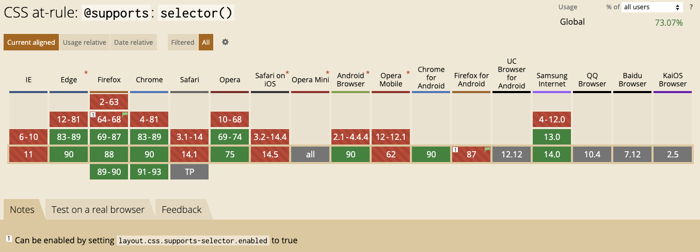
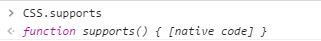
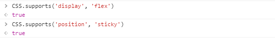
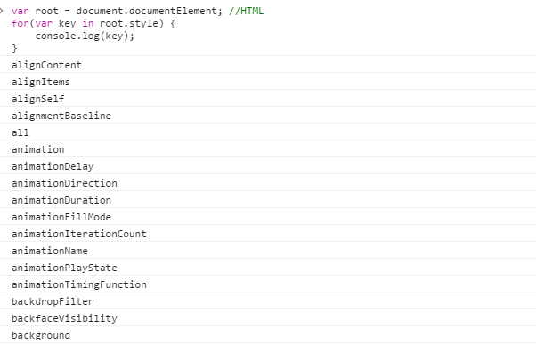
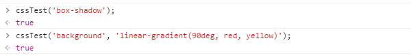

什么是 CSS 特性检测？我们知道，前端技术日新月异的今天，各种新技术新属性层出不穷。在 CSS 层面亦不例外。

一些新属性能极大提升用户体验以及减少工程师的工作量，并且在当下的前端氛围下：

- 很多实验性功能未成为标准却被大量使用；
- 需要兼容多终端，多浏览器，而各浏览器对某一新功能的实现表现的天差地别；

所以有了**优雅降级**和**渐进增强**的说法，在这种背景下，又想使用新的技术给用户提供更好的体验，又想做好回退机制保证低版本终端用户的基本体验，**CSS 特性检测**就应运而生了。

CSS 特性检测就是针对不同浏览器终端，判断当前浏览器对某个特性是否支持。运用 CSS 特性检测，我们可以在支持当前特性的浏览器环境下使用新的技术，而不支持的则做出某些回退机制。

本文将主要介绍两种 CSS 特性检测的方式：

1. **`@supports`**
2. **modernizr**

## CSS `@supports`

传统的 CSS 特性检测都是通过 javascript 实现的，但是未来，原生 CSS 即可实现。

CSS `@supports` 通过 CSS 语法来实现特性检测，并在内部 CSS 区块中写入如果特性检测通过希望实现的 CSS 语句。

#### 语法：

```css
@supports <supports_condition> {
  /* specific rules */
}
```

举个例子：

```css
div {
  position: fixed;
}

@supports (position: sticky) {
  div {
    position: sticky;
  }
}
```

上面的例子中，`position: sticky` 是 position 的一个新属性，用于实现黏性布局，可以轻松实现一些以往需要 javascript 才能实现的布局（[戳我了解详情](http://www.cnblogs.com/coco1s/p/6402723.html)），但是目前只有在 -webkit- 内核下才得到支持。

上面的写法，首先定义了 div 的 `position: fixed` ，紧接着下面一句 `@supports (position:sticky)` 则是特性检测括号内的内容，如果当前浏览器支持 `@supports` 语法，并且支持 `position:sticky` 语法，那么 div 的 则会被设置为 `position:sticky` 。

我们可以看到，`@supports` 语法的核心就在于这一句：`@supports (...) { }` ，括号内是一个 CSS 表达式，如果浏览器判断括号内的表达式合法，那么接下来就会去渲染括号内的 CSS 表达式。除了这种最常规的用法，还可以配合其他几个关键字：

## `@supports not` && `@supports and` && `@supports or`

### `@supports not` -- 非

not 操作符可以放在任何表达式的前面来产生一个新的表达式，新的表达式为原表达式的值的否定。看个例子：

```css
@supports not (background: linear-gradient(90deg, red, yellow)) {
  div {
    background: red;
  }
}
```

因为添加了 not 关键字，所以与上面第一个例子相反，这里如果检测到浏览器不支持线性渐变 `background: linear-gradient(90deg, red, yellow)` 的语法，则将 div 的颜色设置为红色 `background: red` 。

### `@supports and` -- 与

这个也好理解，多重判断，类似 javascript 的 `&&` 运算符符。用 and 操作符连接两个原始的表达式。只有两个原始表达式的值都为真，生成的表达式才为真，反之为假。

当然，and 可以连接任意多个表达式看个例子：

```css
p {
  overflow: hidden;
  text-overflow: ellipsis;
}
@supports (display: -webkit-box) and (-webkit-line-clamp: 2) and
  (-webkit-box-orient: vertical) {
  p {
    display: -webkit-box;
    -webkit-line-clamp: 2;
    -webkit-box-orient: vertical;
  }
}
```

上面同时，检测 `@supports (display:-webkit-box) and (-webkit-line-clamp:2) and (-webkit-box-orient:vertical)` 了三个语法，如果同时支持，则设定三个 CSS 规则。这三个语法必须同时得到浏览器的支持，如果表达式为真，则可以用于实现多行省略效果：

:::code-group

```html[html]
<p>测试多行省略测试多行省略测试多行省略测试法多行省略测试多行省略测试多行省略测试多行省略测试多行省略</p>

```

```css[css]
p {
    overflow : hidden;
	text-overflow: ellipsis;
}

@supports (display: -webkit-box) and (-webkit-line-clamp: 2) and (-webkit-box-orient: vertical) {
    p {
      	display: -webkit-box;
	    -webkit-line-clamp: 2;
	    -webkit-box-orient: vertical;
    }
}

p {
    width: 300px;
    padding: 0 5px;
    font-size: 16px;
    line-height: 2;
    margin: 10px auto;
    background: #ddd;
}

```

:::

### `@supports or` -- 或

理解了 `@supports and`，就很好理解 `@supports or` 了，与 javascript 的 `||` 运算符类似，表达式中只要有一个为真，则生成表达式表达式为真。

看例子：

```css
@supports (background: -webkit-linear-gradient(0deg, yellow, red)) or
  (background: linear-gradient(90deg, yellow, red)) {
  div {
    background: -webkit-linear-gradient(0deg, yellow, red);
    background: linear-gradient(90deg, yellow, red);
  }
}
```

上面的例子中，只有检测到浏览器支持 `background:-webkit-linear-gradient(0deg, yellow, red)` 或者（or） `background:linear-gradient(90deg, yellow, red)` 其中一个，则给 div 元素添加渐变。

:::code-group

```html[html]
<div></div>

```

```css[css]
div {
    margin: 10px auto;
    width: 200px;
    height: 200px;
    background: #fc0;
}

@supports (background:-webkit-linear-gradient(0deg, yellow, red)) or (background:linear-gradient(90deg, yellow, red)){
    div {
        background:-webkit-linear-gradient(0deg, yellow, red);
        background:linear-gradient(90deg, yellow, red)
    }
}
```

:::

当然，关键字 `not` 还可以和 `and` 或者 `or` 混合使用。感兴趣的可以尝试一下。

### Can i use？

兼容性来看，先看看 [Can i use(更新至 2021/05/13)](http://caniuse.com/#search=%40supports) 吧：



大部分浏览器都已经支持了，主要需要使用 polyfill 来兼容的是安卓 4.4 以下版本。

我们已经可以开始使用起来了，使用 `@supports` 实现渐进增强的效果。

> 渐进增强（progressive enhancement）：针对低版本浏览器进行构建页面，保证最基本的功能，然后再针对高级浏览器进行效果、交互等改进和追加功能达到更好的用户体验：

### CSS.supports()

谈到了 `@supports`，就有必要再说说 `CSS.supports()` 。

它是作为 `@supports` 的另一种形式出现的，我们可以使用 javascript 的方式来获得 CSS 属性的支持情况。

可以打开控制台，输入 `CSS.supports` 试试：



如果没有自己实现 CSS.supports 这个方法，输出上述信息，表示浏览器是支持 `@supports` 语法的，使用如下：

```
CSS.supports('display', 'flex')  // true
CSS.supports('position', 'sticky')  // true
```



那它有什么用呢？如果你的页面需要动态添加一些你不确定哪些浏览器支持的新的属性，那它也许会派上用场。以及，它可以配合我们下文即将要讲的 **modernizr** 。

## modernizr

上面介绍了 CSS 方式的特性检测，在以前，通常是使用 javascript 来进行特性检测的，其中 modernizr 就是其中最为出色的佼佼者。

modernizr（[戳我查看 Github](https://github.com/Modernizr/Modernizr) ）是一个开源的 javascript 库。有着将近 2W 的 star ，其优秀程度可见一斑。

简单看看使用方法，假设页面已经引用了 modernizr ，语法如下：

```css
// Listen to a test, give it a callback
Modernizr.on('testname', function( result ) {
  if (result) {
    console.log('The test passed!');
  }
  else {
    console.log('The test failed!');
  }
});

// 或者是类似 CSS.supports()
Modernizr.testAllProps('background', 'linear-gradient(90deg, #888, #ccc)');  // true
```

举个实际的例子，假设我们希望对是否支持渐变这个样式浏览器下的一个 div 区别对待，有如下 CSS：

```css
div {
  background: #aaa;
}

.linear-gradient div {
  background: linear-gradient(90deg, #888, #ccc);
}
```

使用 Modernizr 进行判断，如果支持渐变，则在根元素添加一个 `.linear-gradient` 样式，方便示例，使用了 jquery 语法：

```
if (Modernizr.testAllProps('background', 'linear-gradient(90deg, #888, #ccc)')) {
    $('html').addClass('linear-gradient');
}
```


:::code-group

```html[html]
<div></div>
```

```css[css]
div {
    width: 200px;
    height: 200px;
    margin: 10px auto;
	background: #aaa;
}

.linear-gradient div{
	background: linear-gradient(90deg, #888, #ccc);
}
```

```js[js]
if (Modernizr.testAllProps('background', 'linear-gradient(90deg, #888, #ccc)')) {
    $('html').addClass('linear-gradient');
}

// var root = document.documentElement;
// root.style.backgroundImage = 'linear-gradient(90deg, #888, #ccc)';

// if(root.style.backgroundImage) {
//   $('html').addClass('linear-gradient');
// }
```

:::

当然，Modernizr 还有很多其他的功能，可以去翻翻它的 API 。

## 特性检测原理

如果嫌引入整一个 Modernizr 库太大，页面又不支持 `@supports` ，其实我们自己用简单的 javascript 实现也非常方便简单。

想要知道浏览器支持多少 CSS 属性，可以在调试窗口试试：

```css
var root = document.documentElement; //HTML

for(var key in root.style) {
    console.log(key);
}
```



上面图片截取的只是打印出来的一小部分。如果我们要检测某个属性样式是否被支持，在任意的 element.style 检测它是否存在即可，即上面代码示例的 `root` 可以替换成任意元素。

当然，元素可能有 `background` 属性，但是不支持具体的 `linear-gradinet()` 属性值。这个时候该如何检测呢？只需要将具体的值赋值给某一元素，再查询这个属性值能否被读取。

```css
var root = document.documentElement;

root.style.backgroundImage = 'linear-gradient(90deg, #888, #ccc)';

if(root.style.backgroundImage) {
  // 支持
} else {
  // 不支持
}
```

所以上面 Modernizr 的例子里，javascript 代码可以改成：

```css
var root = document.documentElement;
root.style.backgroundImage = 'linear-gradient(90deg, #888, #ccc)';

if(root.style.backgroundImage) {
  $('html').addClass('linear-gradient');
}
```

当然，做这种特定属性值判断的时候由于有个 CSS 赋值操作，所以我们选取用于判断的元素应该是一个隐藏在页面上的元素。

## 各种方式间的优劣

- 原生的 `@supports` 的性能肯定是最好的，而且无需引入外部 javascript ，首推这个，但是无奈兼容问题，目前来看不是最好的选择。
- Modernizr 功能强大，兼容性好，但是需要引入外部 javascript，多一个 http 请求，如果只是进行几个特性检测，有点杀鸡用牛刀的感觉。
- 针对需要的特性检测，使用 javascript 实现一个简单的函数，再把上面用到的方法封装一下：

```css
/**
 * 用于简单的 CSS 特性检测
 * @param [String] property 需要检测的 CSS 属性名
 * @param [String] value 样式的具体属性值
 * @return [Boolean] 是否通过检查
 */
function cssTest(property, value) {
	// 用于测试的元素，隐藏在页面上
	var ele = document.getElementById('test-display-none');

	// 只有一个参数的情况
	if(arguments.length === 1) {
		if(property in ele.style) {
			return true;
		}
	// 两个参数的情况
	}else if(arguments.length === 2){
		ele.style[property] = value;

		if(ele.style[property]) {
			return true;
		}
	}

	return false;
}
```


