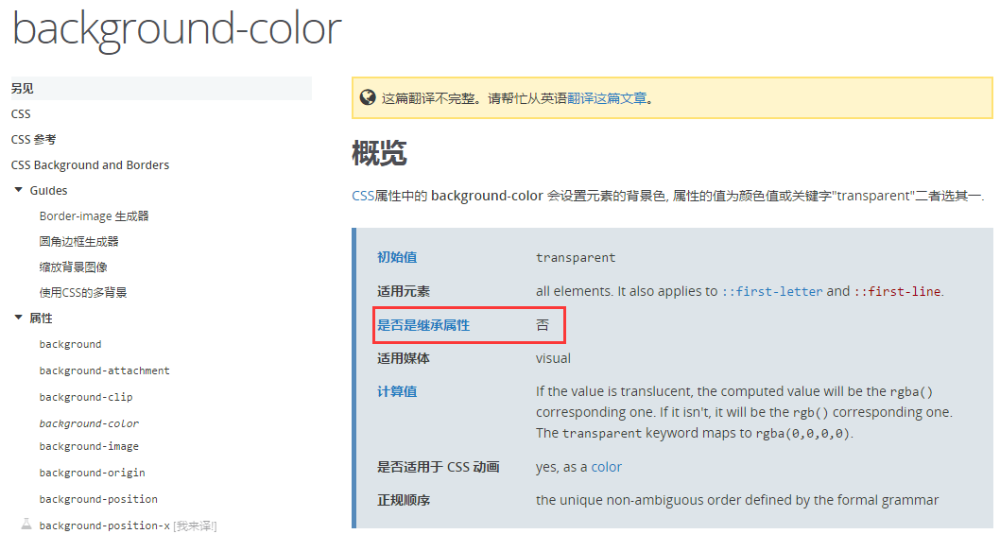
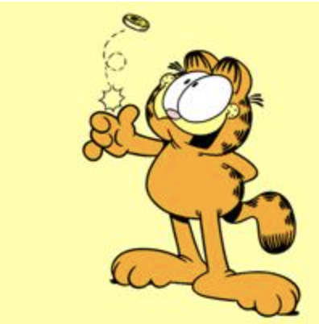
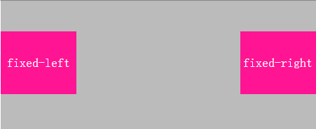
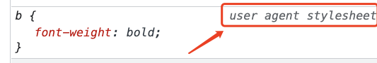
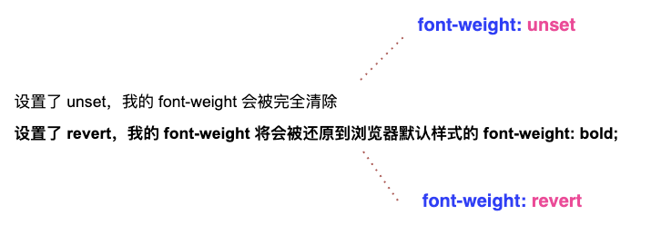

经常会碰到，问一个 CSS 属性，例如 `position` 有多少取值。

通常的回答是 `static`、`relative`、`absolute` 和 `fixed` 。当然，还有一个极少人了解的 `sticky` 。其实，除此之外， CSS 属性通常还可以设置下面几个值：

- `initial`
- `inherit`
- `unset`
- `revert`

```css
{
  position: initial;
  position: inherit;
  position: unset

  /* CSS Cascading and Inheritance Level 3 */
  position: revert;
}
```

了解 CSS 样式的 `initial`（默认）和 `inherit`（继承）以及更新的 `unset` 和 `revert` 是熟练使用 CSS 的关键。

## initial

`initial` 关键字用于设置 CSS 属性为它的默认值，可作用于任何 CSS 样式。（IE 不支持该关键字）

## inherit

每一个 CSS 属性都有一个特性就是，这个属性必然是默认继承的 (`inherited: Yes`) 或者是默认不继承的 (`inherited: no`)其中之一，我们可以在 [MDN](https://developer.mozilla.org/zh-CN/docs/Web/CSS/Reference) 上通过这个索引查找，判断一个属性的是否继承特性。

譬如，以 `background-color` 为例，由下图所示，表明它并不会继承父元素的 `background-color`:



### 可继承属性

最后罗列一下默认为 `inherited: Yes` 的属性：

- 所有元素可继承：visibility 和 cursor
- 内联元素可继承：letter-spacing、word-spacing、white-space、line-height、color、font、 font-family、font-size、font-style、font-variant、font-weight、text- decoration、text-transform、direction
- 块状元素可继承：text-indent 和 text-align
- 列表元素可继承：list-style、list-style-type、list-style-position、list-style-image
- 表格元素可继承：border-collapse

还有一些 inherit 的妙用可以看看这里：[谈谈一些有趣的 CSS 题目（四）-- 从倒影说起，谈谈 CSS 继承 inherit](http://www.cnblogs.com/coco1s/p/5908120.html)，合理的运用 inherit 可以让我们的 CSS 代码更加符合 DRY（Don‘’t Repeat Yourself ）原则。

这里简单举一个例子，利用 `inherit` 实现图片倒影功能。

### 利用 `inherit` 实现图片倒影功能

给定一张有如下背景图的 div：



制作如下的倒影效果：


方法很多，但是我们当然要寻找最快最便捷的方法，至少得是无论图片怎么变化，`div` 大小怎么变化，我们都不用去改我们的代码。

可以使用 `-webkit-box-reflect` 专门用于制作镜像图形，当然另外一种巧妙的方式就是使用 `inherit` 关键字。

我们对图片容器添加一个伪元素，使用 `background-image: inherit` 继承父值的背景图值，就可以做到无论图片如何变，我们的 CSS 代码都无需改动：

```css
div::after {
  content: '';
  position: absolute;
  top: 100%;
  left: 0;
  right: 0;
  bottom: -100%;
  background-image: inherit;
  transform: rotateX(180deg);
}
```

我们使用伪元素 `background-image: inherit;` 继承父元素的背景图，再使用 transform 旋转容器达到反射的效果，结果如下：


:::code-group

```html[html]
<div></div>
```

```css[css]
div {
  margin: 50px auto;
  width: 200px;
  height: 200px;
  background-image: url('./img/608782-20160926101029078-1479229145.jpg');
  position: relative;
}

div:before {
  content: '';
  background-image: inherit;
  position: absolute;
  top: 100%;
  left: 0;
  right: 0;
  bottom: -100%;
  transform: rotateX(180deg);
}

div:after {
  content: '';
  position: absolute;
  width: 200px;
  height: 200px;
  bottom: -200px;
  background: linear-gradient(
    0deg,
    rgba(255, 255, 255, 1) 0%,
    rgba(255, 255, 255, 0) 100%
  );
  z-index: 2;
}
```

:::

## unset

名如其意，`unset` 关键字我们可以简单理解为不设置。其实，它是关键字 `initial` 和 `inherit` 的组合。

什么意思呢？也就是当我们给一个 CSS 属性设置了 `unset` 的话：

1. 如果该属性是默认继承属性，该值等同于 `inherit`
2. 如果该属性是非继承属性，该值等同于 `initial`

举个例子，先列举一些 CSS 中默认继承父级样式的属性：

- 部分可继承样式: `font-size`, `font-family`, `color`, `text-indent`
- 部分不可继承样式: `border`, `padding`, `margin`, `width`, `height`

### 使用 `unset` 继承父级样式：

看看下面这个简单的结构：

```html
<div class="father">
  <div class="children">子级元素一</div>
  <div class="children unset">子级元素二</div>
</div>
```

```css
.father {
  color: red;
  border: 1px solid black;
}

.children {
  color: green;
  border: 1px solid blue;
}

.unset {
  color: unset;
  border: unset;
}
```

1. 由于 `color` 是可继承样式，设置了 `color: unset` 的元素，最终表现为了父级的颜色 `red`。
2. 由于 `border` 是不可继承样式，设置了 `border: unset` 的元素，最终表现为 `border: initial` ，也就是默认 border 样式，无边框。

<UnsetDemo />

## `unset` 的一些妙用

例如下面这种情况，在我们的页面上有两个结构类似的 `position: fixed` 定位元素。



区别是其中一个是 `top:0; left: 0;`，另一个是 `top:0; right: 0;`。其他样式相同。

假设样式结构如下：

```html
<div class="container">
  <div class="left">fixed-left</div>
  <div class="right">fixed-right</div>
</div>
```

通常而言，样式如下：

```css
.left,
.right {
  position: fixed;
  top: 0;
  ...;
}
.left {
  left: 0;
}
.right {
  right: 0;
}
```

使用 unset 的方法：

```css
.left,
.right {
  position: fixed;
  top: 0;
  left: 0;
  ...;
}
.right {
  left: unset;
  right: 0;
}
```

<UnsetDemo2 />
## revert

`revert` 是更为新的一个关键字。源自于 [CSS Cascading and Inheritance Level 3 (CSS Cascading 3)](https://drafts.csswg.org/css-cascade/#default)，直接意译的意思为 -- 恢复。

它与关键字 `unset` 非常类似，在大部分情况下，他们的作用是一模一样的！唯一的区别是：

- `revert`：属性应用了该值后，将还原到具有由浏览器或用户创建的自定义样式表（在浏览器侧设置）设置的值
- `unset`: 属性应用了该值后，样式将完全被还原

### `unset` 和 `revert` 的不同之处

可能有点绕，我们通过一个实际的 DEMO 看看 `unset` 和 `revert` 的异同：

```html
<div class="father">
  <b class="color unset">设置了 unset，我的 font-weight 会被完全清除</b>
  <br />
  <b class="color revert"
    >设置了 revert，我的 font-weight 将会被还原到浏览器默认样式的 font-weight:
    bold;</b
  >
</div>
```

```css
.unset {
  font-weight: unset;
}

.revert {
  font-weight: revert;
}
```

当然，这里有个前提，我当前测试的浏览器（Chrome 92.0.4515.107）对 `<b>` 标签，有设置默认的浏览器用户代理样式，会对它进行加粗处理：



上面的代码实际效果：



<UsetDemo3 />

总结一下，了解 CSS 样式的 `initial`（默认）和 `inherit`（继承）以及更为新的 `unset` 和 `revert` 是熟练使用 CSS 的关键。

虽然有点绕，但是熟练掌握之后，在很多小地方都有着妙用，灵活使用让你的代码更加精简。
