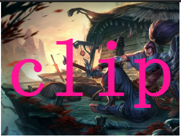
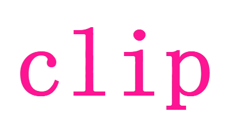
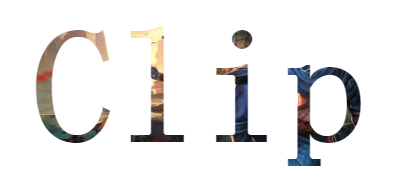

简单而言，`background-clip` 的作用就是**设置元素的背景（背景图片或颜色）的填充规则**。

与 `box-sizing` 的取值非常类似，通常而言，它有 3 个取值：

```css
 {
  background-clip: border-box; // 背景延伸到边框外沿（但是在边框之下）
  background-clip: padding-box; // 边框下面没有背景，即背景延伸到内边距外沿。
  background-clip: content-box; // 背景裁剪到内容区 (content-box) 外沿。
}
```

不过这些都不是本文的主角。本文的主角是 `background-clip: text;` ，当然现在只有 chrome 支持，所以通常想使用它，需要 `-webkit-background-clip:text;`。

## 何为 `-webkit-background-clip:text`

使用了这个属性的意思是，以区块内的文字作为裁剪区域向外裁剪，文字的背景即为区块的背景，文字之外的区域都将被裁剪掉。

看个最简单的 Demo ，没有使用 `-webkit-background-clip:text` :

```html
<div>Clip</div>

<style>
  div {
    font-size: 180px;
    font-weight: bold;
    color: deeppink;
    background: url($img) no-repeat center center;
    background-size: cover;
  }
</style>
```

效果如下：



### 使用 `-webkit-background-clip:text`

我们稍微改造下上面的代码，添加 `-webkit-background-clip:text`：

```css
div {
  font-size: 180px;
  font-weight: bold;
  color: deeppink;
  background: url($img) no-repeat center center;
  background-size: cover;
  -webkit-background-clip: text;
}
```

效果如下：



### 将文字设为透明 `color: transparent`

别急！当然还有更有意思的，上面由于文字设置了颜色，挡住了 div 块的背景，如果将文字设置为透明呢？文字是可以设置为透明的 `color: transparent` 。

```
div {
  color: transparent;
  -webkit-background-clip: text;
}
```

效果如下：



<iframe height="300" style="width: 100%;" scrolling="no" title="clip:text &amp;&amp; color: transparent" src="https://codepen.io/mafqla/embed/BabKJaz?default-tab=html%2Cresult" frameborder="no" loading="lazy" allowtransparency="true" allowfullscreen="true">
  See the Pen <a href="https://codepen.io/mafqla/pen/BabKJaz">
  clip:text &amp;&amp; color: transparent</a> by mafqla (<a href="https://codepen.io/mafqla">@mafqla</a>)
  on <a href="https://codepen.io">CodePen</a>.
</iframe>

通过将文字设置为透明，原本 div 的背景就显现出来了，而文字以为的区域全部被裁剪了，这就是 `-webkit-background-clip:text` 的作用。

## 嗨起来

了解了最基本的用法，接下来可以想想如何去运用这个元素制作一些效果。

1. 大大增强了文字的颜色填充选择
2. 文字颜色的动画效果
3. 配合其他元素，实现一些其他巧妙的用法

### 实现文字渐变效果

利用这个属性，我们可以十分便捷的实现文字的渐变色效果。

```html
<div>background-clip: text</div>
```

```css
div {
  font-size: 54px;
  color: transparent;
  background: linear-gradient(
    45deg,
    #ffeb3b,
    #009688,
    yellowgreen,
    pink,
    #03a9f4,
    #9c27b0,
    #8bc34a
  );
  background-clip: text;
  animation: huerotate 3s infinite;
}

@keyframes huerotate {
  100% {
    filter: hue-rotate(360deg);
  }
}
```

<iframe height="300" style="width: 100%;" scrolling="no" title="background-clip: text 文字渐变色" src="https://codepen.io/mafqla/embed/KKEzZKv?default-tab=html%2Cresult&editable=true&theme-id=light" frameborder="no" loading="lazy" allowtransparency="true" allowfullscreen="true">
  See the Pen <a href="https://codepen.io/mafqla/pen/KKEzZKv">
  background-clip: text 文字渐变色</a> by mafqla (<a href="https://codepen.io/mafqla">@mafqla</a>)
  on <a href="https://codepen.io">CodePen</a>.
</iframe>

### 背景渐变动画 && 文字裁剪

因为有用到 `background` 属性，回忆一下，我在上一篇 [巧妙地制作背景色渐变动画！](http://www.cnblogs.com/coco1s/p/6603403.html) 利用了**渐变** + **animation** 巧妙的实现了一些背景的渐变动画。可以很好的和本文的知识结合起来。

结合渐变动画，当然不一定需要过渡动画，这里我使用的是逐帧动画。配合 `-webkit-background-clip:text`，实现了一种，嗯，很红灯区的感觉：

```html
<div class="text">保健沐足按摩</div>
```

```css
.text {
  font-size: 80px;
  background: linear-gradient(
    90deg,
    red 0,
    orange 15%,
    yellow 30%,
    green 45%,
    teal 60%,
    blue 75%,
    purple 90%,
    purple 100%
  );
  background-clip: text;
  color: transparent;
  animation: changeColor 0.5s linear infinite alternate;
}

@keyframes changeColor {
  0% {
    background-image: linear-gradient(
      90deg,
      red 0,
      orange 15%,
      yellow 30%,
      green 45%,
      teal 60%,
      blue 75%,
      purple 90%,
      purple 100%
    );
  }
  50% {
    background-image: linear-gradient(
      90deg,
      deeppink 0,
      yellowgreen 15%,
      fuchsia 30%,
      lime 45%,
      olive 60%,
      aqua 75%,
      coral 90%,
      brown 100%
    );
  }
  100% {
    background-image: linear-gradient(
      -90deg,
      red 0,
      orange 15%,
      yellow 30%,
      green 45%,
      teal 60%,
      blue 75%,
      purple 90%,
      purple 100%
    );
  }
}
```

<iframe height="300" style="width: 100%;" scrolling="no" title="背景渐变动画 &amp;&amp; 文字裁剪" src="https://codepen.io/mafqla/embed/eYXZyYM?default-tab=html%2Cresult&editable=true&theme-id=light" frameborder="no" loading="lazy" allowtransparency="true" allowfullscreen="true">
  See the Pen <a href="https://codepen.io/mafqla/pen/eYXZyYM">
  背景渐变动画 &amp;&amp; 文字裁剪</a> by mafqla (<a href="https://codepen.io/mafqla">@mafqla</a>)
  on <a href="https://codepen.io">CodePen</a>.
</iframe>

### 给文字增加高光动画

利用 `background-clip`， 我们还可以轻松的给文字增加高光动画。

譬如这样：


其本质也是利用了 `background-clip`，伪代码如下：

```html
<p data-text="Lorem ipsum dolor">Lorem ipsum dolor</p>
```

```css
p {
  position: relative;
  color: transparent;
  background-color: #e8a95b;
  background-clip: text;
}
p::after {
  content: attr(data-text);
  position: absolute;
  left: 0;
  top: 0;
  width: 100%;
  height: 100%;
  background-image: linear-gradient(
    120deg,
    transparent 0%,
    transparent 6rem,
    white 11rem,
    transparent 11.15rem,
    transparent 15rem,
    rgba(255, 255, 255, 0.3) 20rem,
    transparent 25rem,
    transparent 27rem,
    rgba(255, 255, 255, 0.6) 32rem,
    white 33rem,
    rgba(255, 255, 255, 0.3) 33.15rem,
    transparent 38rem,
    transparent 40rem,
    rgba(255, 255, 255, 0.3) 45rem,
    transparent 50rem,
    transparent 100%
  );
  background-clip: text;
  background-size: 150% 100%;
  background-repeat: no-repeat;
  animation: shine 5s infinite linear;
}
@keyframes shine {
  0% {
    background-position: 50% 0;
  }
  100% {
    background-position: -190% 0;
  }
}
```

去掉伪元素的 `background-clip: text`，就能看懂原理：

<iframe height="300" style="width: 100%;" scrolling="no" title="Shine Text" src="https://codepen.io/mafqla/embed/gOEroba?default-tab=html%2Cresult&editable=true&theme-id=light" frameborder="no" loading="lazy" allowtransparency="true" allowfullscreen="true">
  See the Pen <a href="https://codepen.io/mafqla/pen/gOEroba">
  Shine Text</a> by mafqla (<a href="https://codepen.io/mafqla">@mafqla</a>)
  on <a href="https://codepen.io">CodePen</a>.
</iframe>

### 按钮填充效果

运用这个属性，我们可以给按钮实现这样一种遮罩填充动画(主要是用于防止文字闪烁)：

```html
<div class="btn">Btn</div>
```

```css
.btn {
  position: relative;
  color: deeppink;
  background-color: transparent;
  border: 3px solid deeppink;

  &::after {
    content: '';
    position: absolute;
    z-index: -1;
    top: 0;
    left: 50%;
    height: 100%;
    width: 0;
    background-color: deeppink;
    transition: width 0.5s, left 0.5s;
  }
  &:hover {
    color: white;
  }
  &:hover::after {
    top: 0;
    left: 0;
    width: 100%;
    transition: width 0.5s, left 0.5s;
  }
}

.btn {
  background-color: deeppink;
  background-image: linear-gradient(white, white);
  background-repeat: no-repeat;
  background-size: 0% 100%;
  background-position: center;
  -webkit-background-clip: text;
  -webkit-text-fill-color: transparent;
  transition: background-size 0.5s;

  &:hover {
    background-size: 100% 100%;
  }
}
```

效果如下：

<iframe height="300" style="width: 100%;" scrolling="no" title="background-clip:text &amp;&amp; 按钮填充效果" src="https://codepen.io/mafqla/embed/OJqNzPN?default-tab=html%2Cresult&editable=true&theme-id=light" frameborder="no" loading="lazy" allowtransparency="true" allowfullscreen="true">
  See the Pen <a href="https://codepen.io/mafqla/pen/OJqNzPN">
  background-clip:text &amp;&amp; 按钮填充效果</a> by mafqla (<a href="https://codepen.io/mafqla">@mafqla</a>)
  on <a href="https://codepen.io">CodePen</a>.
</iframe>

### 图片窥探效果

再演示其中一个用法，利用两个 div 层一起使用，设置相同的背景图片，父 div 层设置图片模糊，其中子 div 设置 `-webkit-background-clip:text`，然后利用 `animation` 移动子 div ，去窥探图片。简单的效果示意图：

<iframe height="300" style="width: 100%;" scrolling="no" title="background-clip: text 遮罩图片" src="https://codepen.io/mafqla/embed/bGZpaNB?default-tab=html%2Cresult&editable=true&theme-id=light" frameborder="no" loading="lazy" allowtransparency="true" allowfullscreen="true">
  See the Pen <a href="https://codepen.io/mafqla/pen/bGZpaNB">
  background-clip: text 遮罩图片</a> by mafqla (<a href="https://codepen.io/mafqla">@mafqla</a>)
  on <a href="https://codepen.io">CodePen</a>.
</iframe>
