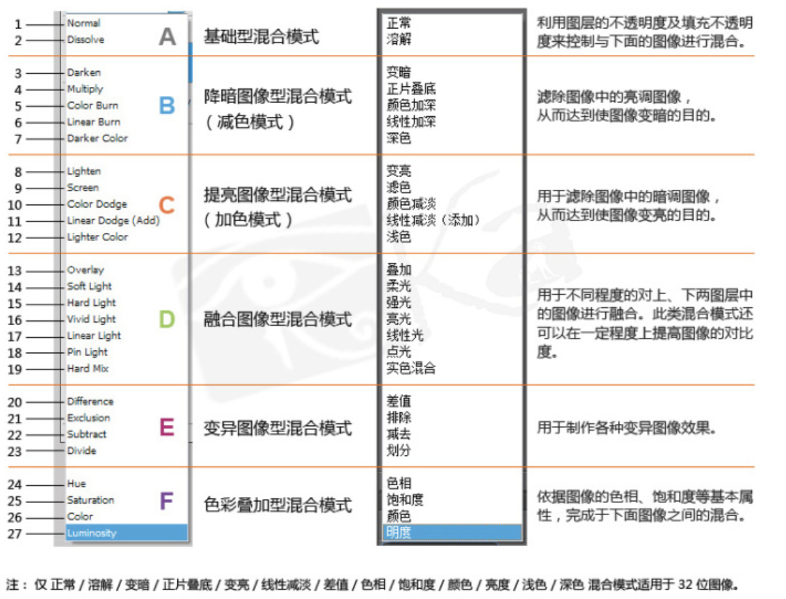

CSS3 新增了一个很有意思的属性 -- `mix-blend-mode` ，其中 mix 和 blend 的中文意译均为混合，那么这个属性的作用直译过来就是混合混合模式，当然，我们我们通常称之为**混合模式**。

混合模式最常见于 photoshop 中，是 PS 中十分强大的功能之一。当然，瞎用乱用混合模式谁都会，利用混合模式将多个图层混合得到一个新的效果，只是要用到恰到好处，或者说在 CSS 中利用混合模式制作出一些效果则需要对混合模式很深的理解及不断的尝试。

我个人对混合模式的理解也十分浅显，本文只是带领大家走进 CSS 混合模式的世界，初浅的了解混合模式及尝试使用它制作一些效果。

## `mix-blend-mode` 概述

上文也说了，`mix-blend-mode` 描述了元素的内容应该与元素的直系父元素的内容和元素的背景如何混合。我们将 PS 中图层的概念替换为 HTML 中的元素。

看看可取的值有哪些：

```css
{
  mix-blend-mode: normal;         // 正常
  mix-blend-mode: multiply;       // 正片叠底
  mix-blend-mode: screen;         // 滤色
  mix-blend-mode: overlay;        // 叠加
  mix-blend-mode: darken;         // 变暗
  mix-blend-mode: lighten;        // 变亮
  mix-blend-mode: color-dodge;    // 颜色减淡
  mix-blend-mode: color-burn;     // 颜色加深
  mix-blend-mode: hard-light;     // 强光
  mix-blend-mode: soft-light;     // 柔光
  mix-blend-mode: difference;     // 差值
  mix-blend-mode: exclusion;      // 排除
  mix-blend-mode: hue;            // 色相
  mix-blend-mode: saturation;     // 饱和度
  mix-blend-mode: color;          // 颜色
  mix-blend-mode: luminosity;     // 亮度
  
  mix-blend-mode: initial;
  mix-blend-mode: inherit;
  mix-blend-mode: unset;
}
```


除去 `initial` 默认、`inherit` 继承 和 `unset` 还原这 3 个所有 CSS 属性都可以取的值外，还有另外的 16 个具体的取值，对应不同的混合效果。

如果不是专业的 PSer 天天和混合模式打交道，想要记住这么多效果，还是挺困难的。不过有前人帮我们总结了一番，看看如何比较好的理解或者说记忆这些效果，摘自[Photoshop中高级进阶系列之一——图层混合模式原理](http://www.zcool.com.cn/article/ZMzcyNzY=.html)：

[

当然，上图是 PS 中的混合模式，数量比 CSS 中的多出几个，但是分类还是通用的。

## `mix-blend-mode` 实例

眼见为实，要会使用 `mix-blend-mode` ，关键还是要迈出使用这一步。这里我写了一个简单的 Demo，包括了所有的混合模式，可以大概试一下各个模式的效果：

<iframe height="300" style="width: 100%;" scrolling="no" title="mix-blend-mode 混合模式示例" src="https://codepen.io/mafqla/embed/gOEroPP?default-tab=html%2Cresult&editable=true&theme-id=light" frameborder="no" loading="lazy" allowtransparency="true" allowfullscreen="true">
  See the Pen <a href="https://codepen.io/mafqla/pen/gOEroPP">
  mix-blend-mode 混合模式示例</a> by mafqla (<a href="https://codepen.io/mafqla">@mafqla</a>)
  on <a href="https://codepen.io">CodePen</a>.
</iframe>

当然，仅仅是这样是感受不到混合模式的魅力的，下面就列举几个利用了混合模式制作的 CSS 动画。

### 使用 `mix-blend-mode: screen` 滤色模式制作 loading 效果


<iframe height="300" style="width: 100%;" scrolling="no" title="mix-blend-mode: screen" src="https://codepen.io/mafqla/embed/bGZpaEg?default-tab=html%2Cresult&editable=true&theme-id=light" frameborder="no" loading="lazy" allowtransparency="true" allowfullscreen="true">
  See the Pen <a href="https://codepen.io/mafqla/pen/bGZpaEg">
  mix-blend-mode: screen</a> by mafqla (<a href="https://codepen.io/mafqla">@mafqla</a>)
  on <a href="https://codepen.io">CodePen</a>.
</iframe>

这里使用了 `mix-blend-mode: screen` 滤色模式，这是一种提亮图像形混合模式。滤色的英文是 screen，也就是两个颜色同时投影到一个屏幕上的合成颜色。具体做法是把两个颜色都反相，相乘，然后再反相。简单记忆为"让白更白，而黑不变"。（不一定十分准确，如有错误还请指正）

我们将三个 div 按照不同延时(`animation-delay`)小幅度旋转起来，来达到一种很显眼很魔性的效果，适合做 loading 图。

### 使用 `mix-blend-mode: difference` 差值模式

再举个例子， `mix-blend-mode: difference` 差值模式。查看每个通道中的颜色信息，比较底色和绘图色，用较亮的像素点的像素值减去较暗的像素点的像素值。与白色混合将使底色反相；与黑色混合则不产生变化。

通俗一点就是上方图层的亮区将下方图层的颜色进行反相，暗区则将颜色正常显示出来，效果与原图像是完全相反的颜色。

看看利用了这个混合模式，运用在一些多图层效果里，可以产生十分绚烂的混合效果：

<iframe height="300" style="width: 100%;" scrolling="no" title="pureCssAnimation(webkit Only)" src="https://codepen.io/mafqla/embed/rNRepxr?default-tab=html%2Cresult&editable=true&theme-id=light" frameborder="no" loading="lazy" allowtransparency="true" allowfullscreen="true">
  See the Pen <a href="https://codepen.io/mafqla/pen/rNRepxr">
  pureCssAnimation(webkit Only)</a> by mafqla (<a href="https://codepen.io/mafqla">@mafqla</a>)
  on <a href="https://codepen.io">CodePen</a>.
</iframe>


上图看似复杂，其实了解原理之后非常的简单，6 个旋转的 div ，通过 `mix-blend-mode: difference` 混合在一起。

### 使用多混合模式制作文字故障效果

最后，想到我之前制作的一个文字故障效果，也可以很好的融合混合模式，制作出下列效果：

<iframe height="300" style="width: 100%;" scrolling="no" title="mixblendmode制作文字故障效果" src="https://codepen.io/mafqla/embed/yLwOpep?default-tab=html%2Cresult&editable=true&theme-id=light" frameborder="no" loading="lazy" allowtransparency="true" allowfullscreen="true">
  See the Pen <a href="https://codepen.io/mafqla/pen/yLwOpep">
  mixblendmode制作文字故障效果</a> by mafqla (<a href="https://codepen.io/mafqla">@mafqla</a>)
  on <a href="https://codepen.io">CodePen</a>.
</iframe>