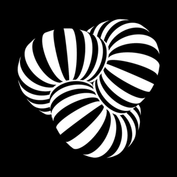
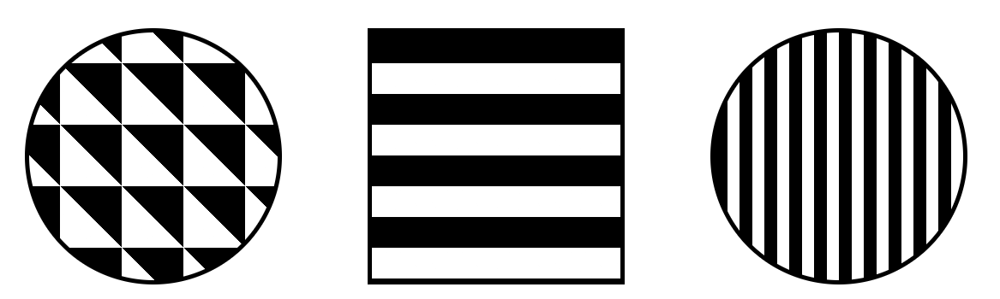

本文接前文：[不可思议的混合模式 mix-blend-mode](https://github.com/chokcoco/iCSS/issues/16) 。由于 `mix-blend-mode` 这个属性的强大，很多应用场景和动效的制作不断完善和被发掘出来，遂另起一文继续介绍一些使用 `mix-blend-mode` 制作的酷炫动画。

CSS3 新增了一个很有意思的属性 -- `mix-blend-mode` ，其中 mix 和 blend 的中文意译均为混合，那么这个属性的作用直译过来就是混合混合模式，当然，我们我们通常称之为**混合模式**。

混合模式最常见于 photoshop 中，是 PS 中十分强大的功能之一。当然，瞎用乱用混合模式谁都会，利用混合模式将多个图层混合得到一个新的效果，只是要用到恰到好处，或者说在 CSS 中利用混合模式制作出一些效果则需要对混合模式很深的理解及不断的尝试。

## mix-blend-mode 简介

关于 `mix-blend-mode` 最基本的用法和描述，可以简单看看上篇文章 [不可思议的混合模式 mix-blend-mode](https://github.com/chokcoco/iCSS/issues/16) 。

## background-blend-mode 简介

除了 `mix-blend-mode` ，CSS 还提供一个 `background-blend-mode` 。也就是背景的混合模式。

- 可以是背景图片与背景图片的混合，
- 也可以是背景图片和背景色的之间的混合。

`background-blend-mode` 的可用取值与 `mix-blend-mode`一样，不重复介绍，下面直接进入应用阶段。

## `background-blend-mode` 基础应用

对于 `background-blend-mode` ，最简单的应用就是将两个或者多个图片利用混合模式叠加在一起。假设我们存在下述两张图片，可以利用背景混合模式 `background-blend-mode` 叠加在一起：


经过背景混合模式 `background-blend-mode:lighten` 处理之后：


[CodePen Demo -- image mix by bg-blend-mode](https://codepen.io/Chokcoco/pen/OzWvNN)

当然，这里使用的是 `background-blend-mode:lighten` 变亮这个混合模式，核心代码如下：

```html
<div class="container"></div>
```


```css
.container {
    background: url($pic1), url($pic2);
    background-size: cover;
    background-blend-mode: lighten;
}
```


我们可以尝试其他的组合，也就是改变 `background-blend-mode` 的各种取值，将会得到各种不同的感官效果。

## 使用 `background-blend-mode: difference` 制作黑白反向动画

黑色白色这两种颜色，无疑是使用频率最高也是我认为最搭的两个颜色。当这两种颜色结合在一起，总是能碰撞出不一样的火花。

扯远了，借助 `difference` 差值混合模式，配合黑白 GIF，能产生奇妙的效果，假设我们拥有这样一张 GIF 图（图片来自网络，侵删）：



利用 `background-blend-mode: difference` ，将它叠加到不同的黑白背景之下（黑白背景由 CSS 画出来）：

产生的效果如下：

<iframe height="600" style="width: 100%;" scrolling="no" title="bg-blend-modes &amp;&amp; Black White GIF" src="https://codepen.io/mafqla/embed/xxBVpVM?default-tab=html%2Cresult&editable=true&theme-id=light" frameborder="no" loading="lazy" allowtransparency="true" allowfullscreen="true">
  See the Pen <a href="https://codepen.io/mafqla/pen/xxBVpVM">
  bg-blend-modes &amp;&amp; Black White GIF</a> by mafqla (<a href="https://codepen.io/mafqla">@mafqla</a>)
  on <a href="https://codepen.io">CodePen</a>.
</iframe>

我们可以尝试其他的组合，将会得到各种不同的感官效果。

## 使用 `background-blend-mode` 制作 hover 效果

想象一下，在上面第一个例子中，如果背景的黑白蒙层不是一开始就叠加在 GIF 图下，而是通过某些交互手段叠加上去。

应用这种方式，我们可以使用 `background-blend-mode` 来制作点击或者 hover 时候的蒙板效果。

假设我们有这样一张原图（黑白效果较好）：


通过混合渐变背景色，配合 Hover 效果，我们可以给这些图配上一些我们想要的色彩：

<iframe height="600" style="width: 100%;" scrolling="no" title="background-blend-mode &amp;&amp; Hover" src="https://codepen.io/mafqla/embed/vYPGpKE?default-tab=html%2Cresult&editable=true&theme-id=light" frameborder="no" loading="lazy" allowtransparency="true" allowfullscreen="true">
  See the Pen <a href="https://codepen.io/mafqla/pen/vYPGpKE">
  background-blend-mode &amp;&amp; Hover</a> by mafqla (<a href="https://codepen.io/mafqla">@mafqla</a>)
  on <a href="https://codepen.io">CodePen</a>.
</iframe>

代码非常简单，示意如下：

```css
.pic {
    width: 300px;
    height: 200px;
    background: url($img),
        linear-gradient(#f00, #00f);
    background-size: cover, 100% 100%;
    background-position: 0 0, -300px 0;
    background-blend-mode: luminosity;
    background-repeat: no-repeat;
    transition: .5s background-position linear;
}

.pic:hover { 
    background-position: 0 0, 0 0; 
}
```


这里有几点需要注意的：

- 这里使用了**背景色渐变动画**，[背景色的渐变动画](https://github.com/chokcoco/iCSS/issues/10)有几种方式实现（戳这里了解更多方法），这里使用的是位移 `background-position`
- 实现上述效果使用的 `background-blend-mode` 不限制具体某一种混合模式，可以自己多尝试

## 使用 mix-blend-mode || background-blend-mode 改变图标的颜色

如果再运用上上一篇文章介绍的知识 [两行 CSS 代码实现图片任意颜色赋色技术](https://github.com/chokcoco/iCSS/issues/32) ，我们可以实现 ICON 的颜色的动态改变。

假设我们有这样一张 ICON 图，注意**主色是黑色，底色的白色**（底色不是透明色），所以符合要求的 JPG、PNG、GIF 图都可以：


利用 `background-blend-mode: lighten` 可以实现动态改变图标主色的效果：

<iframe height="300" style="width: 100%;" scrolling="no" title="bg-blend-mode &amp;&amp; hover" src="https://codepen.io/mafqla/embed/bGZpaeq?default-tab=html%2Cresult&editable=true&theme-id=light" frameborder="no" loading="lazy" allowtransparency="true" allowfullscreen="true">
  See the Pen <a href="https://codepen.io/mafqla/pen/bGZpaeq">
  bg-blend-mode &amp;&amp; hover</a> by mafqla (<a href="https://codepen.io/mafqla">@mafqla</a>)
  on <a href="https://codepen.io">CodePen</a>.
</iframe>

而且这里的具体颜色（渐变、纯色皆可），动画方向都可以可以随意控制的。


又或者是这种 hover fadeIn 效果：

<iframe height="300" style="width: 100%;" scrolling="no" title="mix-blend-mode &amp;&amp; hover" src="https://codepen.io/mafqla/embed/QWoNaEM?default-tab=html%2Cresult&editable=true&theme-id=light" frameborder="no" loading="lazy" allowtransparency="true" allowfullscreen="true">
  See the Pen <a href="https://codepen.io/mafqla/pen/QWoNaEM">
  mix-blend-mode &amp;&amp; hover</a> by mafqla (<a href="https://codepen.io/mafqla">@mafqla</a>)
  on <a href="https://codepen.io">CodePen</a>.
</iframe>

## 使用 `mix-blend-mode` 制作文字背景图

我们将上面 ICON 这个场景延伸一下，ICON 图可以延伸为任意黑色主色白色底色图片，而颜色则可以是纯色、渐变色、或者是图片。

那么我们可以尝试让文字带上渐变色，或者说让文字透出图片。当然这个效果有一些 CSS 属性也可以完成。

譬如 `background-clip: text` 背景裁剪就可以让文字带上渐变色或者展示图片.

<iframe height="300" style="width: 100%;" scrolling="no" title="clip:text &amp;&amp; color: transparent" src="https://codepen.io/mafqla/embed/BabKJaz?default-tab=html%2Cresult&editable=true&theme-id=light" frameborder="no" loading="lazy" allowtransparency="true" allowfullscreen="true">
  See the Pen <a href="https://codepen.io/mafqla/pen/BabKJaz">
  clip:text &amp;&amp; color: transparent</a> by mafqla (<a href="https://codepen.io/mafqla">@mafqla</a>)
  on <a href="https://codepen.io">CodePen</a>.
</iframe>

这里我们使用 `mix-blend-mode` 也能够轻易实现，我们只需要构造出黑色文字，白色底色的文字 div ，叠加上图片，再运用 `mix-blend-mode` 即可，简单原理如下：


核心代码如下，可以看看：

```html
<div class="container">
    <div class="pic"></div>
    <div class="text">IMAGE</div>
</div>
```


```css
.pic {
    position: relative;
    width: 100%;
    height: 100%;
    background: url($img);
    background-repeat: no-repeat;
    background-size: cover;
}

.text {
    position: absolute;
    width:100%;
    height:100%;
    color: #000;
    mix-blend-mode: lighten;
    background-color: #fff;
}
```


<iframe height="600" style="width: 100%;" scrolling="no" title="mix-blend-mode &amp;&amp; TEXT IMAGE" src="https://codepen.io/mafqla/embed/RwdaxGP?default-tab=html%2Cresult&editable=true&theme-id=light" frameborder="no" loading="lazy" allowtransparency="true" allowfullscreen="true">
  See the Pen <a href="https://codepen.io/mafqla/pen/RwdaxGP">
  mix-blend-mode &amp;&amp; TEXT IMAGE</a> by mafqla (<a href="https://codepen.io/mafqla">@mafqla</a>)
  on <a href="https://codepen.io">CodePen</a>.
</iframe>