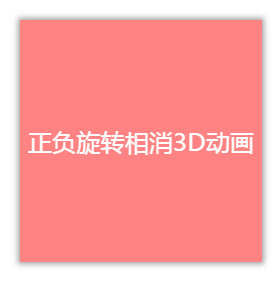
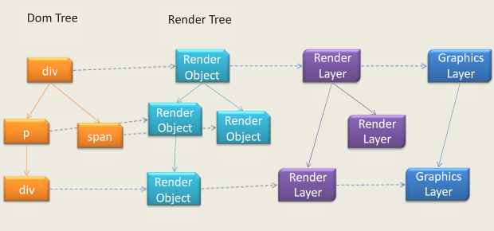
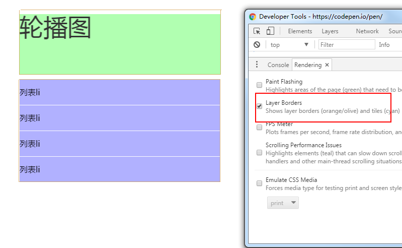
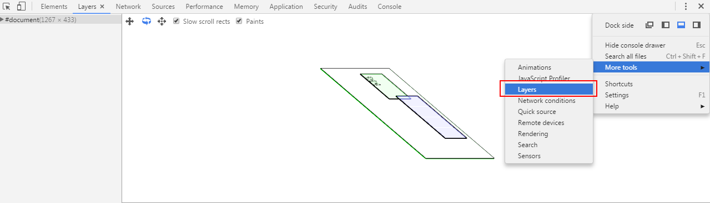
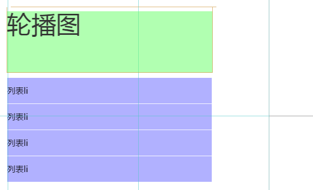

## 正负旋转相消


在动画中，旋转是非常常用的属性，

```css
{
  transform: rotate(90deg);
}
```


那旋转有一些什么高级点的技巧呢？当然是可以改变 `transfrom-origin` ，改变旋转中心点啦。


开个玩笑，改变旋转中心点这个估计大家都知道了，这里要介绍的技巧是利用父级元素正反两个方向的旋转，来制作一些酷炫的 3d 效果。

首先假设一下场景，我们有这样的一层 HTML 结构：

```html
<div class="reverseRotate">
    <div class="rotate">
        <div class="content">正负旋转相消3D动画</div>
    </div>
</div>
```


样式如下：



`.content` 内是我们的主要内容，好了，现在想象一下，如果祖先元素 `.rotate` 进行正向 linear 360° 旋转，父级元素 `.reverseRotate` 进行反向 linear 360° 旋转，效果回是啥样？

CSS 代码如下：

```css
.rotate {
    animation: rotate 5s linear infinite; 
}

.reverseRotate {
    animation: reverseRotate 5s linear infinite; 
}

@keyframes rotate {
    100% {
        transform: rotate(360deg);
    }
}

@keyframes reverseRotate {
    100% {
        transform: rotate(-360deg);
    }
}
```


神奇！因为一正一反的旋转，且缓动函数一样，所以整个 `content` 看上去依然是**静止的**！注意，这里整个 `content` 静止的非常重要。


别急！虽然看上去是静止的，但是其实祖先两个元素都是在旋转的！这会看上去风平浪静的效果底下其实是暗流涌动。用开发者工具选取最外层祖先元素是这样的：


既然如此，我们继续思考，如果我在其中旋转的一个祖先元素上，添加一些别的动画会是什么效果？想想就很刺激啊。

为了和文案里面的 3D 动画扯上关系，我们先给这几个元素添加 3D 转换：

```css
div {
    transform-style: preserve-3d;
    perspective: 500px;
}
```


接着，尝试修改上面的旋转动画，在内层旋转上额外添加一个 rotateX：

```css
@keyframes rotate {
    0% {
        transform: rotateX(0deg) rotateZ(0deg);
    }
    50% {
        transform: rotateX(40deg) rotateZ(180deg);
    }
    100% {
        transform: rotateX(0deg) rotateZ(360deg);
    }
}
```


效果如下：

<iframe height="300" style="width: 100%;" scrolling="no" title="Css动画正负旋转相消" src="https://codepen.io/mafqla/embed/xxBVQbL?default-tab=html%2Cresult&editable=true&theme-id=light" frameborder="no" loading="lazy" allowtransparency="true" allowfullscreen="true">
  See the Pen <a href="https://codepen.io/mafqla/pen/xxBVQbL">
  Css动画正负旋转相消</a> by mafqla (<a href="https://codepen.io/mafqla">@mafqla</a>)
  on <a href="https://codepen.io">CodePen</a>.
</iframe>


Wow，这里需要好好理解一下。由于内容 `content` 层是静止的但其实外层两个图层都在旋转，通过设置额外的 `rotateX(40deg)` ，相当于叠加多了一个动画，由于正反旋转抵消了，所有整个动画只能看到旋转的 `rotateX(40deg)` 这个动画，产生了上述的效果。


## 动画相同，缓动不同

好的，继续下一个小技巧。

有的时候我们页面存在一些具有相同动画的元素，为了让动画不那么死板，我们可以给相同的动画，赋予不同的缓动函数，来达到动画效果。

假设我们有如下的结构：

```html
<div class="container">
    <div class="ball ball1"></div>
    <div class="ball ball2"></div>
    <div class="ball ball3"></div>
</div>
```


样式如下：


我们给它们相同的动画，但是赋予不一样的缓动函数（animation-timing-function），就像这样：

```css
.ball1 {
    animation: move 1s ease-in infinite alternate;
}

.ball2 {
    animation: move 1s linear infinite alternate;
}

.ball3 {
    animation: move 1s ease-out infinite alternate;
}

@keyframes move {
    100% {
        transform: translateY(5vw);
    }
}
```


这样，一个简单的 loading 效果就制作好了。（当然这个技巧比较简单，学会合理运用是关键）


<iframe height="300" style="width: 100%;" scrolling="no" title="动画相同，缓动不同" src="https://codepen.io/mafqla/embed/yLwOQNe?default-tab=html%2Cresult&editable=true&theme-id=light" frameborder="no" loading="lazy" allowtransparency="true" allowfullscreen="true">
  See the Pen <a href="https://codepen.io/mafqla/pen/yLwOQNe">
  动画相同，缓动不同</a> by mafqla (<a href="https://codepen.io/mafqla">@mafqla</a>)
  on <a href="https://codepen.io">CodePen</a>.
</iframe>


### 奇妙的缓动

缓动函数 timing-function 在动画中占据了非常重要的地位。

当你不想使用 CSS 默认提供的 `linear`、`ease-in`、`ease-out` 之类缓动函数的，可以自定义 `cubic-bezier(1, 1, 0, 0)`，这里有个非常好用的工具推荐，下面这个网站，可以方便的调出你需要的缓动函数并且拿到对应的 cubic-bezier 。

[cubic-bezier.com](http://cubic-bezier.com/#.17,.67,.83,.67)

## 过渡取消

我们在制作页面的时候，为了让页面更加有交互感，会给按钮，阴影，颜色等样式添加过渡效果，配合 hover 一起使用。

这个是常规思维，如果我们的元素一开始是没有过渡效果，只有 hover 上去才给它添加一个过渡，又或者一开始元素是有过渡效果的，当我们 hover 上去时，取消它的过渡，会碰撞出什么样的火花呢？

使用这个技巧（也许算不上技巧，纯粹好玩），我们可以制作出一些有趣的效果，例如下面这个感觉是利用就 JS 才完成的动画，其实是纯 CSS 动画：


<iframe height="300" style="width: 100%;" scrolling="no" title="cancle  transition " src="https://codepen.io/mafqla/embed/oNVxQXE?default-tab=html%2Cresult&editable=true&theme-id=light" frameborder="no" loading="lazy" allowtransparency="true" allowfullscreen="true">
  See the Pen <a href="https://codepen.io/mafqla/pen/oNVxQXE">
  cancle  transition </a> by mafqla (<a href="https://codepen.io/mafqla">@mafqla</a>)
  on <a href="https://codepen.io">CodePen</a>.
</iframe>


其实就小圆圈是元素默认是带有 `transition` 的，只有在 hover 上去的时候，取消它的过渡，简单的过程：

1. 由于一开始它的颜色的透明的，而 hover 的时候会赋予它颜色值，但是由于 hover 时过渡被取消了，所有它会直接显示。
2. hover 离开的时候，它的原本的过渡又回来了，这个时候它会从有颜色到透明值缓慢渐变消失。

可以戳这里感受一下：

## 动画层级的控制，保持动画层级在最上方

这个问题可能有一点难理解。需要了解 CSS 动画渲染优化的相关知识。

先说结论，动画层级的控制的意思是**尽量让需要进行 CSS 动画的元素的 `z-index` 保持在页面最上方，避免浏览器创建不必要的图形层（GraphicsLayer）**，能够很好的提升渲染性能。

OK，再一次提到了图形层（GraphicsLayer），这是一个浏览器渲染原理相关的知识（WebKit/blink内核下）。



简单来说，浏览器为了提升动画的性能，为了在动画的每一帧的过程中不必每次都重新绘制整个页面。在特定方式下可以触发生成一个合成层，合成层拥有单独的 GraphicsLayer。

需要进行动画的元素包含在这个合成层之下，这样动画的每一帧只需要去重新绘制这个 Graphics Layer 即可，从而达到提升动画性能的目的。

那么一个元素什么时候会触发创建一个 Graphics Layer 层？从目前来说，满足以下任意情况便会创建层：

- 硬件加速的 iframe 元素（比如 iframe 嵌入的页面中有合成层）
- 硬件加速的插件，比如 flash 等等
- 使用加速视频解码的
- 3D 或者 硬件加速的 2D Canvas 元素
- 3D 或透视变换(perspective、transform) 的 CSS 属性
- 对自己的 opacity 做 CSS 动画或使用一个动画变换的元素
- 拥有加速 CSS 过滤器的元素
- 元素有一个包含复合层的后代节点(换句话说，就是一个元素拥有一个子元素，该子元素在自己的层里)
- 元素有一个 z-index 较低且包含一个复合层的兄弟元素

本题中说到的动画层级的控制，原因就在于上面生成层的最后一条：

> 元素有一个 z-index 较低且包含一个复合层的兄弟元素。

这里是存在坑的地方，首先我们要明确两点：

1. 我们希望我们的动画得到 GPU 硬件加速，所以我们会利用类似 `transform: translate3d()` 这样的方式生成一个 Graphics Layer 层。
2. Graphics Layer 虽好，但不是越多越好，每一帧的渲染内核都会去遍历计算当前所有的 Graphics Layer ，并计算他们下一帧的重绘区域，所以过量的 Graphics Layer 计算也会给渲染造成性能影响。

记住这两点之后，回到上面我们说的坑。

假设我们有一个轮播图，有一个 ul 列表，结构如下：

```html
<div class="container">
    <div class="swiper">轮播图</div>
    <ul class="list">
        <li>列表li</li>
        <li>列表li</li>
        <li>列表li</li>
        <li>列表li</li>
    </ul>
</div>
```


假设给他们定义如下 CSS：

```css
.swiper {
    position: static;
    animation: 10s move infinite;
}
    
.list {
    position: relative;
}

@keyframes move {
    100% {
        transform: translate3d(10px, 0, 0);
    }
}
```


由于给 `.swiper` 添加了 `translate3d(10px, 0, 0)` 动画，所以它会生成一个 Graphics Layer，如下图所示，用开发者工具可以打开层的展示，图形外的黄色边框即代表生成了一个独立的复合层，拥有独立的 Graphics Layer 。



但是！在上面的图中，我们并没有给下面的 `list` 也添加任何能触发生成 Graphics Layer 的属性，但是它也同样也有黄色的边框，生成了一个独立的复合层。

原因在于上面那条**元素有一个 z-index 较低且包含一个复合层的兄弟元素**。我们并不希望 `list` 元素也生成 Graphics Layer ，但是由于 CSS 层级定义原因，下面的 list 的层级高于上面的 swiper，所以它被动的也生成了一个 Graphics Layer 。

使用 Chrome，我们也可以观察到这种层级关系，可以看到 `.list` 的层级高于 `.swiper`：



所以，下面我们修改一下 CSS ，改成：

```css
.swiper {
    position: relative;
    z-index: 100;
}
    
.list {
    position: relative;
}
```


这里，我们明确使得 `.swiper` 的层级高于 `.list` ，再打开开发者工具观察一下：



可以看到，这一次，`.list` 元素已经没有了黄色外边框，说明此时没有生成 Graphics Layer 。再看看层级图：


此时，层级关系才是我们希望看到的，`.list` 元素没有触发生成 Graphics Layer 。而我们希望需要硬件加速的 `.swiper` 保持在最上方，每次动画过程中只会独立重绘这部分的区域。

### 总结

这个坑最早见于张云龙发布的这篇文章[CSS3硬件加速也有坑](https://div.io/topic/1348)，这里还要总结补充的是：

- GPU 硬件加速也会有坑，当我们希望使用利用类似 `transform: translate3d()` 这样的方式开启 GPU 硬件加速，一定要注意元素层级的关系，尽量保持让需要进行 CSS 动画的元素的 `z-index` 保持在页面最上方。
- Graphics Layer 不是越多越好，每一帧的渲染内核都会去遍历计算当前所有的 Graphics Layer ，并计算他们下一帧的重绘区域，所以过量的 Graphics Layer 计算也会给渲染造成性能影响。
- 可以使用 Chrome ，用上面介绍的两个工具对自己的页面生成的 Graphics Layer 和元素层级进行观察然后进行相应修改。
- 上面观察页面层级的 chrome 工具非常吃内存？好像还是一个处于实验室的功能，分析稍微大一点的页面容易直接卡死，所以要多学会使用第一种观察黄色边框的方式查看页面生成的 Graphics Layer 这种方式。

## 数字动画

很多技巧单独拿出来可能都显得比较单薄，我觉得最重要的是平时多积累，学会融会贯通，在实际项目中灵活组合运用，最近项目需要一个比较富有科技感的数字计数器，展示在线人数的不断增加。因为是内部需求，没有设计稿，靠前端自由发挥。

<iframe height="300" style="width: 100%;" scrolling="no" title="3d Number Count" src="https://codepen.io/mafqla/embed/yLwOQYe?default-tab=html%2Cresult&editable=true&theme-id=light" frameborder="no" loading="lazy" allowtransparency="true" allowfullscreen="true">
  See the Pen <a href="https://codepen.io/mafqla/pen/yLwOQYe">
  3d Number Count</a> by mafqla (<a href="https://codepen.io/mafqla">@mafqla</a>)
  on <a href="https://codepen.io">CodePen</a>.
</iframe>

