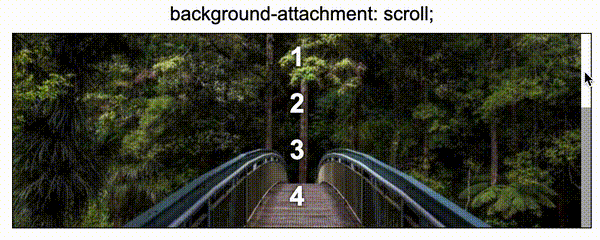
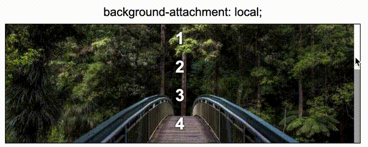
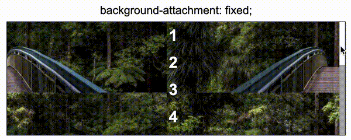

## 何为滚动视差

**视差滚动**（Parallax Scrolling）是指让多层背景以不同的速度移动，形成立体的运动效果，带来非常出色的视觉体验。 作为网页设计的热点趋势，越来越多的网站应用了这项技术。


通常而言，滚动视差在前端需要辅助 Javascript 才能实现。当然，其实 CSS 在实现滚动视差效果方面，也有着不俗的能力。下面就让我们来见识一二：

## 认识 `background-attachment`

`background-attachment` 算是一个比较生僻的属性，基本上平时写业务样式都用不到这个属性。但是它本身很有意思。

`background-attachment`：如果指定了 `background-image` ，那么 `background-attachment` 决定背景是在视口中固定的还是随着包含它的区块滚动的。

单单从定义上有点难以理解，随下面几个 Demo 了解下 `background-attachment` 到底是什么意思：

### `background-attachment: scroll`

**scroll** 此关键字表示背景相对于元素本身固定， 而不是随着它的内容滚动。



### `background-attachment: local`

**local** 此关键字表示背景相对于元素的内容固定。如果一个元素拥有滚动机制，背景将会随着元素的内容滚动， 并且背景的绘制区域和定位区域是相对于可滚动的区域而不是包含他们的边框。



### `background-attachment: fixed`

**fixed** 此关键字表示背景相对于视口固定。即使一个元素拥有滚动机制，背景也不会随着元素的内容滚动。



需要注意的是，看上去 scroll 与 fixed 的效果是一样的，实则不然。

scroll 与 fixed，一个是相对元素本身固定，一个是相对视口固定，有点类似 `position` 定位的 `absolute` 和 `fixed`。如果我们拖动页面大小，会发现 `background-attachment: fixed` 的图片在变换，这是因为里面的图片是基于视口进行定位的：

<iframe height="300" style="width: 100%;" scrolling="no" title="bg-attachment Demo" src="https://codepen.io/mafqla/embed/zYbBejx?default-tab=html%2Cresult&editable=true&theme-id=light" frameborder="no" loading="lazy" allowtransparency="true" allowfullscreen="true">
  See the Pen <a href="https://codepen.io/mafqla/pen/zYbBejx">
  bg-attachment Demo</a> by mafqla (<a href="https://codepen.io/mafqla">@mafqla</a>)
  on <a href="https://codepen.io">CodePen</a>.
</iframe>

## 使用 `background-attachment: fixed` 实现滚动视差

首先，我们使用 `background-attachment: fixed` 来实现滚动视差。**fixed** 此关键字表示背景相对于视口固定。即使一个元素拥有滚动机制，背景也不会随着元素的内容滚动。

这里的关键在于，即使一个元素拥有滚动机制，背景也不会随着元素的内容滚动。也就是说，背景图从一开始就已经被固定死在初始所在的位置。

我们使用，图文混合排布的方式，实现滚动视差，HTML 结构如下，`.g-word` 表示内容结构，`.g-img` 表示背景图片结构：

```html
<section class="g-word">Header</section>
<section class="g-img">IMG1</section>
<section class="g-word">Content1</section>
<section class="g-img">IMG2</section>
<section class="g-word">Content2</section>
<section class="g-img">IMG3</section>
<section class="g-word">Footer</section>
```

关键 CSS：

```css
section {
  height: 100vh;
}

.g-img {
  background-image: url(...);
  background-attachment: fixed;
  background-size: cover;
  background-position: center center;
}
```

效果如下：

<iframe height="300" style="width: 100%;" scrolling="no" title="bg-attachment:fixed parallax" src="https://codepen.io/mafqla/embed/mdoEvLB?default-tab=html%2Cresult&editable=true&theme-id=light" frameborder="no" loading="lazy" allowtransparency="true" allowfullscreen="true">
  See the Pen <a href="https://codepen.io/mafqla/pen/mdoEvLB">
  bg-attachment:fixed parallax</a> by mafqla (<a href="https://codepen.io/mafqla">@mafqla</a>)
  on <a href="https://codepen.io">CodePen</a>.
</iframe>

嗯？有点神奇，为什么会是这样呢？可能很多人会和我一样，第一次接触这个属性对这样的效果感到懵逼。

我们把上面 `background-attachment: fixed` 注释掉，或者改为 `background-attachment: local`，再看看效果：

<iframe height="300" style="width: 100%;" scrolling="no" title="bg-attachment:local " src="https://codepen.io/mafqla/embed/BabzMxx?default-tab=html%2Cresult&editable=true&theme-id=light" frameborder="no" loading="lazy" allowtransparency="true" allowfullscreen="true">
  See the Pen <a href="https://codepen.io/mafqla/pen/BabzMxx">
  bg-attachment:local </a> by mafqla (<a href="https://codepen.io/mafqla">@mafqla</a>)
  on <a href="https://codepen.io">CodePen</a>.
</iframe>

这次，图片正常跟随滚动条滚动了，按常理，这种效果才符合我们大脑的思维。

而滚动视差效果，正是不按常理出牌的一个效果，重点来了：

**当页面滚动到图片应该出现的位置，被设置了 `background-attachment: fixed` 的图片并不会继续跟随页面的滚动而跟随上下移动，而是相对于视口固定死了**。

好，我们再来试一下，如果把所有 `.g-word` 内容区块都去掉，只剩下全部设置了 `background-attachment: fixed` 的背景图区块，会是怎么样呢？

HTML 代码如下：

```html
<section class="g-img">IMG1</section>
<section class="g-img">IMG2</section>
<section class="g-img">IMG3</section>
```

```css
section {
  height: 100vh;
}

.g-img {
  background-image: url(...);
  background-attachment: fixed;
  background-size: cover;
  background-position: center center;
}
```

效果如下：

<iframe height="300" style="width: 100%;" scrolling="no" title="bg-attachment:local " src="https://codepen.io/mafqla/embed/BabzMxx?default-tab=html%2Cresult&editable=true&theme-id=light" frameborder="no" loading="lazy" allowtransparency="true" allowfullscreen="true">
  See the Pen <a href="https://codepen.io/mafqla/pen/BabzMxx">
  bg-attachment:local </a> by mafqla (<a href="https://codepen.io/mafqla">@mafqla</a>)
  on <a href="https://codepen.io">CodePen</a>.
</iframe>

结合这张 GIF，相信能对 `background-attachment: fixed` 有个更深刻的认识，移动的只有视口，而背景图是一直固定死的。

综上，就是 CSS 使用 `background-attachment: fixed` 实现滚动视差的一种方式，也是相对而言比较容易的一种。当然，`background-attachment: fixed` 本身的效果并不仅只是能有用来实现滚动视差效果，合理运用，还可以实现其他很多有趣的效果，这里简单再列一个：

### `background-attachment: fixed` 实现图片点击水纹效果

利用图片相对视口固定，可以有很多有趣的效果，譬如下面这个，来源于这篇文章[CSS Water Wave (水波效果)](https://www.oxxostudio.tw/articles/201407/css-water-wave.html)：

<iframe height="300" style="width: 100%;" scrolling="no" title="bg-attachment:fixed Wave" src="https://codepen.io/mafqla/embed/xxBOMzZ?default-tab=html%2Cresult&editable=true&theme-id=light" frameborder="no" loading="lazy" allowtransparency="true" allowfullscreen="true">
  See the Pen <a href="https://codepen.io/mafqla/pen/xxBOMzZ">
  bg-attachment:fixed Wave</a> by mafqla (<a href="https://codepen.io/mafqla">@mafqla</a>)
  on <a href="https://codepen.io">CodePen</a>.
</iframe>

利用图片相对视口固定的特性实现点击的水纹效果。

> 上面这个效果有点瑕疵，图片在放大容器变大的过程中发生了明显的抖动。当然，效果还是可以的，`background-attachment` 还有很多有意思的效果可以挖掘。

## 使用 `transform: translate3d` 实现滚动视差

言归正传，下面介绍另外一种使用 CSS 实现的滚动视差效果，利用的是 CSS 3D。

原理就是：

1. 我们给容器设置上 `transform-style: preserve-3d` 和 `perspective: xpx`，那么处于这个容器的子元素就将位于 3D 空间中，
2. 再给子元素设置不同的 `transform: translateZ()`，这个时候，不同元素在 3D Z 轴方向距离屏幕（我们的眼睛）的距离也就不一样
3. 滚动滚动条，由于子元素设置了不同的 `transform: translateZ()`，那么他们滚动的上下距离 `translateY` 相对屏幕（我们的眼睛），也是不一样的，这就达到了滚动视差的效果。

> 关于 `transform-style: preserve-3d` 以及 `perspective` 本文不做过多篇幅展开，默认读者都有所了解，还不是特别清楚的，可以先了解下 CSS 3D。

核心代码表示就是：

```html
<div class="g-container">
  <div class="section-one">translateZ(-1)</div>
  <div class="section-two">translateZ(-2)</div>
  <div class="section-three">translateZ(-3)</div>
</div>
```

```css
html {
  height: 100%;
  overflow: hidden;
}

body {
  perspective: 1px;
  transform-style: preserve-3d;
  height: 100%;
  overflow-y: scroll;
  overflow-x: hidden;
}

.g-container {
  height: 150%;

  .section-one {
    transform: translateZ(-1px);
  }
  .section-two {
    transform: translateZ(-2px);
  }
  .section-three {
    transform: translateZ(-3px);
  }
}
```

总结就是父元素设置 `transform-style: preserve-3d` 和 `perspective: 1px`，子元素设置不同的 `transform: translateZ`，滚动滚动条，效果如下：

<iframe height="300" style="width: 100%;" scrolling="no" title="bg-attachment:fixed Wave" src="https://codepen.io/mafqla/embed/xxBOMzZ?default-tab=html%2Cresult&editable=true&theme-id=light" frameborder="no" loading="lazy" allowtransparency="true" allowfullscreen="true">
  See the Pen <a href="https://codepen.io/mafqla/pen/xxBOMzZ">
  bg-attachment:fixed Wave</a> by mafqla (<a href="https://codepen.io/mafqla">@mafqla</a>)
  on <a href="https://codepen.io">CodePen</a>.
</iframe>

很明显，当滚动滚动条时，不同子元素的位移程度从视觉上看是不一样的，也就达到了所谓的滚动视差效果。

### 滚动视差文字阴影/虚影效果

那么，运用 translate3d 的视差效果，又能有一些什么好玩的效果呢？下面这个滚动视差文字阴影/虚影效果很有意思：

<iframe height="300" style="width: 100%;" scrolling="no" title="CSS translate3d Parallax" src="https://codepen.io/mafqla/embed/vYPKbrZ?default-tab=html%2Cresult&editable=true&theme-id=light" frameborder="no" loading="lazy" allowtransparency="true" allowfullscreen="true">
  See the Pen <a href="https://codepen.io/mafqla/pen/vYPKbrZ">
  CSS translate3d Parallax</a> by mafqla (<a href="https://codepen.io/mafqla">@mafqla</a>)
  on <a href="https://codepen.io">CodePen</a>.
</iframe>

当然，通过调整参数（`perspective: ?px` 以及 `transform: translateZ(-?px);`），还能有其他很有意思的效果出现：

<iframe height="300" style="width: 100%;" scrolling="no" title="CSS PARALLAX" src="https://codepen.io/mafqla/embed/BabzMVx?default-tab=html%2Cresult&editable=true&theme-id=light" frameborder="no" loading="lazy" allowtransparency="true" allowfullscreen="true">
  See the Pen <a href="https://codepen.io/mafqla/pen/BabzMVx">
  CSS PARALLAX</a> by mafqla (<a href="https://codepen.io/mafqla">@mafqla</a>)
  on <a href="https://codepen.io">CodePen</a>.
</iframe>
