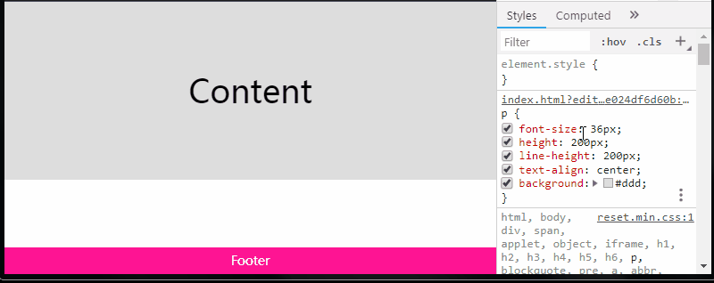

水平垂直居中也算是 CSS 领域最为常见的一个问题了，不同场景下的方法也各不相同，各有优劣。嗯，下面这种应该算是最便捷的了：

```html
<div class="g-container">
    <div class="g-box"></div>
</div>
```


```css
.g-container {
    display: flex;
}

.g-box {
    margin: auto;
}
```


> 上面的 `display: flex` 替换成 `display: inline-flex | grid | inline-grid` 也是可以的。


## 如何让 `margin: auto` 在垂直方向上居中元素

嗯。这里其实就涉及了一个问题，如何让 `margin: auto` 在垂直方向上生效？

换句话说，传统的 `display: block` 容器下，为什么 `margin: auto` 在水平方向可以居中元素在垂直方向却不行？

通常我们会使用这段代码：

```
div {
    width: 200px;
    height: 200px;
    margin: 0 auto;
}
```


让元素相对父元素水平居中。但是如果我们想让元素相对父元素垂直居中的话，使用 `margin: auto 0` 是不生效的。

### `display: block` 下 `margin: auto` 垂直方向无法居中元素的原因

查看 CSS 文档，原因如下，在 `display: block` 下：

If both margin-left and margin-right are auto, their used values are equal, causing horizontal centring.

> —CSS2 Visual formatting model details: 10.3.3

If margin-top, or margin-bottom are auto, their used value is 0.

> —[CSS2 Visual formatting model details: 10.6.3](https://www.w3.org/TR/CSS2/visudet.html#Computing_heights_and_margins)

简单翻译下，在 `display: block` 中，如果 `margin-left` 和 `margin-right` 都是 auto，则它们的表达值相等，从而导致元素的水平居中。( 这里的计算值为元素剩余可用剩余空间的一半)

而如果 `margin-top` 和 `margin-bottom` 都是 auto，则他们的值都为 0，当然也就无法造成垂直方向上的居中。

### 使用 FFC/GFC 使 `margin: auto` 在垂直方向上居中元素

OK，这里要使单个元素使用 `margin: auto` 在垂直方向上能够居中元素，需要让该元素处于 FFC(flex formatting context)，或者 GFC(grid formatting context) 上下文中，也就是这些取值中：

```css
{
    display: flex;
    display: inline-flex;
    display: grid;
    display: inline-grid;
}
```


### FFC 下 `margin: auto` 垂直方向可以居中元素的原因

本文暂且不谈 grid 布局，我们业务中需求中更多的可能是使用 flex 布局，下文将着重围绕 flex 上下文中自动 margin 的一些表现。

> 嗯，也有很多前端被戏称为 flex 工程师，什么布局都 flex 一把梭。

查看 CSS 文档，原因如下，在 `dispaly: flex` 下：

- Prior to alignment via justify-content and align-self, any positive free space is distributed to auto margins in that dimension.

> [CSS Flexible Box Layout Module Level 1 -- 8.1. Aligning with auto margins](https://www.w3.org/TR/2018/CR-css-flexbox-1-20181119/#auto-margins)

简单翻译一下，大意是在 **flex 格式化上下文**中，设置了 `margin: auto` 的元素，在通过 `justify-content` 和 `align-self` 进行对齐之前，任何正处于空闲的空间都会分配到该方向的自动 margin 中去

这里，很重要的一点是，margin auto 的生效不仅是水平方向，垂直方向也会自动去分配这个剩余空间。

## 使用自动 margin 实现 flex 布局下的 `space-between | space-around`

了解了上面最核心的这一句 :

- **在通过 `justify-content` 和 `align-self` 进行对齐之前，任何正处于空闲的空间都会分配到该维度中的自动 margin 中去**

之后，我们就可以在 flex 布局下使用自动 margin 模拟实现 flex 布局下的 `space-between` 以及 `space-around` 了。

### 自动 margin 实现 `space-around`

对于这样一个 flex 布局：

```html
<ul class="g-flex">
    <li>liA</li>
    <li>liB</li>
    <li>liC</li>
    <li>liD</li>
    <li>liE</li>
</ul>
```


如果它的 CSS 代码是：

```css
.g-flex {
    display: flex;
    justify-content: space-around;
}

li { ... }
```


效果如下：

<iframe height="300" style="width: 100%;" scrolling="no" title="margin auto 实现 flex 下的 space-around" src="https://codepen.io/Chokcoco/embed/rgYOVo?default-tab=html%2Cresult&editable=true&theme-id=light" frameborder="no" loading="lazy" allowtransparency="true" allowfullscreen="true">
  See the Pen <a href="https://codepen.io/Chokcoco/pen/rgYOVo">
  margin auto 实现 flex 下的 space-around</a> by Chokcoco (<a href="https://codepen.io/Chokcoco">@Chokcoco</a>)
  on <a href="https://codepen.io">CodePen</a>.
</iframe>


那么下面的 CSS 代码与上面的效果是完全等同的：

```css
.g-flex {
    display: flex;
    // justify-content: space-around;
}

li { 
    margin: auto;
}
```


### 自动 margin 实现 `space-between`

同理，使用自动 margin，也很容易实现 flex 下的 `space-between`，下面两份 CSS 代码的效果的一样的：

```css
.g-flex {
    display: flex;
    justify-content: space-between;
}

li {...}
```


```css
.g-flex {
    display: flex;
    // justify-content: space-between;
}

li {
    margin: auto;
}

li:first-child {
    margin-left: 0;
}

li:last-child {
    margin-right: 0;
}
```


当然，值得注意的是，很重要的一点：

Note: If free space is distributed to auto margins, the alignment properties will have no effect in that dimension because the margins will have stolen all the free space left over after flexing.

> [CSS Flexible Box Layout Module Level 1 -- 8.1. Aligning with auto margins](https://www.w3.org/TR/2018/CR-css-flexbox-1-20181119/#auto-margins)

意思是，如果任意方向上的可用空间分配给了该方向的自动 margin ，则对齐属性（justify-content/align-self）在该维度中不起作用，因为 margin 将在排布后窃取该纬度方向剩余的所有可用空间。

也就是使用了自动 margin 的 flex 子项目，它们父元素设置的 `justify-content` 已经它们本身的 `align-self` 将不再生效，也就是这里存在一个优先级的关系。

## 使用自动 margin 实现 flex 下的 `align-self: flex-start | flex-end | center`

自动 margin 能实现水平方向的控制，也能实现垂直方向的控制，原理是一样的。

用 `margin: auto` 模拟 flex 下的 `align-self: flex-start | flex-end | center`，可以看看下面几个 Demo：


<iframe height="300" style="width: 100%;" scrolling="no" title="margin auto 实现 flex 下的 align-self: center" src="https://codepen.io/Chokcoco/embed/oRobEp?default-tab=html%2Cresult&editable=true&theme-id=light" frameborder="no" loading="lazy" allowtransparency="true" allowfullscreen="true">
  See the Pen <a href="https://codepen.io/Chokcoco/pen/oRobEp">
  margin auto 实现 flex 下的 align-self: center</a> by Chokcoco (<a href="https://codepen.io/Chokcoco">@Chokcoco</a>)
  on <a href="https://codepen.io">CodePen</a>.
</iframe>


<iframe height="300" style="width: 100%;" scrolling="no" title="margin auto 实现 flex 下的 align-self: flex-end" src="https://codepen.io/Chokcoco/embed/PvOZMr?default-tab=html%2Cresult&editable=true&theme-id=light" frameborder="no" loading="lazy" allowtransparency="true" allowfullscreen="true">
  See the Pen <a href="https://codepen.io/Chokcoco/pen/PvOZMr">
  margin auto 实现 flex 下的 align-self: flex-end</a> by Chokcoco (<a href="https://codepen.io/Chokcoco">@Chokcoco</a>)
  on <a href="https://codepen.io">CodePen</a>.
</iframe>


## 不同方向上的自动 margin

OK，看完上面的一大段铺垫之后，大概已经初步了解了 FFC 下，自动 margin 的神奇。

无论是多个方向的自动 margin，抑或是单方向的自动 margin，都是非常有用的。

再来看几个有意思的例子：

### 使用 `margin-left: auto` 实现不规则两端对齐布局

假设我们需要有如下布局：


DOM 结构如下：

```html
<ul class="g-nav">
    <li>导航A</li>
    <li>导航B</li>
    <li>导航C</li>
    <li>导航D</li>
    <li class="g-login">登陆</li>
</ul>
```


对最后一个元素使用 `margin-left: auto`，可以很容易实现这个布局：

```css
.g-nav {
    display: flex;
}

.g-login {
    margin-left: auto;
}
```


此时， `auto` 的计算值就是水平方向上容器排列所有 li 之后的剩余空间。

当然，不一定是要运用在第一个或者最后一个元素之上，例如这样的布局，也是完全一样的实现：


```html
<ul class="g-nav">
    <li>导航A</li>
    <li>导航B</li>
    <li>导航C</li>
    <li>导航D</li>
    <li class="g-login">登陆</li>
    <li>注册</li>
</ul>
```


```css
.g-nav {
    display: flex;
}

.g-login {
    margin-left: auto;
}
```


<iframe height="300" style="width: 100%;" scrolling="no" title="nav list by margin left auto " src="https://codepen.io/Chokcoco/embed/eaGmyv?default-tab=html%2Cresult&editable=true&theme-id=light" frameborder="no" loading="lazy" allowtransparency="true" allowfullscreen="true">
  See the Pen <a href="https://codepen.io/Chokcoco/pen/eaGmyv">
  nav list by margin left auto </a> by Chokcoco (<a href="https://codepen.io/Chokcoco">@Chokcoco</a>)
  on <a href="https://codepen.io">CodePen</a>.
</iframe>


### 垂直方向上的多行居中

OK，又或者，我们经常会有这样的需求，一大段复杂的布局中的某一块，高度或者宽度不固定，需要相对于它所在的剩余空间居中：

<iframe height="300" style="width: 100%;" scrolling="no" title="自动margin快速垂直居中任意段落" src="https://codepen.io/Chokcoco/embed/ZNvzdx?default-tab=html%2Cresult&editable=true&theme-id=light" frameborder="no" loading="lazy" allowtransparency="true" allowfullscreen="true">
  See the Pen <a href="https://codepen.io/Chokcoco/pen/ZNvzdx">
  自动margin快速垂直居中任意段落</a> by Chokcoco (<a href="https://codepen.io/Chokcoco">@Chokcoco</a>)
  on <a href="https://codepen.io">CodePen</a>.
</iframe>


这里有 5 行文案，我们需要其中的第三、第四行相对于剩余空间进行垂直居中。

这里如果使用 flex 布局，简单的 `align-self` 或者 `align-items` 好像都没法快速解决问题。

而使用自动 margin，我们只需要在需要垂直居中的第一个元素上进行 `margin-top: auto`，最后一个元素上进行 `margin-bottom: auto` 即可，看看代码示意：

```html
<div class="g-container">
    <p>这是第一行文案</p>
    <p>这是第二行文案</p>
    <p class="s-thirf">1、剩余多行文案需要垂直居中剩余空间</p>
    <p class="s-forth">2、剩余多行文案需要垂直居中剩余空间</p>
    <p>这是最后一行文案</p>
</div>
```


```css
.g-container {
    display: flex;
    flex-wrap: wrap;
    flex-direction: column;
}

.s-thirf {
    margin-top: auto;
}

.s-forth {
    margin-bottom: auto;
}
```


> 当然，这里将任意需要垂直居中剩余空间的元素用一个 div 包裹起来，对该 div 进行 `margin: auto 0` 也是可以的。


### 使用 `margin-top: auto` 实现粘性 footer 布局

OK，最后再来看这样一个例子。

要求：页面存在一个 footer 页脚部分，如果整个页面的内容高度小于视窗的高度，则 footer 固定在视窗底部，如果整个页面的内容高度大于视窗的高度，则 footer 正常流排布（也就是需要滚动到底部才能看到 footer），算是粘性布局的一种。

看看效果：



嗯，这个需求如果能够使用 flex 的话，使用 `justify-content: space-between` 可以很好的解决，同理使用 `margin-top: auto` 也非常容易完成：

```html
<div class="g-container">
    <div class="g-real-box">
        ...
    </div>
    <div class="g-footer"></div>
</div>
```


```css
.g-container {
    height: 100vh;
    display: flex;
    flex-direction: column;
}

.g-footer {
    margin-top: auto;
    flex-shrink: 0;
    height: 30px;
    background: deeppink;
}
```

<iframe height="300" style="width: 100%;" scrolling="no" title="sticky footer by flex margin auto" src="https://codepen.io/Chokcoco/embed/pmrbWX?default-tab=html%2Cresult&editable=true&theme-id=light" frameborder="no" loading="lazy" allowtransparency="true" allowfullscreen="true">
  See the Pen <a href="https://codepen.io/Chokcoco/pen/pmrbWX">
  sticky footer by flex margin auto</a> by Chokcoco (<a href="https://codepen.io/Chokcoco">@Chokcoco</a>)
  on <a href="https://codepen.io">CodePen</a>.
</iframe>


上面的例子旨在介绍更多自动 margin 的使用场景。当然，这里不使用 flex 布局也是可以实现的，下面再给出一种不借助 flex 布局的实现方式：


<iframe height="300" style="width: 100%;" scrolling="no" title="sticky footer by margin/paddig" src="https://codepen.io/Chokcoco/embed/XwaKNJ?default-tab=html%2Cresult&editable=true&theme-id=light" frameborder="no" loading="lazy" allowtransparency="true" allowfullscreen="true">
  See the Pen <a href="https://codepen.io/Chokcoco/pen/XwaKNJ">
  sticky footer by margin/paddig</a> by Chokcoco (<a href="https://codepen.io/Chokcoco">@Chokcoco</a>)
  on <a href="https://codepen.io">CodePen</a>.
</iframe>


## 值得注意的点

自动 margin 还是很实用的，可以使用的场景也很多，有一些上面提到的点还需要再强调下：

- **块格式化上下文**中`margin-top` 和 `margin-bottom` 的值如果是 auto，则他们的值都为 0
- **flex 格式化上下文**中，在通过 `justify-content` 和 `align-self` 进行对齐之前，任何正处于空闲的空间都会分配到该方向的自动 margin 中去
- 单个方向上的自动 margin 也非常有用，它的计算值为该方向上的剩余空间
- 使用了自动 margin 的 flex 子项目，它们父元素设置的 `justify-content` 以及它们本身的 `align-self` 将不再生效