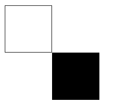
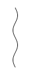
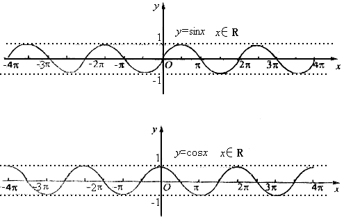
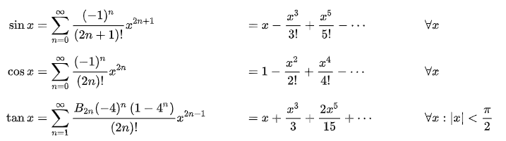
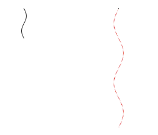

## 理解 box-shadow

首先，回顾一下 `box-shadow` 这个属性。基本属性用法就是给元素创造一层阴影。

再简单提一下，本文会用到的关于阴影的第一个技巧：

### 使用阴影复制图像/投影图像

当 box-shadow 的第三、第四个参数模糊半径和扩张半径都为 0 的时候，我们可以得到一个和元素大小一样的阴影：

```scss
div {
  width: 80px;
  height: 80px;
  border: 1px solid #333;
  box-sizing: border-box;
  box-shadow: 80px 80px 0 0 #000;
}
```

得到如下结果：



### 阴影可以是多重的

第二个技巧则是，`box-shadow` 是允许多重阴影的，并且他们的坐标是可以完全掌控的。

是的，我们可以像下面这样给一个元素定义多重阴影，并且利用阴影的第一、第二个参数控制它相对于元素的坐标：

```scss
div {
  width: 80px;
  height: 80px;
  border: 1px solid #333;
  box-sizing: border-box;
  box-shadow: 80px 80px 0 0 #000, 70px 70px 0 0 #000, ... 60px 60px 0 0 #000;
}
```

## 在阴影坐标中运用三角函数

继续。接下来，我们尝试在阴影的坐标中引入三角函数。

为啥是三角函数，不是圆的标准方程或者椭圆的标准方程或者其他图形函数呢？当然也是可以的，只是这里借助三角函数的 `cos` 或 `sin` 可以实现直接使用 CSS 实现起来很困难的曲线。

带着疑问，先继续向下，假设我们要实现这样一条曲线：



使用 CSS 的话，有什么办法呢？

可能的一些办法是 `clip-path`，或者一些奇技淫巧，使用 `text-decoration` 里的波浪下划线 `wavy`，或者是使用渐变叠加。

当然，还有一种办法是本文将提到的使用 `box-shadow` 及 三角函数。

### 三角函数

咳咳，简单回顾下三角函数里面的 sin、cos 曲线图像变换，还没有全部还给老师。



如果我们有一个 1x1 的 div，它的多重阴影，能够按照像正弦/余弦函数的图像一样进行排布，连起来不就是一条曲线吗？

### 如何在 CSS 中使用三角函数 sin/cos

想法不错，但是 CSS 本身并没有提供三角函数。这里，我们需要借助 Sass 来在 CSS 中实现简单的三角函数。

还好，已经有前人帮忙把这个工作做完了：

- [trigonometry in sass](https://www.unindented.org/blog/trigonometry-in-sass/)
- [在 Sass 中实现三角函数计算](http://jimyuan.github.io/blog/2015/02/12/trigonometry-in-sass.html)

简单而言，就是借助[三角函数的泰勒展开式](https://zh.wikipedia.org/wiki/泰勒级数)，使用 Sass 函数模拟实现三角函数的 sin()、cos()、tan()：



由于展开式是无限长的，使用 Sass 函数模拟时，不可能得到一个非常精确的值，但是在日常作图下已经完全够用了，以下是使用 Sass 函数模拟实现三角函数的 sin()、cos()、tan()：

```scss
@function fact($number) {
  $value: 1;
  @if $number>0 {
    @for $i from 1 through $number {
      $value: $value * $i;
    }
  }
  @return $value;
}

@function pow($number, $exp) {
  $value: 1;
  @if $exp>0 {
    @for $i from 1 through $exp {
      $value: $value * $number;
    }
  } @else if $exp < 0 {
    @for $i from 1 through -$exp {
      $value: $value / $number;
    }
  }
  @return $value;
}

@function rad($angle) {
  $unit: unit($angle);
  $unitless: $angle / ($angle * 0 + 1);
  @if $unit==deg {
    $unitless: $unitless / 180 * pi();
  }
  @return $unitless;
}

@function pi() {
  @return 3.14159265359;
}

@function sin($angle) {
  $sin: 0;
  $angle: rad($angle);
  // Iterate a bunch of times.
  @for $i from 0 through 20 {
    $sin: $sin + pow(-1, $i) * pow($angle, (2 * $i + 1)) / fact(2 * $i + 1);
  }
  @return $sin;
}

@function cos($angle) {
  $cos: 0;
  $angle: rad($angle);
  // Iterate a bunch of times.
  @for $i from 0 through 20 {
    $cos: $cos + pow(-1, $i) * pow($angle, 2 * $i) / fact(2 * $i);
  }
  @return $cos;
}

@function tan($angle) {
  @return sin($angle) / cos($angle);
}
```

由于上面最终计算 sin、cos 泰勒展开的时候，只使用了 20 层循环，所以当传入的值太大的时候，则会产生较大误差。经测试，传入数值在 [-20, 20] 以内，精度还是非常高的。

而以 sin 函数为例，x 取值在 [-π, π] 之间，已经能覆盖所有 sin(x) 的取值范围，所以 [-20, 20] 这个范围是完全够用的，我们只需要尽量让传入的 x 值落在这个区域范围内即不会产生太大误差。

好，铺垫了那么多，接下来使用上述的 sin 函数试一下，假设我们有这样一个结构：

```html
<div></div>
```

```css
div {
  width: 1px;
  height: 1px;
  background: #000;
  border-radius: 50%;
}
```

我们再借助 Sass 实现一个 50 层的循环，当然其中阴影的 x 坐标使用了 sin 函数：

```scss
@function shadowSet($vx, $vy) {
  $shadow: 0 0 0 0 #000;

  @for $i from 0 through 50 {
    $x: sin($i / 8) * $vx;
    $y: $i * $vy;

    $shadow: $shadow, #{$x} #{$y} 0 0 rgba(0, 0, 0, 1);
  }

  @return $shadow;
}

div {
  width: 1px;
  height: 1px;
  background: #000;
  border-radius: 50%;
  box-shadow: shadowSet(4px, 1px);
}
```

上面 `sin($i / 8)`，这里除以 8 是为了让整个 sin(x) 传入的作用域的取值范围为 [0, 6.25]，当而 sin(x) 的作用域为 [0，2π] 时刚好可以画一条完整的单次曲线。这个 8 是可以根据循环的次数不同而进行调整的。

实际，我们得到的 `box-shadow` 如下：

```scss
 {
  box-shadow: 0 0 0 0 black, 0.4986989335px 1px 0 0 black,
    0.989615837px 2px 0 0 black, 1.4650901163px 3px 0 0 black,
    1.9177021544px 4px 0 0 black, 2.3403890918px 5px 0 0 black,
    2.7265550401px 6px 0 0 black, 3.0701740089px 7px 0 0 black,
    3.3658839392px 8px 0 0 black, 3.6090703764px 9px 0 0 black,
    3.7959384774px 10px 0 0 black, 3.9235722281px 11px 0 0 black,
    3.9899799464px 12px 0 0 black, 3.9941253622px 13px 0 0 black,
    3.9359437875px 14px 0 0 black, 3.8163431264px 15px 0 0 black,
    3.6371897073px 16px 0 0 black, 3.4012791593px 17px 0 0 black,
    3.1122927876px 18px 0 0 black, 2.7747401278px 19px 0 0 black,
    2.3938885764px 20px 0 0 black, 1.9756811944px 21px 0 0 black,
    1.5266439682px 22px 0 0 black, 1.0537839735px 23px 0 0 black,
    0.5644800322px 24px 0 0 black, 0.0663675689px 25px 0 0 black,
    -0.4327805381px 26px 0 0 black, -0.9251752496px 27px 0 0 black,
    -1.4031329108px 28px 0 0 black, -1.8591951521px 29px 0 0 black,
    -2.286245275px 30px 0 0 black, -2.677619305px 31px 0 0 black,
    -3.0272099812px 32px 0 0 black, -3.3295620582px 33px 0 0 black,
    -3.5799574329px 34px 0 0 black, -3.7744887692px 35px 0 0 black,
    -3.9101204707px 36px 0 0 black, -3.9847360499px 37px 0 0 black,
    -3.9971711559px 38px 0 0 black, -3.9472317429px 39px 0 0 black,
    -3.8356970987px 40px 0 0 black, -3.6643076841px 41px 0 0 black,
    -3.4357379737px 42px 0 0 black, -3.1535547213px 43px 0 0 black,
    -2.8221613023px 44px 0 0 black, -2.446729px 45px 0 0 black,
    -2.03311631px 46px 0 0 black, -1.58777752px 47px 0 0 black,
    -1.1176619928px 48px 0 0 black, -0.630105724px 49px 0 0 black,
    -0.1327168662px 50px 0 0 black;
}
```

实际得到的图像如下：

<iframe height="300" style="width: 100%;" scrolling="no" title="sass2sin Line" src="https://codepen.io/mafqla/embed/GReNzLW?default-tab=html%2Cresult&editable=true&theme-id=light" frameborder="no" loading="lazy" allowtransparency="true" allowfullscreen="true">
  See the Pen <a href="https://codepen.io/mafqla/pen/GReNzLW">
  sass2sin Line</a> by mafqla (<a href="https://codepen.io/mafqla">@mafqla</a>)
  on <a href="https://codepen.io">CodePen</a>.
</iframe>

### 控制颜色及初始方向

看看上面 Sass 实现的这个方法 `@function shadowSet($vx, $vy)` ，其中 `$vx`，`$vy` 用于控制图像的振幅及松散程度，我们再添加一个控制初始方向的 `$direction`，控制阴影层数的 $count， 控制颜色的 $color:

```scss
@function shadowSet($vx, $vy, $direction, $count, $color) {
  $shadow: 0 0 0 0 $color;

  @for $i from 0 through $count {
    $x: sin($i / 8) * $vx * $direction;
    $y: $i * $vy;

    $shadow: $shadow, #{$x} #{$y} 0 0 $color;
  }

  @return $shadow;
}
```

```scss
.line {
  width: 1px;
  height: 1px;
  margin: 10vh auto;
  background: #000;
  border-radius: 50%;
  box-shadow: shadowSet(4px, 1px, 1, 50, #000);
}

.reverseline {
  width: 1px;
  height: 1px;
  margin: 10vh auto;
  background: #000;
  border-radius: 50%;
  box-shadow: shadowSet(8px, 2px, -1, 100, red);
}
```



### 控制颜色

再进一步，我们可以借助 Sass 的各种颜色函数，实现颜色的变化：

```scss
@function shadowSetColor($vx, $vy, $direction, $count, $color) {
  $shadow: 0 0 0 0 $color;

  @for $i from 0 through $count {
    $color: lighten($color, 0.5);

    $x: sin($i / 8) * $vx * $direction;
    $y: $i * $vy;

    $shadow: $shadow, #{$x} #{$y} 0 0 $color;
  }

  @return $shadow;
}

.colorline {
  width: 5px;
  height: 5px;
  margin: 10vh auto;
  background: green;
  border-radius: 50%;
  box-shadow: shadowSetColor(8px, 2px, -1, 100, green);
}
```

上面，借助了 `lighten` 这个函数，通过改变颜色的亮度值，让颜色变亮，创建一个新的颜色。

当然，Sass 中还有很多其他颜色函数：

- adjust-hue($color,$degrees)：通过改变一个颜色的色相值，创建一个新的颜色；
- lighten($color,$amount)：通过改变颜色的亮度值，让颜色变亮，创建一个新的颜色；
- darken($color,$amount)：通过改变颜色的亮度值，让颜色变暗，创建一个新的颜色；
- saturate($color,$amount)：通过改变颜色的饱和度值，让颜色更饱和，从而创建一个新的颜色
- desaturate($color,$amount)：通过改变颜色的饱和度值，让颜色更少的饱和，从而创建出一个新的颜色；

更多 Sass 颜色函数，可以看看这篇文章：[Sass 基础——颜色函数](https://www.w3cplus.com/preprocessor/sass-color-function.html)

OK，看看这次的效果：

<iframe height="300" style="width: 100%;" scrolling="no" title="sass2sin Line" src="https://codepen.io/mafqla/embed/GReNzLW?default-tab=html%2Cresult&editable=true&theme-id=light" frameborder="no" loading="lazy" allowtransparency="true" allowfullscreen="true">
  See the Pen <a href="https://codepen.io/mafqla/pen/GReNzLW">
  sass2sin Line</a> by mafqla (<a href="https://codepen.io/mafqla">@mafqla</a>)
  on <a href="https://codepen.io">CodePen</a>.
</iframe>

## 在 css-doodle 中使用

OK，前面所有的铺垫都是为了在实际的一些创意想法中去使用它。

在 css-doodle 中，由于是利用 Web Component 特性。在需要三角函数的时候，可以直接使用 JavaScript 提供的 Math 函数，会更加的方便。

> Web Components 是一套不同的 Web 技术，允许您创建可重用的定制元素（它们的功能封装在您的代码之外）并且在您的 web 应用中使用它们。

[袁川](https://codepen.io/yuanchuan/pens/popular?cursor=ZD0xJm89MCZwPTc=)老师，也就是 css-doodle 库的作者，在他的 Codepen 首页背景板中，使用的就是使用上述技巧实现的一副纯 CSS 画作：

<iframe height="300" style="width: 100%;" scrolling="no" title="border-radius" src="https://codepen.io/mafqla/embed/QWoGYPr?default-tab=html%2Cresult&editable=true&theme-id=light" frameborder="no" loading="lazy" allowtransparency="true" allowfullscreen="true">
  See the Pen <a href="https://codepen.io/mafqla/pen/QWoGYPr">
  border-radius</a> by mafqla (<a href="https://codepen.io/mafqla">@mafqla</a>)
  on <a href="https://codepen.io">CodePen</a>.
</iframe>

我也尝试使用这个技巧，做了一副：

<iframe height="300" style="width: 100%;" scrolling="no" title="CSS-Doodle fish 🐟 &amp;   seaweed🍀" src="https://codepen.io/mafqla/embed/MWxbLRZ?default-tab=html%2Cresult&editable=true&theme-id=light" frameborder="no" loading="lazy" allowtransparency="true" allowfullscreen="true">
  See the Pen <a href="https://codepen.io/mafqla/pen/MWxbLRZ">
  CSS-Doodle fish 🐟 &amp;   seaweed🍀</a> by mafqla (<a href="https://codepen.io/mafqla">@mafqla</a>)
  on <a href="https://codepen.io">CodePen</a>.
</iframe>
