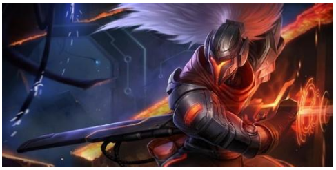
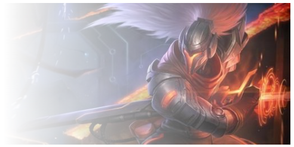
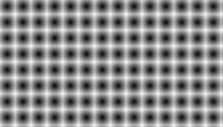
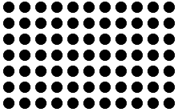
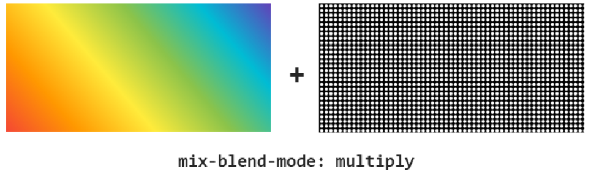
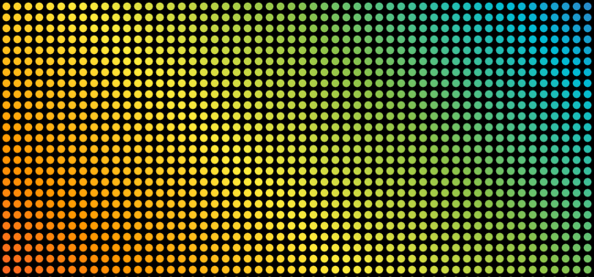
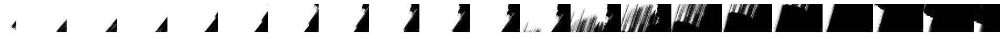

其实 mask 的出现已经有一段时间了，只是没有特别多实用的场景，在实战中使用的非常少，本文将罗列一些使用 mask 创造出来的有意思的场景。

## 语法

最基本，使用 mask 的方式是借助图片，类似这样：

```css
 {
  /* Image values */
  mask: url(mask.png); /* 使用位图来做遮罩 */
  mask: url(masks.svg#star); /* 使用 SVG 图形中的形状来做遮罩 */
}
```

当然，使用图片的方式后文会再讲。借助图片的方式其实比较繁琐，因为我们首先还得准备相应的图片素材，除了图片，mask 还可以接受一个类似 background 的参数，也就是渐变。

类似如下使用方法：

```css
 {
  mask: linear-gradient(#000, transparent); /* 使用渐变来做遮罩 */
}
```

那该具体怎么使用呢？一个非常简单的例子，上述我们创造了一个从黑色到透明渐变色，我们将它运用到实际中，代码类似这样：

下面这样一张图片，叠加上一个从透明到黑色的渐变，

```css
 {
  background: url(image.png);
  mask: linear-gradient(90deg, transparent, #000);
}
```


应用了 mask 之后，就会变成这样：



这个 DEMO，可以先简单了解到 mask 的基本用法。

这里得到了使用 mask 最重要结论：**图片与 mask 生成的渐变的 transparent 的重叠部分，将会变得透明。**

值得注意的是，上面的渐变使用的是 `linear-gradient(90deg, transparent, #fff)`，这里的 `#fff` 纯色部分其实换成任意颜色都可以，不影响效果。

<iframe height="300" style="width: 100%;" scrolling="no" title="使用 MASK 的基本使用" src="https://codepen.io/mafqla/embed/mdomGQK?default-tab=html%2Cresult&editable=true&theme-id=light" frameborder="no" loading="lazy" allowtransparency="true" allowfullscreen="true">
  See the Pen <a href="https://codepen.io/mafqla/pen/mdomGQK">
  使用 MASK 的基本使用</a> by mafqla (<a href="https://codepen.io/mafqla">@mafqla</a>)
  on <a href="https://codepen.io">CodePen</a>.
</iframe>

## 使用 MASK 进行图片裁切

利用上述简单的运用，我们可以使用 mask 实现简单的图片裁剪。

### 使用 mask 实现图片切角遮罩

使用线性渐变，我们实现一个简单的切角图形：

```css
.notching {
  width: 200px;
  height: 120px;
  background: linear-gradient(135deg, transparent 15px, deeppink 0) top left, linear-gradient(
        -135deg,
        transparent 15px,
        deeppink 0
      ) top right,
    linear-gradient(-45deg, transparent 15px, deeppink 0) bottom right, linear-gradient(
        45deg,
        transparent 15px,
        deeppink 0
      ) bottom left;
  background-size: 50% 50%;
  background-repeat: no-repeat;
}
```

像是这样：


我们将上述渐变运用到 mask 之上，而 background 替换成一张图片，就可以得到运用了切角效果的图片：

```css
background: url(image.png);
mask: linear-gradient(135deg, transparent 15px, #fff 0) top left, linear-gradient(
      -135deg,
      transparent 15px,
      #fff 0
    ) top right, linear-gradient(-45deg, transparent 15px, #fff 0) bottom right,
  linear-gradient(45deg, transparent 15px, #fff 0) bottom left;
mask-size: 50% 50%;
mask-repeat: no-repeat;
```

得到的效果如下:

[](https://user-images.githubusercontent.com/8554143/85303829-993e7200-b4dd-11ea-910f-b5bb74e73e02.png)

> 当然，实现上述效果还有其他很多种方式，譬如 clip-path，这里的 mask 也是一种方式。

## 多张图片下使用 mask

上述是单张图片使用 mask 的效果。下面我们看看多张图片下，使用 mask 能碰撞出什么样的火花。

假设我们有两张图片，使用 mask，可以很好将他们叠加在一起进行展示。最常见的一个用法：

```css
div {
  position: relative;
  background: url(image1.jpg);

  &::before {
    position: absolute;
    content: '';
    top: 0;
    left: 0;
    right: 0;
    bottom: 0;
    background: url(image2.jpg);
    mask: linear-gradient(45deg, #000 50%, transparent 50%);
  }
}
```

两张图片，一张完全重叠在另外一张之上，然后使用 `mask: linear-gradient(45deg, #000 50%, transparent 50%)` 分割两张图片：

<iframe height="300" style="width: 100%;" scrolling="no" title="MASK 的基本使用，多张图片下的用法" src="https://codepen.io/Chokcoco/embed/ZEQeNad?default-tab=html%2Cresult&editable=true&theme-id=light" frameborder="no" loading="lazy" allowtransparency="true" allowfullscreen="true">
  See the Pen <a href="https://codepen.io/Chokcoco/pen/ZEQeNad">
  MASK 的基本使用，多张图片下的用法</a> by Chokcoco (<a href="https://codepen.io/Chokcoco">@Chokcoco</a>)
  on <a href="https://codepen.io">CodePen</a>.
</iframe>

当然，注意上面我们使用的 mask 的渐变，是完全的实色变化，没有过度效果。

我们稍微修改一下 mask 内的渐变：

```css
{
- mask: linear-gradient(45deg, #000 50%, transparent 50%)
+ mask: linear-gradient(45deg, #000 40%, transparent 60%)
}
```

即可得到图片 1 向图片 2 过渡切换的效果：

<iframe height="300" style="width: 100%;" scrolling="no" title="MASK 的基本使用，多张图片下的用法2" src="https://codepen.io/mafqla/embed/GRemXPB?default-tab=html%2Cresult&editable=true&theme-id=light" frameborder="no" loading="lazy" allowtransparency="true" allowfullscreen="true">
  See the Pen <a href="https://codepen.io/mafqla/pen/GRemXPB">
  MASK 的基本使用，多张图片下的用法2</a> by mafqla (<a href="https://codepen.io/mafqla">@mafqla</a>)
  on <a href="https://codepen.io">CodePen</a>.
</iframe>

有了上面的铺垫。运用上面的介绍的一些方法，我们就可以使用 `mask` 来进行一些图片切换间的转场动画。

### 使用线性渐变 mask:linear-gradient() 进行切换

还是上面的 Demo，我们通过动态的去改变 mask 的值来实现图片的显示/转场效果。

代码可能是这样：

```css
div {
  background: url(image1.jpg);
  animation: maskMove 2s linear;
}

@keyframes {
  0% {
    mask: linear-gradient(45deg, #000 0%, transparent 5%, transparent 5%);
  }
  1% {
    mask: linear-gradient(45deg, #000 1%, transparent 6%, transparent 6%);
  }
  ... 100% {
    mask: linear-gradient(45deg, #000 100%, transparent 105%, transparent 105%);
  }
}
```

当然，像上面那样一个一个写，会比较费力，通常我们会借助 SASS/LESS 等预处理器进行操作。像是这样：

```css
div {
  position: relative;
  background: url(image2.jpg) no-repeat;

  &::before {
    position: absolute;
    content: '';
    top: 0;
    left: 0;
    right: 0;
    bottom: 0;
    background: url(image1.jpg);
    animation: maskRotate 1.2s ease-in-out;
  }
}

@keyframes maskRotate {
  @for $i from 0 through 100 {
    #{$i}% {
      mask: linear-gradient(
        45deg,
        #000 #{$i + '%'},
        transparent #{$i + 5 + '%'},
        transparent 1%
      );
    }
  }
}
```

可以得到下面这样的效果（单张图片的显隐及两张图片下的切换）：

<iframe height="300" style="width: 100%;" scrolling="no" title="MASK linear-gradient 转场" src="https://codepen.io/Chokcoco/embed/RwrpmyL?default-tab=html%2Cresult&editable=true&theme-id=light" frameborder="no" loading="lazy" allowtransparency="true" allowfullscreen="true">
  See the Pen <a href="https://codepen.io/Chokcoco/pen/RwrpmyL">
  MASK linear-gradient 转场</a> by Chokcoco (<a href="https://codepen.io/Chokcoco">@Chokcoco</a>)
  on <a href="https://codepen.io">CodePen</a>.
</iframe>

### 使用角向渐变 mask: conic-gradient() 进行切换

当然，除了 `mask: linear-gradient()`，使用径向渐变或者角向渐变也都是可以的。使用角向渐变的原理也是一样的：

```css
@keyframes maskRotate {
  @for $i from 0 through 100 {
    #{$i}% {
      mask: conic-gradient(
        #000 #{$i - 10 + '%'},
        transparent #{$i + '%'},
        transparent
      );
    }
  }
}
```

可以实现图片的角向渐显/切换：

<iframe height="300" style="width: 100%;" scrolling="no" title="MASK conic-gradient 转场" src="https://codepen.io/mafqla/embed/VwRbGgy?default-tab=html%2Cresult&editable=true&theme-id=light" frameborder="no" loading="lazy" allowtransparency="true" allowfullscreen="true">
  See the Pen <a href="https://codepen.io/mafqla/pen/VwRbGgy">
  MASK conic-gradient 转场</a> by mafqla (<a href="https://codepen.io/mafqla">@mafqla</a>)
  on <a href="https://codepen.io">CodePen</a>.
</iframe>

这个技巧，在张鑫旭的这篇文章里，有更多丰富的例子，可以移步阅读：

[你用的那些 CSS 转场动画可以换一换了](https://www.zhangxinxu.com/wordpress/2019/05/css-transfer-animation/)

运用这个技巧，我们就可以实现很多有意思的图片效果。像是这样：


## mask 碰撞滤镜与混合模式

继续下一环节。CSS 中很多有意思的属性，和滤镜和混合模式一结合，会碰撞出更多火花。

### mask & 滤镜 filter: contrast()

首先，我们利用多重径向渐变，实现这样一张图。

```css
 {
  background: radial-gradient(#000, transparent);
  background-size: 20px 20px;
}
```



看着没什么特别，我们利用 `filter: contrast()` 对比度滤镜，改造一下。代码大概是这样：

```css
html,
body {
  width: 100%;
  height: 100%;
  filter: contrast(5);
}

div {
  position: relative;
  width: 100%;
  height: 100%;
  background: #fff;

  &::before {
    content: '';
    position: absolute;
    top: 0;
    right: 0;
    bottom: 0;
    left: 0;
    background: radial-gradient(#000, transparent);
    background-size: 20px 20px;
  }
}
```

即可得到这样的图形，利用对比度滤镜，将图形变得非常的锐化。



这个时候，我们再叠加上不同的 mask 遮罩。即可得到各种有意思的图形效果。

```css
body {
    filter: contrast(5);
}

div {
    position: relative;
    background: #fff;

    &::before {
        background: radial-gradient(#000, transparent);
        background-size: 20px 20px;
      + mask: linear-gradient(-180deg, rgba(255, 255, 255, 1), rgba(255, 255, 255, .5));
    }
}
```

<iframe height="300" style="width: 100%;" scrolling="no" title="BG MASK" src="https://codepen.io/mafqla/embed/MWxmqxa?default-tab=html%2Cresult&editable=true&theme-id=light" frameborder="no" loading="lazy" allowtransparency="true" allowfullscreen="true">
  See the Pen <a href="https://codepen.io/mafqla/pen/MWxmqxa">
  BG MASK</a> by mafqla (<a href="https://codepen.io/mafqla">@mafqla</a>)
  on <a href="https://codepen.io">CodePen</a>.
</iframe>

我们叠加了一个线性渐变的 mask `linear-gradient(-180deg, rgba(255, 255, 255, 1), rgba(255, 255, 255, .5))`，注意，两个渐变颜色都是带透明度的。

或者换一个径向渐变：

```css
 {
  mask: repeating-radial-gradient(
    circle at 35% 65%,
    #000,
    rgba(0, 0, 0, 0.5),
    #000 25%
  );
}
```

<iframe height="300" style="width: 100%;" scrolling="no" title=" 使用 mask 搭配滤镜 contrast 2" src="https://codepen.io/mafqla/embed/VwRbGRQ?default-tab=html%2Cresult&editable=true&theme-id=light" frameborder="no" loading="lazy" allowtransparency="true" allowfullscreen="true">
  See the Pen <a href="https://codepen.io/mafqla/pen/VwRbGRQ">
   使用 mask 搭配滤镜 contrast 2</a> by mafqla (<a href="https://codepen.io/mafqla">@mafqla</a>)
  on <a href="https://codepen.io">CodePen</a>.
</iframe>

好的，下一步，与上文类似，我们添加上动画。

```
div {
    ...

    &::before {
        background: radial-gradient(#000, transparent);
        background-size: 20px 20px;
        mask: repeating-radial-gradient(circle at 35% 65%, #000, rgba(0, 0, 0, .5), #000 25%);
        animation: maskMove 15s infinite linear;
    }
}

@keyframes maskMove {
    @for $i from 0 through 100 {
        #{$i}% {
            mask: repeating-radial-gradient(circle at 35% 65%, #000, rgba(0, 0, 0, .5), #000 #{$i + 10 +  '%'});
        }
    }
}
```

看看，可以得到了非常酷炫的动画效果：

<iframe height="300" style="width: 100%;" scrolling="no" title=" 使用 mask 搭配滤镜 contrast 及动画" src="https://codepen.io/mafqla/embed/bGZWxZJ?default-tab=html%2Cresult&editable=true&theme-id=light" frameborder="no" loading="lazy" allowtransparency="true" allowfullscreen="true">
  See the Pen <a href="https://codepen.io/mafqla/pen/bGZWxZJ">
   使用 mask 搭配滤镜 contrast 及动画</a> by mafqla (<a href="https://codepen.io/mafqla">@mafqla</a>)
  on <a href="https://codepen.io">CodePen</a>.
</iframe>

还记得使用 `filter: hue-rotate()` 色相滤镜吗。再加上它，我们可以让颜色也变化起来。

<iframe height="300" style="width: 100%;" scrolling="no" title=" 使用 mask 搭配滤镜 contrast 及动画2" src="https://codepen.io/mafqla/embed/eYXWLoZ?default-tab=html%2Cresult&editable=true&theme-id=light" frameborder="no" loading="lazy" allowtransparency="true" allowfullscreen="true">
  See the Pen <a href="https://codepen.io/mafqla/pen/eYXWLoZ">
   使用 mask 搭配滤镜 contrast 及动画2</a> by mafqla (<a href="https://codepen.io/mafqla">@mafqla</a>)
  on <a href="https://codepen.io">CodePen</a>.
</iframe>

### mask & 滤镜 filter: contrast() & 混合模式

接下来我们再叠加上混合模式。

注意到上面，其实我们的容器背景色是白色 `#fff`。

我们可以通过多嵌套一层层级，再增加一个容器背景色，再叠加上混合模式，产生不一样的效果。

先不添加使用 `mask`，重新构造一下结构，最终的伪代码带个是这样：

```html
<div class="wrap">
  <div class="inner"></div>
</div>
```

```css
.wrap {
  position: relative;
  height: 100%;
  background: linear-gradient(
    45deg,
    #f44336,
    #ff9800,
    #ffeb3b,
    #8bc34a,
    #00bcd4,
    #673ab7
  );
}

.inner {
  height: 100%;
  background: #000;
  filter: contrast(700%);
  mix-blend-mode: multiply;

  &::before {
    content: '';
    position: absolute;
    top: 0;
    right: 0;
    bottom: 0;
    left: 0;
    background: radial-gradient(#fff, transparent);
    background-size: 12px 12px;
  }
}
```

原理示例图如下：



我们就可以得到如下的效果：



OK，到这一步，mask 还没有运用上，我们再添加上 mask。

```css
.wrap {
    background: linear-gradient(45deg, #f44336, #ff9800, #ffeb3b, #8bc34a, #00bcd4, #673ab7);
}

.inner {
    ...
    filter: contrast(700%);
    mix-blend-mode: multiply;

    &::before {
        background: radial-gradient(#fff, transparent);
        background-size: 12px 12px;
      + mask: linear-gradient(#000, rgba(0, 0, 0, .5));
    }
}
```

<iframe height="300" style="width: 100%;" scrolling="no" title="mask &amp; filter &amp; blend-mode" src="https://codepen.io/mafqla/embed/GRemXLX?default-tab=html%2Cresult&editable=true&theme-id=light" frameborder="no" loading="lazy" allowtransparency="true" allowfullscreen="true">
  See the Pen <a href="https://codepen.io/mafqla/pen/GRemXLX">
  mask &amp; filter &amp; blend-mode</a> by mafqla (<a href="https://codepen.io/mafqla">@mafqla</a>)
  on <a href="https://codepen.io">CodePen</a>.
</iframe>

> 实际效果比截图好很多，可以点击 Demo 去看看。

当然，这里叠加的是 `mix-blend-mode: multiply` ，可以尝试其他混合模式，得到其他不一样的效果。

譬如，叠加 `mix-blend-mode: difference`，等等等等：


更多有意思的叠加，感兴趣的同学需要自己多加尝试。

## mask 与图片

当然，mask 最本质的作用应该还是作用于图片。上面得到的重要结论：

**图片与 mask 生成的渐变的 transparent 的重叠部分，将会变得透明。**

也可以作用于 mask 属性传入的图片。也就是说，mask 是可以传入图片素材的，并且遵循 background-image 与 mask 图片的透明重叠部分，将会变得透明。

运用这个技巧，可以制作非常酷炫的转场动画：


这里其实主要是在 mask 中运用了这样一张图片：


然后，使用了逐帧动画，快速切换每一帧的 mask ：

```css
.img1 {
  background: url(image1.jpg) no-repeat left top;
}

.img2 {
  mask: url(https://i.imgur.com/AYJuRke.png);
  mask-size: 3000% 100%;
  animation: maskMove 2s steps(29) infinite;
}

.img2::before {
  background: url(image2.jpg) no-repeat left top;
}

@keyframes maskMove {
  from {
    mask-position: 0 0;
  }
  to {
    mask-position: 100% 0;
  }
}
```

<iframe height="300" style="width: 100%;" scrolling="no" title="mask 制作转场动画" src="https://codepen.io/mafqla/embed/KKEmxLK?default-tab=html%2Cresult&editable=true&theme-id=light" frameborder="no" loading="lazy" allowtransparency="true" allowfullscreen="true">
  See the Pen <a href="https://codepen.io/mafqla/pen/KKEmxLK">
  mask 制作转场动画</a> by mafqla (<a href="https://codepen.io/mafqla">@mafqla</a>)
  on <a href="https://codepen.io">CodePen</a>.
</iframe>

当然，这个也是可以加上各种动画的。上面已经演示了很多次了，感兴趣的同学可以自己尝试尝试。
