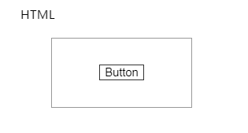
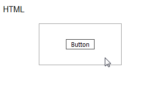
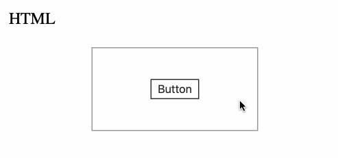

## CSS 中是否存在父选择器？

这是一个非常经典的问题，到目前为止，CSS 没有真正意义上被广泛实现的父选择器，这和浏览器的渲染机制有关。

如果你对 CSS 中是否存在父选择器有疑惑，可以去看看 [知乎 -- CSS 中能否选取父元素？](https://www.zhihu.com/question/20443379)

当然，这不代表 CSS 完全无法通过子元素去控制父元素，通过 `:focus-within` 伪类可以近似的达到类似的目的。

## `:focus-within` 伪类

首先需要复习一下 `:focus-within`，它是一个伪类。

它表示一个元素获得焦点，或，该元素的后代元素获得焦点。**划重点，它或它的后代获得焦点**。

关于 `:focus-within`，不算太了解的可以先看看这篇文章：[《神奇的选择器 :focus-within》](https://github.com/chokcoco/iCSS/issues/36)

利用它，我们可以实现类似这样的功能，通过元素的子元素的获焦（focus 事件），触发该伪元素，从而实现一个狭义的父选择器，类似这样：

<iframe height="300" style="width: 100%;" scrolling="no" title="CSS focus-within INPUT" src="https://codepen.io/mafqla/embed/bGZRWqX?default-tab=html%2Cresult&editable=true&theme-id=light" frameborder="no" loading="lazy" allowtransparency="true" allowfullscreen="true">
  See the Pen <a href="https://codepen.io/mafqla/pen/bGZRWqX">
  CSS focus-within INPUT</a> by mafqla (<a href="https://codepen.io/mafqla">@mafqla</a>)
  on <a href="https://codepen.io">CodePen</a>.
</iframe>

## `:focus-within` 伪类实现父选择的缺陷

借助 `:focus-within` 实现父类选择器最大的问题是，元素必须要有 `focus` 事件，才能触发它或者它的父元素的 `:focus-within`。

所以，这就导致了在之前我认为 `:focus-within` 只能配合 `<button>`、`<input >` 元素一起使用。

> 诸如 `<button>`，`<input>`，`<select>`，`<a>` 这类可交互元素，默认是存在 focus 事件的，而类似 `<div>`，`<span>` 和 `<table>` 这类非交互元素，默认是不能被聚焦的。

也是因为这个原因，大大限制了它的使用场景。基于此，我们引入本文的另外一个主角 -- `tabindex`。

## 使用 `tabindex` 使元素获得 `focus` 事件

[tabindex](https://developer.mozilla.org/zh-CN/docs/Web/HTML/Global_attributes/tabindex): HTML 标签的属性，指示其元素是否可以聚焦，以及它是否/在何处参与顺序键盘导航（通常使用 Tab 键，因此得名）。

也就是说，一个单纯的 div 标签，他是没有 focus 事件的，然而，我们给它加上一个 tabindex 属性，这个时候他就会获得类似 `input` 框一样的表现，拥有了 `focus` 事件，再配合 `:focus-within`，能够使用的场景就大大提升了。

看看伪代码：

```html
<div class="g-father">
  <!-- 没有 focus 事件的 .g-children 元素 -->
  <div class="g-children">Click</div>
</div>
```

```html
<div class="g-father">
  <!-- 拥有 focus 事件的 .g-children 元素 -->
  <div class="g-children" tabindex="-1">Click</div>
</div>
```

> 这里为什么是 `tabindex="-1"` 呢，tabindex 负值表示元素是可聚焦的，但是不能通过键盘导航来访问到该元素。因为我们只需要让元素能够获得 focus 事件，而不需要他真的能够被键盘导航来访问。

这样，配合 `:focus-within`，就能做到当点击子元素的时候，去改变父元素的样式了。

并且，我们可以在任意元素上搭配 `tabindex`，脱离了 `<input>, <a>, <button>` 等元素才有 focus 事件的束缚。

```css
.g-father:focus-within {
  background: #fc0;
}
```

<iframe height="300" style="width: 100%;" scrolling="no" title="tabindex 配合 focus-within 实现div的父选择器" src="https://codepen.io/mafqla/embed/ZEPyKKp?default-tab=html%2Cresult&editable=true&theme-id=light" frameborder="no" loading="lazy" allowtransparency="true" allowfullscreen="true">
  See the Pen <a href="https://codepen.io/mafqla/pen/ZEPyKKp">
  tabindex 配合 focus-within 实现div的父选择器</a> by mafqla (<a href="https://codepen.io/mafqla">@mafqla</a>)
  on <a href="https://codepen.io">CodePen</a>.
</iframe>

## 一个小细节，button 的 focus 事件在 Safari 和 firefox 的上冒泡问题

由于 input 元素（或者任意元素 +`tabindex`） 配合 `:focus-within` 的方案依赖 focus 事件的冒泡。

而对于 `<button>` 元素，稍微有点特殊，存在这样两个问题，即：

1. 在 MacOS 的 Safari 和 Firefox 中， \*\*点击 `<button>` 元素，不会触发 `<button>` 的 focus 事件，也没有 focus 事件冒泡。
2. 在 Windows 的 Safari 和 Firefox 中， **点击 `<button>` 元素，会触发 `<button>` 的 focus 事件，但在被目标元素捕捉到之后，不会继续向上冒泡**。

什么意思呢？我们来验证一下，使用类似这样的结构：

```html
<div class="g-father">
  <input type="button" value="Button" />
</div>
```

```css
input:focus {
  background: #00bcd4;
}

body:focus-within {
  background: blue;
}

.g-father:focus-within {
  background: red;
}
```

看看，在 Chrome 下的表现：


在 Windows 的 Safari，Firefox 下的表现：



在 MacOS 的 Safari，Firefox 下的表现：


在 Chrome 上的表现是正常，而在 Windows 的 Safari、Firefox 上，会触发 button 的 focus 事件，但不会触发父元素的 `:focus-within` 事件，也就是上面说的，focus 事件，在被目标元素捕捉到之后，不会继续向上冒泡。而在 Mac 上，则连 focus 都不会触发。

这一点，在使用的时候务必需要留意。

<iframe height="300" style="width: 100%;" scrolling="no" title="button 的 focus 事件冒泡性验证（Chorme / Safari / Firefox）" src="https://codepen.io/mafqla/embed/XWGgRRM?default-tab=html%2Cresult&editable=true&theme-id=light" frameborder="no" loading="lazy" allowtransparency="true" allowfullscreen="true">
  See the Pen <a href="https://codepen.io/mafqla/pen/XWGgRRM">
  button 的 focus 事件冒泡性验证（Chorme / Safari / Firefox）</a> by mafqla (<a href="https://codepen.io/mafqla">@mafqla</a>)
  on <a href="https://codepen.io">CodePen</a>.
</iframe>
