## 背景基础知识

我们都知道，CSS 中的 `background` 是非常强大的。

首先，复习一下基础，在日常中，我们使用最多的应该就是下面 4 种：

- 纯色背景 `background: #000`：

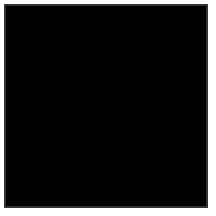

- 线性渐变 `background: linear-gradient(#fff, #000)` :

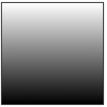

- 径向渐变 `background: radial-gradient(#fff, #000)` :

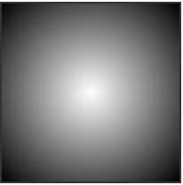

- 角向渐变 `background: conic-gradient(#fff, #000)` :

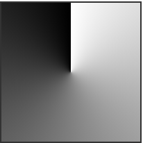

## 背景进阶

当然。掌握了基本的渐变之后，我们开始向更复杂的背景图案进发。我最早是在《CSS Secret》一书中接触学习到使用渐变去实现各种背景图案的。然后就是不断的摸索尝试，总结出了一些经验。

在尝试使用渐变去制作更复杂的背景之前，列出一些比较重要的技巧点：

- 渐变不仅仅只能是单个的 `linear-gradient` 或者单个的 `radial-gradient`，对于 `background` 而言，它是支持多重渐变的叠加的，一点非常重要；
- 灵活使用 `repeating-linear-gradeint`（`repeating-radial-gradeint`），它能减少很多代码量
- `transparent` 透明无处不在
- 尝试 `mix-blend-mode` 与 `mask`，创建复杂图案的灵魂
- 使用随机变量，它能让一个 idea 变成无数美丽的图案

接下来，开始组合之旅。

## 使用 mix-blend-mode

mix-blend-mode ，混合模式。最常见于 photoshop 中，是 PS 中十分强大的功能之一。在 CSS 中，我们可以利用混合模式将多个图层混合得到一个新的效果。

然后，我们来尝试第一个图案，先简单体会一下 `mix-blend-mode` 的作用。

我们使用 `repeating-linear-gradient` 重复线性渐变，制作两个角度相反的背景条纹图。正常而言，不使用混合模式，将两个图案叠加在一起，看看会发生什么。

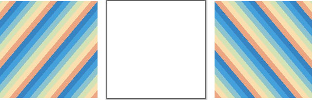

额，会发生什么就有鬼了:sweat_smile: 。显而易见，由于图案不是透明的，叠加在一起之后，由于层叠的关系，只能看到其中一张图。

好，在这个基础上，我们给**最上层**的图案，添加 `mix-blend-mode: multiply`，再来一次，看看这次会发生什么。

<iframe height="300" style="width: 100%;" scrolling="no" title="Repeating-linear-gradient background" src="https://codepen.io/mafqla/embed/poYwKjo?default-tab=html%2Cresult&editable=true&theme-id=light" frameborder="no" loading="lazy" allowtransparency="true" allowfullscreen="true">
  See the Pen <a href="https://codepen.io/mafqla/pen/poYwKjo">
  Repeating-linear-gradient background</a> by mafqla (<a href="https://codepen.io/mafqla">@mafqla</a>)
  on <a href="https://codepen.io">CodePen</a>.
</iframe>

可以看到，添加了混合模式之后，两张背景图通过某种算法叠加在了一起，展现出了非常漂亮的图案效果，也正是我们想要的效果。

### 尝试不同的 `mix-blend-mode`

那为什么上面使用的是 `mix-blend-mode: multiply` 呢？用其他混合模式可以不可以？

当然可以。这里仅仅只是一个示例，`mix-blend-mode: multiply` 在 PS 中意为**正片叠底**，属于图层混合模式的变暗模式组之一。

我们使用上面的 DEMO，尝试其他的混合模式，可以得到不同的效果。

<iframe height="300" style="width: 100%;" scrolling="no" title="Repeating-linear-gradient background" src="https://codepen.io/mafqla/embed/xxBrzwq?default-tab=html%2Cresult&editable=true&theme-id=light" frameborder="no" loading="lazy" allowtransparency="true" allowfullscreen="true">
  See the Pen <a href="https://codepen.io/mafqla/pen/xxBrzwq">
  Repeating-linear-gradient background</a> by mafqla (<a href="https://codepen.io/mafqla">@mafqla</a>)
  on <a href="https://codepen.io">CodePen</a>.
</iframe>

可以看到，不同的混合模式的叠加，效果相差非常之大。当然，运用不同的混合模式，我们也就可以创造出效果各异的图案。

### 借助 CSS-Doodle 随机生成图案

到这，就不得不引出一个写 CSS 的神器 -- **[CSS-Doodle](https://css-doodle.com/)**，我在其他非常多文章中也多次提到过 CSS-doodle，简单而言，它是一个基于 Web-Component 的库。允许我们快速的创建基于 CSS Grid 布局的页面，并且提供各种便捷的指令及函数（随机、循环等等），让我们能通过一套规则，得到不同 CSS 效果。

还是以上面的 DEMO 作为示例，我们将 `repeating-linear-gradient` 生成的重复条纹背景的颜色、粗细、角度随机化、采用的混合模式也是随机选取，然后利用 CSS-Doodle，快速随机的创建各种基于此规则的图案：

<iframe height="300" style="width: 100%;" scrolling="no" title="CSS Doodle - CSS MIX-BLEND-MODE Background " src="https://codepen.io/mafqla/embed/VwRWdvy?default-tab=html%2Cresult&editable=true&theme-id=light" frameborder="no" loading="lazy" allowtransparency="true" allowfullscreen="true">
  See the Pen <a href="https://codepen.io/mafqla/pen/VwRWdvy">
  CSS Doodle - CSS MIX-BLEND-MODE Background </a> by mafqla (<a href="https://codepen.io/mafqla">@mafqla</a>)
  on <a href="https://codepen.io">CodePen</a>.
</iframe>

可以点进去尝试一下，点击鼠标即可随机生成不同的效果：

### 尝试使用径向渐变

当然，上面使用的是**线性渐变**，同样，我们也可以使用**径向渐变**运用同样的套路。

我们可以使用径向渐变，生成多重的径向渐变。像是这样：

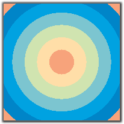

给图片应用上 `background-size`，它就会像是这样：

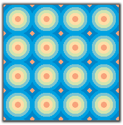

像上文一样，我们稍微对这个图形变形一下，然后叠加两个图层，给最上层的图形，添加 CSS 样式 `mix-blend-mode: darken`：

<iframe height="300" style="width: 100%;" scrolling="no" title="radial-gradient &amp; mix-blend-mode Demo" src="https://codepen.io/mafqla/embed/OJqgEya?default-tab=html%2Cresult&editable=true&theme-id=light" frameborder="no" loading="lazy" allowtransparency="true" allowfullscreen="true">
  See the Pen <a href="https://codepen.io/mafqla/pen/OJqgEya">
  radial-gradient &amp; mix-blend-mode Demo</a> by mafqla (<a href="https://codepen.io/mafqla">@mafqla</a>)
  on <a href="https://codepen.io">CodePen</a>.
</iframe>

### 借助 CSS-Doodle 随机生成图案

再来一次，我们使用 CSS-Doodle，运用上述的规则在径向渐变，也可以得到一系列有意思的背景图。

可以点进去尝试一下，点击鼠标即可随机生成不同的效果：

<iframe height="300" style="width: 100%;" scrolling="no" title="CSS Doodle - CSS MIX-BLEND-MODE Background 2" src="https://codepen.io/mafqla/embed/NWJgzGm?default-tab=html%2Cresult&editable=true&theme-id=light" frameborder="no" loading="lazy" allowtransparency="true" allowfullscreen="true">
  See the Pen <a href="https://codepen.io/mafqla/pen/NWJgzGm">
  CSS Doodle - CSS MIX-BLEND-MODE Background 2</a> by mafqla (<a href="https://codepen.io/mafqla">@mafqla</a>)
  on <a href="https://codepen.io">CodePen</a>.
</iframe>

当然，上述的叠加都是非常简单的图案的叠加，但是掌握了这个原理之后，就可以自己尝试，去创造更复杂的融合。:dog:

上述的叠加效果是基于大片大片的实色的叠加，当然 `mix-blend-mode` 还能和真正的渐变碰撞出更多的火花。

## 在不同的渐变背景中运用混合模式

在不同的渐变背景中运用混合模式？那会产生什么样美妙的效果呢？

运用得当，它可能会像是这样：

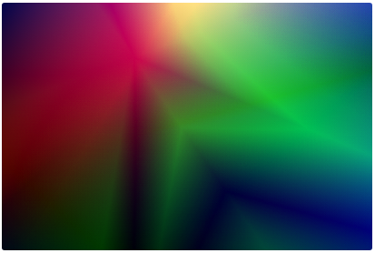

umm，与上面的条纹图案完全不一样的风格。

你可以戳进 [gradienta.io](https://gradienta.io/) 来看看，这里全是使用 CSS 创建的渐变叠加的背景图案库。

### 使用混合模式叠加不同的渐变图案

下面，我们也来实现一个。

首先，我们使用线性渐变或者径向渐变，随意创建几个渐变图案，如下所示：

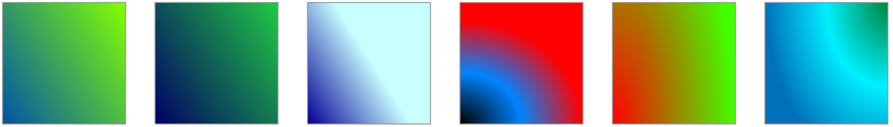

接着，我们两两之间，从第二层开始，使用一个混合模式进行叠加，一共需要设定 5 个混合模式，这里我使用了 `overlay`, `multiply`, `difference`, `difference`, `overlay`。看看叠加之后的效果，非常的 Nice：

<iframe height="300" style="width: 100%;" scrolling="no" title="graideint background mix" src="https://codepen.io/mafqla/embed/abMwKdJ?default-tab=html%2Cresult&editable=true&theme-id=light" frameborder="no" loading="lazy" allowtransparency="true" allowfullscreen="true">
  See the Pen <a href="https://codepen.io/mafqla/pen/abMwKdJ">
  graideint background mix</a> by mafqla (<a href="https://codepen.io/mafqla">@mafqla</a>)
  on <a href="https://codepen.io">CodePen</a>.
</iframe>

由于上面动图 GIF 的压缩率非常高，所以看上去锯齿很明显图像很模糊，你可以点进上面的链接看看。

然后，我们可以再给叠加后的图像再加上一个 `filter: hue-rotate()`，让他动起来，放大一点点看看效果，绚丽夺目的光影效果：

<iframe height="300" style="width: 100%;" scrolling="no" title="gradient background mix 2" src="https://codepen.io/mafqla/embed/VwRWdeQ?default-tab=html%2Cresult&editable=true&theme-id=light" frameborder="no" loading="lazy" allowtransparency="true" allowfullscreen="true">
  See the Pen <a href="https://codepen.io/mafqla/pen/VwRWdeQ">
  gradient background mix 2</a> by mafqla (<a href="https://codepen.io/mafqla">@mafqla</a>)
  on <a href="https://codepen.io">CodePen</a>.
</iframe>

### 借助 CSS-Doodle 随机生成图案

噔噔噔，没错，这里我们又可以继续把 CSS-Doodle 搬出来了。

随机的渐变，随机的混合模式，叠加在一起，燥起来吧。

**使用 CSS-Doodle 随机创建不同的渐变，在随机使用不同的混合模式，让他们叠加在一起**，看看效果：

<iframe height="300" style="width: 100%;" scrolling="no" title="CSS Doodle Mix Gradient" src="https://codepen.io/mafqla/embed/OJqgEMr?default-tab=html%2Cresult&editable=true&theme-id=light" frameborder="no" loading="lazy" allowtransparency="true" allowfullscreen="true">
  See the Pen <a href="https://codepen.io/mafqla/pen/OJqgEMr">
  CSS Doodle Mix Gradient</a> by mafqla (<a href="https://codepen.io/mafqla">@mafqla</a>)
  on <a href="https://codepen.io">CodePen</a>.
</iframe>

> 当然，由于是完全随机生成的效果，所以部分时候生成出来的不算太好看或者直接是纯色的。不过大部分还是挺不错的 😂

---

感谢坚持，看到这里。上述上半部分主要使用的**混合模式**，接下来，下半部分，将主要使用 `mask`，精彩继续。

---

## 使用 mask

除去混合模式，与背景相关的，还有一个非常有意思的属性 -- **MASK**。

[mask](https://developer.mozilla.org/zh-CN/docs/Web/CSS/mask) 译为遮罩。在 CSS 中，mask 属性允许使用者**通过遮罩或者裁切特定区域的图片的方式来隐藏一个元素的部分或者全部可见区域**。

简单而言，mask 可以让图片我们可以灵活的控制图片，设定一部分展示出来，另外剩余部分的隐藏。

### 使用 mask 对图案进行切割

举个例子。假设我们使用 `repeating-linear-gradient` 渐变制作这样一个渐变图案：

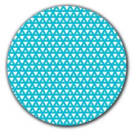

它的 CSS 代码大概是这样：

```css
:root {
  $colorMain: #673ab7;
}
 {
  background: repeating-linear-gradient(
      0,
      $colorSub 0,
      $colorSub 3px,
      transparent 3px,
      transparent 10px
    ), repeating-linear-gradient(
      60deg,
      $colorSub 0,
      $colorSub 3px,
      transparent 3px,
      transparent 10px
    ), repeating-linear-gradient(-60deg, $colorSub 0, $colorSub 3px, transparent
        3px, transparent 10px);
}
```

如果我们给这个图案，叠加一个这样的 mask ：

```css
 {
  mask: conic-gradient(from -135deg, transparent 50%, #000);
}
```

上述 mask 如果是使用 background 表示的话，是这样 `background: conic-gradient(from -135deg, transparent 50%, #000)`, 图案是这样：

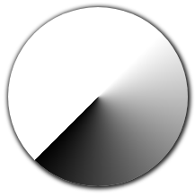

两者叠加在一起，按照 mask 的作用，**背景与 mask 生成的渐变的 transparent 的重叠部分，将会变得透明**。将会得到这样一种效果：

<iframe height="300" style="width: 100%;" scrolling="no" title=" mask &amp; background Demo" src="https://codepen.io/mafqla/embed/eYXRKZZ?default-tab=html%2Cresult&editable=true&theme-id=light" frameborder="no" loading="lazy" allowtransparency="true" allowfullscreen="true">
  See the Pen <a href="https://codepen.io/mafqla/pen/eYXRKZZ">
   mask &amp; background Demo</a> by mafqla (<a href="https://codepen.io/mafqla">@mafqla</a>)
  on <a href="https://codepen.io">CodePen</a>.
</iframe>

我们就完成了 background 与 mask 的结合。运用 mask 切割 background 的效果，我们就能制作出非常多有意思的背景图案：

<iframe height="300" style="width: 100%;" scrolling="no" title="mask-composite Background" src="https://codepen.io/mafqla/embed/zYbzaqo?default-tab=html%2Cresult&editable=true&theme-id=light" frameborder="no" loading="lazy" allowtransparency="true" allowfullscreen="true">
  See the Pen <a href="https://codepen.io/mafqla/pen/zYbzaqo">
  mask-composite Background</a> by mafqla (<a href="https://codepen.io/mafqla">@mafqla</a>)
  on <a href="https://codepen.io">CodePen</a>.
</iframe>

### `mask-composite` OR `-webkit-mask-composite`

接下来，在运用 mask 切割图片的同时，我们会再运用到 `-webkit-mask-composite` 属性。这个是非常有意思的元素，非常类似于 `mix-blend-mode` / `background-blend-mode`。

[-webkit-mask-composite](https://developer.mozilla.org/en-US/docs/Web/CSS/-webkit-mask-composite): 属性指定了将应用于同一元素的多个蒙版图像相互合成的方式。

通俗点来说，他的作用就是，当一个元素存在多重 `mask` 时，我们就可以运用 `-webkit-mask-composite` 进行效果叠加。

注意，这里的一个前提，就是当 mask 是多重 mask 的时候（类似于 background，mask 也是可以存着多重 mask），`-webkit-mask-composite` 才会生效。这也就元素的 mask 可以指定多个，逗号分隔。

假设我们有这样一张背景图：

```css
:root {
  $colorMain: #673ab7;
  $colorSub: #00bcd4;
}
div {
  background: linear-gradient(-60deg, $colorMain, $colorSub);
}
```

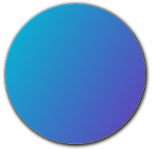

我们的 mask 如下：

```css
 {
  mask: repeating-linear-gradient(
      30deg,
      #000 0,
      #000 10px,
      transparent 10px,
      transparent 45px
    ), repeating-linear-gradient(
      60deg,
      #000 0,
      #000 10px,
      transparent 10px,
      transparent 45px
    ), repeating-linear-gradient(90deg, #000 0, #000 10px, transparent 10px, transparent
        45px);
}
```

mask 表述成 `background` 的话大概是这样：

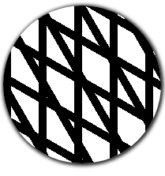

如果，不添加任何 `-webkit-mask-composite`，叠加融合之后的效果是这样：

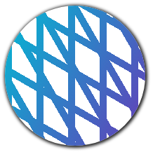

如果添加一个 `-webkit-mask-composite: xor`，则会变成这样：

可以看到，线条的交汇叠加处，有了不一样的效果。

<iframe height="300" style="width: 100%;" scrolling="no" title="background &amp; -webkit-mask-composite" src="https://codepen.io/mafqla/embed/mdowKPj?default-tab=html%2Cresult&editable=true&theme-id=light" frameborder="no" loading="lazy" allowtransparency="true" allowfullscreen="true">
  See the Pen <a href="https://codepen.io/mafqla/pen/mdowKPj">
  background &amp; -webkit-mask-composite</a> by mafqla (<a href="https://codepen.io/mafqla">@mafqla</a>)
  on <a href="https://codepen.io">CodePen</a>.
</iframe>

### 借助 CSS-Doodle 随机生成图案

了解了基本原理之后，上 CSS-Doodle，我们利用多重 mask 和 `-webkit-mask-composite`，便可以创造出各式各样的美妙背景图案：

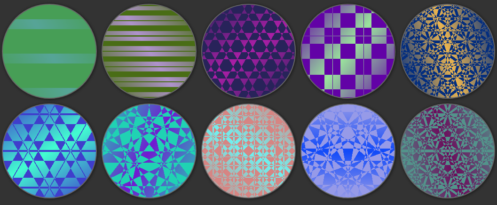

是不是很类似万花筒？

借助了 CSS-Doodle，我们只设定大致的规则，辅以随机的参数，随机的大小。接着就是一幅幅美妙的背景图应运而生。

下面是运用上述规则的尝试的一些图案：

<iframe height="300" style="width: 100%;" scrolling="no" title="CSS Doodle - CSS MASK Background" src="https://codepen.io/mafqla/embed/QWogxNe?default-tab=html%2Cresult&editable=true&theme-id=light" frameborder="no" loading="lazy" allowtransparency="true" allowfullscreen="true">
  See the Pen <a href="https://codepen.io/mafqla/pen/QWogxNe">
  CSS Doodle - CSS MASK Background</a> by mafqla (<a href="https://codepen.io/mafqla">@mafqla</a>)
  on <a href="https://codepen.io">CodePen</a>.
</iframe>

当然，可以尝试变换外形，譬如让它长得像个手机壳。

下面两个 DEMO 也是综合运用了上述的一些技巧的示例，仿佛一个个手机壳的图案。

<iframe height="300" style="width: 100%;" scrolling="no" title="CSS Doodle - CSS MASK Background 2" src="https://codepen.io/mafqla/embed/rNRwKLL?default-tab=html%2Cresult&editable=true&theme-id=light" frameborder="no" loading="lazy" allowtransparency="true" allowfullscreen="true">
  See the Pen <a href="https://codepen.io/mafqla/pen/rNRwKLL">
  CSS Doodle - CSS MASK Background 2</a> by mafqla (<a href="https://codepen.io/mafqla">@mafqla</a>)
  on <a href="https://codepen.io">CodePen</a>.
</iframe>

<iframe height="300" style="width: 100%;" scrolling="no" title="CSS Doodle - CSS MASK Background 3" src="https://codepen.io/mafqla/embed/LYaLrZz?default-tab=html%2Cresult&editable=true&theme-id=light" frameborder="no" loading="lazy" allowtransparency="true" allowfullscreen="true">
  See the Pen <a href="https://codepen.io/mafqla/pen/LYaLrZz">
  CSS Doodle - CSS MASK Background 3</a> by mafqla (<a href="https://codepen.io/mafqla">@mafqla</a>)
  on <a href="https://codepen.io">CodePen</a>.
</iframe>

## 总结一下

背景 `background` 不仅仅只是纯色、线性渐变、径向渐变、角向渐变。混合模式、滤镜、遮罩也并不孤独。

当 `background` 配合混合模式 `mix-blend-mode`，`background-blend-mode`、滤镜 `filter`、以及遮罩 `mask` 的时候，它们就可以组合变幻出各种不同的效果。

到目前为止，CSS 已经越来越强大，它不仅仅可以用于写业务，也可以创造很多有美感的事物，只要我们愿意去多加尝试，便可以创造出美妙的图案。
