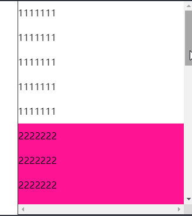

## position-sticky 生效的原理

[在 W3 官方文档中的定义是](https://www.w3.org/TR/css-position-3/#stickypos-scroll)：Sticky positioning is similar to relative positioning except the offsets are automatically calculated in reference to the nearest scrollport.

转换成通俗的大白话就是，Sticky 定位类似于相对定位，（当它表现为 fixed 定位的特性时）会根据最近的滚动容器（nearest scrollport）自动计算偏移量。

其中有一个非常重要的概念就是 nearest scrollport，它表示 sticky 元素在即将消失前会相对它最近的 scrollport 去做定位。

## 正常的 DEMO

所以正常而言，类似下面的这种情况，sticky 是可以正常展示的。

```html
<div class="container">
  - 可滚动的容器 scrollport
  <div class="sticky">- 设置了 sticky 的元素</div>
</div>
```

<iframe height="300" style="width: 100%;" scrolling="no" title="Normal Sticky Demo" src="https://codepen.io/mafqla/embed/NWJvrKG?default-tab=html%2Cresult&editable=true&theme-id=light" frameborder="no" loading="lazy" allowtransparency="true" allowfullscreen="true">
  See the Pen <a href="https://codepen.io/mafqla/pen/NWJvrKG">
  Normal Sticky Demo</a> by mafqla (<a href="https://codepen.io/mafqla">@mafqla</a>)
  on <a href="https://codepen.io">CodePen</a>.
</iframe>

## 失效的 position: sticky

### 1、包裹的父容器高度与 sticky 元素一致

有趣的是，如果在 `.sticky` 元素和你希望 `.sticky` 生效吸附的滚动元素中间，添加上一层 `.parent` 的 div 元素，不给 div 添加任何样式，sticky 则失效了。

譬如是这样：

```html
<div class="container">
  - 可滚动的容器 scrollport
  <div class="parent">
    <div class="sticky">- 设置了 sticky 的元素</div>
  </div>
</div>
```

<iframe height="300" style="width: 100%;" scrolling="no" title="invalid Sticky Demo 1" src="https://codepen.io/mafqla/embed/eYXEzOR?default-tab=html%2Cresult&editable=true&theme-id=light" frameborder="no" loading="lazy" allowtransparency="true" allowfullscreen="true">
  See the Pen <a href="https://codepen.io/mafqla/pen/eYXEzOR">
  invalid Sticky Demo 1</a> by mafqla (<a href="https://codepen.io/mafqla">@mafqla</a>)
  on <a href="https://codepen.io">CodePen</a>.
</iframe>

失效原因：此时 `.sticky` 元素的最近的 scrollport 变成了它的父容器 div，而父容器 div 的高度和 `.sticky` 元素的高度是一样的，所以表现不出 fixed 的特性。

其实，这里不算失效，我们只需要将包裹 `.sticky` 元素的父容器的高度设置的大于 `.sticky` 元素本身，也能看到效果。

譬如，我们可以加上

```css
.parent {
  height: 100vh;
}
```

此时，`sticky` 将重新生效，像是这样：



其实，造成这种现象的本质原因是，**设置了 `position: sticky` 的元素吸附的基准元素从 `.container` 变成了 `.parent`** 。

### 2、包裹的父容器设置了 `overflow: hidden`

第二种情况，也会导致 `position: sticky` 的 fixed 定位特性失效。也就是 `.sticky` 元素的祖先容器存在 overflow: hidden。类似这样：

```html
<div class="container">
  - 可滚动的容器 scrollport
  <div class="hidden">
    - 设置了 overflow: hidden
    <div class="sticky">- 设置了 sticky 的元素</div>
  </div>
</div>
```

<iframe height="300" style="width: 100%;" scrolling="no" title="invalid Sticky Demo 2" src="https://codepen.io/mafqla/embed/dyrzXbg?default-tab=html%2Cresult&editable=true&theme-id=light" frameborder="no" loading="lazy" allowtransparency="true" allowfullscreen="true">
  See the Pen <a href="https://codepen.io/mafqla/pen/dyrzXbg">
  invalid Sticky Demo 2</a> by mafqla (<a href="https://codepen.io/mafqla">@mafqla</a>)
  on <a href="https://codepen.io">CodePen</a>.
</iframe>

在上面这个 DEMO 里面，设置了 `sticky` 的元素的父元素 `hidden` 元素，它的高度是远比 `stikcy` 元素高的，但是滚动的过程中却没有表现出 fixed 的特性。

原因在于，设置了 `overflow: hidden` 的元素，它不再代用滚动的特性，`当 `sticky`元素吸附于`.hidden`元素的顶部时，它随着 `.hidden` 元素本身在 container 移动。所以，所有的 sticky 元素都会被滚动出 container 的滚动区域。

当然，这里有一点比较奇怪的是，`.sticky` 元素相对 `.hidden` 元素进行 fixed 定位，而不是相对 `.container` 元素进行 fixed 定位，表面设置了 `overflow: hidden` 的元素，它也是一个 scrollport。

其实，不止是 `overflow: hidden` ，**设定为 `position: sticky` 元素的任意父节点的 overflow 属性必须是 visible，否则 `position:sticky` 不会生效**。

## 总结一下

看完上面几个 DEMO，可以好好总结一下 `position:sticky` 的生效规则，明白了生效规则就会知道为什么有的时候设定的 `sticky` 会失效：

1. 须指定 top, right, bottom 或 left 四个阈值其中之一（且达到设定的阈值），才可使粘性定位生效。否则其行为与相对定位相同；

   - 并且 top 和 bottom 同时设置时，top 生效的优先级高，left 和 right 同时设置时，left 的优先级高

2. 设定为

   ```css
   position: sticky;
   ```

   的元素的任意父节点的 overflow 属性必须是 visible，否则

   ```css
   position: sticky;
   ```

   不会生效；

   - 如果 position: sticky 元素的任意父节点定位设置为 position: overflow，则父容器无法进行滚动，所以 position:sticky 元素也不会有滚动然后固定的情况

3. 在满足上述情况下，设定了 `position: sticky` 的元素的父容器的高度必须大于当前元素，否则也会失效。（当然，此时，`sticky` 吸附的基准元素就会变成父元素）
