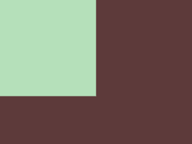
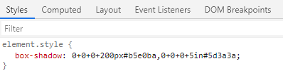

## CSS Battle

首先，这让我想到了，年初的时候沉迷的一个网站 [CSS Battle](https://github.com/chokcoco/iCSS/issues/cssbattle.dev) 。这个网站是核心玩法就是：

官方给出一张图形，在给定的 400 x 300 的画布上，能够用越短的代码实现它，分数就越高。

**注意是，完全一模一样还原**。

其中，[第一题](https://cssbattle.dev/play/1)就非常有趣，看看题目：



嗯，想一想，如果给定这样一张图形，告诉你 HTML 的大小是 `400px` x `300px`，图片中使用到的颜色是 `#5D3A3A, #B5E0BA`，你会怎么用 CSS 去实现它呢？

因为要求，字符数越少，分数越高，当然是选字符少的标签，是不是这样：

```css
<p>
<style>
body{background:#5D3A3A;}
p {width: 200px;height:200px;background:#B5E0BA;}
</style>
```

> 这个网站的设定，HTML 和 CSS 可以按照上述格式写在一起，`<style>` 标签内的即为 CSS，之外的是 HTML ，标签 `<p></p>` 可以简写为 `<p>`

额，这样当然可以，但是看看文章的标题，一行 CSS ？这明显不是啊，并且这里有 100+ 个字符。我们得把字符数压一压。

嗯嗯嗯，想到了阴影，尝试下使用 `box-shadow`：

```css
<a>
<style>
a {
    box-shadow:0 0 0 200px #b5e0ba,0 0 0 400px #5d3a3a;
}
</style>
```

利用两层阴影，完美实现图例图形，并且，字符数压缩到了 82 个。当然，这还不是极致，我们完全可以内联 CSS，再减少字符数：

```css
<a style="box-shadow:0 0 0 200px #b5e0ba,0 0 0 400px #5d3a3a">
```

只有 62 个字符。当然，从一行代码的角度，这个问题完美的解决了，如果追求极致的字符数，上述的代码还可以再简化一下：

```css
<a style=box-shadow:0+0+0+200px#b5e0ba,0+0+0+5in#5d3a3a>
```

> 这里有一些小知识点，HTML5 支持属性后面不用引号包住，又譬如 `box-shadow:  0 0 0 400px #5d3a3a` 是可以压缩到 `box-shadow:0+0+0+5in#5d3a3a`，CSS 中 `1in=96px`，但是画布只有 400px，5in 大于 400px，也没有问题，能够充满画布，但是 `400px` 相对 `5in` 字符多了 2 个。

浏览器里面看一下，这个是完全正确的写法：



OK，最终只有 56 个字符，完美。当然，CSS Battle 里面还有更多更复杂的挑战，也有很多能够通过一行代码实现的，感兴趣的尝试下。

## 一行背景代码

要说到 CSS 最有意思的属性，我觉得背景（background）肯定能够获得很多选票。背景分为：

- 纯色
- 线性渐变(`linear-gradient`)
- 径向渐变(`radial-gradient`)
- 角向渐变(`conic-gradient`)
- 多重线性渐变(`repeating-linear-gradient`)
- 多重径向渐变(`repeating-radial-gradient`)
- 多重角向渐变(`repeating-conic-gradient`)

突出一个字，离谱。并且它们还可以互相混合、叠加添加滤镜、配合各种背景相关属性等等等。

不过今天，来看看一行 CSS Background 代码能玩出什么花来。嗯？这里的主角是多重角向渐变(`repeating-conic-gradient`)，只用一行 CSS 代码：

```css
 {
  background: repeating-conic-gradient(#fff, #000, #fff 0.1deg);
}
```

这什么玩意？脑补一下，这行代码绘制出来的图形会是什么样子？看看：


Wow，不可思议。这里 `0.1deg` 非常关键，这里的角度越小（小于 1deg 为佳），图形越酷炫。

我们把 `0.1deg` 替换成 `30deg` 看看：

```css
 {
  background: repeating-conic-gradient(#fff, #000, #fff 30deg);
}
```

<iframe height="300" style="width: 100%;" scrolling="no" title="One Line CSS Pattern" src="https://codepen.io/mafqla/embed/wvOrPdv?default-tab=html%2Cresult&editable=true&theme-id=light" frameborder="no" loading="lazy" allowtransparency="true" allowfullscreen="true">
  See the Pen <a href="https://codepen.io/mafqla/pen/wvOrPdv">
  One Line CSS Pattern</a> by mafqla (<a href="https://codepen.io/mafqla">@mafqla</a>)
  on <a href="https://codepen.io">CodePen</a>.
</iframe>

我们可以再利用 [CSS - Doodle](https://css-doodle.com/)，随机产生这份美：

<iframe height="300" style="width: 100%;" scrolling="no" title="CSS Doodle - CSS Magic Conic-gradient" src="https://codepen.io/mafqla/embed/rNRGYmw?default-tab=html%2Cresult&editable=true&theme-id=light" frameborder="no" loading="lazy" allowtransparency="true" allowfullscreen="true">
  See the Pen <a href="https://codepen.io/mafqla/pen/rNRGYmw">
  CSS Doodle - CSS Magic Conic-gradient</a> by mafqla (<a href="https://codepen.io/mafqla">@mafqla</a>)
  on <a href="https://codepen.io">CodePen</a>.
</iframe>

> CSS - Doodle 它是一个基于 Web-Component 的库。允许我们快速的创建基于 CSS Grid 布局的页面，并且提供各种便捷的指令及函数（随机、循环等等），让我们能通过一套规则，得到不同 CSS 效果。

## `margin: auto` 与 `place-items: center`

这个也非常有意思，当然，它不算严格意义上的一行 CSS，因为需要搭配其他属性一起使用。

最快水平垂直居中一个元素的方法是什么？

水平垂直居中也算是 CSS 领域最为常见的一个问题了，不同场景下的方法也各不相同，各有优劣。嗯，下面这两种方法应该算是最便捷的了：

### 方法一：`flex` 布局下的 `margin: auto`

```html
<div class="g-container">
  <div class="g-box"></div>
</div>
```

```css
.g-container {
  display: flex;
}

.g-box {
  margin: auto;
}
```

> 上面的 `display: flex` 替换成 `display: inline-flex | grid | inline-grid` 也是可以的。

在 `display: flex` 布局下， `margin auto` 的生效不仅是水平方向，垂直方向也会自动去分配这个剩余空间。

<iframe height="300" style="width: 100%;" scrolling="no" title="最便捷的垂直居中方式 -- flex + margin:auto" src="https://codepen.io/mafqla/embed/oNVGoWM?default-tab=html%2Cresult&editable=true&theme-id=light" frameborder="no" loading="lazy" allowtransparency="true" allowfullscreen="true">
  See the Pen <a href="https://codepen.io/mafqla/pen/oNVGoWM">
  最便捷的垂直居中方式 -- flex + margin:auto</a> by mafqla (<a href="https://codepen.io/mafqla">@mafqla</a>)
  on <a href="https://codepen.io">CodePen</a>.
</iframe>

如果你对非常有用的 `margin: auto` 还不是很了解，可以看看：[探秘 flex 上下文中神奇的自动 margin](https://github.com/chokcoco/iCSS/issues/64)

### 方法二：`grid` 布局下的 `place-items: center`

直接上代码：

```css
.g-container {
  display: grid;
  place-items: center;
}
```

上述两份代码效果都是一样的：

<iframe height="300" style="width: 100%;" scrolling="no" title="最便捷的垂直居中方式 -- grid+ place-items: center" src="https://codepen.io/mafqla/embed/RwdLjVv?default-tab=html%2Cresult&editable=true&theme-id=light" frameborder="no" loading="lazy" allowtransparency="true" allowfullscreen="true">
  See the Pen <a href="https://codepen.io/mafqla/pen/RwdLjVv">
  最便捷的垂直居中方式 -- grid+ place-items: center</a> by mafqla (<a href="https://codepen.io/mafqla">@mafqla</a>)
  on <a href="https://codepen.io">CodePen</a>.
</iframe>
