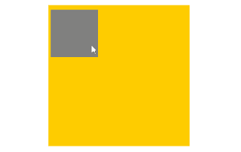
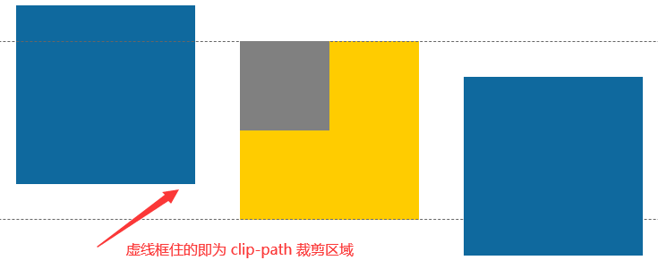
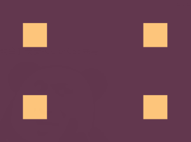

## 控制 `overflow: hidden` 的方向

这源自一个实际的需求，在某个需求当中，要求容器内的内容，**在竖直方向上超出容器会被裁剪，而在水平方向上超出容器，则不会被裁剪**。类似这样：



有意思，第一个想到的解法当然是在上述黄色背景元素本身之外再套用一层父元素，然后父元素才是实际设置 `overflow: hidden` 的元素，父元素的范围就是实际才是控制是否裁剪的范围。类似这样：


实际的父元素才是设置了 `overflow: hidden` 的元素。

当然，如果实际情况就是这么简单，也没什么问题。

但是如果元素处于一个复杂的布局流内，那么可能就没有那么多的空间，让我们再去包裹一层父容器了：


类似上图的情况，还是中间黄色元素，要求只有竖直方向超出裁剪。此时，包裹父元素不再那么容易施展。所以，我们需要另辟蹊径。

### 利用 `clip-path` 进行裁剪

好的，这会可以进入正文了。CSS 中，除了 `overflow: hidden`，还是有其它属性也可以实现超出容器区域进行裁剪的。`clip-path` 便是其中翘楚。

使用 `clip-path`，我们可以方便的控制任意方向上的裁剪。上述的需求则可以这样解决：

```html
<div class="g-container">
  <div class="sub"></div>
</div>
```

关键的 CSS 代码如下：

```css
.g-container {
  width: 200px;
  height: 200px;
  clip-path: polygon(-1000% 0, 1000% 0, 1000% 100%, -1000% 100%);
}
```

这里利用了 `clip-path: polygon()` 来裁剪一个矩形区域，而利用了 `clip-path` 支持负坐标的特点，将裁剪的起点定到远离坐标能画成一个大矩形的形状。示意图：



这样，我们能够在正常布局流中，当前容器大小范围内，画出任意希望 `overflow: hidden` 的范围。

<iframe height="300" style="width: 100%;" scrolling="no" title="Clip-path overflow" src="https://codepen.io/mafqla/embed/bGZYORB?default-tab=html%2Cresult&editable=true&theme-id=light" frameborder="no" loading="lazy" allowtransparency="true" allowfullscreen="true">
  See the Pen <a href="https://codepen.io/mafqla/pen/bGZYORB">
  Clip-path overflow</a> by mafqla (<a href="https://codepen.io/mafqla">@mafqla</a>)
  on <a href="https://codepen.io">CodePen</a>.
</iframe>

再举两个例子：

```css
 {
  // 裁剪出左右两边都 overflow:hidden，上下不 overflow:hidden 的区域
  clip-path: polygon(0 -1000%, 100% -1000%, 100% 1100%, 0 1100%);

  // 裁剪出左边、上边、右边都 overflow:hidden，下边不 overflow: hidden 的区域
  clip-path: polygon(100% 0，100% 1000%, 0 1000%, 0 0);
}
```

当然，上述代码中的 `1000%` 是非常灵活的，自己控制，够用就行。

## 非 overflow、clip-path 的裁剪方式

那么。通过上面的一个小例子，我们知道了 `overflow`，`clip-path` 可以裁剪区域。那么除了这两个，CSS 中还有没有可以进行区域裁剪的元素呢？

有，还有一个有意思的元素，就是 -- `contain` 。

`contain` 属性允许我们指定特定的 DOM 元素和它的子元素，让它们能够独立于整个 DOM 树结构之外。目的是能够让浏览器有能力只对部分元素进行重绘、重排，而不必每次都针对整个页面。

### `contain: paint` 进行内容裁剪

详细说说 `contain: paint`，设定了 `contain: paint` 的元素即是开启了**布局限制**，也就是说，此元素的子元素不会在此元素的边界之外被展示。

> `contain: paint` 属性产生的目的，即是为加快页面的渲染，在非必要区域，不渲染元素。因此，如果元素不在屏幕上或以其他方式设定为不可见，则其后代不可见不被渲染。

```css
.g-container {
  contain: paint;
}
```

看看示例：

<iframe height="300" style="width: 100%;" scrolling="no" title="contain: paint Demo" src="https://codepen.io/mafqla/embed/yLwPGXP?default-tab=html%2Cresult&editable=true&theme-id=light" frameborder="no" loading="lazy" allowtransparency="true" allowfullscreen="true">
  See the Pen <a href="https://codepen.io/mafqla/pen/yLwPGXP">
  contain: paint Demo</a> by mafqla (<a href="https://codepen.io/mafqla">@mafqla</a>)
  on <a href="https://codepen.io">CodePen</a>.
</iframe>

### `contain: paint` 的副作用

`contain: paint` 的本意是用于提升页面的渲染，裁剪到容器之外的元素不进行渲染。但是使用它会产生一些副作用：

1. 它会生成一个自己的新的堆叠上下文(It becomes a stacking context)，也就是说，它会改变它的子元素的 absolute 定位和 fixed 定位的基准；
2. 它会成为新的格式化上下文(It becomes a new formatting context)，也就是说，这意味着元素外部的布局不会再影响它的子元素；

我们解释下第一点，非常的有意思，**它会生成一个自己的新的堆叠上下文**，也就是说，它将改变 `position: fixed` 元素的基准，它会使得设置了 `position: fixed` 的元素不再相对于视口进行定位，而是相对于该元素进行定位。也就是退化成了 `position: absolute`。

## 总结一下

到此，本文提供了 3 种可以实现超出容器范围裁剪的方法：

- `overflow: hidden`
- `clip-path` 绘制裁切区域
- `contain: paint` 不绘制元素范围外的内容

<iframe height="300" style="width: 100%;" scrolling="no" title="Overflow Hidden In CSS" src="https://codepen.io/mafqla/embed/ZEPaVyr?default-tab=html%2Cresult&editable=true&theme-id=light" frameborder="no" loading="lazy" allowtransparency="true" allowfullscreen="true">
  See the Pen <a href="https://codepen.io/mafqla/pen/ZEPaVyr">
  Overflow Hidden In CSS</a> by mafqla (<a href="https://codepen.io/mafqla">@mafqla</a>)
  on <a href="https://codepen.io">CodePen</a>.
</iframe>

当然，它们之间还是有一些差异：

1. `overflow: hidden` 和 `contain: paint` 会创建一个 BFC，而`clip-path`不会，它只是单纯的裁剪
2. 兼容性间的差异

所以也就是说，CSS 不仅仅只有 `overflow: hidden` 实现 `overflow: hidden`，很多情况，可以灵活使用。

## 牛刀小试


这个网站是核心玩法就是：官方给出一张图形，在给定的 400 x 300 的画布上，**能够用越短的代码实现它，分数就越高**。

上次讲了一题通过一行 CSS 代码实现，今天，我们再来看看[第二题](https://cssbattle.dev/play/2)：

]

怎么用最短的代码实现它呢？想想今天说的 `clip-path`。

首先，我们利用这一一段代码，生成这样一个图形：

```css
body {
  margin: 0 50px;
  background: #62374e;
  border: 50px dashed #fdc57b;
}
```


然后，利用 `clip-path`，把上下两部分裁掉即可。

```css
body {
    margin: 0 50px;
    background: #62374e;
    border: 50px dashed #fdc57b;
  + clip-path: polygon(0 50px, 100% 50px, 100% 250px, 0 250px);
}
```


这样就完美实现啦。当然，现在字符数有点多，有 158 个字符这么多。其实对于裁剪矩形区域，`clip-path` 有更便捷的语法，上述 `clip-path:polygon(0 50px, 100% 50px, 100% 250px, 0 250px)` 可以替换成 `clip-path:inset(50px 0)`，减少了 20 个字符。

当然，再暴力一点，我们也可以一行实现：

```html
<body
  bgcolor="62374e"
  style="margin:0+50;border:dashed+50px#fdc57b;clip-path:inset(50px+0"
></body>
```

> 当然，这里可能用了一些这个网站才允许的语法，不过核心实现还是在于用 `clip-path` 切割掉多余部分
