## 中心布局

本文的所有技巧都会围绕这个布局展开，属于一类技巧。

首先，我们需要这样一种中心布局。简单的 HTML 结构如下：

```html
<div class="g-container">
  <div class="g-box"></div>
  <div class="g-box"></div>
  <div class="g-box"></div>
  <div class="g-box"></div>
  <div class="g-box"></div>
</div>
```

```css
.g-container {
  position: relative;
  width: 300px;
  height: 300px;
}
.g-box {
  position: absolute;
  top: 50%;
  left: 50%;
  margin-left: -150px;
  margin-top: -150px;
  width: 100%;
  height: 100%;
  border: 1px solid #000;
}
```

利用绝对定位和 `margin`，将元素全部水平垂直居中叠在一起（因为后面会用到 `transform`，所以选取了这种水平垂直居中的方式），结果如下：

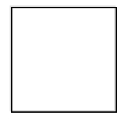

好吧，看着平平无奇，但是基于这种布局，我们可以衍生出非常多有意思的图案。

## 改变元素大小

最简单的，就是我们可以改变元素的大小。

CSS 代码写着太累，所以我们简单的借助 `pug` HTML 模板引擎和 SASS。

```html
div.g-container -for(var i=0; i<10; i++) div.g-box
```

```scss
$count: 10;
@for $i from 1 to $count + 1 {
  .g-box:nth-child(#{$i}) {
    --width: #{$i * 30}px;
    width: var(--width);
    height: var(--width);
    margin-left: calc(var(--width) / -2);
    margin-top: calc(var(--width) / -2);
  }
}
```

容器下包含 10 个子元素，每个子元素大小逐渐递增，很容易得到如下结果：

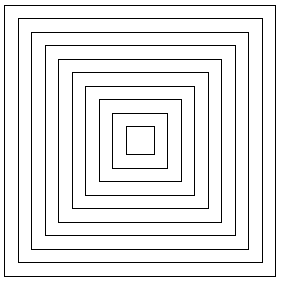

## 改变元素颜色

接着，我们继续改变元素的颜色，让它呈现渐变颜色逐级递进，可以是**边框颜色**：

```scss
@for $i from 1 to $count + 1 {
    .g-box:nth-child(#{$i}) {
         ...
         border-color: hsla(
            calc(#{$i * 25}),
            50%,
            65%,
            1
        );
    }
}
```

得到这样的效果：

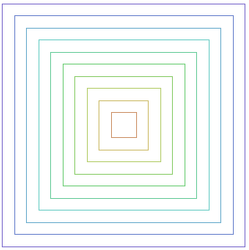

也可以是改变背景 `background` 的颜色：

```scss
@for $i from 1 to $count + 1{
    .g-box:nth-child(#{$i}) {
        ...
        background: hsla(
            calc(#{$i * 25}),
            50%,
            65%,
            1
        );
        z-index: #{$count - $i};
    }
}
```

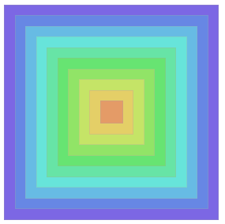

## 改变元素角度

好，接下来，就可以开始变换角度了，我们利用 `transform`，将元素旋转不同的角度：

```scss
@for $i from 1 to $count + 1{
    .g-box:nth-child(#{$i}) {
        ....
        transform: rotate(#{$i * 7}deg);
    }
}
```

效果如下：

<iframe height="300" style="width: 100%;" scrolling="no" title="CSS pattern" src="https://codepen.io/mafqla/embed/abMEWbx?default-tab=html%2Cresult&editable=true&theme-id=light" frameborder="no" loading="lazy" allowtransparency="true" allowfullscreen="true">
  See the Pen <a href="https://codepen.io/mafqla/pen/abMEWbx">
  CSS pattern</a> by mafqla (<a href="https://codepen.io/mafqla">@mafqla</a>)
  on <a href="https://codepen.io">CodePen</a>.
</iframe>

OK，到这里，基本的一些概念就引入的差不多了，总而言之，利用多元素居中布局，改变元素的大小、颜色、透明度、角度、阴影、滤镜、混合模式等等等等，只要你能想到的，都可以。

接下来，我们再引入本文的另外一个主角 -- CSS-doodle 。

[CSS-doodle](https://css-doodle.com/) 是一个基于 Web-Component 的库。允许我们快速的创建基于 CSS Grid 布局的页面，以实现各种 CSS 效果（或许可以称之为 CSS 艺术）。

其最终效果的代码，本质是都还是 CSS。具体的一些概念可以点击主页看看，一看就懂。

## 使用 CSS-doole 实现多元素水平垂直居中布局

我们将上面的布局利用 CSS-doodle 再实现一次，要实现 50 个元素的居中对齐，只需要如下简单的声明即可：

```scss
<css-doodle>
	:doodle {
		@grid: 1x50 / 100vmin;
	}
	@place-cell: center;
</css-doodle>
```

上面的意思大概是，在 `100vmin x 100vmin` 大小的容器下，声明一个 1x50 的 grid 网格布局，利用 `@place-cell: center` 将它们全部水平垂直居中，也就是会叠加在一起。

这样可能看不出效果，我们再给每个元素设置不同的大小，给它们都加上一个简单的 `border`：

```scss
<css-doodle>
	:doodle {
		@grid: 1x50 / 100vmin;
	}
	@place-cell: center;
	@size: calc(100% - @calc(@index() - 1) * 2%);
	border: 1px solid #000;
</css-doodle>
```

- `@size: calc(100% - @calc(@index() - 1) * 2%)` 表示每个子元素宽高的大小（也可以单独设置高宽），`@index` 是个变量，表示当前元素的序号，从 1 - 50，表示没个元素分别为容器的 2% 高宽、4% 高宽一直到 100% 高宽。
- `border: 1px solid #000` 就是正常的 CSS 代码，里面没有变量，作用于每一个元素

效果如下：

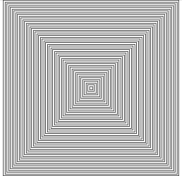

Oh No，眼睛开始花了。这样，我们就快速的实现了前面铺垫时候利用 HTML 代码和繁琐的 CSS 生成的图形效果。

## CSS 艺术

接下来，就开始美妙的 CSS 艺术。

## 改变元素的旋转角度及边框颜色

我们利用上述代码继续往下，为了更好的展示效果，首先整体容器的底色改为黑色，接着改变元素的旋转角度。每个元素旋转 `30deg x @index`。

代码非常的短，大概是这样：

```scss
<css-doodle>
	:doodle {
		@grid: 1x100 / 100vmin;
	}
	@place-cell: center;
	@size: calc(100% - @calc(@index() - 1) * 1%);
	transform: rotate(calc(@index() * 30deg));
	border: 1px solid #fff;
</css-doodle>
```

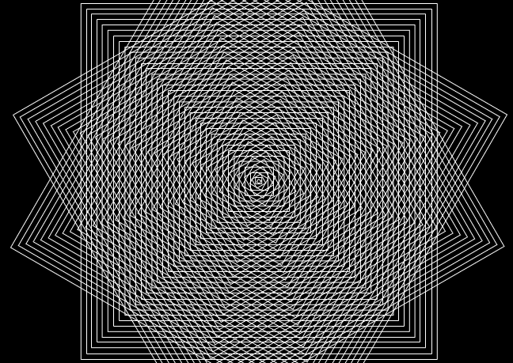

不太好看，接着，我们试着给每个元素，渐进的设置不同的 `border` 颜色，并且透明度 opacity 逐渐降低,，这里我们会用到 `hsla` 颜色表示法：

```scss
<css-doodle>
	:doodle {
		@grid: 1x100 / 100vmin;
	}
	@place-cell: center;
	@size: calc(100% - @calc(@index() - 1) * 1%);
	transform: rotate(calc(@index() * 30deg));
	border: 1px solid hsla(
		calc(calc(100 - @index()) * 2.55),
		calc(@index() * 1%),
		50%,
		calc(@index() / 100)
	);
</css-doodle>
```

再看看效果：

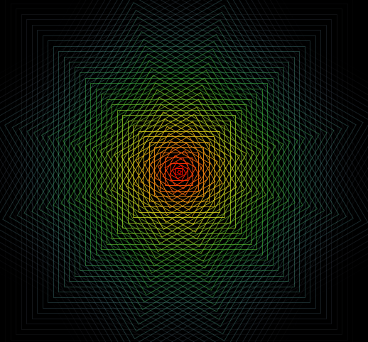

Wow，第一幅看上去还不错的作品出现了。

当然，每一个不同的角度，都能产生不一样的效果，通过 CSS-doodle，可以快速生成不同随机值，随机产生不同的效果。我们稍微改变一下上述代码，将 `transform` 那一行改一下，引入了一个随机值：

```scss
<css-doodle>
	:doodle {
		--rotate: @r(0, 360)deg;
	}
	transform: rotate(calc(@index() * var(--rotate)));
</css-doodle>
```

- 利用 `@r(0, 360)deg`，能随机生成一个介于 0 到 360 之间的随机数，后面可以直接跟上单位，也就变成了一个随机角度值
- `transform: rotate(calc(@index() * var(--rotate)))`，利用 `calc` 规则引入随机生成的 CSS 变量，当然，再不刷新页面的前提下，每一次这个值都是固定的

这样，我们每次刷新页面，就可以得到不同的效果了（当然，CSS-doodle 做了优化，添加短短几行代码就可以通过点击页面刷新效果），改造后的效果，我们每次点击都可以得到一个新的效果：

<iframe height="300" style="width: 100%;" scrolling="no" title="CSS Doodle - CSS Magic Pattern" src="https://codepen.io/mafqla/embed/RwdxVNa?default-tab=html%2Cresult&editable=true&theme-id=light" frameborder="no" loading="lazy" allowtransparency="true" allowfullscreen="true">
  See the Pen <a href="https://codepen.io/mafqla/pen/RwdxVNa">
  CSS Doodle - CSS Magic Pattern</a> by mafqla (<a href="https://codepen.io/mafqla">@mafqla</a>)
  on <a href="https://codepen.io">CodePen</a>.
</iframe>

> 强烈建议你点进 Demo，自己点点鼠标感受一下 :)

## background 颜色奇偶不同

好，我们再换个思路，这次不改变 `border` 的颜色，而是通过选择器控制奇数序号的元素和偶数序号的元素，分别给予它们不一样的背景色：

```scss
<css-doodle>
	:doodle {
		@grid: 1x100 / 100vmin;
	}
	@place-cell: center;
	@size: calc(100% - @calc(@index() - 1) * 1%);
	transform: rotate(calc(@index() * 60deg));

	background: rgba(0, 0, 0, calc((@index * 0.01)));
	@even {
		background: rgba(255, 255, 255, calc((@index * 0.01)));
	}
</css-doodle>
```

利用 `@even {}` 可以快速选中偶数序号的元素，然后给他赋予白色底色，而奇数元素则赋予黑色底色，看看效果：

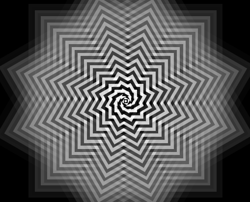

还是一样的思路，我们可以将随机值赋予 `transform` 的旋转角度，利用黑白叠加，看看再不同角度下，都会有什么效果：

<iframe height="300" style="width: 100%;" scrolling="no" title="CSS Doodle - CSS Magic Pattern" src="https://codepen.io/mafqla/embed/OJqzmPp?default-tab=html%2Cresult&editable=true&theme-id=light" frameborder="no" loading="lazy" allowtransparency="true" allowfullscreen="true">
  See the Pen <a href="https://codepen.io/mafqla/pen/OJqzmPp">
  CSS Doodle - CSS Magic Pattern</a> by mafqla (<a href="https://codepen.io/mafqla">@mafqla</a>)
  on <a href="https://codepen.io">CodePen</a>.
</iframe>

当然，在随机的过程中，你也可以选取自己喜欢的，将它们保留下来。

CSS-doodle 支持多种方式的引入，在一页中展示多个图形，不在话下，像是这样：

<iframe height="300" style="width: 100%;" scrolling="no" title="CSS-doodle Pure CSS Pattern  " src="https://codepen.io/mafqla/embed/QWoavwa?default-tab=html%2Cresult&editable=true&theme-id=light" frameborder="no" loading="lazy" allowtransparency="true" allowfullscreen="true">
  See the Pen <a href="https://codepen.io/mafqla/pen/QWoavwa">
  CSS-doodle Pure CSS Pattern  </a> by mafqla (<a href="https://codepen.io/mafqla">@mafqla</a>)
  on <a href="https://codepen.io">CodePen</a>.
</iframe>

## 规律总结

小小总结一下，想要生成不同的图案，其实**只需要找到能够生成不同线条，或者造型图案图形，将它们按照不同的大小，不同的旋转角度，不同颜色及透明度叠加在一起即可**。

这样的话，一些可能的 idea：

- 只利用单向的 border 会是怎么样的呢？
- 出现的 border 都是 `solid`，如果换成是虚线 `dashed` 呢？或许可以再加上 `border-radius`
- `text-decoration` 也支持一些各式的下划线，我们也可以利用它们试试

OK，将上述想法付诸实践，我们就可以得到利用各式线条绘制出来的各式图形。它们可能是这样：

<iframe height="300" style="width: 100%;" scrolling="no" title="CSS-doodle Pure CSS Pattern  " src="https://codepen.io/mafqla/embed/MWxrmYB?default-tab=html%2Cresult&editable=true&theme-id=light" frameborder="no" loading="lazy" allowtransparency="true" allowfullscreen="true">
  See the Pen <a href="https://codepen.io/mafqla/pen/MWxrmYB">
  CSS-doodle Pure CSS Pattern  </a> by mafqla (<a href="https://codepen.io/mafqla">@mafqla</a>)
  on <a href="https://codepen.io">CodePen</a>.
</iframe>

## `clip-path` 与 `drop-shadow`

嘿，说到创造不同的线条与图案，就不得不提 CSS 里另外两个有意思是属性。`clip-path` 与 `fitler: drop-shadow()`。

嗯哼？什么意思呢。我们来个简单的 Demo，利用 `clip-path` ，我们可以裁剪出不同的元素造型。譬如实现一个简单的多边形：

```scss
div {
  width: 300px;
  height: 300px;
  clip-path: polygon(
    50% 0%,
    90% 20%,
    100% 60%,
    75% 100%,
    25% 100%,
    0% 60%,
    10% 20%
  );
  background: #333;
}
```

效果如下：

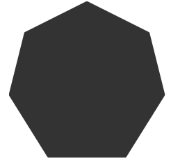

那么利用这个思路，我们就可以尝试利用 `clip-path` 裁剪出各种不同的造型进行叠加。

在 [CSS-doodle Shapes](https://css-doodle.com/shapes/) 中，内置了非常多的 clip-path 图形供我们选择：

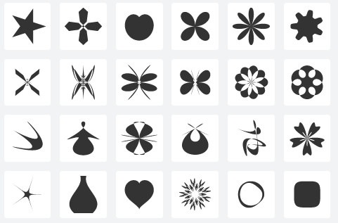

我们随机选取一个：


套用上述的规则，尝试着实现一个图形：

```scss
<css-doodle>
	:doodle {
		@grid: 1x100 / 100vmin;
	}
	@place-cell: center;
	@size: calc(100% - @calc(@index() - 1) * 1%);
	background: hsla(
		calc(calc(100 - @index()) * 2.55),
		calc(@index() * 1%),
		65%,
		calc(@index() / 100)
	);
	clip-path: @shape(
		fill-rule: evenodd;
		split: 200;
		scale: .45;
		x: cos(2t) + cos(π - 5t);
		y: sin(2t) + sin(π - 5t);
	);
</css-doodle>
```

这次没有旋转不同的角度，只是给每一层赋予不同的背景底色，能够得到这样的效果：

<iframe height="300" style="width: 100%;" scrolling="no" title="CSS Doodle - CSS Magic Pattern" src="https://codepen.io/mafqla/embed/qBvpmEe?default-tab=html%2Cresult&editable=true&theme-id=light" frameborder="no" loading="lazy" allowtransparency="true" allowfullscreen="true">
  See the Pen <a href="https://codepen.io/mafqla/pen/qBvpmEe">
  CSS Doodle - CSS Magic Pattern</a> by mafqla (<a href="https://codepen.io/mafqla">@mafqla</a>)
  on <a href="https://codepen.io">CodePen</a>.
</iframe>

### `Clip-path` 与 `drop-shadow` 创造不同线条

OK，上述是利用 `Clip-path` 创造了不同的图案，那不同的线条怎么得来呢？

别急。这就需要请出我们另外一个属性 `drop-shadow`，利用 `drop-shadow`，可以给 `Clip-path` 裁剪出来的图形创造不同的阴影，当然有一些结构上的限制，大概的伪代码如下：

```scss
div {
  position: relative;
  width: 300px;
  height: 300px;
  filter: drop-shadow(0px 0px 1px black);

  &::after {
    content: '';
    position: absolute;
    width: 100%;
    height: 100%;
    left: 0;
    right: 0;
    background: #fff;
    clip-path: polygon(
      50% 0%,
      90% 20%,
      100% 60%,
      75% 100%,
      25% 100%,
      0% 60%,
      10% 20%
    );
  }
}
```

我们需要将 `filter: drop-shadow(0px 0px 2px black)` 作用在利用了 `clip-path` 的元素的父元素之上，并且，利用了 `clip-path:` 的元素必须带有 `background`，才能给裁剪元素附上阴影效果。

上述的代码如下：

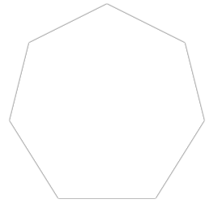

OK，完美，这样一来，我们就极大极大的丰富了我们的线条库，再运用会上述的线条规则，一大波新的图案应运而生。

<iframe height="300" style="width: 100%;" scrolling="no" title="CSS-doodle Pure CSS Pattern  - clip-path - drop-shadow" src="https://codepen.io/mafqla/embed/wvOpdae?default-tab=html%2Cresult&editable=true&theme-id=light" frameborder="no" loading="lazy" allowtransparency="true" allowfullscreen="true">
  See the Pen <a href="https://codepen.io/mafqla/pen/wvOpdae">
  CSS-doodle Pure CSS Pattern  - clip-path - drop-shadow</a> by mafqla (<a href="https://codepen.io/mafqla">@mafqla</a>)
  on <a href="https://codepen.io">CodePen</a>.
</iframe>

OK，限于篇幅，就不一一展开了，感兴趣可以点进上述 Demo Fork 一份自己尝试。还有非常多有意思的图案等待挖掘生成。

最后，再来欣赏一下 CSS-doodle 作者，[袁川](https://codepen.io/yuanchuan)袁老师利用上述技巧的作品：

<iframe height="300" style="width: 100%;" scrolling="no" title="css doodle art" src="https://codepen.io/mafqla/embed/poYpPJV?default-tab=html%2Cresult&editable=true&theme-id=light" frameborder="no" loading="lazy" allowtransparency="true" allowfullscreen="true">
  See the Pen <a href="https://codepen.io/mafqla/pen/poYpPJV">
  css doodle art</a> by mafqla (<a href="https://codepen.io/mafqla">@mafqla</a>)
  on <a href="https://codepen.io">CodePen</a>.
</iframe>
