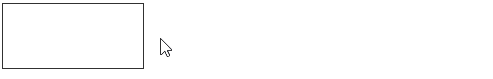
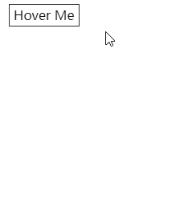
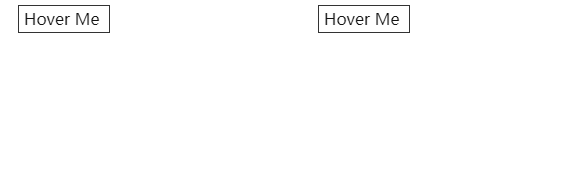
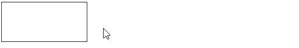
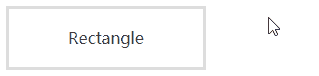
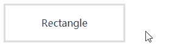
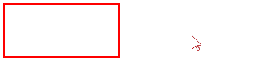
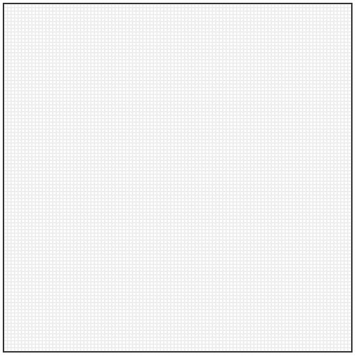
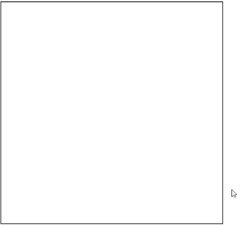

CSS 中，transition 属性用于指定为一个或多个 CSS 属性添加过渡效果。

最为常见的用法，也就是给元素添加一个 transition，让其某个属性从状态 A 变化到状态 B 时，不再是非常直接突兀，而是带有一个补间动画。

举个例子：

```html
<div></div>
```

```html
div { width: 140px; height: 64px; transition: .8s transform linear; } div:hover
{ transform: translate(120px, 0); }
```



当然，除了上述基本的用法，其实 CSS transition 还有一些非常有意思的细节和有趣的用法。下面让我一一娓娓道来。

## 并非所有属性都支持 transition

并非所有属性都支持 transition。和 animation 类似，这里有一个列表，列出了所有支持 transition 的属性 -- [CSS animated properties](https://developer.mozilla.org/zh-CN/docs/Web/CSS/CSS_animated_properties)

当然，有的时候，还有更例外的。某些支持 transition 的属性在某些特定状态下，也是不支持 transition 的。非常典型的就是 `height: auto` 和 `width: auto`。

：

元素的动态高度过渡动画失效，伪代码大概是这样：

```scss
 {
  height: unset;
  transition: height 0.3s linear;

  &.up {
    height: 0;
  }
  &.down {
    height: unset;
  }
}
```

明明给 `height` 属性设置了 `transition`，但是过渡动画没有触发，而是直接一步到位展开：



原因在于， **CSS transtion 不支持元素的高度或者宽度为 auto 的变化**。

对于这种场景，我们可以使用 `max-height` 进行 hack。

这里有一个非常有意思的小技巧。既然不支持 `height: auto`，那我们就另辟蹊径，利用 `max-height` 的特性来做到动态高度的伸缩，譬如：

```scss
 {
  max-height: 0;
  transition: max-height 0.3s linear;

  &.up {
    max-height: 0;
  }
  &.down {
    max-height: 1000px;
  }
}
```



## transition 可以精细化控制每一个属性

继续。在 transition 中，我们可以使用 `transition: all 1s linear` 这样，统一给元素下面的所有支持过渡的属性添加过渡效果（时间及缓动函数）。

同时，我们也可以分别精细化控制每一个属性：

```scss
 {
  // 可以这样
  transition: all 1s linear;

  // 也可以这样
  transition: height 1s linear, transform 0.5s ease-in, color 2s ease-in-out;
}
```

并且，和动画类似，每一个过渡都是支持延迟触发的：

```scss
div {
  // 延迟 1s 触发过渡，过渡动画的时间为 0.8 秒
  transition: 0.8s transform 1s linear;
}
div:hover {
  transform: translate(120px, 0);
}
```



可以看到不管是过渡触发，还是过渡复位，都会等待 1 秒再触发。

利用这个技巧，我们就可以实现一些过渡效果的结合。首先我们实现这样一个宽高变化的过渡动画：

```html
<div></div>
```

```html
div { position: relative; width: 200px; height: 64px; box-shadow: inset 0 0 0
3px #ddd; } div::before { content: ""; position: absolute; width: 0; height: 0;
top: 0; left: 0; width: 0; height: 0; box-sizing: border-box; transition: width
.25s, height .25s, border-bottom-color; transition-delay: .25s, 0s, .25s; }
div:hover::before { width: 200px; height: 64px; border-left: 3px solid #00e2ff;
border-bottom: 3px solid #00e2ff; }
```

我们分别控制元素的伪元素的高度、宽度、及下边框的变化，并且给宽度过渡动画和下边框的颜色动画设置了 0.25 秒的延迟，这样元素的高度会先进行过渡，由于整体的过渡动画世界时间也是 0.25s，所以高度过渡动画结束后，才会开始宽度过渡动画，下边框也才会出现颜色变化。

这样就能把他们的过渡动画衔接在一起，体现到元素的 border 之上，看看效果：



利用同样的原理，我们再把元素的另外一个伪元素也利用上，但是他们的动画时间，整体需要再全部加上 0.5 秒，等到上述的过渡动画执行完毕后才执行：

```scss
div::after {
  right: 0;
  bottom: 0;
}
div:hover::after {
  transition: height 0.25s, width 0.25s, border-top-color 0.25s;
  transition-delay: 0.5s, 0.75s, 0.75s;
  width: 200px;
  height: 64px;
  border-top: 3px solid #00e2ff;
  border-right: 3px solid #00e2ff;
}
```



这样，我们可以把两个伪元素的过渡动画合并，得到一个完整的 border 动画如下：

<iframe height="300" style="width: 100%;" scrolling="no" title="借助transition-delay实现按钮border动画效果" src="https://codepen.io/Chokcoco/embed/GwKOem?default-tab=html%2Cresult&editable=true&theme-id=light" frameborder="no" loading="lazy" allowtransparency="true" allowfullscreen="true">
  See the Pen <a href="https://codepen.io/Chokcoco/pen/GwKOem">
  借助transition-delay实现按钮border动画效果</a> by Chokcoco (<a href="https://codepen.io/Chokcoco">@Chokcoco</a>)
  on <a href="https://codepen.io">CodePen</a>.
</iframe>

**所以，合理控制每一个属性，就能组合得到各种有趣的效果**。

## 动态改变 `transition-duration`

还有一个非常有意思的技巧，我们可以利用元素的一些伪类，动态的去改变元素的 `transition-duration`。

举个例子：

```scss
div {
  width: 140px;
  height: 64px;
  border: 2px solid red;
  transition: 3s all linear;
}
div:hover {
  transition-duration: 0.5s;
  border: 2px solid blue;
}
```

当鼠标 hover 元素时，将元素的过渡动画的持续时间 `transition-duration` 从 3s 改成 0.5s，这样可以做到元素 hover 的时候，过渡动画持续的时间是 0.5s，但是过渡复位的持续时间却是 3s：



利用这个小技巧，我们尝试制作一些有意思的效果。

### 纯 CSS 实现的签名板

利用上述的，小技巧，我们可以实现一个纯 CSS 的签名板。

首先，在高宽都为 500px 的容器中，实现一个 100x100 的 HTML 网格布局，利用 flex、grid 都行，这里为了方便，我借助了 Pug 模板引擎。

```css
div.g-box
    -for(var i=0; i<100; i++)
        div.g-row
            -for(var j=0; j<100; j++)
                div.g-item
```

为了方便示意，我把每个格子加了个 `border`，实际上，背景和格子都是白色的：



为了实现签名的效果，我们给每个格子 `g-item` 加上 hover 事件，hover 时改变当前格子背景色。同时，最重要的是，\*\*在正常状态设置一个非常大的 `transition-duration`，而在 hover 的时候，设置一个非常小的 `transition-duration`，伪代码如下：

```css
.g-item {
  transition: 999999s;
}
.g-item:hover {
  background: #000;
  transition: 0s;
}
```

看看效果：



这样就实现了，鼠标 hover 上去的时候，因为 `transition: 0s` 的缘故，背景色被快速的改变，而当 hover 效果离开， `transition: 999999s` 重新生效，黑色则会以一个非常非常慢的速度失效，以至于慢到感受不到它在发生变化。

当然，要实现签名的话，目前来看还欠缺点什么，我们需要实现鼠标 hover 到画板上不会立即开始出发元素的背景色变化，只有鼠标按下时（保持 `:active` 状态），才开始遵循鼠标轨迹改变颜色。当鼠标停止点击，则停止画画。

这个有个巧妙的方法可以实现，我们在画布上，再叠加一层 div，层级 `z-index` 比画布更高，当鼠标 hover 到画布上，其实是 hover 到这个遮罩层上，当鼠标按下，触发 `:active` 事件时，给元素添加一个 `:activce` 事件，将遮罩层移除即可。

伪代码如下：

```css
div.g-wrap
div.g-box
    -for(var i=0; i<100; i++)
        div.g-row
            -for(var j=0; j<100; j++)
                div.g-item
```

```scss
.g-wrap {
  position: absolute;
  top: 0;
  left: 0;
  bottom: 0;
  right: 0;
  z-index: 10;

  &:active {
    display: none;
  }
}
```

这样，一个完整的签名板，或者说是画板就实现了：

<iframe height="300" style="width: 100%;" scrolling="no" title="Pure CSS signature" src="https://codepen.io/Chokcoco/embed/gOLbrYJ?default-tab=html%2Cresult&editable=true&theme-id=light" frameborder="no" loading="lazy" allowtransparency="true" allowfullscreen="true">
  See the Pen <a href="https://codepen.io/Chokcoco/pen/gOLbrYJ">
  Pure CSS signature</a> by Chokcoco (<a href="https://codepen.io/Chokcoco">@Chokcoco</a>)
  on <a href="https://codepen.io">CodePen</a>.
</iframe>

完整的代码实现，并且利用 CSS 添加上了 `reset` 功能，你可以戳这里：

利用这个技巧，其实就可以用 CSS 实现追随鼠标轨迹的功能（虽然很鸡肋>\_<），我们再可以和其他很多属性混合起来，譬如混合模式和滤镜。
