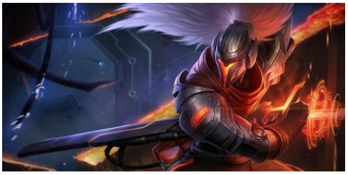
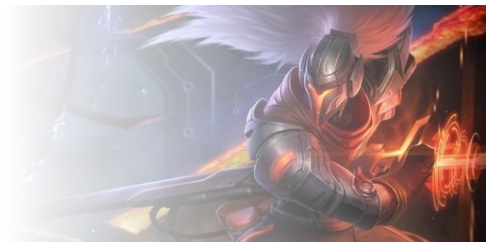
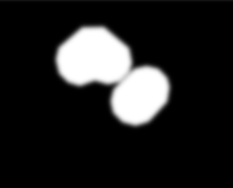

## mask 简单用法介绍

这里只简单介绍下 mask 的基本用法：

最基本，使用 mask 的方式是借助图片，类似这样：

```css
 {
  /* Image values */
  mask: url(mask.png); /* 使用位图来做遮罩 */
  mask: url(masks.svg#star); /* 使用 SVG 图形中的形状来做遮罩 */
}
```

当然，使用图片的方式后文会再讲。借助图片的方式其实比较繁琐，因为我们首先还得准备相应的图片素材，除了图片，mask 还可以接受一个类似 background 的参数，也就是渐变。

类似如下使用方法：

```css
 {
  mask: linear-gradient(#000, transparent); /* 使用渐变来做遮罩 */
}
```

那该具体怎么使用呢？一个非常简单的例子，上述我们创造了一个从黑色到透明渐变色，我们将它运用到实际中，代码类似这样：

下面这样一张图片，叠加上一个从透明到黑色的渐变，

```css
 {
  background: url(image.png);
  mask: linear-gradient(90deg, transparent, #fff);
}
```



应用了 mask 之后，就会变成这样：



这个 DEMO，可以先简单了解到 mask 的基本用法。

这里得到了使用 mask 最重要结论：**添加了 mask 属性的元素，其内容会与 mask 表示的渐变的 transparent 的重叠部分，并且重叠部分将会变得透明。**

值得注意的是，上面的渐变使用的是 `linear-gradient(90deg, transparent, #fff)`，这里的 `#fff` 纯色部分其实换成任意颜色都可以，不影响效果。

<iframe height="300" style="width: 100%;" scrolling="no" title="使用 MASK 的基本使用" src="https://codepen.io/mafqla/embed/vYPRvyr?default-tab=html%2Cresult&editable=true&theme-id=light" frameborder="no" loading="lazy" allowtransparency="true" allowfullscreen="true">
  See the Pen <a href="https://codepen.io/mafqla/pen/vYPRvyr">
  使用 MASK 的基本使用</a> by mafqla (<a href="https://codepen.io/mafqla">@mafqla</a>)
  on <a href="https://codepen.io">CodePen</a>.
</iframe>

## 使用 mask 实现人物遮罩过滤

了解了 mask 的用法后，接下来，我们运用 mask，简单实现视频弹幕中，弹幕碰到人物，自动被隐藏过滤的例子。

首先，我简单的模拟了一个召唤师峡谷，以及一些基本的弹幕：

方便示意，这里使用了一张静态图，表示了召唤师峡谷的地图，并非真的视频，而弹幕则是一条一条的 `<p>` 元素，和实际情况一致。伪代码大概是这样：

```html
<!-- 地图 -->
<div class="g-map"></div>
<!-- 包裹所有弹幕的容器 -->
<div class="g-barrage-container">
  <!-- 所有弹幕 -->
  <div class="g-barrage">6666</div>
  ...
  <div class="g-barrage">6666</div>
</div>
```

为了模拟实际情况，我们再用一个 div 添加一个实际的人物，如果不做任何处理，其实就是我们看视频打开弹幕的感受，人物被视频所遮挡：

注意，这里我添加了一个人物亚索，并且用 animation 模拟了简单的运动，在运动的过程中，人物是被弹幕给遮挡住的。

接下来，就可以请出 mask 了。

我们利用 mask 制作一个 `radial-gradient` ，使得人物附近为 `transparent`，并且根据人物运动的 animation，给 mask 的 `mask-position` 也添加上相同的 animation 即可。最终可以得到这样的效果：

```css
.g-barrage-container {
  position: absolute;
  mask: radial-gradient(
    circle at 100px 100px,
    transparent 60px,
    #fff 80px,
    #fff 100%
  );
  animation: mask 10s infinite alternate;
}

@keyframes mask {
  100% {
    mask-position: 85vw 0;
  }
}
```

实际上就是给放置弹幕的容器，添加一个 `mask` 属性，把人物所在的位置标识出来，并且根据人物的运动不断的去变换这个 mask 即可。我们把 mask 换成 background，原理一看就懂。

- 把 mask 替换成 background 示意图：

background 透明的地方，即 mask 中为 transparent 的部分，实际就是弹幕会被隐藏遮罩的部分，而其他白色部分，弹幕不会被隐藏，正是完美的利用了 mask 的特性。

其实这项技术和视频本身是无关的，我们只需要根据视频计算需要屏蔽掉弹幕的位置，得到相应的 mask 参数即可。如果去掉背景和运动的人物，只保留弹幕和 mask，是这样的：

**需要明确的是，使用 mask，不是将弹幕部分给遮挡住，而是利用 `mask`，指定弹幕容器之下，哪些部分正常展示，哪些部分透明隐藏**。

最后，完整的 Demo 你可以戳这里：

<iframe height="300" style="width: 100%;" scrolling="no" title="mask 实现弹幕人物遮罩过滤" src="https://codepen.io/mafqla/embed/WNmzLoV?default-tab=html%2Cresult&editable=true&theme-id=light" frameborder="no" loading="lazy" allowtransparency="true" allowfullscreen="true">
  See the Pen <a href="https://codepen.io/mafqla/pen/WNmzLoV">
  mask 实现弹幕人物遮罩过滤</a> by mafqla (<a href="https://codepen.io/mafqla">@mafqla</a>)
  on <a href="https://codepen.io">CodePen</a>.
</iframe>

## 实际生产环境中的运用

当然，上面我们简单的还原了利用 mask 实现弹幕遮罩过滤的效果。但是实际情况比上述的场景复杂的多，因为人物英雄的位置是不确定的，每一刻都在变化。所以在实际生产环境中，mask 图片的参数，其实是由后端实时对视频进行处理计算出来的，然后传给前端，前端再进行渲染。

对于运用了这项技术的直播网站，我们可以审查元素，看到包裹弹幕的容器的 mask 属性，每时每刻都在发生变化：

返回回来的其实是一个 SVG 图片，大概长这个样子：



这样，根据视频人物的实时位置变化，不断计算新的 mask，再实时作用于弹幕容器之上，实现遮罩过滤。
