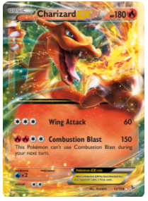
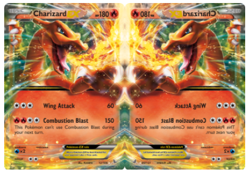
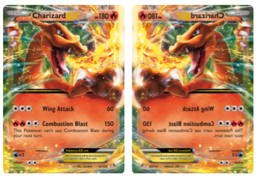
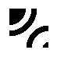
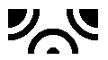
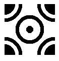
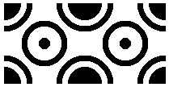
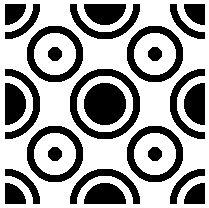

## `-webkit-box-reflect` 基本用法

`-webkit-box-reflect` 的语法非常简单，最基本的用法像是这样：

```css
div {
  -webkit-box-reflect: below;
}
```

其中，below 可以是 below | above | left | right 代表下上左右，也就是有 4 个方向可以选。

假设我们有如下一张图片：

```html
<div></div>
```

```css
div {
  background-image: url('https://images.pokemontcg.io/xy2/12_hires.png');
}
```



加上 `-webkit-box-reflect: right`，也就是右侧的倒影：

```css
div {
  background-image: url('https://images.pokemontcg.io/xy2/12_hires.png');
  -webkit-box-reflect: right;
}
```

效果如下，生成了一个元素右侧的镜像元素：



### 设置倒影距离

在方向后面，还可以接一个具体的数值大小，表示倒影与原元素间的距离。

```css
div {
  background-image: url('https://images.pokemontcg.io/xy2/12_hires.png');
  -webkit-box-reflect: right 10px;
}
```

加上 `10px` 之后，倒影与原元素间将间隔 `10px`：



### 设置倒影虚实

还有一个非常重要的功能，就是方位后面，还能再设置一个渐变值，利用这个渐变值，可以实现倒影的一个虚化效果，这一点非常重要。

```css
div {
  background-image: url('https://images.pokemontcg.io/xy2/12_hires.png');
  -webkit-box-reflect: below 2px linear-gradient(transparent, rgba(0, 0, 0, 0.5));
}
```

看看效果，有了虚实变化之后，这样就更像是一个倒影.

其实，这里的渐变就是给倒影的图片添加了一个 MASK 属性，MASK 属性的 `transparent` 部分，图片将变得透明，而实色部分，则保持原图。

<iframe height="300" style="width: 100%;" scrolling="no" title="-webkit-box-reflect Demo" src="https://codepen.io/mafqla/embed/oNVdWQr?default-tab=html%2Cresult&editable=true&theme-id=light" frameborder="no" loading="lazy" allowtransparency="true" allowfullscreen="true">
  See the Pen <a href="https://codepen.io/mafqla/pen/oNVdWQr">
  -webkit-box-reflect Demo</a> by mafqla (<a href="https://codepen.io/mafqla">@mafqla</a>)
  on <a href="https://codepen.io">CodePen</a>.
</iframe>

## 使用 `-webkit-box-reflect` 实现一些有意思的动效

掌握了基本的语法后，我们就可以利用其实现一些有意思的动效，下面简单罗列一下。

我发现这个属性特别适合运用在一些暗黑系风格的页面中。能够让很多动效看起来高大上很多。（个人审美）

### 在按钮中运用 `-webkit-box-reflect`

配合一些动态边框动画的按钮，能够营造一种很科幻的效果：

<iframe height="300" style="width: 100%;" scrolling="no" title="-webkit-box-reflect Neon Button Hover Effect" src="https://codepen.io/mafqla/embed/vYPjmvE?default-tab=html%2Cresult&editable=true&theme-id=light" frameborder="no" loading="lazy" allowtransparency="true" allowfullscreen="true">
  See the Pen <a href="https://codepen.io/mafqla/pen/vYPjmvE">
  -webkit-box-reflect Neon Button Hover Effect</a> by mafqla (<a href="https://codepen.io/mafqla">@mafqla</a>)
  on <a href="https://codepen.io">CodePen</a>.
</iframe>

### 在文字中运用 `-webkit-box-reflect`

在暗黑系的标题文字中，运用上 `-webkit-box-reflect` ，瞬间高大上了不少。

<iframe height="300" style="width: 100%;" scrolling="no" title="Font &amp; -webkit-box-reflect" src="https://codepen.io/mafqla/embed/GRedmPo?default-tab=html%2Cresult&editable=true&theme-id=light" frameborder="no" loading="lazy" allowtransparency="true" allowfullscreen="true">
  See the Pen <a href="https://codepen.io/mafqla/pen/GRedmPo">
  Font &amp; -webkit-box-reflect</a> by mafqla (<a href="https://codepen.io/mafqla">@mafqla</a>)
  on <a href="https://codepen.io">CodePen</a>.
</iframe>

### 在 3D 中运用 `-webkit-box-reflect`

嘿嘿，接下来，我们甚至可以把 `-webkit-box-reflect` 运用中 3D 效果中，完全不一样的观感体验。

我们给一个 3D 照片墙，加上倒影效果：

<iframe height="300" style="width: 100%;" scrolling="no" title="CSS 3D View &amp; -webkit-box-reflect" src="https://codepen.io/mafqla/embed/wvOjdRg?default-tab=html%2Cresult&editable=true&theme-id=light" frameborder="no" loading="lazy" allowtransparency="true" allowfullscreen="true">
  See the Pen <a href="https://codepen.io/mafqla/pen/wvOjdRg">
  CSS 3D View &amp; -webkit-box-reflect</a> by mafqla (<a href="https://codepen.io/mafqla">@mafqla</a>)
  on <a href="https://codepen.io">CodePen</a>.
</iframe>

## 使用 `-webkit-box-reflect` 创造艺术图案

有趣的 CSS 艺术，它又来了。

在袁川老师的这篇文章中 -- [Chinese Window Lattice And CSS](https://yuanchuan.dev/2019/05/15/window-lattice-and-css.html)，介绍了利用 `-webkit-box-reflect` 生成剪纸艺术这样一种思路。

由于 `-webkit-box-reflect` 可以生成倒影，那么我们利用它进行不断的套娃，一层叠一层，那么只需要生成一个基本的元素，就可以利用倒影产生出各种不同的效果。

假设，我们有如下结构：

```html
<div class="g-wrap1">
  <div class="g-wrap2">
    <div class="g-wrap3">
      <div class="g-wrap4"></div>
    </div>
  </div>
</div>
```

我们只需要给 `.g-wrap4` 实现一个图形，例如这样：

```css
.g-wrap4 {
  background: radial-gradient(
      circle at 0 0,
      #000 30%,
      transparent 30%,
      transparent 40%,
      #000 40%,
      #000 50%,
      transparent 50%
    ), radial-gradient(circle at 100% 100%, #000 10%, transparent 10%, transparent
        30%, #000 30%, #000 40%, transparent 40%);
}
```



然后就是 4 层套娃， 首先给 `.g-wrap4` 加上一层倒影 `-webkit-box-reflect`：

```css
.g-wrap4 {
  -webkit-box-reflect: right 0px;
}
```

得到：



继续套娃，给 `.g-wrap3` 加上一层倒影 `-webkit-box-reflect`：

```css
.g-wrap4 {
  -webkit-box-reflect: right 0px;
}
.g-wrap3 {
  -webkit-box-reflect: below 0px;
}
```



继续，给 `.g-wrap2` 加上一层倒影 `-webkit-box-reflect`：

```css
.g-wrap4 {
  -webkit-box-reflect: right 0px;
}
.g-wrap3 {
  -webkit-box-reflect: below 0px;
}
.g-wrap2 {
  -webkit-box-reflect: left 0px;
}
```



最后，给 `.g-wrap1` 加上一层倒影 `-webkit-box-reflect`：

```css
.g-wrap4 {
  -webkit-box-reflect: right 0px;
}
.g-wrap3 {
  -webkit-box-reflect: below 0px;
}
.g-wrap2 {
  -webkit-box-reflect: left 0px;
}
.g-wrap1 {
  -webkit-box-reflect: above 0px;
}
```

就可以得到一个通过 4 层倒影得到的图形：



这样，通过不同的基础图形，发挥我们的想象力，就可以生成各式各样的剪纸对称图形：

<iframe height="300" style="width: 100%;" scrolling="no" title="-webkit-box-reflect artist" src="https://codepen.io/mafqla/embed/KKERmby?default-tab=html%2Cresult&editable=true&theme-id=light" frameborder="no" loading="lazy" allowtransparency="true" allowfullscreen="true">
  See the Pen <a href="https://codepen.io/mafqla/pen/KKERmby">
  -webkit-box-reflect artist</a> by mafqla (<a href="https://codepen.io/mafqla">@mafqla</a>)
  on <a href="https://codepen.io">CodePen</a>.
</iframe>
