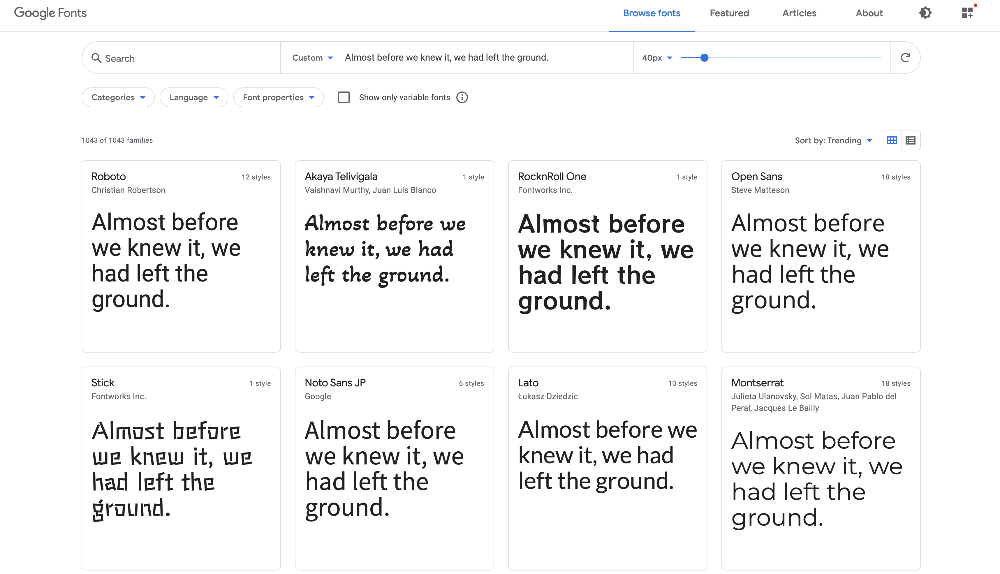
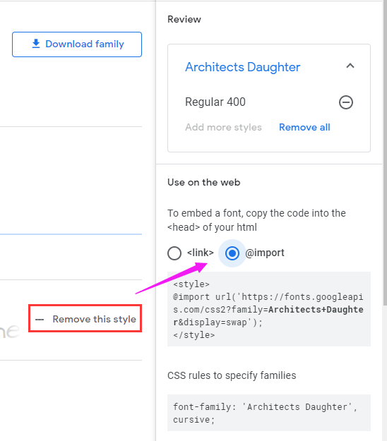
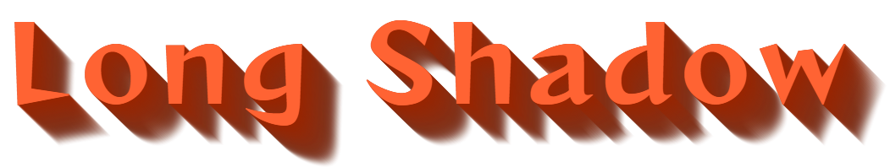
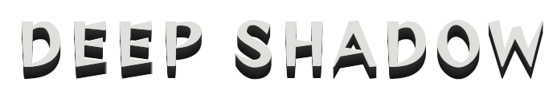
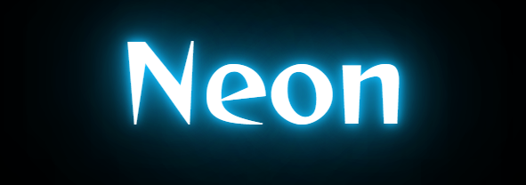
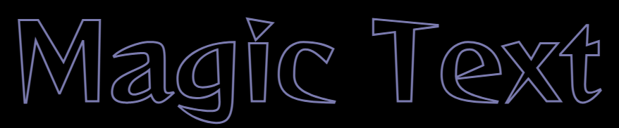
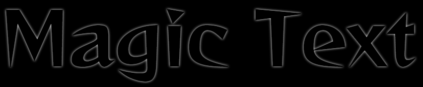
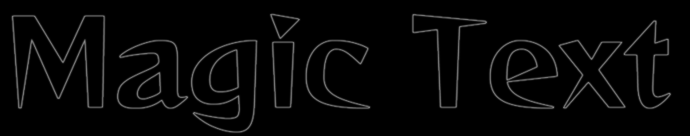
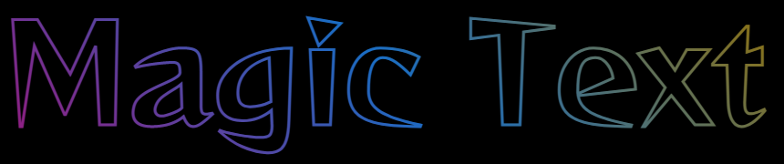
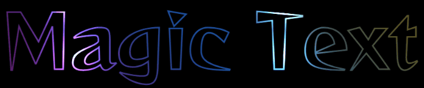

## Google Font

在写各种 DEMO 的时候，有的时候一些特殊的字体能更好的体现动画的效果。这里讲一个快速引入不同格式字体的小技巧。

就是 [Google Font](https://fonts.google.com/) 这个网站，上面有非常多的不同的开源字体：



当我们相中了一个我们喜欢的字体，它也提供了非常快速的便捷的引入方式。选中对应的字体，选择 `+Select this style`，便可以通过 `link` 和 `@import` 两种方式引入：


使用 `link` 标签引入：

```html
<link rel="preconnect" href="https://fonts.gstatic.com" />
<link
  href="https://fonts.googleapis.com/css2?family=Source+Code+Pro:wght@200&display=swap"
  rel="stylesheet"
/>
```

OR，在 CSS 代码中，使用 `@import` 引入：

```html
<style>
  @import url('https://fonts.googleapis.com/css2?family=Source+Code+Pro:wght@200&display=swap');
</style>
```

上述两种方式内部其实都是使用的 `@font-face` 进行了字体的定义。

我们可以通过 [@font-face](https://developer.mozilla.org/zh-CN/docs/Web/CSS/@font-face) 快速声明指定一个自定义字体。类似这样：

```css
@font-face {
  font-family: 'Open Sans';
  src: url('/fonts/OpenSans-Regular-webfont.woff2') format('woff2'), url('/fonts/OpenSans-Regular-webfont.woff')
      format('woff');
}
```

这样，利用 Google Font，我们就可以便捷的享受各种字体了。

我在我的个人项目或者一些 DEMO 中，需要一些艺术字体或者特殊字体展示不一样的效果时，经常会使用这种方式。而至于在业务中，是否需要引入一些特殊字体，就见仁见智了。

---

接下来，就会分门别类的看看，文字在 CSS 中，和不同属性相结合，能够鼓捣出什么样的效果。

## 文字与阴影

通过将字体与字体阴影 `text-shadow`，相结合，阴影的不同运用方式，产生不一样的效果。

我们通过一系列 Demo 来看看。

### 长阴影文字效果

通过多层次，颜色逐渐变化（透明）的阴影变化，可以生成长阴影：

```css
div {
  text-shadow: 0px 0px #992400, 1px 1px rgba(152, 36, 1, 0.98),
    2px 2px rgba(151, 37, 2, 0.96), 3px 3px rgba(151, 37, 2, 0.94),
    4px 4px rgba(150, 37, 3, 0.92), 5px 5px rgba(149, 38, 4, 0.9),
    6px 6px rgba(148, 38, 5, 0.88), 7px 7px rgba(148, 39, 5, 0.86),
    8px 8px rgba(147, 39, 6, 0.84), 9px 9px rgba(146, 39, 7, 0.82),
    10px 10px rgba(145, 40, 8, 0.8), 11px 11px rgba(145, 40, 8, 0.78),
    12px 12px rgba(144, 41, 9, 0.76), 13px 13px rgba(143, 41, 10, 0.74),
    14px 14px rgba(142, 41, 11, 0.72), 15px 15px rgba(142, 42, 11, 0.7),
    16px 16px rgba(141, 42, 12, 0.68), 17px 17px rgba(140, 43, 13, 0.66),
    18px 18px rgba(139, 43, 14, 0.64), 19px 19px rgba(138, 43, 15, 0.62),
    20px 20px rgba(138, 44, 15, 0.6), 21px 21px rgba(137, 44, 16, 0.58),
    22px 22px rgba(136, 45, 17, 0.56), 23px 23px rgba(135, 45, 18, 0.54),
    24px 24px rgba(135, 45, 18, 0.52), 25px 25px rgba(134, 46, 19, 0.5),
    26px 26px rgba(133, 46, 20, 0.48), 27px 27px rgba(132, 47, 21, 0.46),
    28px 28px rgba(132, 47, 21, 0.44), 29px 29px rgba(131, 48, 22, 0.42),
    30px 30px rgba(130, 48, 23, 0.4), 31px 31px rgba(129, 48, 24, 0.38),
    32px 32px rgba(129, 49, 24, 0.36), 33px 33px rgba(128, 49, 25, 0.34),
    34px 34px rgba(127, 50, 26, 0.32), 35px 35px rgba(126, 50, 27, 0.3),
    36px 36px rgba(125, 50, 28, 0.28), 37px 37px rgba(125, 51, 28, 0.26),
    38px 38px rgba(124, 51, 29, 0.24), 39px 39px rgba(123, 52, 30, 0.22),
    40px 40px rgba(122, 52, 31, 0.2), 41px 41px rgba(122, 52, 31, 0.18),
    42px 42px rgba(121, 53, 32, 0.16), 43px 43px rgba(120, 53, 33, 0.14),
    44px 44px rgba(119, 54, 34, 0.12), 45px 45px rgba(119, 54, 34, 0.1),
    46px 46px rgba(118, 54, 35, 0.08), 47px 47px rgba(117, 55, 36, 0.06),
    48px 48px rgba(116, 55, 37, 0.04), 49px 49px rgba(116, 56, 37, 0.02),
    50px 50px rgba(115, 56, 38, 0);
}
```



当然，多重阴影以及每重的颜色我们很难一个一个手动去写，在写长阴影的时候通常需要借助 `SASS`、`LESS` 去帮助节省时间：

```scss
@function makelongrightshadow($color) {
  $val: 0px 0px $color;

  @for $i from 1 through 50 {
    $color: fade-out(desaturate($color, 1%), 0.02);
    $val: #{$val}, #{$i}px #{$i}px #{$color};
  }

  @return $val;
}
div {
  text-shadow: makeLongShadow(hsl(14, 100%, 30%));
}
```

### 立体阴影文字效果

如果多层阴影，但是颜色变化没那么强烈，能够塑造一种立体的效果。

```css
div {
  text-shadow: 0 -1px 0 #ffffff, 0 1px 0 #2e2e2e, 0 2px 0 #2c2c2c, 0 3px 0 #2a2a2a, 0 4px 0 #282828, 0 5px 0 #262626, 0 6px 0 #242424, 0 7px 0 #222222, 0 8px 0 #202020, 0 9px 0 #1e1e1e, 0 10px 0 #1c1c1c, 0 11px 0 #1a1a1a, 0 12px 0 #181818, 0 13px 0 #161616, 0 14px 0 #141414, 0 15px 0 #121212);
}
```



### 内嵌阴影文字效果

合理的阴影颜色和背景底色搭配，搭配，可以实现类似内嵌效果的阴影。

```css
div {
  color: #202020;
  background-color: #2d2d2d;
  letter-spacing: 0.1em;
  text-shadow: -1px -1px 1px #111111, 2px 2px 1px #363636;
}
```

<iframe height="300" style="width: 100%;" scrolling="no" title="5 text shadow effects in css3" src="https://codepen.io/mafqla/embed/xxBjaeP?default-tab=html%2Cresult&editable=true&theme-id=light" frameborder="no" loading="lazy" allowtransparency="true" allowfullscreen="true">
  See the Pen <a href="https://codepen.io/mafqla/pen/xxBjaeP">
  5 text shadow effects in css3</a> by mafqla (<a href="https://codepen.io/mafqla">@mafqla</a>)
  on <a href="https://codepen.io">CodePen</a>.
</iframe>

### 氖光效果（Neon）

氖光效果，英文名叫 Neon，是我在 Codepen 上看到的最多的效果之一。它的原理非常简单，却可以产生非常酷炫的效果。

我们只需要设置 3~n 层阴影效果，每一层的模糊半径（文字阴影的第三个参数）间隔较大，并且每一层的阴影颜色相同即可。

```css
p {
  color: #fff;
  text-shadow: 0 0 10px #0ebeff, 0 0 20px #0ebeff, 0 0 50px #0ebeff, 0 0 100px
      #0ebeff, 0 0 200px #0ebeff;
}
```

当然，通常运用 Neon 效果时，背景底色都是偏黑色。



合理运用 Neon 效果，就可以制作非常多有意思的动效。譬如作用于鼠标 hover 上去的效果：

```css
p {
  transition: 0.2s;

  &:hover {
    text-shadow: 0 0 10px #0ebeff, 0 0 20px #0ebeff, 0 0 50px #0ebeff, 0 0 100px
        #0ebeff, 0 0 200px #0ebeff;
  }
}
```

<iframe height="300" style="width: 100%;" scrolling="no" title="Neon Demo" src="https://codepen.io/mafqla/embed/LYamJvd?default-tab=html%2Cresult&editable=true&theme-id=light" frameborder="no" loading="lazy" allowtransparency="true" allowfullscreen="true">
  See the Pen <a href="https://codepen.io/mafqla/pen/LYamJvd">
  Neon Demo</a> by mafqla (<a href="https://codepen.io/mafqla">@mafqla</a>)
  on <a href="https://codepen.io">CodePen</a>.
</iframe>

<iframe height="300" style="width: 100%;" scrolling="no" title="Neon Glow" src="https://codepen.io/FelixRilling/embed/oNNLMb?default-tab=html%2Cresult&editable=true&theme-id=light" frameborder="no" loading="lazy" allowtransparency="true" allowfullscreen="true">
  See the Pen <a href="https://codepen.io/FelixRilling/pen/oNNLMb">
  Neon Glow</a> by Felix Rilling (<a href="https://codepen.io/FelixRilling">@FelixRilling</a>)
  on <a href="https://codepen.io">CodePen</a>.
</iframe>

也可以选取适当合适的字体，配合动画效果，实现一种渐进的亮灯效果：

```html
<p>
  <span id="n">n</span>
  <span id="e">e</span>
  <span id="o">o</span>
  <span id="n2">n</span>
</p>
```

```css
p:hover span {
  animation: flicker 1s linear forwards;
}
p:hover #e {
  animation-delay: 0.2s;
}
p:hover #o {
  animation-delay: 0.5s;
}
p:hover #n2 {
  animation-delay: 0.6s;
}

@keyframes flicker {
  0% {
    color: #333;
  }
  5%,
  15%,
  25%,
  30%,
  100% {
    color: #fff;
    text-shadow: 0px 0px 5px var(--color), 0px 0px 10px var(--color),
      0px 0px 20px var(--color), 0px 0px 50px var(--color);
  }
  10%,
  20% {
    color: #333;
    text-shadow: none;
  }
}
```

<iframe height="300" style="width: 100%;" scrolling="no" title="Neon Demo" src="https://codepen.io/mafqla/embed/VwRxGNB?default-tab=html%2Cresult&editable=true&theme-id=light" frameborder="no" loading="lazy" allowtransparency="true" allowfullscreen="true">
  See the Pen <a href="https://codepen.io/mafqla/pen/VwRxGNB">
  Neon Demo</a> by mafqla (<a href="https://codepen.io/mafqla">@mafqla</a>)
  on <a href="https://codepen.io">CodePen</a>.
</iframe>

## 文字与背景

CSS 中的背景 background，也提供了一些属性用于增强文字的效果。

### background-clip 与文字

背景中有个属性为 `background-clip`， 其作用就是**设置元素的背景（背景图片或颜色）的填充规则**。

与 `box-sizing` 的取值非常类似，通常而言，它有 3 个取值，`border-box`，`padding-box`，`content-box`，后面规范新增了一个 `background-clip`。时至今日，部分浏览器仍需要添加前缀 webkit 进行使用 `-webkit-background-clip`。

使用了这个属性的意思是，以区块内的文字作为裁剪区域向外裁剪，文字的背景即为区块的背景，文字之外的区域都将被裁剪掉。

看个最简单的 Demo ，没有使用 `background-clip:text` :

```html
<div>Clip</div>

<style>
  div {
    font-size: 180px;
    font-weight: bold;
    color: deeppink;
    background: url($img) no-repeat center center;
    background-size: cover;
  }
</style>
```

效果如下：

<iframe height="300" style="width: 100%;" scrolling="no" title="background-clip: unset;" src="https://codepen.io/mafqla/embed/gOEzdyE?default-tab=html%2Cresult&editable=true&theme-id=light" frameborder="no" loading="lazy" allowtransparency="true" allowfullscreen="true">
  See the Pen <a href="https://codepen.io/mafqla/pen/gOEzdyE">
  background-clip: unset;</a> by mafqla (<a href="https://codepen.io/mafqla">@mafqla</a>)
  on <a href="https://codepen.io">CodePen</a>.
</iframe>

#### 使用 `background-clip:text`

我们稍微改造下上面的代码，添加 `-webkit-background-clip:text`：

```css
div {
  font-size: 180px;
  font-weight: bold;
  color: deeppink;
  background: url($img) no-repeat center center;
  background-size: cover;
  background-clip: text;
}
```

效果如下：

<iframe height="300" style="width: 100%;" scrolling="no" title="background-clip:text" src="https://codepen.io/mafqla/embed/NWJMLVW?default-tab=html%2Cresult&editable=true&theme-id=light" frameborder="no" loading="lazy" allowtransparency="true" allowfullscreen="true">
  See the Pen <a href="https://codepen.io/mafqla/pen/NWJMLVW">
  background-clip:text</a> by mafqla (<a href="https://codepen.io/mafqla">@mafqla</a>)
  on <a href="https://codepen.io">CodePen</a>.
</iframe>

看到这里，可能有人就纳闷了，这不就是文字设置 `color` 属性嘛。

别急，由于文字设置了颜色，挡住了 div 块的背景，如果将文字设置为透明呢？文字是可以设置为透明的 `color: transparent` 。

```css
div {
  color: transparent;
  background-clip: text;
}
```

效果如下：

<iframe height="300" style="width: 100%;" scrolling="no" title="clip:text &amp;&amp; color: transparent" src="https://codepen.io/mafqla/embed/jOJxvob?default-tab=html%2Cresult&editable=true&theme-id=light" frameborder="no" loading="lazy" allowtransparency="true" allowfullscreen="true">
  See the Pen <a href="https://codepen.io/mafqla/pen/jOJxvob">
  clip:text &amp;&amp; color: transparent</a> by mafqla (<a href="https://codepen.io/mafqla">@mafqla</a>)
  on <a href="https://codepen.io">CodePen</a>.
</iframe>

通过将文字设置为透明，原本 div 的背景就显现出来了，而文字以外的区域全部被裁剪了，这就是 `background-clip:text` 的作用。

### 利用 `background-clip` 图文搭配

这样，我们可以选取合适的图片合适的字体，实现任意风格的文字效果。

<iframe height="300" style="width: 100%;" scrolling="no" title="background-clip: text &amp; Image text" src="https://codepen.io/mafqla/embed/poYVOmy?default-tab=html%2Cresult&editable=true&theme-id=light" frameborder="no" loading="lazy" allowtransparency="true" allowfullscreen="true">
  See the Pen <a href="https://codepen.io/mafqla/pen/poYVOmy">
  background-clip: text &amp; Image text</a> by mafqla (<a href="https://codepen.io/mafqla">@mafqla</a>)
  on <a href="https://codepen.io">CodePen</a>.
</iframe>

又或者，利用这个效果实现一张创意海报：

### 利用 `background-clip` 实现渐变文字

再者，利用这个属性，也可以轻松的实现渐变色的文字：

```css
 {
  background: linear-gradient(
    45deg,
    #009688,
    yellowgreen,
    pink,
    #03a9f4,
    #9c27b0,
    #8bc34a
  );
  background-clip: text;
}
```


配合 `background-position` 或者 `filter: hue-rotate()`，让渐变动起来：

```css
 {
  background: linear-gradient(
    45deg,
    #009688,
    yellowgreen,
    pink,
    #03a9f4,
    #9c27b0,
    #8bc34a
  );
  background-clip: text;
  animation: huerotate 5s infinite;
}

@keyframes huerotate {
  100% {
    filter: hue-rotate(360deg);
  }
}
```

<iframe height="300" style="width: 100%;" scrolling="no" title="background-clip: text 文字渐变色" src="https://codepen.io/mafqla/embed/eYXrLag?default-tab=html%2Cresult&editable=true&theme-id=light" frameborder="no" loading="lazy" allowtransparency="true" allowfullscreen="true">
  See the Pen <a href="https://codepen.io/mafqla/pen/eYXrLag">
  background-clip: text 文字渐变色</a> by mafqla (<a href="https://codepen.io/mafqla">@mafqla</a>)
  on <a href="https://codepen.io">CodePen</a>.
</iframe>

### 利用 `background-clip` 给文字增加高光动画

利用 `background-clip`， 我们还可以轻松的给文字增加高光动画。

譬如这样：


其本质也是利用了 `background-clip`，伪代码如下：

```html
<p data-text="Lorem ipsum dolor">Lorem ipsum dolor</p>
```

```css
p {
  position: relative;
  color: transparent;
  background-color: #e8a95b;
  background-clip: text;
}
p::after {
  content: attr(data-text);
  position: absolute;
  left: 0;
  top: 0;
  width: 100%;
  height: 100%;
  background-image: linear-gradient(
    120deg,
    transparent 0%,
    transparent 6rem,
    white 11rem,
    transparent 11.15rem,
    transparent 15rem,
    rgba(255, 255, 255, 0.3) 20rem,
    transparent 25rem,
    transparent 27rem,
    rgba(255, 255, 255, 0.6) 32rem,
    white 33rem,
    rgba(255, 255, 255, 0.3) 33.15rem,
    transparent 38rem,
    transparent 40rem,
    rgba(255, 255, 255, 0.3) 45rem,
    transparent 50rem,
    transparent 100%
  );
  background-clip: text;
  background-size: 150% 100%;
  background-repeat: no-repeat;
  animation: shine 5s infinite linear;
}
@keyframes shine {
  0% {
    background-position: 50% 0;
  }
  100% {
    background-position: -190% 0;
  }
}
```

去掉伪元素的 `background-clip: text`，就能看懂原理：

<iframe height="300" style="width: 100%;" scrolling="no" title="Shine Text" src="https://codepen.io/mafqla/embed/ExMLezv?default-tab=html%2Cresult&editable=true&theme-id=light" frameborder="no" loading="lazy" allowtransparency="true" allowfullscreen="true">
  See the Pen <a href="https://codepen.io/mafqla/pen/ExMLezv">
  Shine Text</a> by mafqla (<a href="https://codepen.io/mafqla">@mafqla</a>)
  on <a href="https://codepen.io">CodePen</a>.
</iframe>

### `mask` 与文字

还有一个与背景相关的属性 -- `mask` 。

只需要记住核心的，使用 `mask` 最重要结论就是：**添加了 mask 属性的元素，其内容会与 mask 表示的渐变的 transparent 的重叠部分，并且重叠部分将会变得透明。**

利用 `mask`，我们可以实现各种文字的出场特效：

```html
<div>
  <p>Hello MASK</p>
</div>
```

核心的 CSS 代码：

```css
div {
  mask: radial-gradient(circle at 50% 0%, #000, transparent 30%);
  animation: scale 6s infinite;
}
@keyframes scale {
  0% {
    mask-size: 100% 100%;
  }
  60%,
  100% {
    mask-size: 150% 800%;
  }
}
```

<iframe height="300" style="width: 100%;" scrolling="no" title="MASK Text Effect" src="https://codepen.io/mafqla/embed/xxBjaNP?default-tab=html%2Cresult&editable=true&theme-id=light" frameborder="no" loading="lazy" allowtransparency="true" allowfullscreen="true">
  See the Pen <a href="https://codepen.io/mafqla/pen/xxBjaNP">
  MASK Text Effect</a> by mafqla (<a href="https://codepen.io/mafqla">@mafqla</a>)
  on <a href="https://codepen.io">CodePen</a>.
</iframe>

## 文字与混合模式(mix-blend-mode)及滤镜(filter)

接下来，就到了非常有意思的混合模式及滤镜了。这两个属性给 CSS 世界增添了非常多的趣味性，活灵活用，会感叹 CSS 居然如此的强大美妙。

之前有多非常多篇关于**混合模式**及**滤镜**的文章，一些基础的用法就不再赘述。

### 给文字添加边框，生成镂空文字

在 CSS 中，我们可以利用 `-webkit-text-stroke`，给文字快速的添加边框，利用这个，可以快速生成镂空型的文字：

```css
p {
  -webkit-text-stroke: 3px #373750;
}
```



当然，我们看到，用到的属性 `-webkit-text-stroke` 带了 `webkit` 前缀，存在一定的兼容性问题。

所以，在更早的时候，我们还会使用 `text-shadow`，生成镂空文字。

```css
p {
  text-shadow: 0 0 5px #fff;
}
```



可以看到，因为使用的是阴影，所以有很明显的虚化的感觉，存在一定的瑕疵。

还有一种非常绕的方法，利用混合模式加上滤镜，也能生成镂空文字。

```scss
p {
  position: relative;
  color: #fff;

  &::after {
    content: 'Magic Text';
    position: absolute;
    left: 0;
    top: 0;
    color: #fff;
    mix-blend-mode: difference;
    filter: blur(1px);
  }
}
```



这里利用 `filter: blur(1px)` 生成了一个比原字体稍微大一点点的字体覆盖在原字体之上，再利用 `mix-blend-mode: difference` 消除掉了同色的部分，只留下了利用模糊滤镜多出来的那一部分。

> `mix-blend-mode: difference`: 差值模式（Difference），作用是查看每个通道中的颜色信息，比较底色和绘图色，用较亮的像素点的像素值减去较暗的像素点的像素值。与白色混合将使底色反相；与黑色混合则不产生变化。

示意动图如下：

<iframe height="300" style="width: 100%;" scrolling="no" title="Hollow TEXT EFFECT" src="https://codepen.io/mafqla/embed/gOEzdJE?default-tab=html%2Cresult&editable=true&theme-id=light" frameborder="no" loading="lazy" allowtransparency="true" allowfullscreen="true">
  See the Pen <a href="https://codepen.io/mafqla/pen/gOEzdJE">
  Hollow TEXT EFFECT</a> by mafqla (<a href="https://codepen.io/mafqla">@mafqla</a>)
  on <a href="https://codepen.io">CodePen</a>.
</iframe>

### 利用混合模式，生成渐变色镂空文字

好，回到上面的 `-webkit-text-stroke`，拿到了镂空文字后，我们还可以利用混合模式 `mix-blend-mode: multiply` 生成渐变色的文字。

> `mix-blend-mode: multiply`: 正片叠底（multiply），将两个颜色的像素值相乘，然后除以 255 得到的结果就是最终色的像素值。通常执行正片叠底模式后的颜色比原来两种颜色都深。任何颜色和黑色正片叠底得到的仍然是黑色，任何颜色和白色执行正片叠底则保持原来的颜色不变，而与其他颜色执行此模式会产生暗室中以此种颜色照明的效果。

```scss
p {
  position: relative;
  -webkit-text-stroke: 3px #9a9acc;

  &::before {
    content: ' ';
    width: 100%;
    height: 100%;
    position: absolute;
    left: 0;
    top: 0;
    background-image: linear-gradient(45deg, #ff269b, #2ab5f5, #ffbf00);
    mix-blend-mode: multiply;
  }
}
```



在这里，`mix-blend-mode: multiply` 发挥的作用和 mask 非常的类似，我们其实是生成了一幅渐变图案，但是只有在文字轮廓内，渐变颜色才会显现。

当然，上述效果和整体的黑色底色也是有关系的。


### 利用混合模式，生成光影效果文字

OK，在上述的基础上，我们可以继续叠加混合模式，这次我们利用剩余的一个 `::after` 伪类，再添加一个 `mix-blend-mode: color-dodge` 混合模式，给文字加上最后的点缀，实现美妙的光影效果。

> `mix-blend-mode: color-dodge`: 颜色减淡模式（Color Dodge），查看每个通道的颜色信息，通过降低“对比度”使底色的颜色变亮来反映绘图色，和黑色混合没变化。。

核心的伪代码：

```scss
p {
  position: relative;
  -webkit-text-stroke: 3px #7272a5;

  &::before {
    content: ' ';
    background-image: linear-gradient(45deg, #ff269b, #2ab5f5, #ffbf00);
    mix-blend-mode: multiply;
  }

  &::after {
    content: '';
    position: absolute;
    background: radial-gradient(circle, #fff, #000 50%);
    background-size: 25% 25%;
    mix-blend-mode: color-dodge;
    animation: mix 8s linear infinite;
  }
}

@keyframes mix {
  to {
    transform: translate(50%, 50%);
  }
}
```

看看效果：

[]

这里就要感叹 `mix-blend-mode: color-dodge` 的神奇了，去掉这个混合模式，其实是这样的：

<iframe height="300" style="width: 100%;" scrolling="no" title="Hollow TEXT EFFECT" src="https://codepen.io/mafqla/embed/QWorVXb?default-tab=html%2Cresult&editable=true&theme-id=light" frameborder="no" loading="lazy" allowtransparency="true" allowfullscreen="true">
  See the Pen <a href="https://codepen.io/mafqla/pen/QWorVXb">
  Hollow TEXT EFFECT</a> by mafqla (<a href="https://codepen.io/mafqla">@mafqla</a>)
  on <a href="https://codepen.io">CodePen</a>.
</iframe>

好，就上面这个效果，还可以继续吗？答案是可以的。限于篇幅，本文不再继续在这个效果上深入，感兴趣的可以拿着上面的 DEMO 自己再捣鼓捣鼓。

### 利用混合模式实现文字与底色反色的效果

这里还是利用 `mix-blend-mode: difference` 差值模式，实现一种文字与底色反色的 Title 效果。

> `mix-blend-mode: difference`: 差值模式（Difference），作用是查看每个通道中的颜色信息，比较底色和绘图色，用较亮的像素点的像素值减去较暗的像素点的像素值。与白色混合将使底色反相；与黑色混合则不产生变化。

代码非常的简单，我们实现一个黑白相间的背景，文本的颜色为白色，配合上差值模式，即可实现黑底上的文字为白色，白底上的文字为黑色的效果。

```scss
p {
  background: repeating-radial-gradient(
    circle at 200% 200%,
    #000 0,
    #000 150px,
    #fff 150px,
    #fff 300px
  );

  &::before {
    content: 'LOREM IPSUM';
    color: #fff;
    mix-blend-mode: difference;
  }
}
```

可以用于一些标题效果：

<iframe height="300" style="width: 100%;" scrolling="no" title="Radial-gradient + Mix-blend-mode" src="https://codepen.io/mafqla/embed/jOJxvjb?default-tab=html%2Cresult&editable=true&theme-id=light" frameborder="no" loading="lazy" allowtransparency="true" allowfullscreen="true">
  See the Pen <a href="https://codepen.io/mafqla/pen/jOJxvjb">
  Radial-gradient + Mix-blend-mode</a> by mafqla (<a href="https://codepen.io/mafqla">@mafqla</a>)
  on <a href="https://codepen.io">CodePen</a>.
</iframe>

https://codepen.io/Chokcoco/pen/jLjNRj)

## 文字与 SVG

最后，我们再来看看文字与 SVG。

在 SVG 与 CSS 的搭配中，有一类非常适合拿来做动画的属性，也就是 `stroke-*` 相关的几个属性，利用它们，我们只需要掌握简单的 SVG 语法，就可以快速制作相关的线条动画。

我们利用 SVG 中几个和边框、线条相关的属性，来实现文字的线条动画，下面罗列一下，其实大部分和 CSS 对比一下非常好理解，只是换了个名字：

- stroke-width：类比 css 中的 border-width，给 svg 图形设定边框宽度；
- stroke：类比 css 中的 border-color，给 svg 图形设定边框颜色；
- stroke-linejoin | stroke-linecap：设定线段连接处的样式；
- stroke-dasharray：值是一组数组，没数量上限，每个数字交替表示划线与间隔的宽度；
- stroke-dashoffset：则是虚线的偏移量

> 具体的更深入的介绍，可以看看这篇：[【Web 动画】SVG 线条动画入门](https://www.cnblogs.com/coco1s/p/6225973.html)

### 线条文字动画

接下来，我们利用 `stroke-*` 相关属性，实现一个简单的线条文字动画。

```html
<svg viewBox="0 0 400 200">
  <text x="0" y="70%">Lorem</text>
</svg>
```

```scss
svg text {
  animation: stroke 5s infinite alternate;
  letter-spacing: 10px;
  font-size: 150px;
}
@keyframes stroke {
  0% {
    fill: rgba(72, 138, 20, 0);
    stroke: rgba(54, 95, 160, 1);
    stroke-dashoffset: 25%;
    stroke-dasharray: 0 50%;
    stroke-width: 1;
  }
  70% {
    fill: rgba(72, 138, 20, 0);
    stroke: rgba(54, 95, 160, 1);
    stroke-width: 3;
  }
  90%,
  100% {
    fill: rgba(72, 138, 204, 1);
    stroke: rgba(54, 95, 160, 0);
    stroke-dashoffset: -25%;
    stroke-dasharray: 50% 0;
    stroke-width: 0;
  }
}
```

动画的核心就是，利用动态变化文字的 `stroke-dasharray` 和 `stroke-dashoffset` 形成视觉上的线条变换，动画的最后再给文字上色。看看效果：

<iframe height="300" style="width: 100%;" scrolling="no" title="SVG Text Line Effect" src="https://codepen.io/mafqla/embed/XWGqPLg?default-tab=html%2Cresult&editable=true&theme-id=light" frameborder="no" loading="lazy" allowtransparency="true" allowfullscreen="true">
  See the Pen <a href="https://codepen.io/mafqla/pen/XWGqPLg">
  SVG Text Line Effect</a> by mafqla (<a href="https://codepen.io/mafqla">@mafqla</a>)
  on <a href="https://codepen.io">CodePen</a>.
</iframe>
