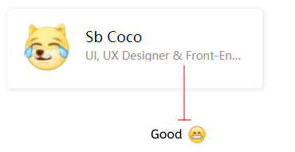
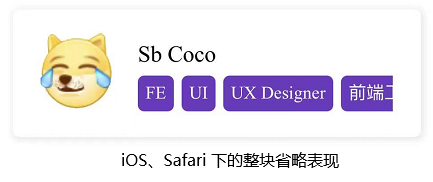

## 文本超长打点

对于**单行文本**，使用单行省略：

```css
 {
  width: 200px;
  white-space: nowrap;
  overflow: hidden;
  text-overflow: ellipsis;
}
```

[]

而对于**多行文本**的超长省略，使用 `-webkit-line-clamp` 相关属性，兼容性也已经非常好了：

```css
 {
  width: 200px;
  overflow: hidden;
  text-overflow: ellipsis;
  display: -webkit-box;
  -webkit-line-clamp: 2;
  -webkit-box-orient: vertical;
}
```

<iframe height="300" style="width: 100%;" scrolling="no" title="inline-block 实现整块的溢出打点" src="https://codepen.io/mafqla/embed/mdoLGNv?default-tab=html%2Cresult&editable=true&theme-id=light" frameborder="no" loading="lazy" allowtransparency="true" allowfullscreen="true">
  See the Pen <a href="https://codepen.io/mafqla/pen/mdoLGNv">
  inline-block 实现整块的溢出打点</a> by mafqla (<a href="https://codepen.io/mafqla">@mafqla</a>)
  on <a href="https://codepen.io">CodePen</a>.
</iframe>

## 问题一：超长文本整块省略

基于上述的超长打点省略方案之下，会有一些变化的需求。譬如，我们有如下结构：

```html
<section>
  <a href="/" class="avatar"></a>
  <div class="info">
    <p class="person-card__name">Sb Coco</p>
    <p class="person-card__desc">
      <span>FE</span>
      <span>UI</span>
      <span>UX Designer</span>
      <span>前端工程师</span>
    </p>
  </div>
</section>
```

[]

对于上述超出的情况，我们希望对于超出文本长度的整一块 -- **前端工程师**，整体被省略。

如果我们直接使用上述的方案，使用如下的 CSS，结果会是这样，并非我们期待的整块省略：

```css
.person-card__desc {
  width: 200px;
  white-space: nowrap;
  overflow: hidden;
  text-overflow: ellipsis;
}
```

[]

### 将 `display: inline` 改为 `display: inline-block` 实现整块省略

这里，如果我们需要实现一整块的省略，只需要将包裹整块标签元素的 `span` 的 `display` 由 `inline` 改为 `inline-block` 即可。

```css
.person-card__desc span {
  display: inline-block;
}
```

<iframe height="300" style="width: 100%;" scrolling="no" title="整块超长溢出打点省略" src="https://codepen.io/mafqla/embed/wvOjYww?default-tab=html%2Cresult&editable=true&theme-id=light" frameborder="no" loading="lazy" allowtransparency="true" allowfullscreen="true">
  See the Pen <a href="https://codepen.io/mafqla/pen/wvOjYww">
  整块超长溢出打点省略</a> by mafqla (<a href="https://codepen.io/mafqla">@mafqla</a>)
  on <a href="https://codepen.io">CodePen</a>.
</iframe>

## 问题二：iOS 不支持整块超长溢出打点省略

然而，上述方案并非完美的。经过实测，上述方案在 **iOS** 和 **Safari** 下，没能生效，表现为这样：

[]

查看规范 - [CSS Basic User Interface Module Level 3 - text-overflow](https://drafts.csswg.org/css-ui-3/#text-overflow)，究其原因，在于 `text-overflow` 只能对内联元素进行打点省略。（Chrome 对此可能做了一些优化，所以上述非 iOS 和 Safari 的场景是正常的）

所以猜测是因为经过了 `display: inline-block` 的转化后，已经不再是严格意义上的内联元素了。

### 解决方案，使用多行省略替代单行省略

当然，这里经过试验后，发现还是有解的，我们在开头还提到了一种多行省略的方案，我们将多行省略的代码替换单行省略，只是行数 `-webkit-line-clamp: 2` 改成一行即可 `-webkit-line-clamp: 1`。

```css
.person-card__desc {
  width: 200px;
  white-space: normal;
  overflow: hidden;
  text-overflow: ellipsis;
  display: -webkit-box;
  -webkit-line-clamp: 1;
  -webkit-box-orient: vertical;
}
.person-card__desc span {
  display: inline-block;
}
```

这样，在 iOS/Safari 下也能完美实现整块的超长打点省略：

<iframe height="300" style="width: 100%;" scrolling="no" title="整块超长溢出打点省略" src="https://codepen.io/mafqla/embed/NWJMOKP?default-tab=html%2Cresult&editable=true&theme-id=light" frameborder="no" loading="lazy" allowtransparency="true" allowfullscreen="true">
  See the Pen <a href="https://codepen.io/mafqla/pen/NWJMOKP">
  整块超长溢出打点省略</a> by mafqla (<a href="https://codepen.io/mafqla">@mafqla</a>)
  on <a href="https://codepen.io">CodePen</a>.
</iframe>

值得注意的是，在使用 ` -webkit-line-clamp` 的方案的时候，一定要配合 `white-space: normal` 允许换行，而不是不换行。这一点，非常重要。

这样，我们就实现了全兼容的整块的超长打点省略了。

当然，` -webkit-line-clamp` 本身也是存在一定的兼容性问题的，实际使用的时候还需要具体去取舍。
