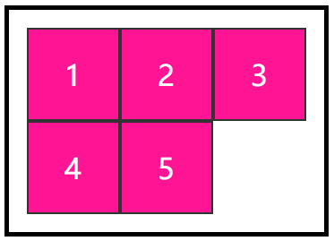
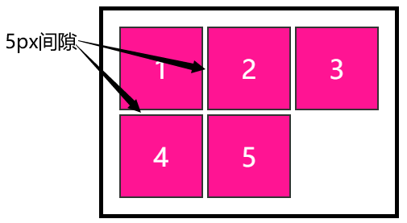
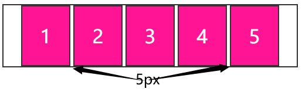
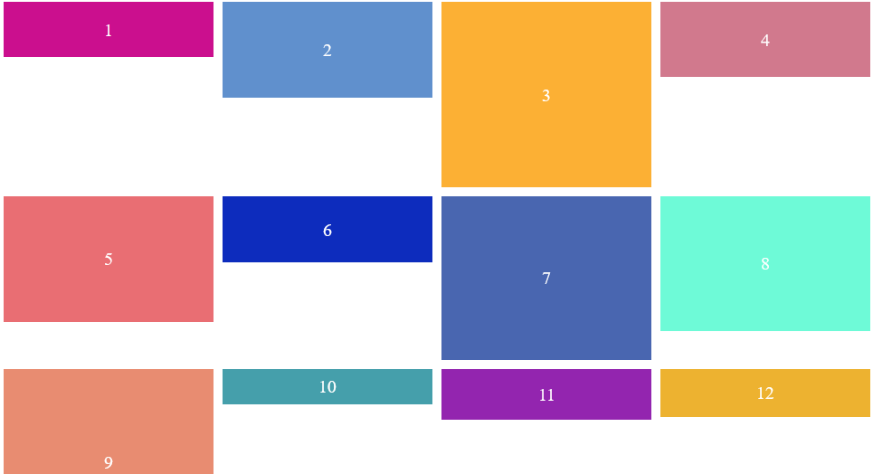
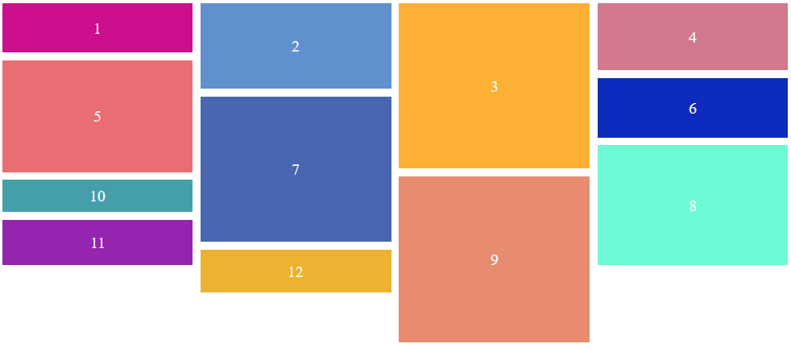
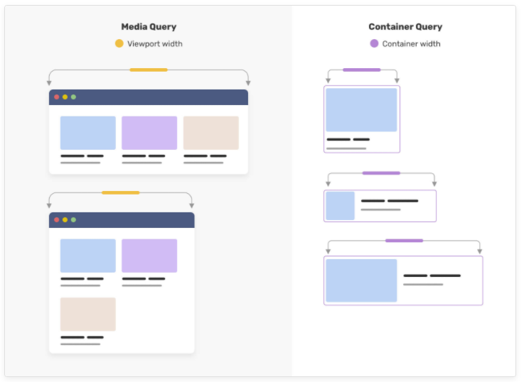

`gap` 并非是新的属性，它一直存在于多栏布局 `multi-column` 与 grid 布局中，其中：

- `column-gap` 属性用来设置多栏布局 `multi-column` 中元素列之间的间隔大小
- grid 布局中 `gap` 属性是用来设置网格行与列之间的间隙，该属性是 `row-gap` 和 `column-gap` 的简写形式，并且起初是叫 `grid-gap`

譬如我们有如下一个 `grid` 布局：

```html
<div class="grid-container">
  <div class="item">1</div>
  <div class="item">2</div>
  <div class="item">3</div>
  <div class="item">4</div>
  <div class="item">5</div>
</div>
```

```css
.grid-container {
  display: grid;
  border: 5px solid;
  padding: 20px;
  grid-template-columns: 1fr 1fr 1fr;
}
.item {
  width: 100px;
  height: 100px;
  background: deeppink;
  border: 2px solid #333;
}
```

效果如下：



通过给 `grid-container` 添加 `gap` 属性，可以非常方便的设置网格行与列之间的间隙：

```css
.grid-container {
    display: grid;
    border: 5px solid;
    padding: 20px;
    grid-template-columns: 1fr 1fr 1fr;
+   gap: 5px;
}
```



而从 **Chromium 84** 开始，我们可以开始在 `flex` 布局中使用 `gap` 属性了！[Can i use -- gap property for Flexbox](https://caniuse.com/?search=flex gap)

它的作用与在 grid 布局中的类似，可以控制水平和竖直方向上 flex item 之间的间距：

```css
.flex-container {
  width: 500px;
  display: flex;
  flex-wrap: wrap;
  gap: 5px;
  justify-content: center;
  border: 2px solid #333;
}

.item {
  width: 80px;
  height: 100px;
  background: deeppink;
}
```



`gap` 属性的优势在于，它避免了传统的使用 `margin` 的时候需要考虑第一个或者最后一个元素的左边距或者右边距的烦恼。正常而言，4 个水平的 `flex item`，它们就应该只有 3 个间隙。`gap` 只生效于两个 `flex item` 之间。

## 控制容器宽高比属性 `aspect-ratio`

保持元素容器一致的宽高比（称为长宽比）对于响应式 Web 设计和在某些布局当中至关重要。 现在，通过 Chromium 88 和 Firefox 87，我们有了一种更直接的方法来控制元素的宽高比 -- `aspect-ratio`。[Can i use -- aspect-ratio](https://caniuse.com/?search=aspect-ratio)

首先，我们只需要设定元素的宽，或者元素的高，再通过 `aspect-ratio` 属性，即可以控制元素的整体宽高：

```html
<div class="width"></div>
<div class="height"></div>
```

```css
div {
  background: deeppink;
  aspect-ratio: 1/1;
}
.width {
  width: 100px;
}
.height {
  height: 100px;
}
```

都可以得到如下图形：


其次，设定了 `aspect-ratio` 的元素，元素的高宽其中一个发生变化，另外一个会跟随变化：

```html
<div class="container">
  <div>宽高比1:1</div>
  <div>宽高比2:1</div>
  <div>宽高比3:1</div>
</div>
```

```css
.container {
  display: flex;
  width: 30vw;
  padding: 20px;
  gap: 20px;
}
.container > div {
  flex-grow: 1;
  background: deeppink;
}
.container > div:nth-child(1) {
  aspect-ratio: 1/1;
}
.container > div:nth-child(2) {
  aspect-ratio: 2/1;
}
.container > div:nth-child(3) {
  aspect-ratio: 3/1;
}
```

当容器大小变化，每个子元素的宽度变宽，元素的高度也随着设定的 `aspect-ratio` 比例跟随变化：

<iframe height="300" style="width: 100%;" scrolling="no" title="aspect-ratio Demo" src="https://codepen.io/mafqla/embed/ZEPRjom?default-tab=html%2Cresult&editable=true&theme-id=light" frameborder="no" loading="lazy" allowtransparency="true" allowfullscreen="true">
  See the Pen <a href="https://codepen.io/mafqla/pen/ZEPRjom">
  aspect-ratio Demo</a> by mafqla (<a href="https://codepen.io/mafqla">@mafqla</a>)
  on <a href="https://codepen.io">CodePen</a>.
</iframe>

## firefox 下的 CSS Grid 瀑布流布局（grid-template-rows: masonry）

`grid-template-rows: masonry` 是 firefox 在 firefox 87 开始支持的一种基于 grid 布局快速创建瀑布流布局的方式。并且 firefox 一直在推动该属性进入标准当中。

从 firefox 87 开始，在浏览器输入网址栏输入 `about:config` 并且开启 `layout.css.grid-template-masonry-value.enabled` 配置使用。[Can i use -- grid-template-rows: masonry](https://caniuse.com/?search=grid-template-rows)

正常而言，我们想要实现瀑布流布局还是需要花费一定的功夫的，即便是基于 grid 布局。在之前，我们通过 grid 布局，通过精细化控制每一个 `grid item`，也可以实现一些伪瀑布流布局：

```html
<div class="g-container">
  <div class="g-item">1</div>
  <div class="g-item">2</div>
  <div class="g-item">3</div>
  <div class="g-item">4</div>
  <div class="g-item">5</div>
  <div class="g-item">6</div>
  <div class="g-item">7</div>
  <div class="g-item">8</div>
</div>
```

```scss
.g-container {
  height: 100vh;
  display: grid;
  grid-template-columns: repeat(4, 1fr);
  grid-template-rows: repeat(8, 1fr);
}

.g-item {
  &:nth-child(1) {
    grid-column: 1;
    grid-row: 1 / 3;
  }
  &:nth-child(2) {
    grid-column: 2;
    grid-row: 1 / 4;
  }
  &:nth-child(3) {
    grid-column: 3;
    grid-row: 1 / 5;
  }
  &:nth-child(4) {
    grid-column: 4;
    grid-row: 1 / 6;
  }
  &:nth-child(5) {
    grid-column: 1;
    grid-row: 3 / 9;
  }
  &:nth-child(6) {
    grid-column: 2;
    grid-row: 4 / 9;
  }
  &:nth-child(7) {
    grid-column: 3;
    grid-row: 5 / 9;
  }
  &:nth-child(8) {
    grid-column: 4;
    grid-row: 6 / 9;
  }
}
```

效果如下：

<iframe height="300" style="width: 100%;" scrolling="no" title="CSS实现瀑布流布局（display: grid）" src="https://codepen.io/mafqla/embed/Yzgvjvq?default-tab=html%2Cresult&editable=true&theme-id=light" frameborder="no" loading="lazy" allowtransparency="true" allowfullscreen="true">
  See the Pen <a href="https://codepen.io/mafqla/pen/Yzgvjvq">
  CSS实现瀑布流布局（display: grid）</a> by mafqla (<a href="https://codepen.io/mafqla">@mafqla</a>)
  on <a href="https://codepen.io">CodePen</a>.
</iframe>

在上述 Demo 中，使用 `grid-template-columns`、`grid-template-rows` 分割行列，使用 `grid-row` 控制每个 `grid item` 的所占格子的大小，但是这样做的成本太高了，元素一多，计算量也非常大，并且还是在我们提前知道每个元素的高宽的前提下。

而在有了 `grid-template-rows: masonry` 之后，一切都会变得简单许多，对于一个不确定每个元素高度的 4 列的 grid 布局：

```css
.container {
  display: grid;
  grid-template-columns: repeat(4, 1fr);
}
```

正常而言，看到的会是这样：



简单的给容器加上 `grid-template-rows: masonry`，表示竖方向上，采用瀑布流布局：

```css
.container {
  display: grid;
  grid-template-columns: repeat(4, 1fr);
+ grid-template-rows: masonry;
}
```

便可以轻松的得到这样一种瀑布流布局：



如果你在使用 firefox，并且开启了 `layout.css.grid-template-masonry-value.enabled` 配置，可以戳进下面的 DEMO 感受一下：

<iframe height="300" style="width: 100%;" scrolling="no" title=" grid-template-rows: masonry 实现瀑布流布局（Only Firefox）" src="https://codepen.io/mafqla/embed/jOJKpKx?default-tab=html%2Cresult&editable=true&theme-id=light" frameborder="no" loading="lazy" allowtransparency="true" allowfullscreen="true">
  See the Pen <a href="https://codepen.io/mafqla/pen/jOJKpKx">
   grid-template-rows: masonry 实现瀑布流布局（Only Firefox）</a> by mafqla (<a href="https://codepen.io/mafqla">@mafqla</a>)
  on <a href="https://codepen.io">CodePen</a>.
</iframe>

当然，这是一个最简单的 DEMO，关于更多 `grid-template-rows: masonry` 相关知识，你可以详细的看看这篇文章：[Native CSS Masonry Layout In CSS Grid](https://www.smashingmagazine.com/native-css-masonry-layout-css-grid/)

## CSS 容器查询（Container Queries）

什么是 [CSS 容器查询](https://developer.mozilla.org/en-US/docs/Web/CSS/CSS_Container_Queries)（Container Queries）？

在之前，对于同个样式，我们如果希望根据视口大小得到不一样效果，通常使用的是**媒体查询**。

但是，一些容器或者组件的设计可能并不总是与视口的大小有关，而是与组件在布局中的放置位置有关。

所以在未来，新增了一种方式可以对不同状态下的容器样式进行控制，也就是容器查询。在最新的 [Chrome Canary](https://www.google.com/chrome/canary/) 中，我们可以通过 `chrome://flags/#enable-container-queries` 开启 Container Queries 功能。

假设我们有如下结构：

```html
<div class="wrap">
  <div class="g-container">
    <div class="child">Title</div>
    <p>
      Lorem ipsum dolor sit amet consectetur adipisicing elit. Necessitatibus
      vel eligendi, esse illum similique sint!!
    </p>
  </div>
</div>
```

正常情况下的样式如下：

```scss
.g-container {
  display: flex;
  flex-wrap: nowrap;
  border: 2px solid #ddd;

  .child {
    flex-shrink: 0;
    width: 200px;
    height: 100px;
    background: deeppink;
  }

  p {
    height: 100px;
    font-size: 16px;
  }
}
```

结构如下：


在未来，我们可以通过 `@container query` 语法，设定父容器 `.wrap` 在不同宽度下的不同表现，在上述代码基础上，新增下述代码：

```scss
.wrap {
  contain: layout inline-size;
  resize: horizontal;
  overflow: auto;
}
.g-container {
  display: flex;
  flex-wrap: nowrap;
  border: 2px solid #ddd;
  .child {
    flex-shrink: 0;
    width: 200px;
    height: 100px;
    background: deeppink;
  }
  p {
    height: 100px;
    font-size: 16px;
  }
}
// 当 .wrap 宽度小于等于 400px 时下述代码生效
@container (max-width: 400px) {
  .g-container {
    flex-wrap: wrap;
    flex-direction: column;
  }
  .g-container .child {
    width: 100%;
  }
}
```

注意这里要开启 `@container query`，需要配合容器的 `contain` 属性，这里设置了 `contain: layout inline-size`，当 `.wrap` 宽度小于等于 `400px` 时，`@container (max-width: 400px) ` 内的代码则生效，从横向布局 `flex-wrap: nowrap` 变换成了纵向换行布局 `flex-wrap: wrap`：

<iframe height="300" style="width: 100%;" scrolling="no" title="CSS @container query Demo" src="https://codepen.io/mafqla/embed/abMKjKg?default-tab=html%2Cresult&editable=true&theme-id=light" frameborder="no" loading="lazy" allowtransparency="true" allowfullscreen="true">
  See the Pen <a href="https://codepen.io/mafqla/pen/abMKjKg">
  CSS @container query Demo</a> by mafqla (<a href="https://codepen.io/mafqla">@mafqla</a>)
  on <a href="https://codepen.io">CodePen</a>.
</iframe>

媒体查询与容器查询的异同，通过一张简单的图看看，核心的点在于**容器的宽度发生变化时，视口的宽度不一定会发生变化**：



这里仅仅是介绍了 `@container query` 的冰山一角，更多内容你可以戳这里了解更多：[say-hello-to-css-container-queries](https://ishadeed.com/article/say-hello-to-css-container-queries/)
