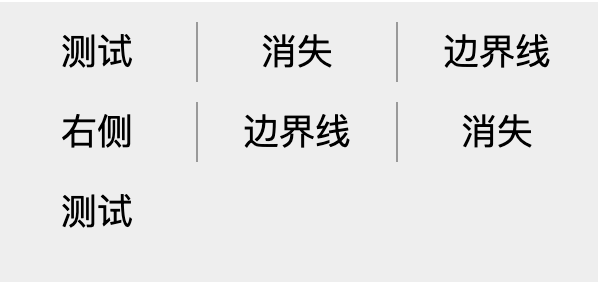

## 7、消失的边界线问题

看看下图，经常会在一些导航栏中见到，要求每行中最后一列的右边框消失，如何在所有浏览器中最便捷优雅的实现？



如果是不需要兼容 `IE8-` ，那么使用 CSS3 新增的选择器无疑是一种好方法。

```css
// 使用伪类选择器，选择第 3n 个元素去掉边框
li:nth-child(3n) {
  border-right: none;
}
```

当然，如果个数确定也不多，给需要去掉右边框的元素直接添加一个特定的 class 也就完事。不过这样不够优雅。

这里有个小技巧，就是通过添加反向添加边框并且增加一个负的 `margin` 来实现。

首先，假定我们的 `ul` 结构如下：

```html
<div class="ul-container">
  <ul>
    <li>测试</li>
    <li>消失</li>
    <li>边界线</li>
    <li>右侧</li>
    <li>边界线</li>
    <li>消失</li>
    <li>测试</li>
  </ul>
</div>
```

如图中所示，假定每行排列 3 个 `li` ，每个 `li` 宽 `100px` ，我们的 ul 和 ul-container 宽度都设为 `300px` 。

_最重要的是，每个 `li` 设置一个左边框而不是右边框_：

```css
.ul-container,
ul {
  width: 300px;
}

li {
  float: left;
  width: 99px;
  border-left: 1px solid #999;
}
```

我们会得到如下这样的结果：


接下来，我们将容器 `ul-container` 设置为 `overflow:hidden` ，并且将 `ul` 左移一个像素 `margin-left:-1px` 。

这样 `ul` 中第一列的所有边框都因为左移了一像素并且被 `overflow:hidden` 而消失了，造成了下一个 `li` 的右边框看着像左边框一样，其实只是个障眼法：

```
.ul-container{
  overflow:hidden;
}
ul{
  margin-left:-1px;
}
```

效果图就如一开始图示所示：


:::code-group

```html[html]
<div class="ul-container">
  <ul>
    <li>测试</li>
    <li>消失</li>
    <li>边界线</li>
    <li>右侧</li>
    <li>边界线</li>
    <li>消失</li>
    <li>测试</li>
  </ul>
</div>
```

```css[css]
ul{
	width: 300px;
	margin-left:-1px;
}

li{
	float:left;
	width:99px;
	line-height:30px;
	text-align:center;
	border-left:1px solid #999;
	font-size:18px;
	margin-bottom:10px;
}

.ul-container{
	width: 300px;
	margin: 50px auto;
	overflow:hidden;
	background: #eee;
	padding:10px 0;
}

```

:::

这种做法可以适应不同 `li` 个数的所有情况，因为每个新添加的 `li` ，都会生成一个左边框与上一个 `li` 元素分开，只是在视觉上看上去像是上一个 `li` 元素的右边框。
