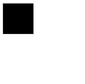
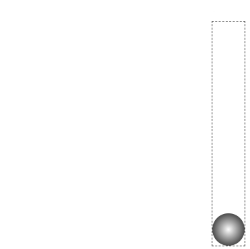
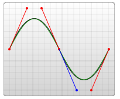
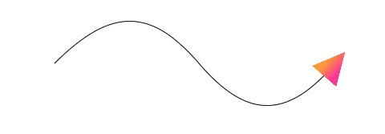
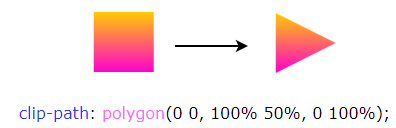

## 什么是 CSS Motion Path 运动路径？

什么是 CSS Motion Path 运动路径？利用这个规范规定的属性，我们可以控制元素按照特定的路径进行位置变换的动画。并且，这个路径可以是非常复杂的一条路径。

在进一步介绍 CSS Motion Path 之前，我们先看看使用传统的 CSS 的能力，我们如何实现路径动画。

### CSS 传统方式实现直线路径动画

在之前，我们希望将一个物体从 A 点直线运动到 B 点，通常而言可以使用 `transform: translate()`、`top | left | bottom | right` 或者 是 `margin` 之类的可以改变物体位置的属性。

简单的一个 Demo：

```html
<div></div>
```

```css
div {
  width: 60px;
  height: 60px;
  background: #000;
  animation: move infinite 1s alternate linear;
}
@keyframes move {
  100% {
    transform: translate(100px, 100px);
  }
}
```

对于简单的从 A 点直线运动到 B 点的效果如下：



### CSS 传统方式实现曲线路径动画

当然，CSS 也可以实现一些简单的曲线路径动画的。如果我们希望从 A 点运动到 B 点走的不是一条直线，而是一条曲线，该怎么做呢？

对于一些简单的圆弧曲线路径，还是可以借助一些巧妙的办法实现的，看看下面这个例子。

这次，我们使用了两个元素，子元素是希望被曲线运动的小球，但是实际上我们是通过设定了父元素的 `transform-origin`，让父元素进行了一个 `transform: rotate()` 的运动带动了子元素的小球：

```html
<div class="g-container">
  <div class="g-ball"></div>
</div>
```

```css
.g-container {
  position: relative;
  width: 10vmin;
  height: 70vmin;
  transform-origin: center 0;
  animation: rotate 1.5s infinite alternate;
}
.g-ball {
  position: absolute;
  width: 10vmin;
  height: 10vmin;
  border-radius: 50%;
  background: radial-gradient(circle, #fff, #000);
  bottom: 0;
  left: 0;
}
@keyframes rotate {
  100% {
    transform: rotate(90deg);
  }
}
```

为了方便理解，在运动的过程中，我让父元素的轮廓显现出来：



这样，我们算是勉强得到了一个非直线路径运动动画，它的实际运动轨迹是一条曲线。

然而，这基本上是之前 CSS 能做到的极限了，使用纯 CSS 的方法，没办法实现更复杂的路径动画，譬如下面这样一条路径动画：

<svg xmlns="http://www.w3.org/2000/svg" xmlns:xlink="http://www.w3.org/1999/xlink" width="470" height="120">
<style type="text/css">
.path{fill:none;stroke:#00AEEF;stroke-width:3;stroke-linecap:round;stroke-miterlimit:10;stroke-dasharray:0.4997,4.9973;}
.text{font-family:'MyriadPro-Regular';font-size:12;}
</style>
<defs>
<path id="plane" d="M15.1-6.2H3.4l-6.3-9.9c1.8-0.3,5.4-1.5,5.4-3.6s-4.8-3.6-6.3-3.6h-3.9l-4.5-6.9h-8.4l2.4,6.9h-0.3v7.2h3l3.6,9.9h-15.9l-6.6-6.6h-4.8l5.7,9.6v7.8l-5.7,9.6h4.8l6.6-6.6h15.9l-3.6,9.6h-3v7.2h0.3l-2.4,6.9h8.7l4.5-6.9h3.9c1.5,0,6.3-1.5,6.3-3.6c0-1.8-3.6-3.3-5.4-3.6l6.3-9.9h11.7c3.9,0,18-2.7,18-6.9C33.1-3.5,19-6.2,15.1-6.2z"/>
</defs>
<use xlink:href="#plane" transform="translate(57.8,45) rotate(-52)"/>
<use xlink:href="#plane" transform="translate(240,45) rotate(24)"/>
<use xlink:href="#plane" transform="translate(423,47) rotate(-55)"/>
<path class="path" d="M421.2,50C343.5,175.5,142.1-86,57.8,45"/>
</svg>

直到现在，我们有了一种更为强大的专门做这个事情的规范，也就是本文的主角 -- **CSS Motion Path**。

## CSS Motion Path 实现直线路径动画

CSS Motion Path 规范主要包含以下几个属性：

- `offset-path`：接收一个 SVG 路径（与 SVG 的 path、CSS 中的 clip-path 类似），指定运动的几何路径
- `offset-distance`：控制当前元素基于 `offset-path` 运动的距离
- `offset-position`：指定 `offset-path` 的初始位置
- `offset-anchor`：定义沿 `offset-path` 定位的元素的锚点。 这个也算好理解，运动的元素可能不是一个点，那么就需要指定元素中的哪个点附着在路径上进行运动
- `offset-rotate`：定义沿 `offset-path` 定位时元素的方向，说人话就是运动过程中元素的角度朝向

下面，我们使用 Motion Path 实现一个简单的直线位移动画。

```html
<div></div>
```

```css
div {
  width: 60px;
  height: 60px;
  background: linear-gradient(#fc0, #f0c);
  offset-path: path('M 0 0 L 100 100');
  offset-rotate: 0deg;
  animation: move 2000ms infinite alternate ease-in-out;
}
@keyframes move {
  0% {
    offset-distance: 0%;
  }
  100% {
    offset-distance: 100%;
  }
}
```

`offset-path` 接收一个 SVG 的 path 路径，这里我们的路径内容是一条自定义路径 `path("M 0 0 L 100 100")`，翻译过来就是从 `0 0` 点运动到 `100px 100px` 点。

> `offset-path` 接收一个 SVG 路径，指定运动的几何路径。与 SVG 的 path、CSS 中的 clip-path 类似，对于这个 SVG Path 还不太了解的可以戳这里先了解下 SVG 路径内容：[SVG 路径](https://developer.mozilla.org/zh-CN/docs/Web/SVG/Tutorial/Paths)

我们会得到如下结果：


通过控制元素的 `offset-distance` 从 `0%` 变化到 `100%` 进行元素的路径动画。

当然，上述的动画是最基本的，我可以充分利用 path 的特性，增加多个中间关键帧，稍微改造下上述代码：

```css
div {
  // 只改变运动路径，其他保持一致
  offset-path: path(
    'M 0 0 L 100 0 L 200 0 L 300 100 L 400 0 L 500 100 L 600 0 L 700 100 L 800 0'
  );
  animation: move 2000ms infinite alternate linear;
}
@keyframes move {
  0% {
    offset-distance: 0%;
  }
  100% {
    offset-distance: 100%;
  }
}
```

这里最主要还是运用了 path 中的 `L` 指令，得到了如下图这样一条直线路径：


最终的效果如下，与利用 `transform: translate()` 添加多个关键帧类似：

<iframe height="300" style="width: 100%;" scrolling="no" title="CSS Motion Path Demo" src="https://codepen.io/mafqla/embed/rNRryBb?default-tab=html%2Cresult&editable=true&theme-id=light" frameborder="no" loading="lazy" allowtransparency="true" allowfullscreen="true">
  See the Pen <a href="https://codepen.io/mafqla/pen/rNRryBb">
  CSS Motion Path Demo</a> by mafqla (<a href="https://codepen.io/mafqla">@mafqla</a>)
  on <a href="https://codepen.io">CodePen</a>.
</iframe>

## CSS Motion Path 实现曲线路径动画

上面的运动轨迹都是由直线构成，下面我们看看如何使用 CSS Motion Path 实现曲线路径动画。

其实原理还是一模一样，只需要在 `offset-path: path()` 中添加曲线相关的路径即可。

在 SVG 的 Path 中，我们取其中一种绘制曲线的方法 -- 贝塞尔曲线，譬如下述这条 path，其中的 path 为 `d="M 10 80 C 80 10, 130 10, 190 80 S 300 150, 360 80"`：

```html
<svg width="400" height="160" xmlns="http://www.w3.org/2000/svg">
  <path d="M 10 80 C 80 10, 130 10, 190 80 S 300 150, 360 80" stroke="black" fill="transparent"/>
</svg>
```

对应这样一条连续的贝塞尔曲线：



将对应的路径应用在 `offset-path: path` 中：

```html
<div></div>
```

```css
div:nth-child(2) {
  width: 40px;
  height: 40px;
  background: linear-gradient(#fc0, #f0c);
  offset-path: path('M 10 80 C 80 10, 130 10, 190 80 S 300 150, 360 80');
}
@keyframes move {
  0% {
    offset-distance: 0%;
  }
  100% {
    offset-distance: 100%;
  }
}
```

可以得到如下运动效果：

<iframe height="300" style="width: 100%;" scrolling="no" title="CSS Motion Path Demo" src="https://codepen.io/mafqla/embed/VwRBpwj?default-tab=html%2Cresult&editable=true&theme-id=light" frameborder="no" loading="lazy" allowtransparency="true" allowfullscreen="true">
  See the Pen <a href="https://codepen.io/mafqla/pen/VwRBpwj">
  CSS Motion Path Demo</a> by mafqla (<a href="https://codepen.io/mafqla">@mafqla</a>)
  on <a href="https://codepen.io">CodePen</a>.
</iframe>

可以看到，元素是沿着贝塞尔曲线的路径进行运动的，并且，由于这次没有限制死 `offset-rotate`，元素的朝向也是跟随路径的朝向一直变化的。（可以联想成开车的时候，车头一直跟随道路会进行变化的，带动整个车身的角度变化）

## 理解 offset-anchor 运动锚点

OK，那么接下来，我们再看看 `offset-anchor` 如何理解。

还是上述的 DEMO，我们把小正方形替换成一个三角形，并且把运动的曲线给画到页面上，像是这样：



其中，三角形是通过 `clip-path` 实现的：

```css
width: 40px;
height: 40px;
clip-path: polygon(0 0, 100% 50%, 0 100%);
background: linear-gradient(#fc0, #f0c);
```



通常而言，沿着曲线运动的是物体的中心点（类比 `transform-origin`），在这里，我们可以通过 `offset-anchor` 改变运动的锚点，譬如，我们希望三角形的最下方沿着曲线运动：

```css
.ball {
  width: 40px;
  height: 40px;
  clip-path: polygon(0 0, 100% 50%, 0 100%);
  offset-path: path('M 10 80 C 80 10, 130 10, 190 80 S 300 150, 360 80');
  offset-anchor: 0 100%;
  background: linear-gradient(#fc0, #f0c);
  animation: move 3000ms infinite alternate linear;
}
@keyframes move {
  0% {
    offset-distance: 0%;
  }
  100% {
    offset-distance: 100%;
  }
}
```

<iframe height="300" style="width: 100%;" scrolling="no" title="CSS Motion Path offset-anthor Demo" src="https://codepen.io/mafqla/embed/BabPWam?default-tab=html%2Cresult&editable=true&theme-id=light" frameborder="no" loading="lazy" allowtransparency="true" allowfullscreen="true">
  See the Pen <a href="https://codepen.io/mafqla/pen/BabPWam">
  CSS Motion Path offset-anthor Demo</a> by mafqla (<a href="https://codepen.io/mafqla">@mafqla</a>)
  on <a href="https://codepen.io">CodePen</a>.
</iframe>

## 运用 Motion Path 制作动画效果

OK，上面我们基本把原理给过了一遍，下面我们就看看，运用 Motion Path，可以在实践中如何运用。

### 利用 Motion Path 制作按钮效果

利用运动路径，我们可以制作一些简单的按钮点击效果。在之前，我在 CodePen 上见到过这样一种按钮点击效果：

<iframe height="300" style="width: 100%;" scrolling="no" title="Bubbly button (Design by Gal Shir)" src="https://codepen.io/mafqla/embed/poYZeox?default-tab=html%2Cresult&editable=true&theme-id=light" frameborder="no" loading="lazy" allowtransparency="true" allowfullscreen="true">
  See the Pen <a href="https://codepen.io/mafqla/pen/poYZeox">
  Bubbly button (Design by Gal Shir)</a> by mafqla (<a href="https://codepen.io/mafqla">@mafqla</a>)
  on <a href="https://codepen.io">CodePen</a>.
</iframe>

其原理是运用了 `background-radial` 去生成每一个小圆点，通过控制 `background-position` 控制小圆点的位移，详细的 Demo 代码你可以戳这里：

但是小圆点的运动路径基本上都是直线，运用本文的 Motion Path，我们也可以实现一些类似的效果，核心代码如下，HTML 这里我们使用了 `Pug` 模板，CSS 使用了 `SASS`：

```scss
.btn
  -for(var i=0; i<60; i++)
    span.dot
```

```scss
.btn {
  position: relative;
  padding: 1.5rem 4.5rem;
}
.btn .dot {
  position: absolute;
  width: 4px;
  height: 4px;

  @for $i from 1 through $count {
    &:nth-child(#{$i}) {
      top: 50%;
      left: 50%;
      transform: translate3d(-50%, -50%, 0) rotate(#{360 / $count * $i}deg);
    }
  }

  &::before {
    content: '';
    position: absolute;
    top: 0;
    left: 0;
    width: 4px;
    height: 4px;
    border-radius: 50%;
    offset-path: path(
      'M0 1c7.1 0 10.7 2 14.3 4s7.1 4 14.3 4 10.7-2 14.3-4 7.2-4 14.3-4 10.7 2 14.3 4 7.1 4 14.3 4 10.7-2 14.3-4 7.1-4 14.3-4 10.7 2 14.3 4 7.1 4 14.3 4 10.7-2 14.3-4 7.1-4 14.3-4 10.7 2 14.3 4 7.1 4 14.3 4'
    );
    offset-distance: 0;
  }
}

.btn.is-animating:active .dot:nth-child(4n + 1)::before {
  animation: dot var(--animation-time) var(--animation-timging-function);
}
.btn.is-animating:active .dot:nth-child(4n + 2)::before {
  border: 1px solid var(--color-primary);
  background: transparent;
  animation: dot var(--animation-time) var(--animation-timging-function) 0.1s;
}
.btn.is-animating:active .dot:nth-child(4n + 3)::before {
  animation: dot var(--animation-time) var(--animation-timging-function) 0.2s;
}
.btn.is-animating:active .dot:nth-child(4n)::before {
  border: 1px solid var(--color-primary);
  background: transparent;
  animation: dot var(--animation-time) var(--animation-timging-function) 0.3s;
}

@keyframes dot {
  0% {
    offset-distance: 0%;
    opacity: 1;
  }
  90% {
    offset-distance: 60%;
    opacity: 0.5;
  }
  100% {
    offset-distance: 100%;
    opacity: 0;
  }
}
```

别看代码多有一点点复杂，但是不难理解，本质就是给每个子元素小点点设置同样的 ` offset-path: path()`，给不同分组下的子元素设定不同的旋转角度，并且利用了动画延迟 `animation-delay` 设定了 4 组同时出发的动画。

这里我们的轨迹 path 不是直线，效果如下：

<iframe height="300" style="width: 100%;" scrolling="no" title="Button Animation with CSS Offset Paths" src="https://codepen.io/mafqla/embed/XWGBMWw?default-tab=html%2Cresult&editable=true&theme-id=light" frameborder="no" loading="lazy" allowtransparency="true" allowfullscreen="true">
  See the Pen <a href="https://codepen.io/mafqla/pen/XWGBMWw">
  Button Animation with CSS Offset Paths</a> by mafqla (<a href="https://codepen.io/mafqla">@mafqla</a>)
  on <a href="https://codepen.io">CodePen</a>.
</iframe>

### 利用 Motion-Path 绘制地图路径寻路动画

这个也是非常实用的，现在我们可以完全利用 CSS Motion-Path 实现地图上的寻路动画：

该 Demo 源自 Ahmad Emran：

<iframe height="300" style="width: 100%;" scrolling="no" title="Animation with offset-path | Only Using CSS &amp; HTML" src="https://codepen.io/ahmadbassamemran/embed/bXByBv?default-tab=html%2Cresult&editable=true&theme-id=light" frameborder="no" loading="lazy" allowtransparency="true" allowfullscreen="true">
  See the Pen <a href="https://codepen.io/ahmadbassamemran/pen/bXByBv">
  Animation with offset-path | Only Using CSS &amp; HTML</a> by Ahmad Emran (<a href="https://codepen.io/ahmadbassamemran">@ahmadbassamemran</a>)
  on <a href="https://codepen.io">CodePen</a>.
</iframe>

### 利用 Motion-Path 绘制路径动画

又或者，我们利用 Path 能绘制任意路径的特性，实现各种我们想要的路径，譬如加入购物车的抛物线，或者各类运动轨迹，都不在话下，这里再提供一个 Demo：

<iframe height="300" style="width: 100%;" scrolling="no" title="CSS Motion Path offset-path animation" src="https://codepen.io/mafqla/embed/VwRBpYj?default-tab=html%2Cresult&editable=true&theme-id=light" frameborder="no" loading="lazy" allowtransparency="true" allowfullscreen="true">
  See the Pen <a href="https://codepen.io/mafqla/pen/VwRBpYj">
  CSS Motion Path offset-path animation</a> by mafqla (<a href="https://codepen.io/mafqla">@mafqla</a>)
  on <a href="https://codepen.io">CodePen</a>.
</iframe>
