## 法一. 全兼容的 SVG 大法

想要生成一个带圆角的三角形，**代码量最少**、最好的方式是使用 SVG 生成。

使用 SVG 的 多边形标签 `<polygon>` 生成一个三边形，使用 SVG 的 `stroke-linejoin="round"` 生成连接处的圆角。

代码量非常少，核心代码如下：

```html
<svg width="250" height="250" viewBox="-50 -50 300 300">
  <polygon
    class="triangle"
    stroke-linejoin="round"
    points="100,0 0,200 200,200"
  />
</svg>
```

```css
.triangle {
  fill: #0f0;
  stroke: #0f0;
  stroke-width: 10;
}
```

实际图形如下：

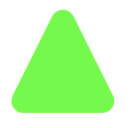

这里，其实是借助了 SVG 多边形的 `stroke-linejoin: round` 属性生成的圆角，`stroke-linejoin` 是什么？它用来控制两条描边线段之间，有三个可选值：

- `miter` 是默认值，表示用方形画笔在连接处形成尖角
- `round` 表示用圆角连接，实现平滑效果
- `bevel` 连接处会形成一个斜接

我们实际是**通过一个带边框，且边框连接类型为 `stroke-linejoin: round` 的多边形生成圆角三角形的**。

如果，我们把底色和边框色区分开，实际是这样的：

```css
.triangle {
  fill: #0f0;
  stroke: #000;
  stroke-width: 10;
}
```

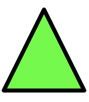

### 通过 stroke-width 控制圆角大小

那么如何控制圆角大小呢？也非常简单，通过控制 `stroke-width` 的大小，可以改变圆角的大小。

当然，要保持三角形大小一致，在增大/缩小 `stroke-width` 的同时，需要缩小/增大图形的 `width`/`height`：

<iframe height="300" style="width: 100%;" scrolling="no" title="A triangle with rounded " src="https://codepen.io/mafqla/embed/MWxxQZB?default-tab=html%2Cresult&editable=true&theme-id=light" frameborder="no" loading="lazy" allowtransparency="true" allowfullscreen="true">
  See the Pen <a href="https://codepen.io/mafqla/pen/MWxxQZB">
  A triangle with rounded </a> by mafqla (<a href="https://codepen.io/mafqla">@mafqla</a>)
  on <a href="https://codepen.io">CodePen</a>.
</iframe>

## 法二. 图形拼接

不过，上文提到了，**使用纯 CSS 实现带圆角的三角形**，但是上述第一个方法其实是借助了 SVG。那么仅仅使用 CSS，有没有办法呢？

当然，发散思维，CSS 有意思的地方正在于此处，用一个图形，能够有非常多种巧妙的解决方案！

我们看看，一个圆角三角形，它其实可以被拆分成几个部分：

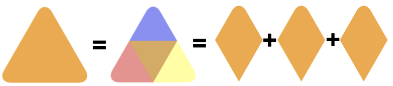

所以，其实我们只需要能够画出一个这样的带圆角的菱形，通过 3 个进行旋转叠加，就能得到圆角三角形：


### 绘制带圆角的菱形

那么，接下来我们的目标就变成了绘制一个带圆角的菱形，方法有很多，本文给出其中一种方式：

1. 首先将一个正方形变成一个菱形，利用 `transform` 有一个固定的公式：

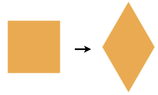

```html
<div></div>
```

```css
div {
  width: 10em;
  height: 10em;
  transform: rotate(-60deg) skewX(-30deg) scale(1, 0.866);
}
```

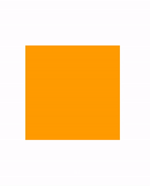

1. 将其中一个角变成圆角：

```css
div {
    width:  10em;
    height: 10em;
    transform: rotate(-60deg) skewX(-30deg) scale(1, 0.866);
  + border-top-right-radius: 30%;
}
```

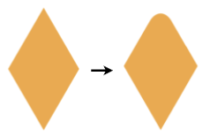

至此，我们就顺利的得到一个带圆角的菱形了！

### 拼接 3 个带圆角的菱形

接下来就很简单了，我们只需要利用元素的另外两个伪元素，再生成 2 个带圆角的菱形，将一共 3 个图形旋转位移拼接起来即可！

完整的代码如下：

```html
<div></div>
```

```css
div {
  position: relative;
  background-color: orange;
}
div:before,
div:after {
  content: '';
  position: absolute;
  background-color: inherit;
}
div,
div:before,
div:after {
  width: 10em;
  height: 10em;
  border-top-right-radius: 30%;
}
div {
  transform: rotate(-60deg) skewX(-30deg) scale(1, 0.866);
}
div:before {
  transform: rotate(-135deg) skewX(-45deg) scale(1.414, 0.707) translate(
      0,
      -50%
    );
}
div:after {
  transform: rotate(135deg) skewY(-45deg) scale(0.707, 1.414) translate(50%);
}
```

就可以得到一个圆角三角形了！效果如下：

<iframe height="300" style="width: 100%;" scrolling="no" title="A triangle with rounded" src="https://codepen.io/mafqla/embed/abMMqPr?default-tab=html%2Cresult&editable=true&theme-id=light" frameborder="no" loading="lazy" allowtransparency="true" allowfullscreen="true">
  See the Pen <a href="https://codepen.io/mafqla/pen/abMMqPr">
  A triangle with rounded</a> by mafqla (<a href="https://codepen.io/mafqla">@mafqla</a>)
  on <a href="https://codepen.io">CodePen</a>.
</iframe>

## 法三. 图形拼接实现渐变色圆角三角形

完了吗？没有！

上述方案，虽然不算太复杂，但是有一点还不算太完美的。就是无法支持渐变色的圆角三角形。像是这样：

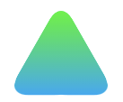

如果需要实现渐变色圆角三角形，还是有点复杂的。但真就还有人鼓捣出来了，下述方法参考至 -- [How to make 3-corner-rounded triangle in CSS](https://stackoverflow.com/questions/14446677/how-to-make-3-corner-rounded-triangle-in-css)。

同样也是利用了多块进行拼接，但是这次我们的基础图形，会非常的复杂。

首先，我们需要实现这样一个容器外框，和上述的方法比较类似，可以理解为是一个圆角菱形（画出 border 方便理解）：

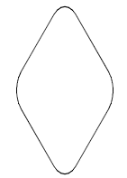

```html
<div></div>
```

```css
div {
  width: 200px;
  height: 200px;
  transform: rotate(30deg) skewY(30deg) scaleX(0.866);
  border: 1px solid #000;
  border-radius: 20%;
}
```

接着，我们同样使用两个伪元素，实现两个稍显怪异的图形进行拼接，算是对 `transform` 的各种用法的合集：

```css
div::before,
div::after {
  content: '';
  position: absolute;
  width: 200px;
  height: 200px;
}
div::before {
  border-radius: 20% 20% 20% 55%;
  transform: scaleX(1.155) skewY(-30deg) rotate(-30deg) translateY(-42.3%) skewX(
      30deg
    ) scaleY(0.866) translateX(-24%);
  background: red;
}
div::after {
  border-radius: 20% 20% 55% 20%;
  background: blue;
  transform: scaleX(1.155) skewY(-30deg) rotate(-30deg) translateY(-42.3%) skewX(
      -30deg
    ) scaleY(0.866) translateX(24%);
}
```

为了方便理解，制作了一个简单的变换动画：

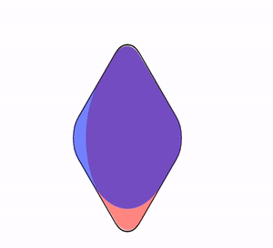

本质就是实现了这样一个图形：

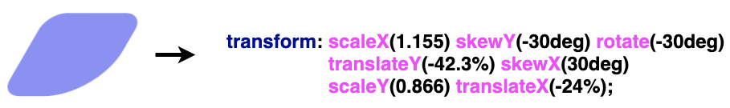

最后，给父元素添加一个 `overflow: hidden` 并且去掉父元素的 `border` 即可得到一个圆角三角形：

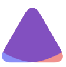]

由于这两个元素重叠空间的特殊结构，此时，给两个伪元素添加同一个渐变色，会完美的叠加在一起：

```css
div::before,
div::after {
  background: linear-gradient(#0f0, #03a9f4);
}
```

最终得到一个渐变圆角三角形：

<iframe height="300" style="width: 100%;" scrolling="no" title="A triangle with rounded and gradient background" src="https://codepen.io/mafqla/embed/GReeQzN?default-tab=html%2Cresult&editable=true&theme-id=light" frameborder="no" loading="lazy" allowtransparency="true" allowfullscreen="true">
  See the Pen <a href="https://codepen.io/mafqla/pen/GReeQzN">
  A triangle with rounded and gradient background</a> by mafqla (<a href="https://codepen.io/mafqla">@mafqla</a>)
  on <a href="https://codepen.io">CodePen</a>.
</iframe>
