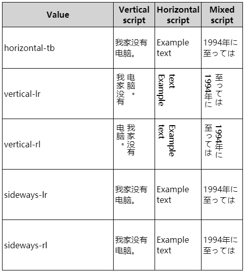
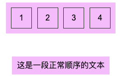
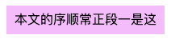
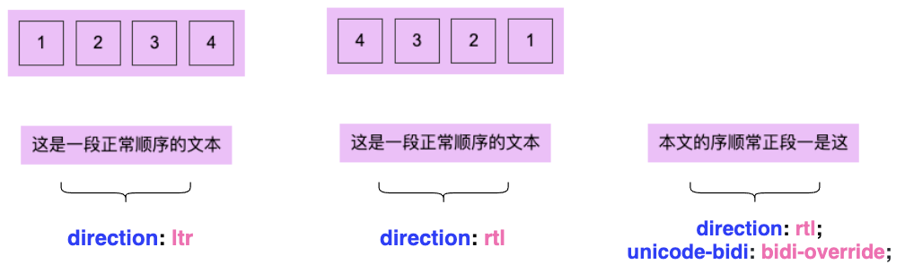
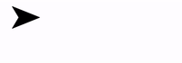
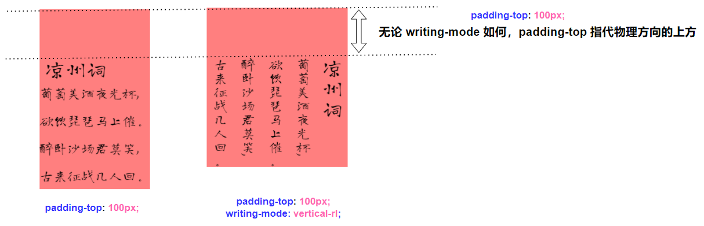
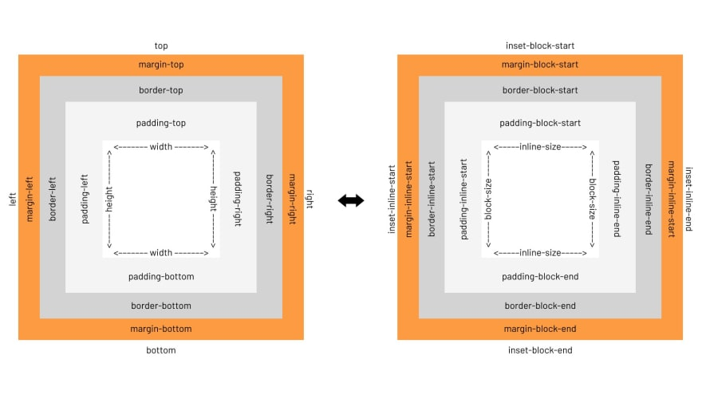
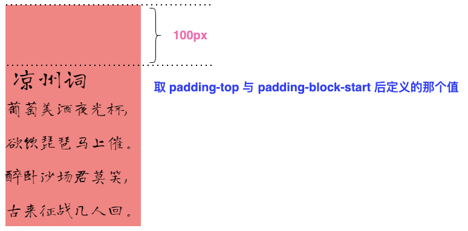

在 CSS 中，我们经常会与各种方向方位打交道。

譬如 `margin`、`padding`，它们就会有 `margin-left`、`margin-right` 或者是 `padding-left`、`padding-right`。还有定位中的 `left`、`top`、`right`、`bottom`，它们表示了上下左右不同的方位。

还有一种情况是从 x 方位到 x 方位，譬如 `writing-mode`、`direction`，它代表了一种顺序，表示块流动方向，或者文字书写的方向等。

本文将捋一捋 CSS 世界中的方位与顺序，探寻其中一些有意思的点。

## `writing-mode` & `direction` & `unicode-bidi`

在 CSS 世界中，这 3 个属性都与排版顺序相关，互有关联但作用各异。

- `writing-mode`：定义了文本水平或垂直排布以及在块级元素中文本的行进方向。
- `direction`：设置文本排列的方向。 rtl 表示从右到左 (类似希伯来语或阿拉伯语)， ltr 表示从左到右。
- `unicode-bidi`：它与 `direction` 非常类似，两个会经常一起出现。在现代计算机应用中，最常用来处理双向文字的算法是 Unicode 双向算法。而 `unicode-bidi` 这个属性是用来重写这个算法的。

单纯看定义有点懵逼，我们简单的看几个应用示意图：

### `writing-mode` 示意

`writing-mode` 基本只需要留意最常见的 `horizontal-tb`、`vertical-lr`、`vertical-rl` 。表示文本的行进方向，下图表示浏览器对 `writing-mode` 的支持完整的情况下输出的外观：

[](https://user-images.githubusercontent.com/8554143/125310864-89eaca80-e365-11eb-8f22-489b3a3be9a7.png)

### `direction` 示意

OK，那 `direction` 又为何呢？它**表示文本排列的方向**。

- `direction: ltr`：默认属性。可设置文本和其他元素的默认方向是从左到右。
- `direction: rtl`：可设置文本和其他元素的默认方向是从右到左。

有点绕，所以上 Demo 最为直观。假设，我们有如下结构：

```html
<ul class="wrap">
  <li>1</li>
  <li>2</li>
  <li>3</li>
  <li>4</li>
</ul>
<p>这是一段正常顺序的文本</p>
```

简单的 CSS 如下：

```scss
p,
ul {
  background: #ff00ff50;
  padding: 10px;
}
ul {
  display: flex;
  justify-content: space-between;

  & > li {
    border: 1px solid #333;
  }
}
```

正常情况下的样式如下：

[](https://user-images.githubusercontent.com/8554143/125785340-e78b5ac1-b064-4b07-adb7-35440775f753.png)

我们分别给两组元素的父容器 `<p>` 和 `<ul>` 加上 `direction: ltr` 及 `direction: rtl`，则最终效果如下：

[](https://user-images.githubusercontent.com/8554143/125786086-ddf374f7-723b-4a59-a8c2-733a6c322707.png)

可以看到，`direction` 可以改变子元素的排列方向，但是**它确无法改变单段文本内（或是内联元素内），每一个文字的书写顺序**。

那如果，我希望 `这是一段正常顺序的文本` 这段文字，不是从左向右进行书写，而是反过来，从右到左进行书写，又该如何设置呢？

### `unicode-bidi` 示意

这就需要请出 `unicode-bidi` 了。

单独使用 `direction: rtl` 无法使单段文本内（或是内联元素内），文字的书写顺序改为从右至左。需要配合 `unicode-bidi`。

CSS 中的 `unicode-bidi` 属性，和 `direction` 属性，共同决定如何处理文档中的双书写方向文本。

还是上述的代码，我们改造一下：

```html
<p>这是一段正常顺序的文本</p>
```

```css
p {
  direction: rtl;
  unicode-bidi: bidi-override;
}
```

结果如下：

[](https://user-images.githubusercontent.com/8554143/125787634-6f7826b1-449f-4ee0-8dfa-d29eb4f498b5.png)

放到一起比较：

这里除了 `unicode-bidi: bidi-override`，`unicode-bidi: isolate-override` 也能得到同样的效果。

[](https://user-images.githubusercontent.com/8554143/125788234-a9a787ad-496f-4adf-ad30-11c842d2a3cf.png)

这里涉及了一个非常重要的知识 -- **Unicode 双向算法**。

### Unicode 双向算法

双向文字就是一个字符串中包含了两种文字，既包含从左到右的文字又包含从右到左的文字。

对于文字书写习惯，分为：

1. 大多数文字都是从左到右的书写习惯：比如拉丁文字（英文字母）和汉字；
2. 少数文字是从右到左的书写方式比如阿拉伯文（ar）跟希伯来文（he）。

在现代计算机应用中，最常用来处理双向文字的算法是 Unicode 双向算法（Unicode Bidirectional Algorithm）。

一个区域内有总体方向，决定从这个区域的哪边开始书写文字，通常称为基础方向。**浏览器会根据你的默认语言来设置默认的基础方向，如英语、汉语的基础方向为从左到右，阿拉伯语的基础方向为从右到左**。

在 Web 中，我们有 3 种方式可以控制文字方向：

1. html 实体 - `‎` 与 `‏`）
2. `<bid>` 与 `<bdo>` 标签 与 `dir` 属性
3. CSS 属性 `direction` + `unicode-bidi`

本文介绍的就是 CSS 中的 `direction` + `unicode-bidi` 方式控制文字的书写方向。关于 Unicode 双向算法（Unicode Bidirectional Algorithm）本身还是非常复杂的，本文也仅仅只是简单提及，更为详尽的内容，你可以参考 [UNICODE BIDIRECTIONAL ALGORITHM](https://unicode.org/reports/tr9/)

## `writing-mode` & `direction` & `unicode-bidi` 的一些应用

除去本身的功能，下面我们来看看它们其它的一些应用场景。

### 使用 `writing-mode` 进行创意排布布局

`writing-mode` 非常适合用于进行一些创意排版。

基础的类似中国古诗词的一些竖向展示：

```html
<div class="g-wrap">
  <h2>凉州词</h2>
  <p>葡萄美酒夜光杯,</p>
  <p>欲饮琵琶马上催。</p>
  <p>醉卧沙场君莫笑,</p>
  <p>古来征战几人回。</p>
</div>
```

给 `.g-wrap` 分别添加 `writing-mode: vertical-rl` 或者 `writing-mode: vertical-lr` 得到不同的效果：

```css
.rl {
  writing-mode: vertical-rl;
}
.lr {
  writing-mode: vertical-lr;
}
```

<iframe height="300" style="width: 100%;" scrolling="no" title="display poems  by writing-mode" src="https://codepen.io/mafqla/embed/VwRNLoL?default-tab=html%2Cresult&editable=true&theme-id=light" frameborder="no" loading="lazy" allowtransparency="true" allowfullscreen="true">
  See the Pen <a href="https://codepen.io/mafqla/pen/VwRNLoL">
  display poems  by writing-mode</a> by mafqla (<a href="https://codepen.io/mafqla">@mafqla</a>)
  on <a href="https://codepen.io">CodePen</a>.
</iframe>

又或者像是这样，利用 `writing-mode:vertical-rl` 实现标题的竖向排列，搭配内容形成有意思的报纸排版：

```html
<div>
  <h2>Title Loomings</h2>
  <p>Call me Ishmael. Some years ago- never mind ho....</p>
</div>
```

```css
div {
  width: 750px;
  padding-left: 150px;
}
h2 {
  position: absolute;
  writing-mode: vertical-rl;
}
```

得到这样的排版布局：

<iframe height="300" style="width: 100%;" scrolling="no" title="writing-mode Layout Demo" src="https://codepen.io/mafqla/embed/gOEypVL?default-tab=html%2Cresult&editable=true&theme-id=light" frameborder="no" loading="lazy" allowtransparency="true" allowfullscreen="true">
  See the Pen <a href="https://codepen.io/mafqla/pen/gOEypVL">
  writing-mode Layout Demo</a> by mafqla (<a href="https://codepen.io/mafqla">@mafqla</a>)
  on <a href="https://codepen.io">CodePen</a>.
</iframe>

### 省略位置，使之在头部进行省略

我们都知道，本文超长溢出的省略，通过都是在文本的最末尾。像是这样：

```html
<p>Make CSS Ellipsis Beginning of String</p>
```

```css
p {
  overflow: hidden;
  text-overflow: ellipsis;
  white-space: nowrap;
}
```

[](https://user-images.githubusercontent.com/8554143/125794003-c36a72f4-b146-40d3-ac5e-3158f2a7a901.png)

这里，我们可以通过 `direction`，将省略打点的位置，从尾部移动至头部：

```css
p {
  direction: rtl;
}
```

结果如下：

[](https://user-images.githubusercontent.com/8554143/125794830-770a22d6-89e0-4ecc-ba9d-936d6dffd233.png)

> 尝试了下运用在多行省略中，多行省略的打点会出现在最后一行的左侧，不符合需求。

<iframe height="300" style="width: 100%;" scrolling="no" title="CSS Ellipsis Beginning of String" src="https://codepen.io/mafqla/embed/WNmWvVX?default-tab=html%2Cresult&editable=true&theme-id=light" frameborder="no" loading="lazy" allowtransparency="true" allowfullscreen="true">
  See the Pen <a href="https://codepen.io/mafqla/pen/WNmWvVX">
  CSS Ellipsis Beginning of String</a> by mafqla (<a href="https://codepen.io/mafqla">@mafqla</a>)
  on <a href="https://codepen.io">CodePen</a>.
</iframe>

### 使用 `writing-mode` 改变元素方位

这个小技巧是在张老师的博客中学到的：[改变 CSS 世界纵横规则的 writing-mode 属性](https://www.zhangxinxu.com/wordpress/2016/04/css-writing-mode/)

我们可以通过 `writing-mode: vertical-rl`，将元素转一个 90° 角：

```html
<div>➤</div>
```

```css
div:hover {
  writing-mode: vertical-rl;
}
```

看看效果，当 hover 的时候，将箭头从向右 ➡️ 改为向下 🔽 ：

[](https://user-images.githubusercontent.com/8554143/125922028-71f41f68-7d35-4955-813b-10754df86d83.gif)

> 当然，现在这个功能完全可以用 `transform` 替代，但是在之前需要兼容 IE 系列的时候，不失为一个有意思的小技巧。

## CSS 中的逻辑属性

下面一个章节，我们聊聊 CSS 中的逻辑位置。

我们知道，在我们使用类似 `margin` 和 `padding` 的时候，可以单独控制每个方向，例如 `margin-top`、`padding-left`。

然而，这种使用了 `top`/`left`/`bottom`/`right` 物理方向维度定义的属性，在不同的排版规则下，就非常容易出问题。

思考如下这样一个 DEMO，我们希望给古诗的题目的上方，添加一个 padding 值：

```html
<div class="g-wrap pt">
  <h2>凉州词</h2>
  <p>葡萄美酒夜光杯,</p>
  <p>欲饮琵琶马上催。</p>
  <p>醉卧沙场君莫笑,</p>
  <p>古来征战几人回。</p>
</div>
<div class="g-wrap pt rl">
  <h2>凉州词</h2>
  <p>葡萄美酒夜光杯,</p>
  <p>欲饮琵琶马上催。</p>
  <p>醉卧沙场君莫笑,</p>
  <p>古来征战几人回。</p>
</div>
```

```css
.pt {
  padding-top: 100px;
}
.rl {
  writing-mode: vertical-rl;
}
```

[](https://user-images.githubusercontent.com/8554143/126026735-85a873d4-39e7-41a0-b9f1-a720022eb15f.png)

可以看到，无论 `writing-mode` 如何，`padding-top` 始终指代物理方向的上方。

基于这种不同排版规则，物理方向可能会带来一定的困扰这个问题，CSS 在 [CSS Logical Properties and Values Level 1](https://drafts.csswg.org/css-logical/) 规范中，推出了 CSS 逻辑属性。

**CSS 逻辑属性**与值是 CSS 的一个新的模块，其引入的属性与值能做到从逻辑角度控制布局，而不是从物理、方向或维度来控制。

还是上述的 DEMO，我们可以使用 `padding-block-start` 替代 `padding-top`。

重点：**使用 `padding-block-start` 替代 `padding-top`**：

```css
.pt {
-   padding-top: 100px;
+   padding-block-start: 100px;
}
.rl {
    writing-mode: vertical-rl;
}
```

这次再看看效果：

`padding` 的位置由物理上的上方，变成了逻辑上的上方。

<iframe height="300" style="width: 100%;" scrolling="no" title="物理方向与逻辑方向展示" src="https://codepen.io/mafqla/embed/MWxRwNB?default-tab=html%2Cresult&editable=true&theme-id=light" frameborder="no" loading="lazy" allowtransparency="true" allowfullscreen="true">
  See the Pen <a href="https://codepen.io/mafqla/pen/MWxRwNB">
  物理方向与逻辑方向展示</a> by mafqla (<a href="https://codepen.io/mafqla">@mafqla</a>)
  on <a href="https://codepen.io">CodePen</a>.
</iframe>

### margin、padding、border、relative 物理属性到逻辑属性的映射

类似这样的属性，在规范中定义了挺多的，简单罗列一下具体的映射规则：

#### `margin` 物理属性到逻辑属性的映射：

| Property 属性 | Logical Property 逻辑属性 |
| ------------- | ------------------------- |
| margin-top    | margin-block-start        |
| margin-left   | margin-inline-start       |
| margin-right  | margin-inline-end         |
| margin-bottom | margin-block-end          |

#### `padding` 物理属性到逻辑属性的映射：

| Property 属性  | Logical Property 逻辑属性 |
| -------------- | ------------------------- |
| padding-top    | padding-block-start       |
| padding-left   | padding-inline-start      |
| padding-right  | padding-inline-end        |
| padding-bottom | padding-block-end         |

#### `border` 物理属性到逻辑属性的映射：

| Property 属性                      | Logical Property 逻辑属性                |
| ---------------------------------- | ---------------------------------------- |
| border-top{-size\|style\|color}    | border-block-start{-size\|style\|color}  |
| border-left{-size\|style\|color}   | border-inline-start{-size\|style\|color} |
| border-right{-size\|style\|color}  | border-inline-end{-size\|style\|color}   |
| border-bottom{-size\|style\|color} | border-block-end{-size\|style\|color}    |

#### `relative` 物理属性到逻辑属性的映射：

| Property 属性 | Logical Property 逻辑属性 |
| ------------- | ------------------------- |
| top           | inset-block-start         |
| left          | inset-inline-start        |
| right         | inset-inline-end          |
| bottom        | inset-block-end           |

- 等等...（完整的列表，你可以戳这里：[MDN - CSS 逻辑属性与值](https://developer.mozilla.org/zh-CN/docs/Web/CSS/CSS_Logical_Properties)）

在逻辑属性中没有方向性的概念，只有开始（start）和结束（end）、块（block）和内联（inline）的概念。比如说，在从左到右（LTR）中，start 是 left，但在从右到左（RTL），它是 right。

### 逻辑属性下的盒子模型

考虑到不同排版带来的逻辑问题，整个盒子模型也可以随之进行改变。

下图，左边是物理盒子模型，右边是逻辑属性下的盒子模型。

[](https://user-images.githubusercontent.com/8554143/126159755-f13a52da-2ec9-46c3-a3af-3dae0fbe69fb.png)

### 物理方向与逻辑方向重叠

当然，还有这样一种情况，就是设置的逻辑方向和物理方向重叠，譬如我们给一个正常从左往右，从上至下的元素同时设置 `padding-top` 和 `padding-block-start`，看看会发生什么：

```css
div {
  padding-top: 120px;
  padding-block-start: 100px;
}
```

[](https://user-images.githubusercontent.com/8554143/126258614-5e79d794-f0f3-4e1f-82db-f90e1fcc7710.png)

这里如果物理方向与逻辑方向设置的 `padding` 重叠，将会取两个值中后面定义的那个。这里由于 `padding-block-start` 后于 `padding-top` 定义，所以 `padding` 的值为 `100px`。

`margin` 和 `border` 同理。这里我的理解是，同个方向上还是只能存在一个 `margin\padding\border`，无论是逻辑方向还是物理方向，取后定义的值为准。

<iframe height="300" style="width: 100%;" scrolling="no" title="物理方向与逻辑方向重叠 DEMO 展示" src="https://codepen.io/mafqla/embed/ZEPZGgq?default-tab=html%2Cresult&editable=true&theme-id=light" frameborder="no" loading="lazy" allowtransparency="true" allowfullscreen="true">
  See the Pen <a href="https://codepen.io/mafqla/pen/ZEPZGgq">
  物理方向与逻辑方向重叠 DEMO 展示</a> by mafqla (<a href="https://codepen.io/mafqla">@mafqla</a>)
  on <a href="https://codepen.io">CodePen</a>.
</iframe>
